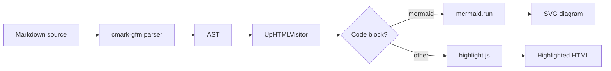
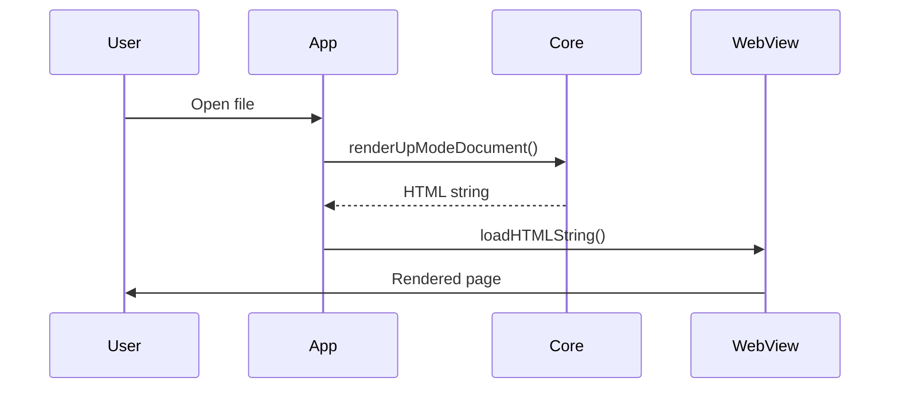
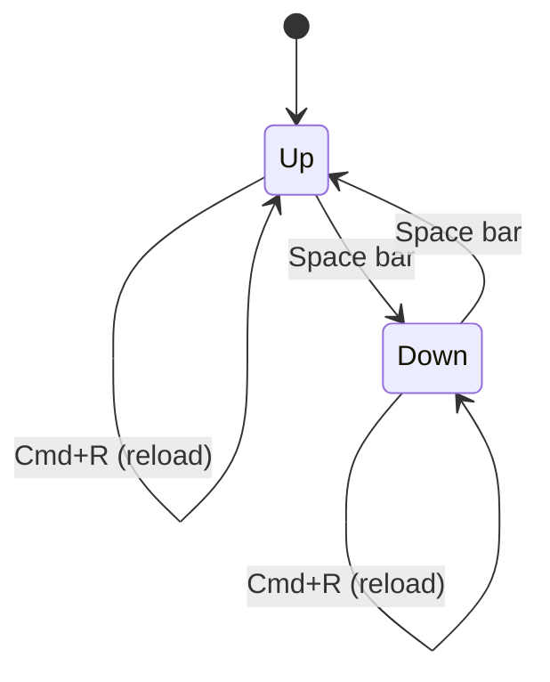

Feature showcase
===============================================================================

Mud renders GitHub-Flavored Markdown with a set of extended features beyond the
CommonMark baseline. This document demonstrates all of them in one place.


## Inline formatting

Standard inline markup: **bold**, _italic_, _**bold and italic**_,
~~strikethrough~~, and `inline code`.

Emoji shortcodes resolve to Unicode using GitHub's gemoji database (~1,800
aliases): :rocket: :sparkles: :tada: :white_check_mark: :warning:

> "Mud renders Markdown the way GitHub does, right on your Mac."[^comment-a]


## Syntax highlighting

Code blocks with a language tag are highlighted server-side by highlight.js via
JavaScriptCore — no network requests, no external dependencies.

```swift
struct Renderer {
    func render(_ markdown: String) -> String {
        let doc = MarkdownParser.parse(markdown)
        var visitor = UpHTMLVisitor()
        visitor.visit(doc)
        return visitor.result
    }
}
```

```python
from pathlib import Path

def render_file(path: Path) -> str:
    text = path.read_text(encoding="utf-8")
    return markdown.markdown(text, extensions=["tables", "fenced_code"])
```

```sh
mud -u README.md > output.html
mud -u -b README.md        # open in browser
mud -f README.md           # fragment only, no <html> wrapper
```


## Math

Three forms are recognized, the same three GitHub accepts. A fenced code block
tagged `math`:

```math
\zeta(s) = \sum_{n=1}^{\infty} \frac{1}{n^s}
```

A paragraph wrapped in `$$…$$`:

$$ \int_0^\infty e^{-x^2}\,dx = \frac{\sqrt{\pi}}{2} $$

And inline math, written `` $`…`$ ``, which sits in a line of prose: the
Pythagorean theorem $`a^2 + b^2 = c^2`$, or Euler's identity
$`e^{i\pi} + 1 = 0`$.

The backticks are required — a bare `$…$` is not math — so a price like $5, or
a shell variable written `$PATH`, stays literal.

Anything Temml can typeset works, matrices and multi-case definitions included.

```math
A = \begin{pmatrix}
a_{11} & a_{12} & \cdots & a_{1n} \\
a_{21} & a_{22} & \cdots & a_{2n} \\
\vdots & \vdots & \ddots & \vdots \\
a_{m1} & a_{m2} & \cdots & a_{mn}
\end{pmatrix}
```

```math
f(n) = \begin{cases}
  n / 2      & \text{if } n \text{ is even} \\
  3n + 1     & \text{if } n \text{ is odd}
\end{cases}
```


## Task lists

- [x] CommonMark baseline (headings, lists, links, images)
- [x] GFM tables
- [x] GFM task lists
- [x] GFM strikethrough
- [x] GFM alerts (note, tip, important, warning, caution)
- [x] DocC asides
- [x] Status asides
- [x] Mermaid diagrams
- [x] Math (TeX typeset to MathML)
- [x] Syntax highlighting via highlight.js
- [x] Emoji shortcodes
- [x] YAML frontmatter
- [x] Change tracking
- [x] Footnotes
- [x] Comments


## Tables

GFM tables support per-column text alignment using `:` in the separator row.

| Feature          | Syntax               | Status |
| ---------------- | :------------------: | -----: |
| Alerts           | `> [!NOTE]`          | ✓      |
| Mermaid diagrams | ```` ```mermaid ```` | ✓      |
| Math             | ```` ```math ````    | ✓      |
| Syntax highlight | ```` ```swift ````   | ✓      |
| Emoji shortcodes | `:shortcode:`        | ✓      |
| Task lists       | `- [ ]`              | ✓      |
| Strikethrough    | `~~text~~`           | ✓      |
| DocC asides      | `> Note: …`          | ✓      |
| Status asides    | `> Status: …`        | ✓      |
| Frontmatter      | `---` … `---`        | ✓      |
| Change tracking  | View → Show Changes  | ✓      |
| Footnotes        | `text[^1]`           | ✓      |
| Comments         | `[^comment-1]`       | ✓      |


## Footnotes

A footnote reference like `[^label]` links to a definition kept at the bottom
of the document.[^1] Click a marker to jump to its definition; in Up mode,
click on a marker to read the footnote in a popover without leaving your place.

Footnote labels can be numbers or words — `[^1]` and `[^note]` both work — and
the bodies are full Markdown.[^rich] Definitions can appear anywhere in the
source.


## Comments

A comment is Mud's own convention layered on standard footnotes: a footnote
whose label starts with `comment-`.[^comment-b] Mud shows comments in a margin
column beside the text, anchored to the quoted passage they annotate, rather
than in the footnote list at the bottom.

Because a comment is just a footnote, it survives untouched in any other
Markdown tool. On GitHub it renders as an ordinary footnote with a byline. In
Mud you can add, reply to, edit, and delete comments directly in the margin —
the changes are written back to the document as footnotes.


## Alerts

GFM alert syntax (`> [!TYPE]`) produces colour-coded call-outs with Octicon
icons.

> [!NOTE]
> Highlights information that users should take into account, even when
> skimming.

> [!TIP]
> Optional information to help a user be more successful.

> [!IMPORTANT]
> Crucial information necessary for users to succeed.

> [!WARNING]
> Critical content demanding immediate user attention due to potential risks.

> [!CAUTION]
> Negative potential consequences of an action.

Alerts can also contain rich content — code blocks, lists, inline formatting,
and links:

> [!TIP]
> Press **Space** to toggle between Up mode (rendered) and Down mode (raw
> source) without losing your scroll position.
>
> Or use the toolbar button, or **View → Toggle Mode** in the menu bar.


### DocC asides

DocC-style asides use a word-and-colon prefix instead of the GFM `[!TYPE]` tag.
Both syntaxes produce the same icon and colour scheme.

> Note: Use DocC style in documentation comments rendered by Xcode.

> Tip: The TOC sidebar (View → Show Sidebar) lists all headings. Click any
> entry to jump to that section.

> Warning: Modifying the file outside Mud while it is open may cause the file
> watcher to miss the final change event on some filesystems.


### Status asides

A blockquote starting with `Status:` renders as a special call-out — used in
plan documents to track progress.

> Status: Complete
>
> All features in this document are implemented and shipping.


## Diagrams

Fenced code blocks with `mermaid` as the language identifier are rendered as
diagrams using the Mermaid library.


### Rendering pipeline




### Request lifecycle




### Mode states




## Change tracking

Mud tracks changes to your document as you edit and reload. Toggle the Changes
bar from **View → Show Changes** (⌃⌘C) or the toolbar button.

- **Up mode** — tinted overlays highlight inserted, deleted, and modified
  content. Numbered expando buttons let you reveal deletions and expand mixed
  groups. Word-level diffs show exactly which words changed.
- **Down mode** — colored line-number gutters and background tints mark changed
  lines, with word-level markers for fine-grained detail.
- **Changes sidebar** — a list of all change groups; click to navigate.
- **Waypoints** — diff against the last accept point, a time-based snapshot, or
  (with git waypoints enabled) a recent commit.

See `Doc/Guides/change-tracking.md` for the full guide.

[^1]: This is a footnote. The marker above is a superscript number; this
    definition is collected here at the foot of the document.

[^rich]: Footnote bodies can hold rich Markdown — `inline code`, **bold**,
    _italic_, links, and even short lists:

    - first point
    - second point

[^comment-a]: > "Mud renders Markdown the way GitHub does, right on your Mac."

    💬 {Mud @ 2026-06-22 09:14:00}:

    This is a comment, anchored to the quotation above. It appears in
    the margin column to the right, beside the text it annotates.

    💬 {Mudder @ 2026-06-22 09:15:30}:

    Replies stack underneath. Each `💬 {author @ time}:` line starts a
    new message in the same thread.

[^comment-b]: > a footnote whose label starts with `comment-`

    💬 {Claude @ 2026-06-22 09:18:42}:

    For example, this thread is defined by a footnote labelled
    `comment-b`. The label is a unique key — never renumber or reuse
    one.
