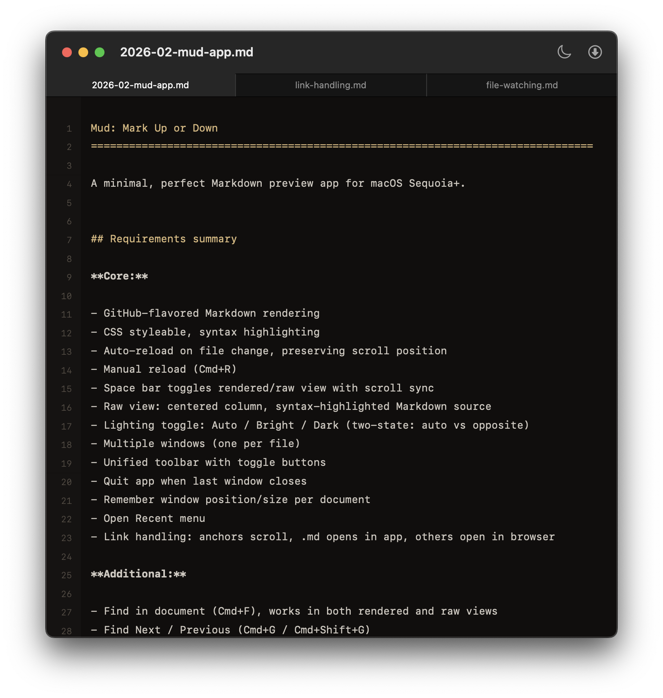

Image Embedding Test
===============================================================================

Open this file in Mud to test embedded images. Each section contains images
that should display as described.

## Basic images

These use relative paths to images in the `Images/` subdirectory.

## Parent directory path

This references an image from the repository root via a relative path.

## Image with title attribute

Hover over this image to see the title tooltip.

## Inline images

Images placed inline with surrounding text.

Here is an icon  embedded in a paragraph of text. The
image should appear inline with the words around it.

## Multiple images in sequence

Two images back-to-back with no text between them.

## Image inside a link

Clicking this image should behave like a regular external link.

## Image with empty alt text

Decorative image with empty alt text.

## Remote image

This image is loaded from the web over HTTPS.

## Broken image reference

This references a file that does not exist. It should display alt text or a
broken-image indicator.

## Expected behavior summary

| Scenario          | Expected result                                   |
| ----------------- | ------------------------------------------------- |
| Basic image       | Displays the image from a relative path           |
| Parent directory  | Resolves `../../` and displays the image          |
| Title attribute   | Shows tooltip on hover                            |
| Inline image      | Image appears inline within the paragraph         |
| Sequential images | Both images display stacked vertically            |
| Linked image      | Image is clickable; opens link in default browser |
| Empty alt text    | Image displays with no alt text                   |
| Remote image      | Loads and displays image from the web             |
| Broken reference  | Shows alt text or broken-image placeholder        |
