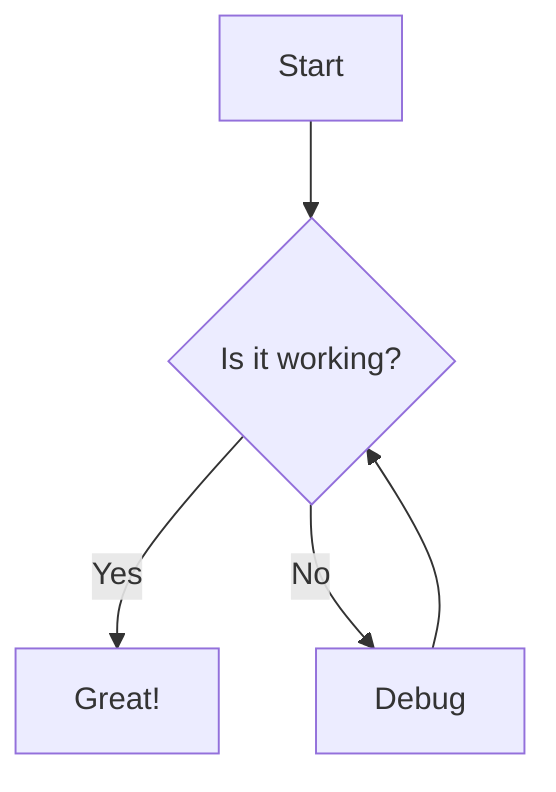
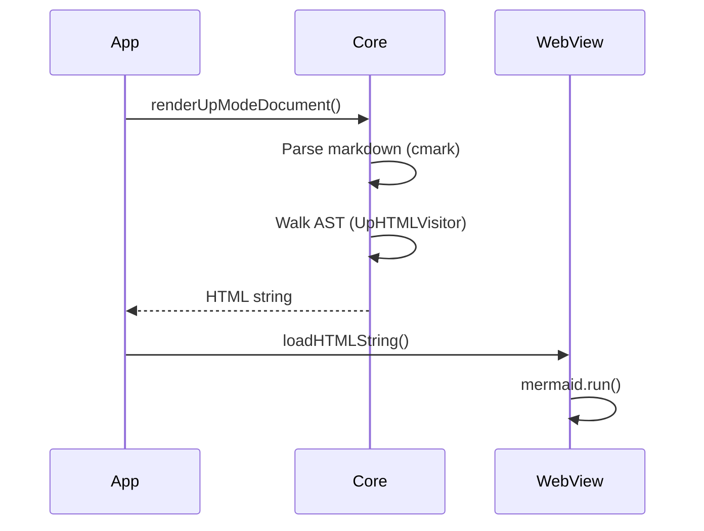
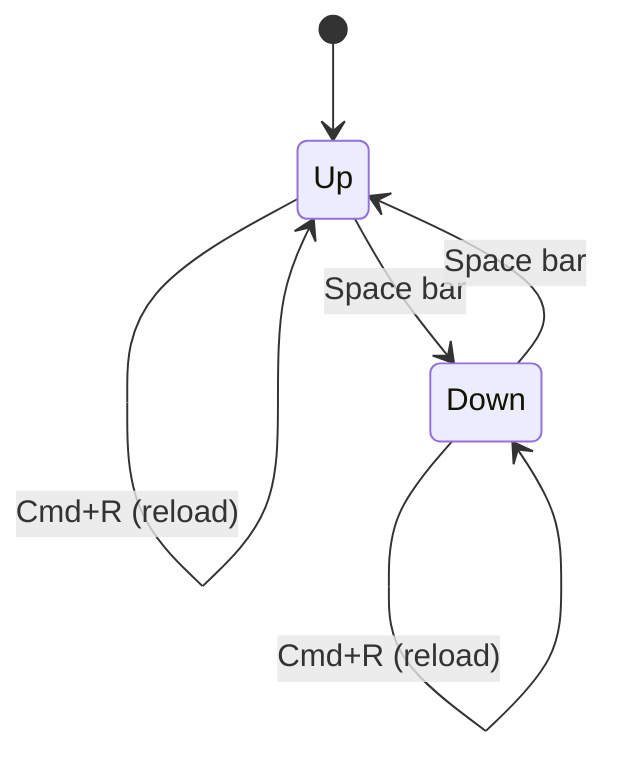
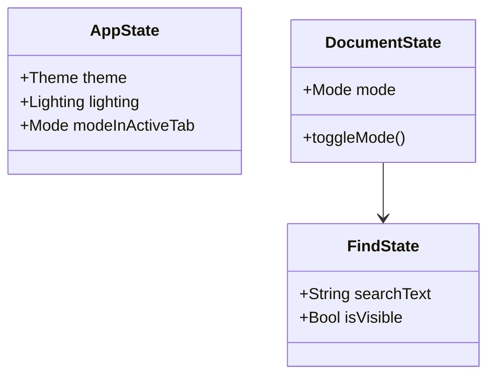
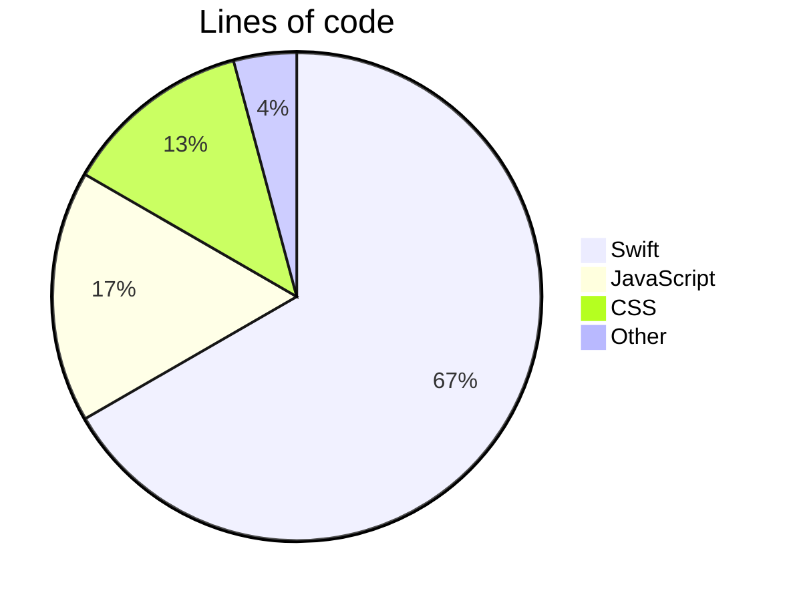

Mermaid diagrams
===============================================================================

Examples of mermaid diagram types rendered by Mud.


## Flowchart




## Sequence diagram




## State diagram




## Class diagram




## Pie chart




## Regular code block (not mermaid)

This should render as a normal syntax-highlighted code block, not a diagram:

```swift
let html = MudCore.renderUpToHTML("# Hello\n")
```
