Mermaid diagrams
===============================================================================

Examples of mermaid diagram types rendered by Mud.


## Flowchart

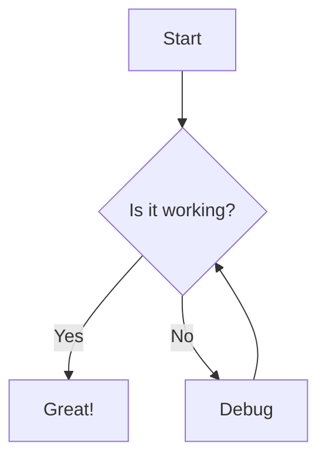
```mermaid
graph TD
    A[Start] --> B{Is it working?}
    B -->|Yes| C[Great!]
    B -->|No| D[Debug]
    D --> B
```


## Flowchart with subgraphs

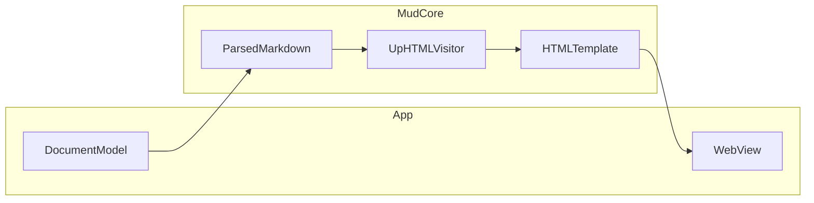
```mermaid
flowchart LR
    subgraph App
        DM[DocumentModel]
        WV[WebView]
    end

    subgraph MudCore
        P[ParsedMarkdown]
        V[UpHTMLVisitor]
        T[HTMLTemplate]
    end

    DM --> P
    P --> V
    V --> T
    T --> WV
```


## Sequence diagram

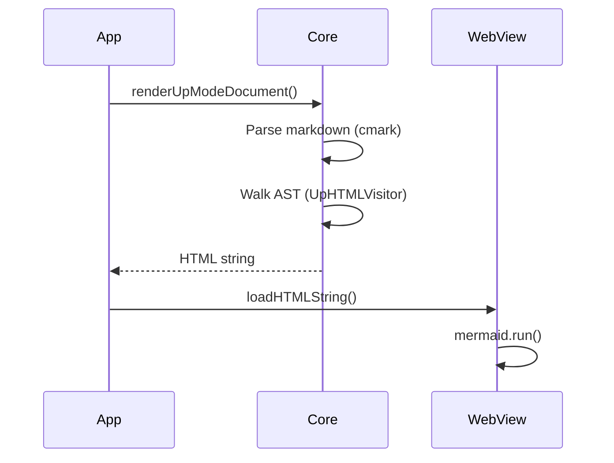
```mermaid
sequenceDiagram
    participant App
    participant Core
    participant WebView

    App->>Core: renderUpModeDocument()
    Core->>Core: Parse markdown (cmark)
    Core->>Core: Walk AST (UpHTMLVisitor)
    Core-->>App: HTML string
    App->>WebView: loadHTMLString()
    WebView->>WebView: mermaid.run()
```


## State diagram

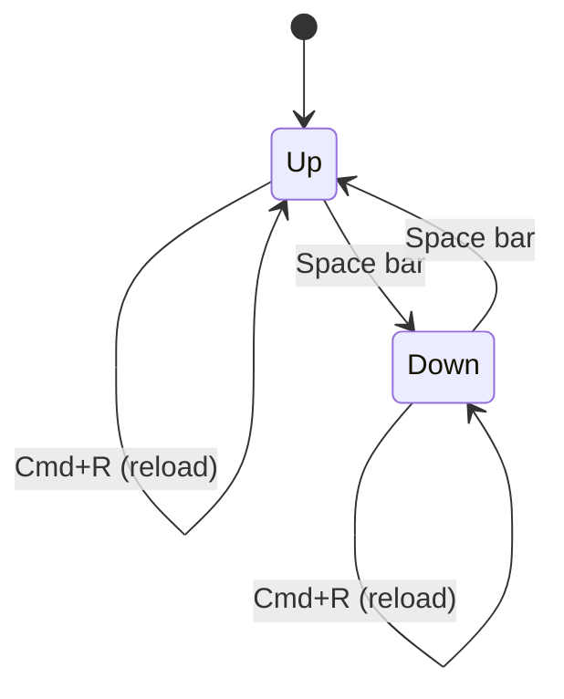
```mermaid
stateDiagram-v2
    [*] --> Up
    Up --> Down: Space bar
    Down --> Up: Space bar

    Up --> Up: Cmd+R (reload)
    Down --> Down: Cmd+R (reload)
```


## Class diagram

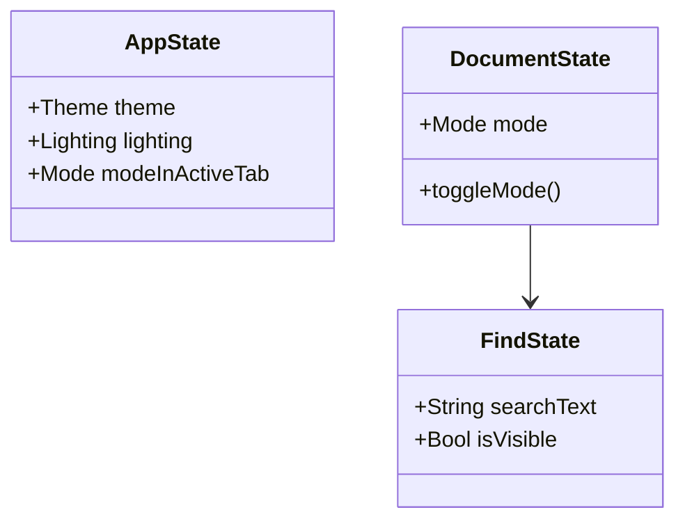
```mermaid
classDiagram
    class AppState {
        +Theme theme
        +Lighting lighting
        +Mode modeInActiveTab
    }
    class DocumentState {
        +Mode mode
        +toggleMode()
    }
    class FindState {
        +String searchText
        +Bool isVisible
    }
    DocumentState --> FindState
```


## Pie chart

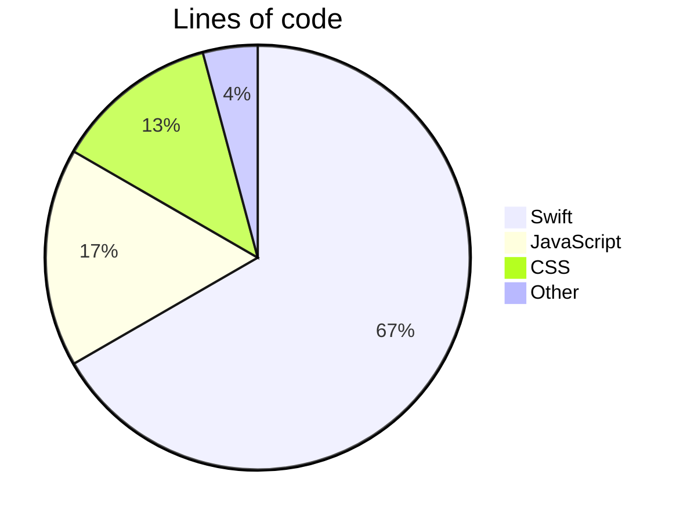
```mermaid
pie title Lines of code
    "Swift" : 3200
    "JavaScript" : 800
    "CSS" : 600
    "Other" : 200
```


## Entity relationship diagram

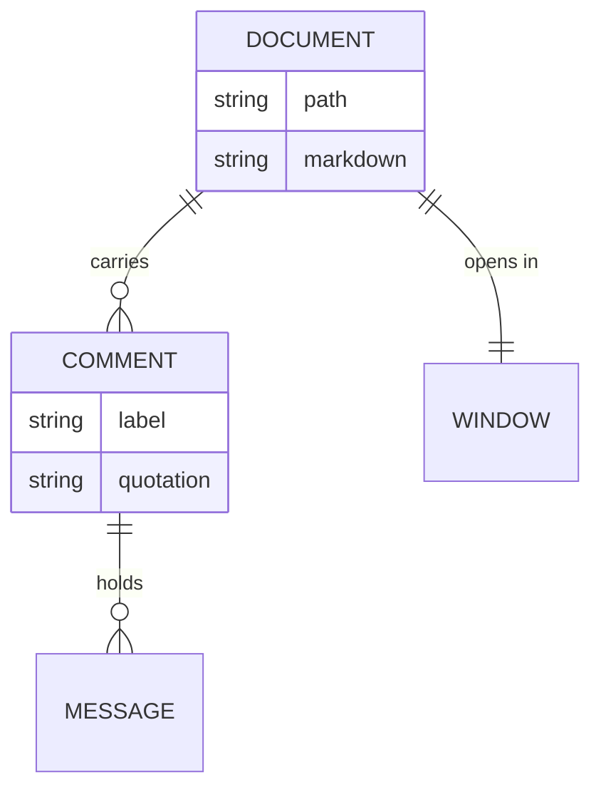
```mermaid
erDiagram
    DOCUMENT ||--o{ COMMENT : carries
    DOCUMENT ||--|| WINDOW : "opens in"
    COMMENT ||--o{ MESSAGE : holds
    DOCUMENT {
        string path
        string markdown
    }
    COMMENT {
        string label
        string quotation
    }
```


## Gantt chart

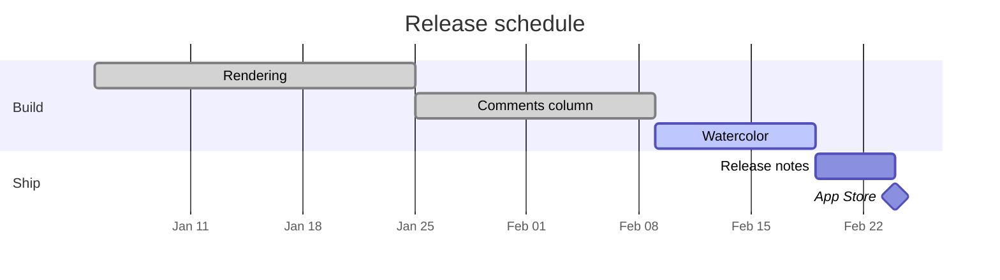
```mermaid
gantt
    title Release schedule
    dateFormat YYYY-MM-DD
    axisFormat %b %d

    section Build
    Rendering       :done,    a1, 2026-01-05, 20d
    Comments column :done,    a2, after a1, 15d
    Watercolor      :active,  a3, after a2, 10d

    section Ship
    Release notes   :         b1, after a3, 5d
    App Store       :milestone, after b1, 0d
```


## Git graph

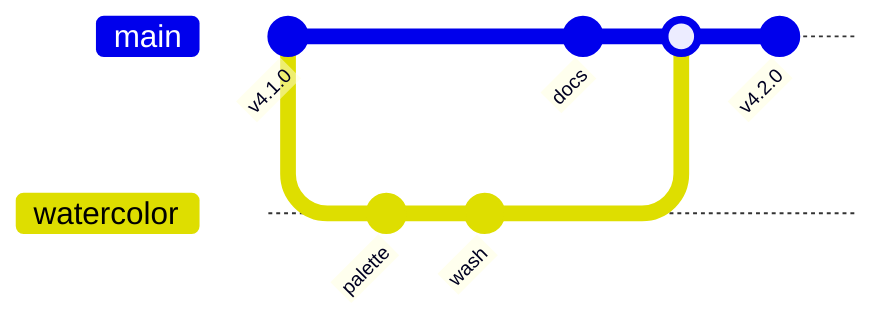
```mermaid
gitGraph
    commit id: "v4.1.0"
    branch watercolor
    commit id: "palette"
    commit id: "wash"
    checkout main
    commit id: "docs"
    merge watercolor
    commit id: "v4.2.0"
```


## Mindmap

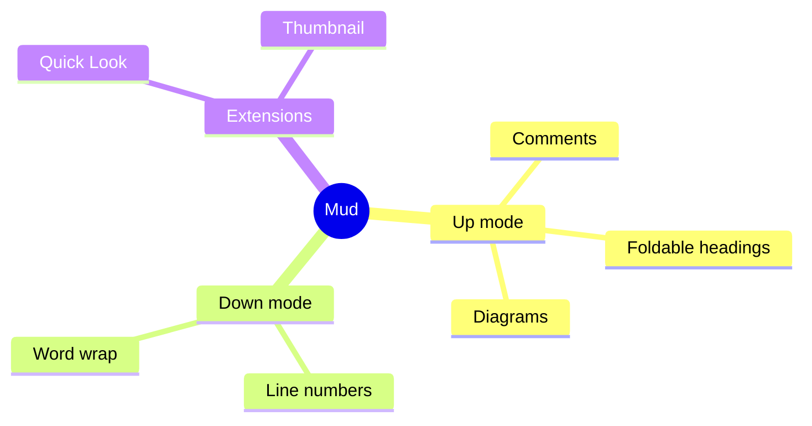
```mermaid
mindmap
  root((Mud))
    Up mode
      Comments
      Foldable headings
      Diagrams
    Down mode
      Line numbers
      Word wrap
    Extensions
      Quick Look
      Thumbnail
```


## Timeline

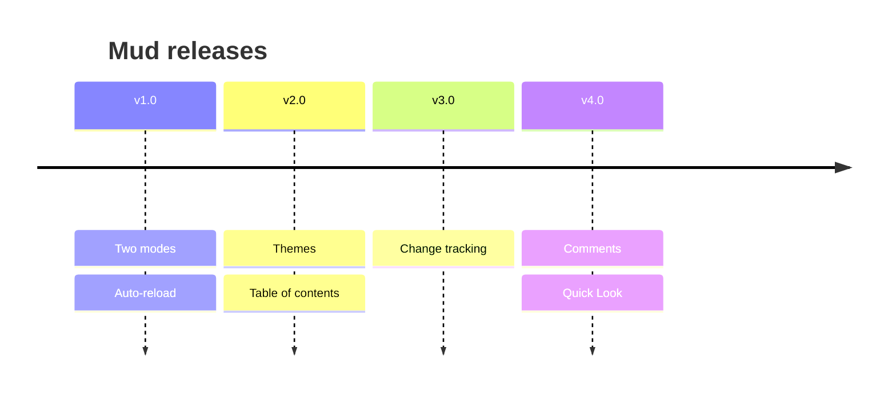
```mermaid
timeline
    title Mud releases
    v1.0 : Two modes : Auto-reload
    v2.0 : Themes : Table of contents
    v3.0 : Change tracking
    v4.0 : Comments : Quick Look
```


## User journey

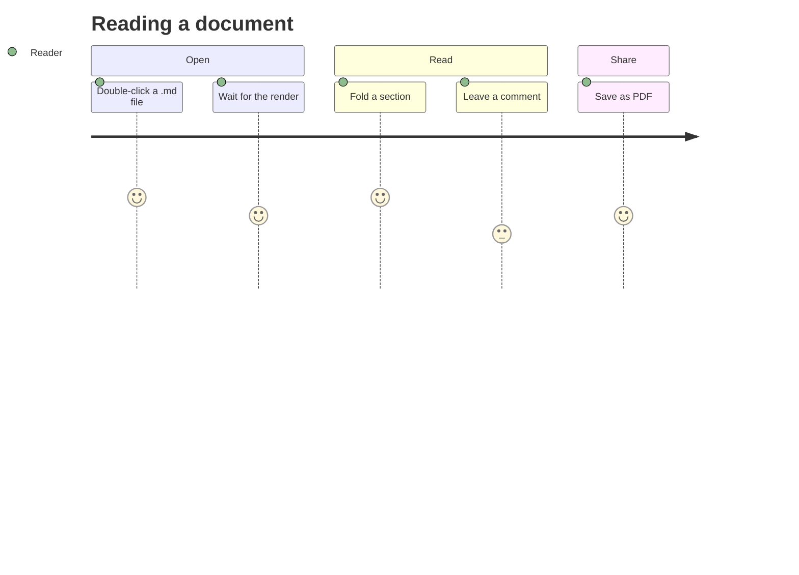
```mermaid
journey
    title Reading a document
    section Open
      Double-click a .md file: 5: Reader
      Wait for the render: 4: Reader
    section Read
      Fold a section: 5: Reader
      Leave a comment: 3: Reader
    section Share
      Save as PDF: 4: Reader
```


## XY chart

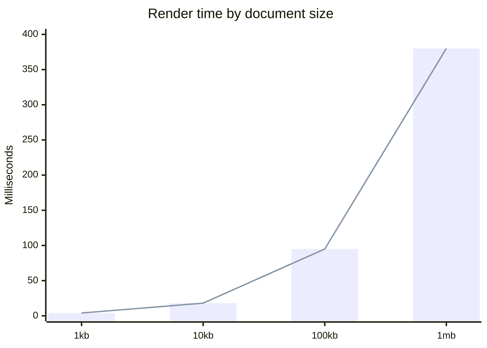
```mermaid
xychart-beta
    title "Render time by document size"
    x-axis [1kb, 10kb, 100kb, 1mb]
    y-axis "Milliseconds" 0 --> 400
    bar [4, 18, 95, 380]
    line [4, 18, 95, 380]
```


## Quadrant chart

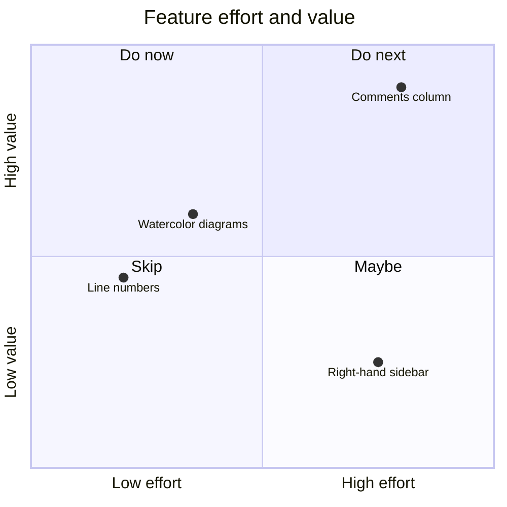
```mermaid
quadrantChart
    title Feature effort and value
    x-axis Low effort --> High effort
    y-axis Low value --> High value
    quadrant-1 Do next
    quadrant-2 Do now
    quadrant-3 Skip
    quadrant-4 Maybe
    Watercolor diagrams: [0.35, 0.6]
    Comments column: [0.8, 0.9]
    Line numbers: [0.2, 0.45]
    Right-hand sidebar: [0.75, 0.25]
```


## Invalid diagram

A diagram that won't parse shows the block as the author wrote it, with an
INVALID badge in the corner. Click the badge for the parser's complaint: in the
app it opens in a popover, and in an exported document — where there is no app
to ask — it appears under the block instead. Here the first node's bracket is
never closed:

```mermaid
graph TD
    A[Start] --> B[Unclosed
    B --> C[End]
```

A diagram type Mermaid doesn't recognize fails differently — there is no line
or column to point at, so the message just says what it couldn't match:

```mermaid
flowbart TD
    A --> B
```

Neither failure stops the diagrams around it. This one still draws, and still
takes its wash:

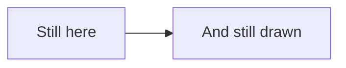
```mermaid
graph LR
    A[Still here] --> B[And still drawn]
```


## Regular code block (not mermaid)

This should render as a normal syntax-highlighted code block, not a diagram:

```swift
let html = MudCore.renderUpToHTML("# Hello\n")
```
