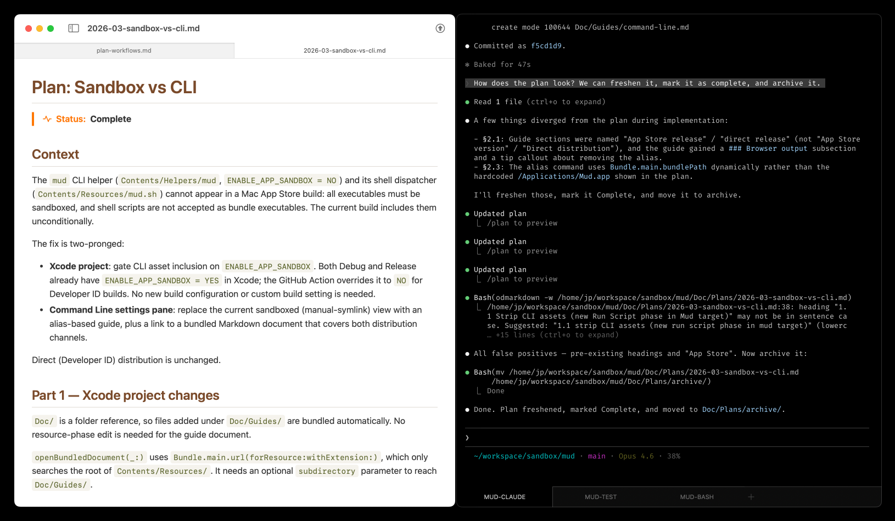

Plan-based workflows with Claude Code
===============================================================================

> Date: Fri March 6, 2026

Over the last few months, I've settled into a particular pattern when working
with Claude Code on "big ideas." This pattern largely formalizes Claude's plan
mode into a repeatable development and documentation workflow. The real value
is that when I tell Claude to "_implement this_," I already know exactly what
it is going to do.

This workflow is overkill for many common development tasks, like tweaking a
button style, or solving an unmysterious logic bug in a method, or whatever.
It's for features, or multi-file fixes, or tasks with numerous unknowns. You
tend to know it when you see it.

Development is broken down into three stages: Planning, Underway, Complete.


## Stage 1: Planning

- Start a fresh session with a detailed prompt and tell Claude Code to prepare
  a markdown plan in `doc/plans/`.
- Review the plan and request changes to it, big or small.
- Repeat the review-and-change cycle many times. This can be scores of prompts
  over a period of hours, sometimes requiring multiple sessions to manage
  context.
- Commit the plan: "Doc: specify plan for XYZ".


## Stage 2: Underway

- In a fresh session, give the plan to CC and tell it to implement tests for
  the 1st phase. (Sometimes I ask it first how well it understands the plan —
  if necessary I can `/resume` the context-rich planning session to flesh out
  the gaps.)
- Tell CC to update the markdown plan with progress to date.
- Review tests & plan, commit: "Tests: cases for XYZ phase 1".
- In the same session, tell CC to implement the 1st phase.
- Run tests.
- Tell CC to update the markdown plan with progress again.
- Review code & plan, commit: "XYZ: phase 1".
- Repeat for each subsequent phase, usually in a fresh session per phase.


## Stage 3: Complete

- In a fresh session, give the plan to CC and tell it to finalize it and
  simplify it (usually replacing verbatim code blocks with brief functional
  summaries).
- Mark the plan as complete and move it to `doc/plans/archive/`.
- Commit the plan: "Doc: complete and archive plan for XYZ".


-------------------------------------------------------------------------------


Obviously coding agent capabilities are improving constantly, and this workflow
may seem very manual for things that Opus 4.6 could often one-shot, but I find
this level of documentation and revision and TDD substantially reduces
[cognitive debt](https://simonwillison.net/guides/agentic-engineering-patterns/interactive-explanations/).

[Mud](https://apps.josephpearson.org/mud) is a great fit for this workflow
because I can have CC running in a terminal on the right half of my screen, and
Mud displaying the plan on the left half of my screen (where my beloved vim
used to be). As Claude Code writes and rewrites the plan, it updates
immediately in Mud.




-------------------------------------------------------------------------------


A few more resources if you're interested in this plan-centric workflow with
Claude Code...

I configure my workspace `settings.local.json` to use the current project's
`doc/plans/` directory rather than its obscure internal one:

```
{
  "plansDirectory": "./doc/plans"
}
```

I have these instructions in my workspace `CLAUDE.md`:

````markdown
## Writing plans

For any project that is a discrete local Git repository, you will find a
`doc/plans/` directory. If you do not find one, you may create it.

Within this directory, we write our dev plans in markdown files with names that
are prefixed with the year-and-month of creation. Some example file names:

```
* 2026-01-logging-refactor.md
* 2026-01-token-exchange.md
```

When entering plan mode, the system suggests a plan file with a random name.
Ignore the random name. Instead, create the plan file directly at the correct
`YYYY-MM-short-description.md` path in `doc/plans/` using the Write tool. If
the file already exists under the random name (e.g. from a previous attempt),
rename it with `git mv` if tracked or `mv` if untracked.

The first heading should be "Plan: " followed by the name in _Title Case_,
followed by a "Status:" callout. eg:

```
Plan: Token Exchange
===============================================================================

> Status: Planning
```

Valid statuses include: Planning, Underway, Complete. Once marked as "Complete",
the plan can be moved into the doc/plans/archive/ subdirectory.
````
