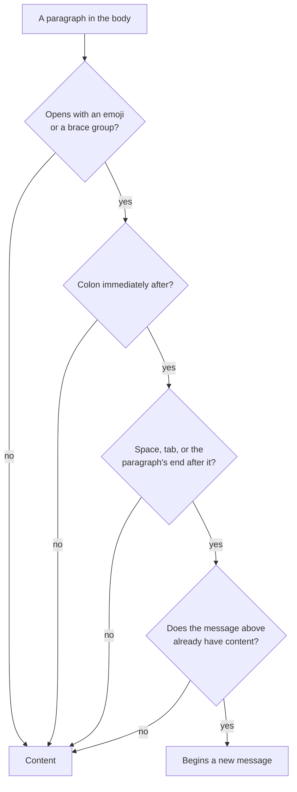

Comments in Mud — Specification
===============================================================================

A **comment** is a thread of messages about a passage of a document: a review
note, a question, an answer. Mud stores one as an ordinary GFM footnote, so a
commented file is still a plain Markdown file — every other tool renders it,
git diffs it line by line, and a person can write or edit one by hand.

Here is a whole comment:

```
The build step[^💬-a] runs before tests.

[^💬-a]: > The build step

    🤖 {Claude @ 2026-06-22 14:30:05}:

    Should this be cached? It reruns on every push.

    👤 {JP @ 2026-06-22 15:02:31}:

    Good catch — caching it now.
```

None of that is Mud's own syntax. It is a footnote reference, a footnote
definition, a blockquote, and three paragraphs. Mud reads four things out of it
that another renderer does not:

| Piece               | Mud reads it as                                  |
| ------------------- | ------------------------------------------------ |
| the `💬-a` label     | a comment, rather than an authorial footnote     |
| `> The build step`  | the **quotation** — the text the thread is about |
| `🤖 {Claude @ …}:`   | a **message attribution**: avatar, author, time  |
| the paragraph below | that message's **content**                       |


## Why a footnote

Three things follow from building on footnotes, and together they are the
reason for the convention.

**It survives every other tool.** A GFM renderer that does not follow this spec
still shows the thread — as a footnote, with each `{author @ time}` reading as
a byline above its message. Nothing is lost and nothing looks broken.

**It can be written by hand.** An author, or a coding agent with no more than a
text editor, can add a comment to a document without Mud, and Mud will read it.

**It diffs.** Each message is its own paragraph in a text file, so review tools
show a new message as added lines.

The price is that Mud has to find its own structure inside a body that Markdown
treats as ordinary prose. Most of this document is the rules that make that
unambiguous.


## How to read this document

The sections below define the format. The [worked examples](#worked-examples)
at the end are **live**: every one is a real comment in this file. Open the
document in Mud to see them as comments; read it in Mark Down mode, or on
GitHub, to see the source. `Core/Tests/CommentSerializationTests.swift` mirrors
them case for case.

Reading is permissive — anything defined here is valid input. Writing is
narrower: [what Mud writes](#what-mud-writes) is one canonical form, and a
hand-author is under no obligation to match it.


## The label

A comment is any footnote whose label is a **comment prefix** followed by an
**id**:

| Label form     | Example        |
| -------------- | -------------- |
| `💬-<id>`       | `[^💬-a]`       |
| `comment-<id>` | `[^comment-a]` |

The id is one or more letters, digits, `_` or `-`. Any other footnote label is
an authorial footnote, and Mud leaves it alone.

The two prefixes mean exactly the same thing. Mud writes `💬-` and reads both,
so documents written before the emoji prefix keep working, and anyone who
cannot type 💬 easily can write `comment-`.

The prefix says only "this footnote is a comment". The id is what tells one
comment from another, so a document may hold `[^comment-a]` and `[^💬-b]` at
once — and `[^💬-a]` and `[^comment-a]` are two _different_ comments, which is a
good reason not to write both.


## The body

A comment's body holds, in order:

1. an optional **quotation** — a leading blockquote naming the document text
   the thread is attached to;
2. one or more **messages**.

```
[^💬-a]: > The build step                  ← quotation

    🤖 {Claude @ 2026-06-22 14:30:05}:     ← attribution

    Should this be cached? It reruns       ← content
    on every push.

    👤 {JP @ 2026-06-22 15:02:31}:         ← attribution: a second message

    Good catch — caching it now.           ← content
```

The four-space indent is not Mud's: it is the GFM footnote continuation indent,
and every line of the body needs it. Get it wrong and the definition ends
early, comment or not.


### The quotation

Only a blockquote that comes **first**, before any message, is the quotation. A
blockquote below an attribution is part of that message's content — which is
how a reply quotes the message above it
([example d](#d-a-thread-with-avatars)).

Mud matches a quotation against the document's _rendered_ text, so it is
flattened first: runs of whitespace collapse to one space, line breaks become
spaces, and inline code gives up its backticks (`` > the `foo` value `` matches
the rendered "the foo value").

A comment needs no quotation. Without one it is a general note on the document
([example h](#h-a-thread-with-no-quotation)).


### Messages

Everything after the quotation is messages. A message is a run of blocks —
paragraphs, lists, code blocks, anything a footnote may hold — usually
introduced by an attribution.

The first message needs no attribution: its content may start straight after
the quotation ([example b](#b-a-quotation)). Every later message needs one,
because the attribution is the only thing that marks a boundary.


## The attribution

An attribution is the opening of a paragraph, in three parts:

```
👤 {author @ time}:
```

- an **avatar** — any single emoji, standing for whoever wrote the message;
- a **brace group** — `{author @ time}`, with either part optional;
- a **colon** — required.

At least one of the avatar and the brace group must be present, which gives
four forms:

| Attribution   | Reads as                     |
| ------------- | ---------------------------- |
| `👤 {JP @ t}:` | avatar, author, and time     |
| `{JP @ t}:`   | author and time, no avatar   |
| `👤:`          | an avatar and nothing else   |
| `{}:`         | nothing at all (discouraged) |

An avatar is exactly one emoji character, counted the way a reader counts it:
👨‍💻 is three code points joined into one character, so it is one avatar. `#`
and `1` carry Unicode's Emoji property but do not present as emoji, so neither
is one.

Mud writes 👤 unless the reader picks another avatar in Settings → Comments. A
message stored with no avatar is _shown_ with 💬, the glyph every attribution
carried before avatars existed.


### Author and time

Both parts inside the braces are optional:

| Brace group               | Author | Time             |
| ------------------------- | ------ | ---------------- |
| `{JP @ 2026-06-01 18:33}` | JP     | 2026-06-01 18:33 |
| `{JP}`                    | JP     | —                |
| `{@ 2026-06-01 18:33}`    | —      | 2026-06-01 18:33 |
| `{}` (discouraged)        | —      | —                |

To divide author from time, Mud takes the **last** `@` whose following text
(trimmed) parses as a time; everything before it (trimmed) is the author. When
no `@` is followed by a valid time, the whole interior is the author — so an
author may contain `@`, whether an `@`-handle
([example k](#k-an-author-containing-an-at-sign)) or an email address, without
being misread.

A time is one of three forms, all local wall-clock with no zone:

| Form                  | Example               |
| --------------------- | --------------------- |
| `YYYY-MM-DD`          | `2026-06-01`          |
| `YYYY-MM-DD HH:MM`    | `2026-06-01 18:33`    |
| `YYYY-MM-DD HH:MM:SS` | `2026-06-01 18:33:13` |

The first `}` closes the group, so neither the author nor the time may contain
a `}`.


## Where one message ends and the next begins

An attribution at the start of a paragraph begins a new message. Two rules
decide whether a paragraph really carries one, and both exist to keep ordinary
prose from being read as structure.

**The colon rule.** An emoji or a brace group at a paragraph's start is just
text unless a colon immediately follows it, and that colon is followed by a
space, a tab, or the end of the paragraph.

| Paragraph               | Read as                            |
| ----------------------- | ---------------------------------- |
| `💬: hello`              | an attribution, avatar 💬           |
| `🎉 We shipped it!`      | content — no colon                 |
| `{x: 1} is the default` | content — no colon                 |
| `👤 {JP} :`              | content — a space before the colon |
| `{JP}:hello`            | content — no space after the colon |

So a message may open with an emoji, or be nothing but one
([example p](#p-a-message-that-is-only-an-emoji)), and needs no escaping.

**The empty-message rule.** A message always has content. An attribution does
_not_ begin a new message when the message it would close has none. A lone
attribution-shaped paragraph directly below an attribution is read as that
message's content, rather than as a second, empty message following an empty
one ([example q](#q-attribution-shaped-content)).



One shape is left that the convention cannot settle on its own: content that
begins with a brace group **and** a colon, with a sentence above it.
`{x: 1}: the default mapping` reads as a message authored by `x: 1`. That is
the case to reach for backticks in.


## Escaping

Inline code is **opaque** to the attribution grammar, which reads the source
text: an emoji or a brace group inside backticks begins no message, colon or no
colon. This is the general escape, and the one to use by hand
([example r](#r-backticks-as-the-escape)).

A quotation works the other way around. It is matched against the rendered
text, so backticks inside it are dropped rather than matched.

When Mud itself writes a message whose body holds an attribution-shaped
paragraph, it has no reader to ask, so it prefixes that paragraph with a
zero-width space (U+200B). The character renders as nothing and defeats the
grammar's first rule — the paragraph no longer opens with an emoji or a `{`.
Reading does not strip it: leaving it in place is what keeps the escape
idempotent, so a later rewrite adds no second one.


## Whitespace

Inside a definition, the whitespace around a comment's parts is structure Mud
reads, not text it renders.

- **Between the avatar and `{`** — any run of spaces or tabs, or none. Mud
  writes one space.

- **Between `}` and `:`** — none at all. Written as `{JP} :`, the paragraph
  carries no attribution, and the whole of it — braces, colon and all — is
  content.

- **After the `:`** — a space, a tab, or the end of the paragraph. This is why
  `{JP}:hello` is content. It is also why an attribution whose message begins
  on the very next line is content: the character after the colon is then a
  line break, not a space.

  ```
  👤 {JP @ 2026-06-01 18:33}:
  The message.
  ```

  Leave a blank line, as Mud does, and the two are separate paragraphs and the
  attribution is read.

- **Between the quotation and the first message** — a blank line, always.
  Without it, Markdown reads the message as part of the blockquote.

- **Between blocks** — extra blank lines, before the quotation or between
  messages, change nothing.

Whitespace _within_ message content is meaningful in the usual Markdown ways.


## Anchoring a quotation

A quotation is not decoration: it names the run of text Mud highlights. The
matching rule is deliberately narrow, so a quotation either anchors to the
passage its author meant or does not anchor at all.

Mud matches in two phases, against the flattened rendered text of the document:

1. **Verbatim** — the quotation must sit _immediately before_ the comment's
   marker. A quotation with no ellipsis uses only this phase.
2. **Truncated** — tried only when the verbatim phase fails and the quotation
   carries a spaced ellipsis. See below.

A quotation that matches neither way leaves the comment unanchored: the thread
still shows, with nothing highlighted. When one label is referenced more than
once, the quotation anchors at the first reference.


### Truncated quotations

A long quotation may be **shortened**: replace the middle with an ellipsis
surrounded by spaces, keeping a head and a tail.

```
> The quick brown fox … over the lazy dog
```

Write the ellipsis as the single character `…` (U+2026) or as three dots `...`
— both are read, since not every keyboard makes `…` easy to type. Mud writes
`…`. Only an ellipsis with whitespace on **both** sides marks a truncation;
`wait...what` is ordinary quoted text.

To match, Mud splits the quotation on each spaced ellipsis into parts. The
**last** part must sit immediately before the marker. Each earlier part is then
matched to its nearest occurrence before the part already matched, walking
right to left. The anchored range runs from the first part's start to the
marker, so the elided middle is highlighted along with the rest. If any part is
missing, the comment is unanchored, the same as a verbatim miss.

A truncation is only safe when it re-anchors to exactly the intended range,
which fails if a kept part recurs between its true position and the next part.
Mud checks this whenever it truncates: it runs the matcher against the full
quotation, and widens the two kept ends until the shortened form recovers the
whole original range — or gives up and stores the quotation whole. A
hand-author should take the same care.


## What Mud writes

Everything in this section is Mud's own behavior when it authors a comment, not
a requirement on a hand-written one.

- **Label** — the `💬-` prefix and the next free id in the sequence `a`, `b`, …
  `z`, `za`, `zb`, …. Ids are never reused or renumbered, so deleting `💬-b`
  leaves a gap. Editing a comment that carries the older `comment-` prefix
  leaves that label as it is.
- **Placement** — the marker goes at the end of the commented passage; the
  definition is appended at the foot of the file, after one blank line.
  Markdown allows a definition anywhere, which is why this document can keep
  each one beside its example.
- **Shape** — the quotation first, then one attribution paragraph per message
  with that message's content in the blocks below it. Mud reads the one-line
  form `{JP}: a short message`, but does not write it.
- **Quotation** — the selected text verbatim, truncated only when it runs past
  120 characters.
- **Avatar** — the `comment-avatar` preference, 👤 unless the reader changes it.
  A message that carried no avatar is written back with none, so rewriting a
  thread never stamps Mud's avatar onto someone else's message. The one
  exception is a reply with no attributes at all: it needs a marker or it would
  merge into the message above, so it is written as `💬:`.
- **Bytes** — an edit rewrites only the bytes of the comment it touches, so
  unrelated text, indentation, and line endings survive exactly. A file being
  edited by both Mud and an agent stays readable in both.


## How comments look elsewhere

Nothing in the convention is invalid Markdown, so a commented document renders
everywhere:

- **In a renderer that doesn’t follow this spec** — GitHub, and most static
  site generators — the thread appears in the footnotes: the quotation as a
  blockquote, each attribution as a plain `{author @ time}` byline above its
  message.
- **In Mud** the threads are laid out in a column beside the text, and the
  quoted passage highlights when its thread is hovered or opened. The marker
  itself is invisible unless Settings → Comments → "Show comment markers" is
  on, which draws a 💬 where it sits.

Comments take no footnote number of their own: authorial footnotes stay
numbered 1, 2, 3 however many comments sit among them. The `[^1]` in
[example b](#b-a-quotation), defined at the foot of this document, is here to
show it.


-------------------------------------------------------------------------------


## Worked examples

Each example below is a live comment in this file. The prose says what the case
shows; the list under it gives the properties Mud reads out of the source.


### a. The simplest comment

The quick brown fox[^💬-a] jumped over the lazy dog.

[^💬-a]: The simplest comment. No quotation, no author, no time.

No quotation and no attribution, so the whole body is one unattributed message.

- Label: 💬-a

- Message 1:

  - Content: The simplest comment. No quotation, no author, no time.


### b. A quotation

The quick brown fox[^💬-b] jumped over the lazy dog.[^1]

[^💬-b]: > fox

    A quoted comment, no attributes.

The leading blockquote is the quotation; the paragraph below it is the first
message, which needs no attribution. The `[^1]` at the end of the sentence is
an ordinary footnote, numbered independently of the comments.

- Label: 💬-b

- Quotation: fox

- Message 1:

  - Content: A quoted comment, no attributes.


### c. Author and time on one line

The quick brown fox[^💬-c] jumped over the lazy dog.

[^💬-c]: > brown fox

    {JP @ 2026-06-01 18:33}: A message with author and time.

An attribution and its content on a single line. Mud reads this form and writes
the two-paragraph one.

- Label: 💬-c

- Quotation: brown fox

- Message 1:

  - Author: JP
  - Time: 2026-06-01 18:33
  - Content: A message with author and time.


### d. A thread with avatars

The quick brown fox[^💬-d] jumped over the lazy dog.

[^💬-d]: > quick brown fox

    👤 {Joseph @ 2026-06-01 18:33}:

    First message in the thread.

    🤖 {Claude Opus 4.8 @ 2026-06-01 18:33:13}:

    > First message in the thread.

    Second message in the thread, recognized as a new message because an
    attribution begins a paragraph.

Two messages, each with its own avatar — which is how a thread shows who is
speaking at a glance. The blockquote in the second message follows an
attribution, so it is content, not a second quotation.

- Label: 💬-d

- Quotation: quick brown fox

- Message 1:

  - Avatar: 👤
  - Author: Joseph
  - Time: 2026-06-01 18:33
  - Content: First message in the thread.

- Message 2:

  - Avatar: 🤖

  - Author: Claude Opus 4.8

  - Time: 2026-06-01 18:33:13

  - Content:

    > First message in the thread.

    Second message in the thread, recognized as a new message because an
    attribution begins a paragraph.


### e. A thread without avatars

The quick brown fox[^💬-e] jumped over the lazy dog.

[^💬-e]: > The quick brown fox

    {JP @ 2026-06-01 18:33}:

    First message in the thread.

    {Claude Opus 4.8 @ 2026-06-01 18:33:13}:

    Second message in the thread.

The avatar is optional, so a `{…}:` at a paragraph start is enough to begin a
message. Neither message carries one, so Mud shows both with 💬.

- Label: 💬-e

- Quotation: The quick brown fox

- Message 1:

  - Author: JP
  - Time: 2026-06-01 18:33
  - Content: First message in the thread.

- Message 2:

  - Author: Claude Opus 4.8
  - Time: 2026-06-01 18:33:13
  - Content: Second message in the thread.


### f. An emoji in running prose

The quick brown fox[^💬-f] jumped over the lazy dog.

[^💬-f]: > fox

    👤 {JP @ 2026-06-01 18:33}:

    A single message. The body mentions a 🎉 mid-sentence, which must not be
    read as a second message because it is not at the start of a paragraph.

One message. An attribution is recognized only at a paragraph's start, so an
emoji mid-sentence is ordinary text.

- Label: 💬-f

- Quotation: fox

- Message 1:

  - Avatar: 👤
  - Author: JP
  - Time: 2026-06-01 18:33
  - Content: A single message. The body mentions a 🎉 mid-sentence, which must
    not be read as a second message because it is not at the start of a
    paragraph.


### g. A missing colon

The quick brown fox[^💬-g] jumped over the lazy dog.

[^💬-g]: > brown fox

    👤 {JP @ 2026-06-01 18:33}

    The colon after the closing brace is missing, so none of this is an
    attribution.

Valid Markdown, but not the comment its author meant. Without the colon the
first paragraph is ordinary content, so the comment holds one unattributed
message whose text happens to open with an avatar and a brace group.

- Label: 💬-g

- Quotation: brown fox

- Message 1:

  - Content:

    👤 {JP @ 2026-06-01 18:33}

    The colon after the closing brace is missing, so none of this is an
    attribution.


### h. A thread with no quotation

The quick brown fox[^💬-h] jumped over the lazy dog.

[^💬-h]: 👤 {JP @ 2026-06-01 18:33}:

    A general message with no quotation, but part of a thread.

    🤖 {Claude Opus 4.8 @ 2026-06-01 18:33:13}:

    A reply, also with no document quotation.

No leading blockquote, so there is no quotation — the comment is a general note
on the document. Two attributions, so two messages.

- Label: 💬-h

- Message 1:

  - Avatar: 👤
  - Author: JP
  - Time: 2026-06-01 18:33
  - Content: A general message with no quotation, but part of a thread.

- Message 2:

  - Avatar: 🤖
  - Author: Claude Opus 4.8
  - Time: 2026-06-01 18:33:13
  - Content: A reply, also with no document quotation.


### i. An author and no time

The quick brown fox[^💬-i] jumped over the lazy dog.

[^💬-i]: > fox

    {JP}: A message with an author but no time.

The brace group holds no `@`-delimited time, so the whole interior is the
author.

- Label: 💬-i

- Quotation: fox

- Message 1:

  - Author: JP
  - Content: A message with an author but no time.


### j. A time and no author

The quick brown fox[^💬-j] jumped over the lazy dog.

[^💬-j]: > fox

    {@ 2026-06-01}: A message with a time but no author.

The interior opens with `@` and the rest parses as a date, so the author is
empty.

- Label: 💬-j

- Quotation: fox

- Message 1:

  - Time: 2026-06-01
  - Content: A message with a time but no author.


### k. An author containing an at-sign

The quick brown fox[^💬-k] jumped over the lazy dog.

[^💬-k]: > fox

    {@jp}: An author that is an `@`-handle.

The only `@` is followed by `jp`, which is not a time, so nothing splits and
the whole interior — leading `@` and all — is the author. Contrast
[example j](#j-a-time-and-no-author), where the text after the `@` _is_ a time.

- Label: 💬-k

- Quotation: fox

- Message 1:

  - Author: @jp
  - Content: An author that is an `@`-handle.


### l. Empty braces

The quick brown fox[^💬-l] jumped over the lazy dog.

[^💬-l]: > fox

    {}: Empty braces have no attributes.

Valid but discouraged: the braces are consumed and yield nothing. Prefer
omitting the attribution, as in [example a](#a-the-simplest-comment).

- Label: 💬-l

- Quotation: fox

- Message 1:

  - Content: Empty braces have no attributes.


### m. Avatar-only attributions

The quick brown fox[^💬-m] jumped over the lazy dog.

[^💬-m]: > fox

    💬: A threaded message with no author or time.

    💬: A reply, also unattributed.

An avatar and a colon, with no braces, is the shortest attribution there is —
enough to mark a message boundary when there is nothing to say about who wrote
it or when. The avatar here is 💬, which is also what a message with no avatar
is shown with.

- Label: 💬-m

- Quotation: fox

- Message 1:

  - Avatar: 💬
  - Content: A threaded message with no author or time.

- Message 2:

  - Avatar: 💬
  - Content: A reply, also unattributed.


### n. A truncated quotation

The quick brown fox jumped over the lazy dog[^💬-n] today.

[^💬-n]: > quick … dog

    A truncated quotation: "quick" and "dog" are kept, the middle elided.

The verbatim phase fails, so the truncated phase splits the quotation into
`quick` and `dog`. `dog` anchors immediately before the marker; `quick` is its
nearest earlier match; the highlight spans the whole original range. Writing
`> quick ... dog` with three dots would parse identically.

- Label: 💬-n

- Quotation: quick … dog

- Anchors to: quick brown fox jumped over the lazy dog

- Message 1:

  - Content: A truncated quotation: "quick" and "dog" are kept, the middle
    elided.


### o. The older label prefix

The quick brown fox jumped over the lazy dog[^comment-o].

[^comment-o]: > lazy dog

    {JP @ 2026-06-01 18:33}: A comment under the older label prefix.

Read exactly as every example above: `comment-` and `💬-` are the same prefix as
far as Mud is concerned. Mud writes `💬-` for anything it adds, and leaves an
existing `comment-` label alone when it edits that comment.

- Label: comment-o

- Quotation: lazy dog

- Message 1:

  - Author: JP
  - Time: 2026-06-01 18:33
  - Content: A comment under the older label prefix.


### p. A message that is only an emoji

The quick brown fox jumped over the lazy dog[^💬-p].

[^💬-p]: > lazy dog

    👤 {JP @ 2026-06-01 18:33}:

    ✨

One message whose whole content is an emoji. No colon follows the `✨`, so it is
not an attribution and begins no second message.

- Label: 💬-p

- Quotation: lazy dog

- Message 1:

  - Avatar: 👤
  - Author: JP
  - Time: 2026-06-01 18:33
  - Content: ✨


### q. Attribution-shaped content

The quick brown[^💬-q] fox jumped over the lazy dog.

[^💬-q]: > brown

    👤 {JP @ 2026-06-01 18:33}:

    {x: 1}: the default mapping

One message. The second paragraph is attribution-shaped — brace group, colon,
space — but reading it as a second message would leave JP's message with no
content, and an attribution never closes an empty message. So it stays JP's
content.

Had JP written a sentence above it, the same paragraph _would_ have begun a
second message, authored by `x: 1`. That is the case for backticks — see
[example r](#r-backticks-as-the-escape).

- Label: 💬-q

- Quotation: brown

- Message 1:

  - Avatar: 👤
  - Author: JP
  - Time: 2026-06-01 18:33
  - Content: {x: 1}: the default mapping


### r. Backticks as the escape

The quick brown fox jumped[^💬-r] over the lazy dog.

[^💬-r]: > jumped

    👤 {JP @ 2026-06-01 18:33}:

    A sentence first.

    `🌚`: foo

    `{x: 1}`: the default mapping

One message. Both of the last two paragraphs are attribution-shaped, and a
sentence stands above them, so the empty-message rule rescues neither — the
backticks do. Inline code is opaque to the attribution grammar.

- Label: 💬-r

- Quotation: jumped

- Message 1:

  - Avatar: 👤

  - Author: JP

  - Time: 2026-06-01 18:33

  - Content:

    A sentence first.

    `🌚`: foo

    `{x: 1}`: the default mapping


-------------------------------------------------------------------------------


[^1]: This is a regular footnote. Included to prove that footnote markers are
    independently numbered from comments.
