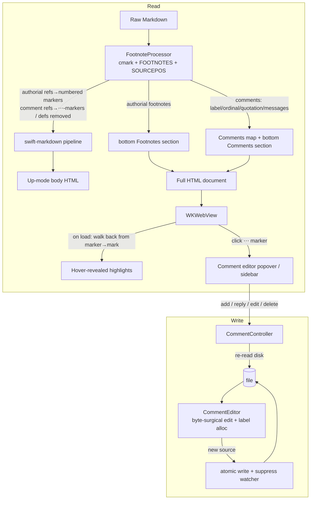

Plan: Footnote Comments
===============================================================================

> Status: Underway


## Context

Issue #5 asks for a commenting workflow: select content in a document, attach a
comment, and use the resulting comments as a batch of feedback for a coding
agent — instead of burning context on multiple rounds of back-and-forth. This
is squarely Mud's primary purpose: collaboratively reviewing and iterating a
Markdown document with an agent.

The proposal in the issue never answers the one question that decides the whole
design: **where do comments live at rest?** A separate comment database brings
all the usual pain — what happens when the file moves, how do you sync to
another device, how do you share with a friend or an agent. Markdown is a plain
text format, and the comments should be too.

So comments are stored **inside the Markdown file, as standard GFM footnotes**.
The key idea is deliberately small and **not Mud-specific** — it's a convention
any tool (or human, or agent) can read and write by hand:

> A footnote is a comment **iff its label matches `^comment-[\w-]+$`**. Its
> body may open with a **blockquote** holding the quoted text (the
> **quotation**), followed by one or more **messages**, each optionally
> introduced by a **message attributes** block — `{author @ timestamp}` with an
> optional leading `💬` and trailing `:`. No blockquote ⇒ a "general"
> (unanchored) comment; more than one message ⇒ a thread.

That's the whole format — ordinary blockquotes, the `💬` emoji, and footnotes,
all of which render in any Markdown viewer with footnote support, with nothing
to strip and no proprietary namespace to learn. The canonical grammar, with a
worked example per case and the exact properties it parses to, is pinned in
`Doc/Spec/comments.md`.

This makes Mud a _writer_ for the first time: it modifies the `.md` file when
(and only when) a user adds, edits, replies to, or removes a comment. Every
other path stays read-only.

This buys three things for free:

- **Portability** — comments travel with the file. Move, rename, sync, share:
  all handled, because there is nothing to keep in sync.
- **Agent visibility** — the agent reads the file and sees the comments _as
  footnotes, anchored inline where they apply_. This is the issue's third
  "future extension" (expose comments to an LLM) solved with no CLI and no MCP.
- **Reuse** — comments build directly on the
  [Native Footnotes](./2026-05-native-footnotes.md) plan: cmark-based footnote
  detection, source rewriting by sourcepos byte range, and the bottom-section
  export all carry over unchanged.

**In scope (new vs. an earlier draft):** threading. The format threads
naturally via repeated `💬` messages, so v1 adopts the threaded _format_ and
renders a thread as a flat sequence of messages.

**Out of scope, deliberately ruled out** (not deferred): the issue's
export-as-unified-diff and push-to-forge features, plus bidirectional-forge
sync. The file _is_ the artifact you hand the agent, so those mechanisms are
unnecessary.

This plan depends on Native Footnotes landing first (or alongside): it reuses
that plan's `FootnoteProcessor`, cmark glue, and export-section machinery.


## 2026-06 update — brace attribute syntax

Comments were first built (pre-release, never shipped) with message attributes
written as a **parenthetical** — `💬 JP (2026-06-01 18:33):`. That form had two
limits: attribution was recognized only when the parenthetical parsed as a
date, so an author **without** a timestamp was inexpressible; and a
colon-terminated header was ambiguous with ordinary prose. We move the
attributes into **braces** — `💬 {JP @ 2026-06-01 18:33}:` — so a
paragraph-leading `{` is the unambiguous signal, and author and timestamp each
become independently optional. Because the paren form never shipped, there is
no on-disk data to migrate: the reader accepts braces only. The canonical spec,
rewritten around this form, is `Doc/Spec/comments.md`; the sections below are
updated to match.

**Nomenclature** (used throughout): a **comment** (the footnote) holds an
optional **quotation** and one or more **messages**; a message may open with a
**message attributes** block — `{…}`, optional leading `💬`, optional trailing
`:`.

**Codec changes** (`CommentSerialization.swift`) beyond the inline descriptions
below — the migration work this update folds in:

1. **Delimiter parens → braces.** `parseAttribution` recognizes a paragraph
   that begins (after an optional `💬`) with `{…}`, not `author (timestamp)`.
2. **Brace presence alone is the signal.** `{JP}` (author, no timestamp) and a
   bare `{}` (no attributes, discouraged) are now recognized; attribution no
   longer requires a parseable timestamp.
3. **Last- `@` split.** Inside the braces, the **last** `@` whose trailing text
   parses as a timestamp splits author from timestamp; otherwise the whole
   interior is the author (so an author may contain `@` — an `@`-handle or
   email).
4. **Date-only timestamps.** `parseTimestamp` gains `YYYY-MM-DD`, tried after
   the date-time forms so it can't swallow them.
5. **A `{…}` block demarcates a message — not just `💬`.** `isMessageStart` (and
   `parse`'s split) now also fires on a paragraph-initial `{`. This
   **reverses** the original `comment-e` decision: two `{…}:` blocks with no
   `💬` are now **two messages**, not one.
6. **Bare markers are consumed.** A message whose leading paragraph is just `💬`
   (or `{}`) with no attributes still has that marker peeled (`comment-m`),
   where the original `buildMessage` left it in the body.
7. **Strict write emits braces.** `serialize`/ `headerLine` write
   `{author @ timestamp}` / `{author}` / `{@ timestamp}`, preserving
   `parse(serialize(…)) == …`. New round-trip + parse cases: spec examples i–m.

**Whitespace** picks up one hard rule: there must be **no** whitespace between
the closing `}` and the optional `:` (otherwise the `:` is the first character
of the message content). See the spec's Whitespace section.


## 2026-06 update — quotation truncation

A quotation is the document text a comment points to. Mud stores it as the
leading blockquote and, on render, finds it again by matching it against the
text right before the marker. A long selection makes a long quotation — this
plan's own `[^comment-zb]` stores a whole paragraph. That causes two problems:
the on-disk footnote is bulky, and a long quotation is fragile, because one
agent edit anywhere inside it breaks the exact match and the comment silently
goes unanchored.

Quotation truncation addresses both. When Mud creates a comment from a long
selection, it may shorten the quotation by replacing a middle section with an
ellipsis surrounded by spaces — keeping a head and a tail. So a paragraph-long
quotation becomes, for example:

> Anchoring by verbatim echo … computed in JS, never stored.

The comment still highlights the whole original range; only the stored text is
shorter.


### Format

The on-disk form is unchanged except that the quotation blockquote may contain
a truncation marker: an ellipsis with whitespace on both sides, written either
as the single character `…` (U+2026) or as three dots `...` (not everyone can
type `…` easily). The quotation is still a leading blockquote of plain text. An
ellipsis with no surrounding space (`wait...what`) is ordinary quoted text, not
a truncation. Mud writes `…`; it reads either form. The canonical description
and a worked example (`comment-n`) live in `Doc/Spec/comments.md`.


### Matching (read side)

Matching a quotation gains a second phase. Both run in JS at render time
against the whitespace-collapsed flat text of the body, exactly as today;
nothing is stored.

1. **Verbatim.** Walk back `quotation.length` characters from the marker and
   check that run equals the quotation — the current behavior. A quotation with
   no truncation marker uses only this phase, so existing comments are
   unaffected.
2. **Truncated.** Only when phase 1 fails and the quotation contains a spaced
   ellipsis. Split the quotation on each spaced ellipsis (`…` or `...` with
   whitespace on both sides) into parts. Match the **last** part against the
   run immediately before the marker. Then walk left: for each earlier part,
   find its nearest occurrence (`lastIndexOf`) before the part already matched.
   The highlight runs from the start of the first matched part to the end of
   the last — so it covers the elided middle too. If any part isn't found, the
   comment is unanchored, the same as a verbatim miss.

The per-slice `<mark>` wrapping over the computed range is unchanged from the
existing render path (see _Anchoring_).


### Creation (write side)

Capture already collapses the selection's whitespace into the quotation (in
`mud-comments.js`). Truncation is added there, before the draft is posted to
Swift:

- If the collapsed quotation is short (under a threshold — start at ~16 words /
  ~120 characters, tunable), store it whole. No truncation.
- Otherwise build a candidate: keep the first few and last few words, joined
  with `…` (Mud writes the `…` character).
- **Verify before writing.** Run the phase-2 matcher on the candidate against
  the live DOM. Keep it only if it re-anchors to exactly the original selection
  range. If it doesn't (a kept part recurs inside the span, so the
  nearest-match lands wrong), widen the head and tail and retry; if it still
  can't be made unambiguous, fall back to the full quotation.

This "generate it, then check it round-trips" rule is what makes a truncation
unambiguous by construction — Mud never writes a truncation it can't recover.


### The split regex

The delimiter is an ellipsis with whitespace on both sides, in either form:

```js
/\s+(?:…|\.\.\.)\s+/
```

Accepting `...` alongside `…` lets a hand-author who can't type `…` still
truncate.


### Relation to the deferred endpoint anchoring

The Anchoring section lists endpoint anchoring — re-anchoring a long run's two
ends independently — as the planned robustness upgrade for long quotations.
Truncation is a simpler form of the same idea: it anchors a head and a tail and
treats the middle as filler. It ships now and covers the common case; full
endpoint anchoring (with per-part fuzziness) stays a later option.


### Files

- `Core/Sources/Resources/mud-comments.js` — the only behavior change: the
  two-phase matcher at render, and candidate-truncate-then-verify at capture.
- `Doc/Spec/comments.md` — documents the format and matching (done alongside
  this section).
- No Swift changes. The quotation is already stored and parsed as plain text:
  `CommentEditor` writes it as a blockquote and the `Comment` model carries it
  verbatim, ellipsis and all. Matching stays render-time JS, never stored, as
  in the existing design.


### Verification

- Unit: a Core round-trip test that a quotation containing `…` survives
  `serialize`/ `parse` unchanged (it is plain text, so this only guards against
  accidental special-casing).
- End-to-end (the acceptance proof): replace `[^comment-zb]`'s paragraph-long
  quotation in this plan with
  `> Anchoring by verbatim echo … computed in JS, never stored.`, open the plan
  in Mud, and confirm the `[⋯]` marker still highlights the whole original
  bullet on hover. Then break the tail by an external edit and confirm it
  degrades to unanchored.
- End-to-end (capture): select a long passage, Add Comment, and confirm Mud
  writes a truncated `> head … tail` quotation that re-highlights the full
  selection.


## Confirmed decisions

These were settled during design; the implementation below assumes them.

- **Classifier is the label alone.** A footnote is a comment iff its label
  matches `^comment-[\w-]+$`. No secondary signal is required — the `comment-`
  prefix _is_ the statement of intent. Everything else is **optional**: a bare
  `[^comment-a]: just an observation.` (no quotation, no attribution) is a
  perfectly valid comment (spec example `comment-a`).

- **Quotation is a leading blockquote; attributes are a braced header.** When
  present, the definition body opens with a blockquote whose text is the quoted
  range. A message may open with a **message attributes** block —
  `{author @ timestamp}`, optional leading `💬`, optional trailing `:` (a plain
  paragraph). Nothing Mud-proprietary and nothing hidden: a basic viewer shows
  the quotation as a blockquote and the attributes as visible `{…}` text.

- **Attributes grammar is forgiving.** A message's first paragraph may open
  with `[💬 ]{author @ timestamp}[:]` — the `💬` and the trailing colon both
  optional, and the braces are the signal (a paragraph-leading `{` is always
  read as attributes). Inside, the **last** `@` whose trailing text parses as a
  timestamp splits `author` from `created`; with no such `@` the whole interior
  is the `author` (so an author may contain `@` — an `@`-handle or email).
  Either field may be absent: `{JP}` → author only; `{@ 2026-06-01 18:33}` →
  timestamp only; `{}` → neither (tolerated, discouraged). A timestamp parses
  as `YYYY-MM-DD`, `YYYY-MM-DD HH:MM`, or `YYYY-MM-DD HH:MM:SS`. Attributes are
  peeled only from a message's **first** paragraph. Timestamps are **local
  wall-clock** (no offset stored); `created` is an absolute `Date`, so a reader
  in another time zone sees the shifted wall-clock — acceptable for v1.

- **Messages are demarcated by a paragraph-initial attributes block.** A new
  message opens at every **paragraph that begins with `💬` or `{`**; its body
  runs to the next such paragraph (or the end), so a message may span several
  blocks. With no such block the whole post-quotation body is one message. A
  `{…}:` header with **no** `💬` therefore also starts a message — so two bare
  `{…}:` blocks are **two messages** (spec example `comment-e`; this reverses
  the original "only `💬` splits" rule). A `💬` or `{` mid-paragraph is ordinary
  prose and never splits (`comment-f`). The root **quotation** anchors in the
  **document**; a reply that quotes the prior message does so with a blockquote
  in its own body (parsed, not anchored in v1).

- **Anchoring by verbatim echo; no orphan state.** A comment with **no
  quotation** (no leading blockquote) is **general** by construction. A comment
  _with_ a quotation anchors iff that text occurs **verbatim** in the document;
  if it doesn't (the agent rewrote the text), the comment is simply general.
  There is **no** distinct "orphaned" state and no sentinel: a comment is
  either anchored (a highlight is drawn) or not (none is). Whether a quotation
  matches is a pure **render-time DOM** question, computed in JS, never
  stored.[^comment-zb]

- **Strict write, forgiving read.** Mud _generates_ a strict canonical form —
  alpha labels (`comment-a`, `comment-b`, …); a leading blockquote for the
  quotation; one `💬 {author @ timestamp}:` header **per message** (always, even
  a single one), alone on its line, with the commentary starting in a **new
  block** below it; four-space-indented continuation; lines under 79 characters
  — but Mud _accepts_ anything the convention allows: any `^comment-[\w-]+$`
  label, any whitespace **except between `}` and `:`**, a missing
  `💬`/author/timestamp/colon or even empty `{}`, inline commentary on the
  header line, the blockquote on the marker line or below it. Two consequences
  of the "new block" rule: a message's commentary may be **any** Markdown (a
  blockquote, list, code block — it isn't trapped inline after the colon), and
  the whole codec is **pure block structure with no hard breaks**.

- **Labelling.** The label suffix is an **alpha token allocated in insertion
  order** — the next label is the lexicographically greatest existing
  _scheme-valid_ suffix, incremented (if the last letter is `z`, append `a`;
  otherwise bump the last letter): `a … z, za, zb … zz, zza …`. Hand-authored
  suffixes the scheme could never have produced (`az`, `aa`, `comment-1`,
  `comment-foo`, …) are **ignored when choosing that basis**, so an anomaly
  can't drag the next label into a strange namespace — the comment after
  `{a, b, ya}` is `c`. The scheme is lexicographically monotonic over its own
  labels, so string order equals allocation order and no integer decode is
  needed; and because the basis is always scheme-valid, the new label exceeds
  every scheme-valid label and differs from every anomaly, so it can never
  collide. Labels are **never renumbered**: adding a comment touches only the
  new marker and one appended definition; deleting one leaves a gap. The label
  is a stable join-key and durable identity; the user-facing ordinal (1, 2, 3
  …) is derived from marker position at render time.

- **Rendering.** A comment reference renders — in Mud _and_ exports — as a
  `[⋯]` marker icon (a grayish square with a black middot-ellipsis), not a
  numbered superscript; the highlighted range stays **hidden until the marker
  is hovered**, then shows as a bright-yellow background under the quoted text.
  Mud adds a "Comments" sidebar pane; every export (CLI, Open In Browser,
  Print/PDF, Quick Look) gets a **separate** `<section>` titled Comments,
  emitted **last**, after any authorial footnotes section. Because the marker
  carries no number, comments never consume a footnote number in Mud's rendered
  output — authorial footnotes stay gap-free.

- **Write-back.** Re-read the file from disk → fresh cmark parse →
  byte-surgical edit → atomic write → suppress the self-triggered file-watcher
  reload.


## Data model

The on-disk grammar — one worked example per case with the exact properties it
parses to — is pinned in `Doc/Spec/comments.md`, the canonical spec. This
section summarizes it.

A comment is a footnote whose label matches `^comment-[\w-]+$`. Its definition
body is, in order:

1. an **optional leading blockquote** — the **quotation** (the document text
   the comment refers to). With no blockquote the comment is **general**
   (unanchored).
2. one or more **messages**. A message is introduced by a paragraph beginning
   with a **message attributes** block (`💬` and/or `{…}`); its body is
   everything up to the next such paragraph (so a message may span several
   blocks — paragraphs, blockquotes, lists). A thread is just more than one
   message. A message's first paragraph may open with `💬 {author @ timestamp}:`
   — `💬`, both fields, and the trailing colon all optional, timestamp
   `YYYY-MM-DD[ HH:MM[:SS]]`. Everything after is the **commentary** (arbitrary
   Markdown).

The fully-attributed, threaded case (spec example `comment-d`):

```markdown
  The quick brown fox[^comment-d] jumped over the lazy dog.

  [^comment-d]: > quick brown fox

      💬 {JP @ 2026-06-01 18:33}:

      First comment in thread.

      💬 {Claude Opus 4.8 @ 2026-06-01 18:33:13}:

      > First comment in thread.

      Second comment — a reply that quotes JP, as a blockquote in its own body.
```

The marker `[^comment-d]` sits in the document at the **end** of the quoted
range (see _Anchoring_). The leading blockquote (`> quick brown fox`) is the
**root quotation**; a blockquote that appears **after** a `💬` (Claude's
`> First comment in thread.`) is part of that message's commentary, not the
document anchor — the always-present `💬` header is exactly what disambiguates
the two.

Three things the format gives up by construction — no microformat, nothing to
escape, nothing whitespace-fragile:

- **General = no blockquote.** There is no `…` sentinel; absence of a quotation
  _is_ "general." Corollary: a leading blockquote is **always** read as the
  quotation, so a hand-authored general comment whose body opens with a
  blockquote (and carries no `💬`) reads as anchored, not general. Mud's strict
  write avoids this by always emitting the `💬` header first; the tie-break is
  deliberate.
- **Attributes are visible Markdown** (`💬 {author @ timestamp}:`), not a hidden
  `title` attribute.
- **Messages are blank-line-separated blocks.** No hard breaks, no trailing
  whitespace, no microformat — just paragraphs and blockquotes (see _Risks
  C10_).

Core model (new `Core/Sources/Comments/Comment.swift`):

```swift
  public struct Comment: Sendable, Equatable, Identifiable {
      public var id: String { label }       // stable identity — the footnote label
      public let label: String              // e.g. "comment-a"; ref is "[^\(label)]"
      public let ordinal: Int               // 1-based document-order position; display only
      public let quotation: String?         // root blockquote, whitespace-collapsed; nil = general
      public let messages: [CommentMessage] // one per message (attributed or author-less)
  }

  public struct CommentMessage: Sendable, Equatable {
      public let author: String?  // brace text before the timestamp's "@"; nil if unattributed
      public let created: Date?   // parsed from the brace's "@ <timestamp>"; nil if absent/unparseable
      public let body: String     // commentary as Markdown (may itself contain blockquotes, lists, …)
  }
```

There is no `isOrphaned` field and no stored anchor: a comment is general when
it has no `quotation`, and an anchored comment is "anchored or not" purely as a
render-time DOM question (see _Anchoring_). The label is the footnote label,
allocated in insertion order and used purely as a stable join-key.

`parse`/ `serialize` and the attribution/timestamp grammar live in
`Core/Sources/Comments/CommentSerialization.swift`; the round-trip invariant is
`parse(serialize(quotation, messages)) == (quotation, messages)`.


## Architecture

Two concerns, kept separate:

1. **Read path** — extend `FootnoteProcessor` to _classify_ comment definitions
   (label `^comment-[\w-]+$`) apart from authorial footnotes, render each
   comment reference as a `[⋯]` marker (instead of a numbered superscript),
   parse each definition body into a `quotation` plus an ordered
   `[CommentMessage]`, and surface a `[Comment]` list alongside the existing
   footnote list. Pure, testable, shared by app and export.
2. **Write path** — a pure Core `CommentEditor` that rewrites a source `String`
   (insert / rewrite-body / delete) by byte range, plus an app-side
   `CommentController` that orchestrates re-read, atomic write, and watcher
   suppression.




## Anchoring

The model has one anchor — **the marker position** — and one extent — **the
quotation**. A comment's marker is written into the source at exactly the point
where the quoted text ends, so on render the highlight is simply "the
`quotation.length` characters immediately **before** the marker." Re-anchoring
is therefore a short **backward walk** from the marker, not a search of the
document: no scour, no ambiguity when the quoted text repeats elsewhere, no
nearest-occurrence tiebreak. Matching runs against a **whitespace-normalized,
flattened text**, so inline _and_ block element boundaries disappear. The only
place a DOM-position → source-byte mapping is needed is **insert**, and only
for the single selection-end point (below).

- **Capture.** Take the selection text via `Selection.toString()` (block-aware,
  so a cross-paragraph selection reads `…event. Cover…` rather than jamming
  `…event.Cover…`), collapse runs of whitespace to single spaces, and store
  that as the comment's `quotation`. Written as a leading blockquote, the
  collapsed form renders cleanly everywhere and makes matching insensitive to
  the exact break representation. The selection's **end** is the marker's
  insertion point.
- **On create.** Re-read the file and fresh-parse with cmark. Insert
  `[^comment-<label>]` at the **exact source byte of the selection's end** —
  mid-block, right where the quotation ends — by walking the anchor block's
  inline nodes, accumulating their rendered text up to the selection-end
  offset, and reading that node's **per-node sourcepos** for the byte. This is
  the one DOM→source mapping the design needs, and end-anchoring confines it to
  a single point. The highlight extent is recovered on render from the
  quotation, so the marker sits at the quotation's end even when the selection
  spans several blocks.
- **On render.** Each comment reference becomes a visible `[⋯]` marker —
  `<a class="mud-comment-marker" data-mud-label="LABEL" href="#cmt-LABEL">⋯</a>`
  (swift-markdown passes inline HTML through, exactly as for footnote markers),
  baked into the static HTML so it shows even without JS. `mud-comments.js`
  builds a flat text of the body with a position → (text node, offset) index,
  then for each marker walks **backward** `quotation.length` characters from
  the marker and checks that run equals the `quotation`. (If that fails and the
  quotation contains a spaced `…`, a second phase splits it on the ellipsis and
  anchors the head and tail — see _quotation truncation_ above.) On a match it
  maps that range back to a `Range` and wraps **each intersected text-node
  slice** in its own
  `<mark class="mud-comment-highlight" data-mud-label="LABEL">`. Per-slice
  wrapping is required because `Range.surroundContents()` throws across element
  boundaries; the shared `data-mud-label` ties the slices to the marker. The
  marks are **transparent by default** — hovering the marker toggles
  `.is-active` (bright yellow) on the slices with the matching
  `data-mud-label`, and clears it on leave.
- **Unanchored fallback.** If the run immediately before the marker doesn't
  equal the quotation (a general comment, or the agent rewrote the text), the
  `[⋯]` marker still renders but reveals nothing on hover; if the reference is
  gone entirely (a dangling definition), there is no icon. Either way the
  comment still appears in the sidebar and the bottom section with its
  quotation and messages — there is simply no document highlight. No badge, no
  separate state.

The backward flat-text walk and per-slice wrapping are the main JS complexity;
`mud-changes.js`'s zoom-normalized rect handling and span walking are the
closest prior art to follow.

_Known v1 limitations / deferred edges:_ **Reply highlighting** applies only to
the root **quotation**, which has a marker to walk back from; a reply that
quotes the prior message (a blockquote in its own body) has no positional
marker, so highlighting it would require a search within that (short) message.
Replies are parsed and stored but their quotes are **not** highlighted in v1 —
the thread renders as a flat sequence of messages — so that search is deferred
with them. Overlapping highlights need no handling: a highlight is revealed
only on marker hover, one marker at a time, so two never show at once. A long
or cross-block quotation is **more likely to go unanchored** (one agent edit
anywhere in the run breaks the exact backward match); it degrades to a general
comment gracefully, and endpoint anchoring (re-anchoring the run's two ends
independently) is the planned robustness upgrade. **Quotation truncation** (the
2026-06 update above) is the first step toward it: a shortened `head … tail`
quotation is smaller on disk and harder to break, because an edit inside the
elided middle no longer breaks the match.

**Marker-deleted comments are not surfaced (v1).** cmark unlinks an
_unreferenced_ footnote definition from its tree, so a comment whose inline
`[^comment-x]` marker was deleted but whose bottom definition survives is
stripped as an orphan and does **not** appear in the sidebar or section — it is
indistinguishable from a dangling footnote. The common unanchored case (the
agent rewrote the _quoted text_ but left the marker) is unaffected: the marker
is present, the comment still surfaces, and only the highlight is withheld.
Surfacing marker-deleted definitions would require parsing orphaned defs
separately and is deferred.


## Implementation

### Core

**`Core/Sources/Rendering/FootnoteProcessor.swift`** — extend the existing
processor (from the Footnotes plan):

- **Classify before numbering.** A definition is a **comment** iff its label
  matches `^comment-[\w-]+$`; otherwise it's an authorial footnote. Footnote
  display numbers are assigned in first-reference order over **authorial**
  references only; comment references are diverted to the `[⋯]` marker path and
  never increment the footnote counter. So `[^1]`, `[^comment-a]`, `[^2]`
  renders in Mud as footnotes 1 and 2 (the comment occupying no number, leaving
  no gap) — even though a foreign renderer like GitHub, which numbers every
  reference by appearance, would show 1, 2, 3.

  - **This means abandoning cmark's reference numbers.** The current `process`
    reads each marker's display number straight from
    `cmark_node_get_literal(refNode)`, but cmark numbers **every** footnote
    reference — comments included — so `[^1] [^comment-a] [^2]` arrives as
    1/2/3 and `[^2]` would render as 3. Replace that read with a Mud-assigned
    counter incremented in first-reference order over **authorial** refs only
    (comment refs skipped). The per-occurrence back-reference id
    (`id="fnref-N-K"`) re-keys off this Mud number, not cmark's.

- Comment references emit the `[⋯]` marker (above) instead of the `<sup>`
  footnote marker; comment definitions are removed from the body like footnote
  definitions. Only **defined** comment labels become markers; a dangling
  `[^comment-x]` stays literal, exactly as for dangling footnotes.

- For each comment definition, parse the body into a `quotation` plus an
  ordered `[CommentMessage]` via `CommentSerialization.parse` and build a
  `Comment` (`label`, `ordinal` = document-order index, `quotation`,
  `messages`). The result type gains a `comments: [Comment]` field beside
  `footnotes`.

**`Core/Sources/Comments/CommentSerialization.swift`** (new) — the read/write
codec for definition bodies, no IO:

```swift
  enum CommentSerialization {
      // Read: structure a comment definition's de-indented body Markdown into the
      // root quotation and ordered messages.
      static func parse(_ bodyMarkdown: String) -> (quotation: String?, messages: [CommentMessage])
      // Write: render quotation + messages into Mud's strict canonical body
      // (leading blockquote for the quotation; one "💬 {author @ timestamp}:"
      // header per message, alone on its line; commentary in a following block).
      static func serialize(quotation: String?, _ messages: [CommentMessage]) -> String
      // Attributes grammar: peel a leading "[💬 ]{author @ timestamp}[:]" from a
      // message's first paragraph (💬, both fields, and colon all optional).
      static func parseAttribution(_ paragraphText: String)
          -> (author: String?, created: Date?, inlineBody: String)
      // Timestamp grammar: "YYYY-MM-DD", "YYYY-MM-DD HH:MM", or
      // "YYYY-MM-DD HH:MM:SS" (local wall-clock) ↔ Date.
      static func parseTimestamp(_ s: Substring) -> Date?
      static func formatTimestamp(_ date: Date) -> String
  }
```

- `parse` consumes the definition's body. It re-parses the footnote
  definition's **de-indented `bodyMarkdown`** (the clean CommonMark the shared
  cmark parse already produces via `renderDefinitionBody`) with
  **swift-markdown** into `[BlockMarkup]`. This is safe precisely because the
  body is already de-indented: the swift-markdown multi-paragraph misparse that
  forced cmark for _footnote_ bodies doesn't bite a pre-normalized string, so
  the codec stays pure, testable Swift with no C-interop. From those blocks:
  (1) a **leading blockquote**, if present, becomes `quotation` (flattened,
  whitespace-collapsed); otherwise `quotation` is nil. (2) The remaining blocks
  are split into messages at each **paragraph that begins with `💬` or `{`** (a
  message attributes block); a message owns its blocks up to the next such
  paragraph. If the first remaining block isn't one, an implicit author-less
  message opens (the single-message, no-attributes case). (3) Each message's
  first paragraph is run through `parseAttribution`; the leading `💬` and `{…}`
  are peeled (even when they carry no author/timestamp, as in a bare `💬`
  reply), `author`/ `created` come from the braces, and the remaining text +
  blocks become `body` (Markdown). A `💬` or `{` that is not paragraph-initial
  is ordinary prose and never splits.
- `serialize` is the strict inverse used on write;
  `parse(serialize(q, xs)) == (q, xs)` is the round-trip invariant. The output
  is plain block structure (no hard breaks): just paragraphs and blockquotes.

**`Core/Sources/Comments/CommentEditor.swift`** (new) — pure source rewriting,
no IO:

```swift
  enum CommentEditor {
      // New comment with the given quotation, anchored at the selection end;
      // allocates the next label.
      static func insert(into source: String, quotation: String?, message: CommentMessage)
          -> (source: String, comment: Comment)?
      // Replace the body of an existing definition (covers edit, reply, and
      // delete-a-message — the caller supplies the quotation + new message list).
      static func rewrite(_ source: String, label: String,
                          quotation: String?, messages: [CommentMessage]) -> String
      // Remove a whole comment: its marker and its definition.
      static func delete(_ source: String, label: String) -> String
      // "comment-" + lex-max scheme-valid suffix, incremented.
      static func nextLabel(in source: String) -> String
  }
```

- `insert` allocates the next label via `nextLabel`, maps the selection-end DOM
  point to a source byte (walk the anchor block's inline nodes to the
  selection-end offset, read that node's per-node sourcepos; fresh cmark
  parse), inserts the `[^comment-<label>]` marker at **exactly that byte** —
  where the quotation ends — and appends `serialize(quotation, [message])` to
  the bottom Comments group (creating it after any footnote definitions, with
  one blank line of separation). Returns `nil` if the selection-end can't be
  mapped (caller decides whether to fall back to the block end, or abort).
- `rewrite` finds the definition by `label` (an exact `[^comment-<label>]`
  match) and replaces its body with `serialize(quotation, messages)`. A reply
  is `rewrite(label, quotation, existing + [newMessage])`; an edit is `rewrite`
  with one message's body changed; removing one message in a thread is
  `rewrite` with it dropped. The quotation and the marker are untouched.
- `delete` removes both the definition and its marker, leaving the label gap
  rather than reflowing later labels.
- `nextLabel` takes the lexicographically greatest existing **scheme-valid**
  suffix — one matching `^(z*[a-y]|z+)$`, the form the scheme itself produces —
  and increments it (if the last letter is `z`, append `a`; otherwise bump the
  last letter), starting at `a` when there is none. Anomalous suffixes (`az`,
  `aa`, `comment-1`, `comment-foo`) are ignored as the basis, so they neither
  lengthen nor misdirect the next label; the result exceeds every scheme-valid
  label and differs from every anomaly, so it can't collide.
- All edits are **byte-surgical**: every untouched byte of the source is
  preserved exactly (line endings, trailing-newline state, indentation), so
  diffs stay minimal and concurrent agent edits aren't clobbered beyond the
  edited spans.

**`Core/Sources/RenderOptions.swift`** — add
`public var commentMode: CommentMode = .section` (parallel to `footnoteMode`),
and append `commentMode.rawValue` to `contentIdentity`. `CommentMode` is
`{ interactive, section }`: `.interactive` for the live app (highlights +
sidebar; the bottom section is emitted but `is-print-only`), `.section` for all
export paths (visible bottom section).

**`Core/Sources/MudCore.swift`** — extend the footnotes-aware render entry
point to also return comments:

- `RenderedUpDocument` gains `comments: [Comment]` (and a per-comment rendered
  HTML thread for the editor/sidebar, mirroring the footnote popover map).
- The bottom-section renderer emits, after the optional Footnotes section, a
  `<section class="comments" data-comments><h2>Comments</h2><ol>…</ol></section>`
  — given `is-print-only` when `commentMode == .interactive`. Each item is
  `<li id="cmt-LABEL">` rendering the comment: the `quotation` as a styled
  quote block, then each message with its attribution (`author` · `created`)
  and its `body` rendered as Markdown via the shared `renderUpBody`, plus a
  back-link to the anchor.
- The String export entry points (`renderUpModeDocument`, `renderUpToHTML`) run
  the same preprocessing and get the visible Comments section for free.


### App

**Entitlements** — Mud has been read-only. The MAS build is sandboxed
(`ENABLE_APP_SANDBOX = YES`), so writing requires swapping
`com.apple.security.files.user-selected.read-only` for `…read-write` in
`App/Mud.entitlements` **(done**) and retaining **security-scoped** write
access for the opened file (start/stop access around the write). The direct
build is **not** sandboxed (`ENABLE_APP_SANDBOX = NO`,
`App/MudDirect.entitlements`), so it already writes freely and needs no
entitlement change. **Verify** writes succeed in a sandboxed build before
relying on the feature there.

**`App/CommentController.swift`** (new) — owns the write path for a document:

- On add/reply/edit/delete: **re-read the file from disk**, call the
  `CommentEditor` against that fresh content (never the possibly-stale
  in-memory render), write atomically (temp file + rename), and **suppress the
  self-write reload**.
- Self-write suppression (implemented): the write path records the written
  content's hash on `DocumentState` via `registerSelfWrite`; the existing
  `FileWatcher` reload reads the file and calls `consumeSelfWrite`. A match is
  treated as our own change (refresh the render, but no background-reload
  badge); a non-match is a genuine external edit (badge raised, stale hashes
  cleared). The watcher plumbing is untouched — only the reload's
  classification changed.
- After a successful write, refresh the in-app render so the new/edited
  highlight and sidebar entry appear.

**No editor popover.** Reading _and_ editing a comment both happen in the
**Comments sidebar** (below), not an anchored popover. An earlier draft used an
`NSPopover` (`App/CommentEditorPopover.swift`); it was removed after the
key-window finding below.

> Build-time learning (2026-06): **an editable `NSPopover` anchored in a
> document window cannot receive keystrokes.** A popover is hosted in a private
> `_NSPopoverWindow` that AppKit attaches as a **child** of the anchor view's
> window. The parent document window keeps `NSApp.keyWindow`, so key events
> never reach the popover's first responder — even though the popover's window
> reports `isKeyWindow == true` (a child window is _drawn_ key) and
> `canBecomeKey == true`. Neither `.transient` nor `.applicationDefined`
> behavior, nor `makeKey()`, `makeKeyAndOrderFront()`, `makeFirstResponder()`,
> nor `NSApp.activate()` moves real key status to the popover. The **only**
> thing that worked was `window.parent?.removeChildWindow(window)` to detach
> the popover window so it can become the genuine key window — a dependency on
> Apple's private popover parenting we don't want to ship. (The read-only
> `FootnotePopover` is unaffected: it never needs key/text input. An all-HTML
> `<textarea>` in a WKWebView popover hits the **same** wall — keystrokes route
> to `NSApp.keyWindow` = the parent — so moving the editor into HTML does not
> escape it; see the cocoa-dev "WKWebView rejecting keyboard input" thread,
> same root cause.) **Resolution:** editing moves out of the popover entirely —
> the compose surface lives in the **Comments sidebar**, which is inside the
> document window (already the key window), so a native SwiftUI text editor
> there just works with no private-API dependency. See the Sidebar note below.

**`App/WebView.swift`** — register handlers alongside `mudOpen`/ `mudFootnote`,
and surface them as plain closures (no popover anchoring; the sidebar is the
destination):

- `mudCommentDraft` — JS posts the current selection's collapsed `quotation`
  plus its source locator when the user invokes "Add Comment". The coordinator
  builds a `CommentDraft` and calls `onCommentDraft(draft)`; no rect is needed.
- `mudCommentOpen` — JS posts a comment label on `[⋯]` marker click; the
  coordinator calls `onOpenComment(label)`.
- `revealCommentLabel: String?` (value-diffed in the coordinator) drives
  `Mud.comments.reveal(label)` — scroll the document to that marker and light
  its highlight; `nil` clears. This is the sidebar→document direction
  (selecting a thread reveals it in place).

**`App/DocumentContentView.swift`** — the live Up path renders with
`commentMode: .interactive` and feeds the parsed `comments` to the `WebView`
(highlights). `loadFromDisk` also publishes
`state.comments = MudCore.parseComments(text)` (parallel to `outlineHeadings`)
so the sidebar has the model. Wires the `WebView` closures: `onOpenComment`
sets `state.activeCommentLabel` and reveals the sidebar's Comments pane;
`onCommentDraft` sets `state.pendingDraft` and does likewise. Heading/outline
extraction stays on the original `ParsedMarkdown` (`[⋯]` markers and highlights
contribute no outline text — verify).

**Menu / context-menu** — add **"Add Comment…"** to the Edit menu and to
`MudWebView`'s context menu, enabled only when there is a non-empty Up-mode
selection (and the document is writable). Hidden where writing can't work.

**Sidebar** — add a `comments` case to `Preferences/SidebarPane.swift`, a third
"Comments" segment in `SidebarView.swift`, and a new
**`App/CommentsSidebarView.swift`**. It is a small master/detail in the sidebar
(a `NavigationStack`): a **list** of comments in document order (quotation
snippet, author, `created`), and a **thread view** for the selected comment.
The thread view renders the existing messages **read-only in a `WKWebView`**
(`MudCore.renderCommentThreadDocument`, the relocated `CommentThreadWebView`)
above a native SwiftUI `TextEditor` compose box and the action buttons (create
→ Add; existing → Reply / Edit last / Delete). Because the sidebar is inside
the document window (the key window), the native text editor takes keystrokes
with no popover/key-window workaround. Writes go straight through
`CommentController(fileURL:)`; the `FileWatcher` reload then refreshes
`state.comments` and the render. Selecting a row sets
`state.activeCommentLabel` (→ document reveal); an "Add Comment" selection
opens the thread view in create mode with the quotation shown and the compose
box focused. The window controller exposes `revealSidebar(.comments)` to expand
the split and switch panes. Wire it into `SidebarView.swift`'s pane container.

**Author identity** — a `comment-author` preference (new key in
`MudPreferences`), defaulting to `NSFullUserName()`, written as the `author` in
each new message's `💬 {author @ timestamp}:` header. Surface it in a settings
pane (a small "Comments" pane, or a field under General).


### Resources

**`Core/Sources/Resources/mud-comments.js`** (new) — selection capture
(`Selection.toString()`, whitespace-collapsed) for the draft message; highlight
re-anchoring of the **root** quotation (flat-text index → match → `Range` →
per-slice `<mark>`, across inline _and_ block boundaries, zoom-normalized like
`mud-changes.js`), with the slices left **transparent until the matching `[⋯]`
marker is hovered** (toggle `.is-active`); `[⋯]` marker click → post
`mudCommentOpen` in-app (the `href="#cmt-LABEL"` jump is the no-handler
fallback in exports); unanchored handling (skip drawing). Injected as a
`WKUserScript` in-app **and inlined in full-document exports**, so the marker
and hover work there too; with no JS (fragment, print) the static marker and
bottom section remain.

**`Core/Sources/Resources/mud-up.css`** — `.mud-comment-marker` styled as a
grayish square chip carrying a black middot-ellipsis (`⋯`) glyph
(theme/lighting-variable-aware); `.mud-comment-highlight` transparent by
default with `.mud-comment-highlight.is-active` a bright-yellow background (a
lighting-aware variable so it still reads in dark mode); the styling for Mud's
rendered Comments section and sidebar (the quotation block, the per-message
attribution, and the threaded messages); the `.comments` section (reusing the
footnotes section styling); and the print-only rule:

```css
  .comments.is-print-only { display: none; }
  @media print { .comments.is-print-only { display: block; } }
```

Mud renders the thread from the parsed `Comment` model with its **own** markup
and classes, so the styling never depends on the on-disk form; the raw
blockquote-and- `💬` source is what Down mode and foreign renderers show.


### Down mode, Quick Look, CLI

- **Down mode** needs no comment-specific code, because comment definitions
  _are_ footnotes: `scan` already classifies `[^comment-a]` references and
  their definition blocks (the `> quotation` blockquote and the
  `💬 {author @ timestamp}:` headers) by cmark footnote node, so they pick up
  the existing `md-footnote-ref` / `md-footnote-def` highlighting and body
  re-parse for free. v1 styles them **identically to authorial footnotes** (no
  distinct comment treatment in Down mode); the raw source is displayed
  literally and honestly, with no wrapper element to dim.
- **Quick Look** and the **CLI** use the String export API (`.section`), so
  comments appear as the bottom Comments section automatically. Neither writes
  comments — authoring is GUI-only.


### Docs

Update `Doc/AGENTS.md` file quick reference: add `Comments/Comment.swift`,
`Comments/CommentEditor.swift`, `Comments/CommentSerialization.swift` (Core),
`CommentController.swift`, `CommentEditorPopover.swift`,
`CommentsSidebarView.swift` (App), and `mud-comments.js`; note the `comments`
case on `SidebarPane`, the `commentMode` field on `RenderOptions`, the
`comment-author` preference, the new read-write entitlement, and the comment
classification step in the rendering-pipeline section. Reference the grammar
spec `Doc/Spec/comments.md`.


## Risks to verify at build time

**Spike C2 and C5b first — they gate the rest.** Sandbox write access (C2) and
the selection-DOM → source-byte mapping (C5b) are the two long poles; prototype
both before building the editor UI or sidebar. If sandbox writes fail,
authoring on the MAS build can't work as designed; if inline sourcepos can't
place the marker mid-paragraph, comments fall back to block-granularity
anchoring. The processor already proves usable inline sourcepos exists — it
reads and validates each footnote reference's source columns today
(`delimitsFootnoteRef`) — so C5b is mapping work, not a capability unknown.

- **C1 — footnote-label portability.** The label prefix is `comment-` (hyphen
  before an alpha suffix). Hyphens and lowercase alpha are unreservedly valid
  in footnote labels everywhere; pin `[^comment-a]` with a fixture and confirm
  GitHub/Gist don't mangle the anchor id (the colon-encoding bug that ruled out
  `mud:` doesn't apply to a hyphen).
- **C2 — sandbox write access.** ✅ **Verified.** The read-write entitlement
  plus security-scoped access permit writing the user-opened file in a
  sandboxed build.
- **C3 — self-write vs. external edit.** ✅ **Resolved.** Each successful
  `CommentController` write registers the exact written content's hash on
  `DocumentState` (`registerSelfWrite`); the file-watcher reload reads the new
  text and calls `consumeSelfWrite` — a match still refreshes the render (so
  the new marker appears) but skips the background-reload badge, while a
  genuine external edit (no match) raises the badge as before and clears stale
  pending hashes. The watcher itself is untouched.
- **C4 — byte-surgical fidelity.** Insert/rewrite/delete preserve line endings,
  trailing-newline state, and all untouched bytes; diffs stay minimal.
- **C5 — DOM re-anchoring.** The backward walk of `quotation.length` chars from
  the marker → `Range` → per-slice `<mark>` is correct across inline elements
  (bold/links/code spans) **and** block boundaries (a cross-paragraph selection
  highlights both runs), under zoom; a non-matching run yields no highlight
  (never the wrong one), and the slices read as one highlight.
- **C5b — insert-time inline sourcepos.** cmark reports usable **per-node**
  source positions for inline nodes under `CMARK_OPT_SOURCEPOS`, so the
  selection-end DOM point maps to the correct source byte (mid-paragraph,
  through emphasis/links/code spans). If inline sourcepos proves unreliable,
  fall back to inserting the marker at the block end (degrading the highlight
  to block granularity for that comment).
- **C6 — concurrent agent edit during authoring.** A file change between
  selection and save routes to the unanchored path rather than corrupting the
  file or clobbering the agent's edit.
- **C7 — codec renders in a basic footnote viewer.** Pin the
  `Doc/Spec/comments.md` examples in a GitHub Gist and confirm: the leading
  blockquote shows the quotation, each `💬 {author @ timestamp}:` line shows
  attribution, the commentary (any Markdown) renders, and the footnote
  back-links work. There are no HTML tags to be stripped; the only non-ASCII is
  the `💬` glyph, which renders as an emoji everywhere.
- **C8 — comment/footnote numbering interplay.** In a document mixing authorial
  footnotes and comments, Mud's footnote display numbers count only authorial
  references (comments occupy no number and leave no gap); the Comments and
  Footnotes sections number independently.
- **C9 — attributes + timestamp grammar.** `parseAttribution` peels
  `[💬 ]{author @ timestamp}[:]` from a message's first paragraph:
  `{JP @ 2026-06-01 18:33}:` → author + created; `{JP}` → author only;
  `{@ 2026-06-01 18:33}` → timestamp only; `{}` → neither; the no-colon variant
  (`comment-g`) parses the same. The **last** `@` whose suffix parses as a
  timestamp splits the fields; `{@jp}` → author `@jp`, no timestamp
  (`comment-k`). Date-only `YYYY-MM-DD` parses (`comment-j`). Content with no
  leading `{`/ `💬` is all body.
- **C10 — attributes/blockquote codec parses.** The root quotation is the
  leading blockquote; messages split at a **paragraph-initial** `💬` **or** `{`
  — so two `{…}:` blocks are two messages (`comment-e`) and a bare `💬` is a
  message with no attributes (`comment-m`) — while a `💬` or `{` in running
  prose never splits (`comment-f`).
  `parse(serialize(quotation, messages)) == (quotation, messages)` round-trips
  quotation, authors, createds, and bodies (including a reply whose body is
  itself a blockquote). The worked examples and their expected properties are
  pinned in `Doc/Spec/comments.md`.


## Verification

Build (user runs in the macOS VM): `cd Core && swift build`, then `swift test`;
then open `Mud.xcodeproj`, re-resolve packages, build the app.

The grammar spec `Doc/Spec/comments.md` holds one worked example per case with
the exact properties it must parse to: a bare comment (`comment-a`), a quoted
comment (`comment-b`), an attributed comment (`comment-c`), a thread with a
reply that quotes the prior message (`comment-d`), a two-message thread whose
headers omit the `💬` (`comment-e`), a `💬`-in-prose decoy (`comment-f`), a
no-colon header (`comment-g`), a general-and-threaded comment (`comment-h`),
author-only (`comment-i`), date-only with no author (`comment-j`), an
`@`-in-author handle (`comment-k`), empty braces (`comment-l`), and a bare- `💬`
unattributed thread (`comment-m`). The unit tests below assert each example
parses to its stated properties. **Extend the matrix** with: an authorial
`[^1]` footnote alongside a comment (numbering interplay), two comments on the
same block, and a comment whose quotation does **not** occur in the document
(general/unanchored at render).

**Core unit tests** (`Core/Tests/CommentTests.swift`, new):

- classification: any `^comment-[\w-]+$` label → comment (with or without a
  leading blockquote or `💬`); the same body on a non- `comment-` label →
  authorial footnote.
- quotation: a leading blockquote → `quotation`; no leading blockquote → nil
  (general); a blockquote **after** a `💬` belongs to that message's body, not
  the quotation (`comment-d`).
- attributes + timestamp grammar (C9): `comment-c`/ `comment-g` (full),
  `comment-i` (author only), `comment-j` (date-only, no author), `comment-k`
  (`@`-handle author, no split), `comment-l` (empty braces); the last-
  `@`-parses split; content with no leading `{`/ `💬` is all body.
- message splitting: a paragraph beginning with `💬` or `{` opens a message —
  including two `{…}:` blocks with no `💬` (`comment-e`, two messages) and a
  bare `💬` (`comment-m`); a `💬` or `{` in running prose does **not**
  (`comment-f`); no attributes block at all → one author-less message.
- numbering interplay (C8): `[^1]`, `[^comment-a]`, `[^2]` → authorial
  footnotes render as 1 and 2 (comment occupies no number, no gap).
- codec round-trip (C10):
  `parse(serialize(quotation, messages)) == (quotation, messages)` for the
  general, quoted, attributed, threaded, and reply-with-a-blockquote cases.
- spec conformance: a table-driven test mirroring `Doc/Spec/comments.md`'s
  examples asserts each parses to its declared properties.
- `nextLabel`: empty source → `comment-a`; `…a … z` → `comment-za`; `zz` →
  `comment-zza`; gapped / out-of-order scheme-valid labels → greatest
  incremented; anomalous labels ignored as basis (`{a, b, ya}` → `c`; `{a, aa}`
  → `b`; only `comment-1`/ `comment-foo` present → `a`).
- `insert`: marker lands at the **selection-end byte** (mid-paragraph, right
  where the quotation ends — not the block end), including a selection ending
  inside inline markup; definition appended to the Comments group; the new
  label comes from `nextLabel`; existing markers and definitions are
  byte-for-byte untouched (no renumber).
- `rewrite` (edit/reply) and `delete` by `label`: reply appends a `💬` message;
  edit changes one body; delete removes both marker and definition and leaves
  the label gap; quotation and other comments untouched.
- general/unanchored: a comment with no quotation, and a comment whose
  quotation is absent from the document, both parse normally and produce no
  document highlight in render.
- export render (`renderUpModeDocument`, `.section`): output has
  `<section class="comments"` _after_ any footnotes section, with
  `<li id="cmt-comment-a"`.

**End-to-end** (open `Doc/Spec/comments.md`, then a scratch file, in Mud, Up
mode):

- select text → "Add Comment…" → editor → save → a `[⋯]` marker appears
  (highlight only on hover), a sidebar row appears, and the file gains a
  `[^comment-<label>]` marker + definition (minimal diff: only the new marker
  and definition change).
- reply in the editor → a second `💬` message appends to the same definition
  (single-definition diff); edit a body → single-definition diff; delete →
  marker and definition removed, other comments' labels untouched (gap left).
- with the document open, edit the underlying text externally (simulating the
  agent) to break a quotation → on reload the comment shows unanchored (in the
  sidebar and section, no document highlight), no data lost; restore the text →
  it re-anchors.
- the highlight is hidden until the `[⋯]` marker is hovered, then reveals as a
  bright-yellow background that lands correctly when the quotation spans
  bold/links/code spans, and when the selection crosses a paragraph break (both
  runs highlighted, marker in the end block).
- the `comment-d` thread renders as a flat sequence of messages with
  per-message attribution; the reply that quotes JP shows its quote as a
  blockquote, not a document highlight.
- Cmd+P / Save-PDF → Comments section appears last in the PDF.
- toggle to Down mode → raw `[^comment-a]` + `> quotation` +
  `💬 {author @ timestamp}:` shown, unchanged.

**Export:**

- Open In Browser → visible Comments section, after footnotes; back-links work.
- `mud -u` / `mud -f` on the fixture → output contains the Comments section.
- Quick Look (spacebar in Finder) → Comments section visible.

[^comment-zb]: > Anchoring by verbatim echo … computed in JS, never stored.

    💬 {JP @ 2026-06-22 20:52:26}:

    Look at the quotation for this comment. It’s really long! We
    should update the comments spec to permit “quotation
    truncation”.

    When creating comments, the spec can say “you may shorten the
    quotation by replacing any middle section of it with an ellipsis
    surrounded by spaces.”

    Mud will create such quotation truncations carefully, making
    sure they are unambiguous.

    When matching quotations, quotation truncation means that there
    are now two phases. The first phase is a verbatim search for an
    exact match in the text that directly precedes the comment
    marker.

    If nothing is found in the “verbatim-search” phase, and if the
    quotation contains an ellipsis surrounded by whitespace, then
    there is a second “truncation-search” phase. In this phase, the
    string is split into parts using `/\s+…\s+/`. Taking the last
    part, we search for a matching string directly preceding the
    comment marker. If a match is found, we take the
    next-to-last-part, and search for the matching string that most
    closely precedes the last part. If found, we continue to work
    backwards through the parts until we find all of them. The
    quoted text is the range between the first and last parts.
