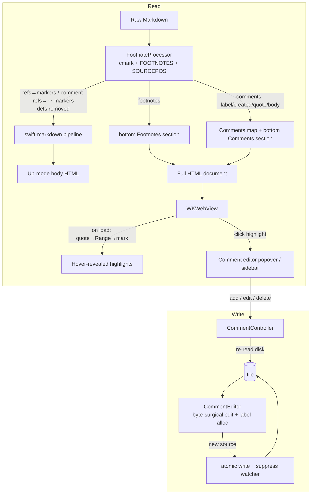

Plan: Footnote Comments
===============================================================================

> Status: Planning


## Context

Issue #5 asks for a commenting workflow: select content in a document, attach a
comment, and use the resulting comments as a batch of feedback for a coding
agent — instead of burning context on multiple rounds of back-and-forth. This
is squarely Mud's primary purpose: collaboratively reviewing and iterating a
Markdown document with an agent.

The proposal in the issue never answers the one question that decides the whole
design: **where do comments live at rest?** A separate comment database brings
all the usual pain — what happens when the file moves, how do you sync to
another device, how do you share with a friend or an agent. Markdown is a plain
text format, and the comments should be too.

So comments are stored **inside the Markdown file, as standard GFM footnotes**
whose body opens with an inline `<q>` element holding the quoted text and a
little metadata. This makes Mud a _writer_ for the first time: it modifies the
`.md` file when (and only when) a user adds, edits, or removes a comment. Every
other path stays read-only.

This buys three things for free:

- **Portability** — comments travel with the file. Move, rename, sync, share:
  all handled, because there is nothing to keep in sync.
- **Agent visibility** — the agent reads the file and sees the comments _as
  footnotes, anchored inline where they apply_. This is the issue's third
  "future extension" (expose comments to an LLM) solved with no CLI and no MCP.
- **Reuse** — comments build directly on the
  [Native Footnotes](./2026-05-native-footnotes.md) plan: cmark-based footnote
  detection, source rewriting by sourcepos byte range, and the bottom-section
  export all carry over.

**Out of scope, deliberately ruled out** (not deferred): the issue's
export-as-unified-diff and push-to-forge features, plus the threaded-comments
and bidirectional-forge-sync extensions. The file _is_ the artifact you hand
the agent, so those mechanisms are unnecessary.

This plan depends on Native Footnotes landing first (or alongside): it reuses
that plan's `FootnoteProcessor`, cmark glue, and export section machinery.


## Confirmed decisions

These were settled during design; the implementation below assumes them.

- **Storage.** A comment is a GFM footnote: a `[^mud-a]` reference at the
  anchor point plus a definition holding the comment body, grouped at the
  bottom of the file. Labels are **alpha** (`mud-a`, `mud-b`, …), not numeric,
  to signal the label is an opaque positional handle rather than a count and to
  keep comments in a namespace visually distinct from numeric authorial
  footnotes.
- **Quote + metadata.** Both ride in a single inline `<q>` element at the head
  of the definition body:
  `<q data-mud-comment="CREATED" data-mud-author=…>QUOTE</q>`, where
  `data-mud-comment` carries the ISO-8601 created timestamp and its mere
  presence is the classifier flag. The quote is the element's text content —
  visible everywhere (exports and foreign renderers like GitHub show it) — and
  the metadata rides as `data-mud-*` attributes, which renderers strip, so they
  stay invisible. `<q>` is inline, not a CommonMark HTML-block starter, so the
  comment body stays normal Markdown on the same line. A definition is
  classified as a Mud comment when it has **both** a `mud-` label prefix
  **and** a leading `<q>` carrying a `data-mud-comment` attribute — so a
  coincidental user footnote is never hijacked. The value is the `created` date
  when it parses as ISO-8601; a missing or malformed value yields a comment
  with **no creation date** (still a comment). Durable identity is the
  **label** (stable — never renumbered or reused), not `created`.
- **Anchoring.** DOM text-quote: the stored `quote` is the rendered plain text
  of the selection, relocated in the rendered DOM at load time and wrapped in a
  highlight that the `[⋯]` marker reveals on hover. If the quote can no longer
  be found (the agent rewrote or deleted the text), the comment is preserved as
  **orphaned** — body and quote intact, listed in the sidebar, no highlight.
- **Labelling.** The label suffix is an **alpha token allocated in insertion
  order** — the next label is the lexicographically greatest existing
  _scheme-valid_ label, incremented (if the last letter is `z`, append `a`;
  otherwise bump the last letter): `a … z, za, zb … zz, zza …`. Hand-authored
  labels the scheme could never have produced (`az`, `aa`, `ya`, …) are
  **ignored when choosing that basis**, so an anomaly can't drag the next label
  into a strange namespace — the comment after `{a, b, ya}` is `c`, not `yb`.
  The scheme is lexicographically monotonic over its own labels, so string
  order equals allocation order and no integer decode is needed; and because
  the basis is always scheme-valid, the new label exceeds every scheme-valid
  label and differs from every anomaly, so it can never collide. Labels are
  **never renumbered**: adding a comment touches only the new marker and one
  appended definition (a minimal diff), and deleting one leaves a gap rather
  than reflowing the rest. The label is therefore a stable join-key, not a
  count, and the durable identity used to match a comment across reloads and to
  target edits; the user-facing ordinal (1, 2, 3 …) is derived from marker
  position at render time, and `created` is optional display metadata.
- **Rendering.** A comment reference renders — in Mud _and_ exports — as a
  `[⋯]` marker icon (a grayish square with a black middot-ellipsis), not a
  numbered superscript; the highlighted range stays **hidden until the marker
  is hovered**, then shows as a bright-yellow background under the quoted text.
  Mud adds a "Comments" sidebar pane; every export (CLI, Open In Browser,
  Print/PDF, Quick Look) gets a **separate** `<section>` titled Comments,
  emitted **last**, after any authorial footnotes section. Because the marker
  carries no number, comments never consume a footnote number in Mud's rendered
  output — authorial footnotes stay gap-free.
- **Write-back.** Re-read the file from disk → fresh cmark parse →
  byte-surgical edit → atomic write → suppress the self-triggered file-watcher
  reload.


## Data model

A comment in the source looks like this (marker shown at a paragraph end; see
_Anchoring_ for why):

```markdown
  The benchmark shows a 3x speedup on the hot path.[^mud-a]

  …

  [^mud-a]: <q data-mud-comment="2026-05-31T14:02:09Z"
      data-mud-author="Joseph Pearson">a 3x speedup on the hot path</q>
      This number is from the synthetic suite — quote the production
      figure instead.
```

Mud emits the definition **line-wrapped** to keep it readable: the marker and
the opening `<q …>` tag start the first line, and the tag's remaining
attributes, the quote, and the body soft-wrap onto four-space-indented
footnote-continuation lines (breaks collapse to spaces on parse, matching the
whitespace-collapsed `quote`, so it round-trips). This keeps every line under
~80; if cmark won't accept an inline open tag spanning continuation lines (see
the build-time risk), the fallback keeps the whole `<q …>` tag on the marker
line — one ~85-char line, everything else still wrapped.

Core model (new `Core/Sources/Comments/Comment.swift`):

```swift
  public struct Comment: Sendable, Equatable, Identifiable {
      public var id: String { label }   // stable identity — never renumbered/reused
      public let label: String          // alpha join-key, e.g. "a", "za"; ref is "[^mud-\(label)]"
      public let ordinal: Int           // 1-based document-order position; display only
      public let created: Date?         // nil when the stamp is missing/malformed
      public let author: String?        // author label
      public let quote: String          // rendered plain text of the selection
      public let body: String           // comment Markdown (leading <q> split off)
      public let isOrphaned: Bool        // quote not locatable at render time
  }
```

The `<q>` carrier (a single inline element at the head of the definition body):

| Part               | Carrier            | Purpose                                                                                                                            |
| ------------------ | ------------------ | ---------------------------------------------------------------------------------------------------------------------------------- |
| quote              | `<q>` text content | What's commented on. Visible everywhere; anchor seed.                                                                              |
| `data-mud-comment` | attribute          | Its presence classifies the `<q>` as a Mud comment; its value is the ISO-8601 created stamp when parseable, else `created` is nil. |
| `data-mud-author`  | attribute          | Author label. Best-effort; may be omitted.                                                                                         |

The label is **not** a count stored in the markup — it is the footnote label,
allocated in insertion order and used purely as a stable join-key. The quote is
escaped as ordinary HTML text content (`<`, `&`); the short attribute values
are attribute-escaped (`"`, `&`). Because `<q>` is on GitHub's tag allowlist,
the quote renders (with quotation marks) and the `data-mud-*` attributes are
stripped — so the metadata stays invisible — while Mud styles
`q[data-mud-comment]` as a block quote where it controls the CSS. The
parse/serialize helpers live in `Core/Sources/Comments/CommentMetadata.swift`.


## Architecture

Two concerns, kept separate:

1. **Read path** — extend `FootnoteProcessor` to _classify_ comment definitions
   apart from authorial footnotes, render each comment reference as a `[⋯]`
   marker (instead of a numbered superscript), and surface a `[Comment]` list
   alongside the existing footnote list. Pure, testable, shared by app and
   export.
2. **Write path** — a pure Core `CommentEditor` that rewrites a source `String`
   (insert / update / delete) by byte range, plus an app-side
   `CommentController` that orchestrates re-read, atomic write, and watcher
   suppression.




## Anchoring

The user selects in the **rendered DOM**; the marker must be written into the
**source**. A full DOM-offset → source-byte mapping is hard (inline syntax
makes rendered offsets diverge from source offsets within a block). Both the
highlight and the marker are driven by **the quote as the universal anchor**,
matched against a **whitespace-normalized, flattened text** of the content —
which makes element boundaries (inline _and_ block) disappear: re-anchoring is
always just "find this string in the flat text," with no special-casing.

- **Capture.** Take the selection text via `Selection.toString()` (block-aware,
  so a cross-paragraph selection reads `…event. Cover…` rather than jamming
  `…event.Cover…`), collapse runs of whitespace to single spaces, and store
  that as `quote`. The collapsed form keeps the `<q>` on a single source line,
  renders cleanly everywhere, and makes matching insensitive to the exact break
  representation.
- **On create.** Re-read the file, fresh-parse with cmark, match the quote
  against the flattened source text, and insert `[^mud-<label>]` just before
  the terminating newline of the block containing the **selection's end**
  (sourcepos gives the byte range). The marker is a single point at block
  granularity; the highlight extent comes from the quote, so the marker can sit
  in one block even when the selection spans several.
- **On render.** Each comment reference becomes a visible `[⋯]` marker —
  `<a class="mud-comment-marker" data-mud-label="LABEL" href="#cmt-LABEL">⋯</a>`
  (swift-markdown passes inline HTML through, exactly as for footnote markers),
  baked into the static HTML so it shows even without JS. `mud-comments.js`
  then builds a flat text of the body with a position → (text node, offset)
  index, locates the quote (preferring the occurrence nearest the marker when
  the text repeats), maps the match back to a `Range`, and wraps **each
  intersected text-node slice** in its own
  `<mark class="mud-comment-highlight" data-mud-label="LABEL">`. Per-slice
  wrapping is required because `Range.surroundContents()` throws across element
  boundaries; the shared `data-mud-label` ties the slices to the marker. The
  marks are **transparent by default** — hovering the marker toggles
  `.is-active` (bright yellow) on the slices with the matching
  `data-mud-label`, and clears it on leave.
- **Orphan fallback.** If the quote can't be located (the agent rewrote it),
  the `[⋯]` marker still renders but reveals nothing on hover; if the marker is
  gone entirely (a dangling definition), there is no icon. Either way the
  comment is flagged `isOrphaned` and appears in the sidebar with its quote and
  body.

The flat-text indexing and per-slice wrapping are the main JS complexity;
`mud-changes.js`'s zoom-normalized rect handling and span walking are the
closest prior art to follow.

_Known v1 limitations / deferred edges:_ the marker sits at block end rather
than exactly at the selection point (acceptable for review comments).
**Overlapping highlights** from two comments on overlapping ranges (a slice
belonging to more than one comment) are out of scope — v1 may render the later
one atop the earlier; nesting or multi-id slices is a future refinement. A long
or cross-block quote is **more orphan-prone** (one agent edit anywhere in the
span breaks the exact match); it degrades to an orphan gracefully, and
prefix/suffix endpoint anchoring (re-anchoring the two ends independently and
filling between) is the planned robustness upgrade. **Bounding the displayed
quote** is a deferred refinement: v1 stores the full collapsed quote (so the
highlight extent is exact), but a long cross-block quote renders as a clumsy
inline run on foreign renderers like GitHub, where we can't restyle `<q>` to a
block. The fix is to cap the _visible_ quote (a leading slice with an ellipsis,
or `prefix … suffix`) — better UX in every renderer and a natural fit with the
endpoint-anchoring upgrade — rather than switching the carrier element.


## Implementation

### Core

**`Core/Sources/Rendering/FootnoteProcessor.swift`** — extend the existing
processor (from the Footnotes plan):

- When collecting definitions, classify each as a **comment** when its label
  matches `mud-[a-z]+` _and_ its body begins with a `<q>` carrying a
  `data-mud-comment` attribute (any value); otherwise it stays an authorial
  footnote. The value becomes `created` when it parses as ISO-8601, else
  `created` is nil.
- **Classify before numbering.** Footnote display numbers are assigned in
  first-reference order over **authorial** references only; comment references
  are diverted to the `[⋯]` marker path and never increment the footnote
  counter. So `[^1]`, `[^mud-a]`, `[^2]` renders in Mud as footnotes 1 and 2
  (the comment occupying no number, leaving no gap) — even though a foreign
  renderer like GitHub, which numbers every reference by appearance, would show
  1, 2, 3.
- Comment references emit the `[⋯]` marker (above) instead of the `<sup>`
  footnote marker; comment definitions are removed from the body like footnote
  definitions.
- The result type gains a `comments: [Comment]` field beside `footnotes`. The
  leading `<q>` is split off — its text content becomes `quote`, its
  `data-mud-comment` value becomes `created` (nil if absent/malformed) and
  `data-mud-author` becomes `author`, the remaining Markdown becomes `body` —
  the `mud-` suffix becomes `label`, and `ordinal` is the document-order index.

**`Core/Sources/Comments/CommentEditor.swift`** (new) — pure source rewriting,
no IO. Each entry point takes the current source and returns a new source plus
the affected comment:

```swift
  enum CommentEditor {
      static func insert(into source: String, quote: String, body: String,
                         created: Date, author: String?) -> (source: String, comment: Comment)?
      static func update(_ source: String, label: String, body: String) -> String
      static func delete(_ source: String, label: String) -> String
      static func nextLabel(in source: String) -> String   // lex-max existing label, incremented
  }
```

- `insert` allocates the next label via `nextLabel`, locates the anchor block
  by quote match (fresh cmark parse), inserts the `[^mud-<label>]` marker at
  block end, and appends the definition to the bottom Comments group (creating
  it after any footnote definitions, with one blank line of separation). No
  renumbering: existing markers and definitions are left untouched. Returns
  `nil` if the quote can't be located (caller decides whether to create an
  orphan-only definition or abort).
- `update` / `delete` find the definition by `label` (an exact `[^mud-<label>]`
  match) and rewrite or remove it (and, for delete, its marker). Delete leaves
  the label gap rather than reflowing later labels.
- `nextLabel` takes the lexicographically greatest existing **scheme-valid**
  `mud-` label — one matching `^(z*[a-y]|z+)$`, the form the scheme itself
  produces — and increments it (if the last letter is `z`, append `a`;
  otherwise bump the last letter), starting at `a` when there is no
  scheme-valid label. Labels the scheme could never have generated (`az`, `aa`,
  `ya`, …) are ignored as the basis, so they neither lengthen nor misdirect the
  next label. Because the basis is always scheme-valid the increment is
  unambiguous (such a label ends in `z` only when it is all- `z`) and the
  result exceeds every scheme-valid label while differing from every anomaly —
  so it can never collide with an existing label.
- All edits are **byte-surgical**: every untouched byte of the source is
  preserved exactly (line endings, trailing-newline state, indentation), so
  diffs stay minimal and concurrent agent edits aren't clobbered beyond the
  edited spans. Because labels are never reflowed, an add/delete diff is
  exactly the one marker and one definition that changed.

**`Core/Sources/Comments/CommentMetadata.swift`** (new) — build and parse the
leading `<q data-mud-comment …>QUOTE</q>` wrapper: serialize a comment's quote
(HTML-escaped text content) and its `created` (the `data-mud-comment` value) /
`author` (attribute-escaped) into the element, and split it back out of a
definition body into `quote` plus the remaining `body` Markdown.

**`Core/Sources/RenderOptions.swift`** — add
`public var commentMode: CommentMode = .section` (parallel to `footnoteMode`),
and append `commentMode.rawValue` to `contentIdentity`. `CommentMode` is
`{ interactive, section }`: `.interactive` for the live app (highlights +
sidebar; the bottom section is emitted but `is-print-only`), `.section` for all
export paths (visible bottom section).

**`Core/Sources/MudCore.swift`** — extend the footnotes-aware render entry
point to also return comments:

- `RenderedUpDocument` gains `comments: [Comment]` (and a per-comment rendered
  HTML body for the editor/sidebar, mirroring the footnote popover map).
- The bottom-section renderer emits, after the optional Footnotes section, a
  `<section class="comments" data-comments><h2>Comments</h2><ol>…</ol></section>`
  — given `is-print-only` when `commentMode == .interactive`. Each item is
  `<li id="cmt-LABEL">` containing the quote as a styled `<q data-mud-comment>`
  block, the body rendered via the shared `renderUpBody`, the `created`
  attribution, and a back-link to its anchor.
- The String export entry points (`renderUpModeDocument`, `renderUpToHTML`) run
  the same preprocessing and get the visible Comments section for free.


### App

**Entitlements** — Mud has been read-only; writing requires
`com.apple.security.files.user-selected.read-write` in `App/Mud.entitlements`
and `App/MudDirect.entitlements`, and retaining **security-scoped** write
access for the opened file (start/stop access around the write). This is a hard
prerequisite for the sandboxed (MAS) build; the direct build needs the same
entitlement for consistency. **Verify** writes succeed in a sandboxed build
before relying on the feature there.

**`App/CommentController.swift`** (new) — owns the write path for a document:

- On add/edit/delete: **re-read the file from disk**, call the `CommentEditor`
  against that fresh content (never the possibly-stale in-memory render), write
  atomically (temp file + rename), and **suppress the self-write reload**.
- Self-write suppression: record the expected post-write mtime/size (or content
  hash) and have `FileWatcher` ignore the next change event that matches,
  rather than blindly pausing the watcher (so a near-simultaneous _external_
  edit is still caught). Reuse the existing watcher plumbing.
- After a successful write, refresh the in-app render so the new/edited
  highlight and sidebar entry appear.

**`App/CommentEditorPopover.swift`** (new) — an `NSPopover` (`.transient`)
hosting an editable body (SwiftUI `TextEditor`) with Save and Delete, anchored
at the highlight rect (same web→AppKit rect conversion as the footnote
popover). Creating a comment shows the same editor anchored at the live
selection.

**`App/WebView.swift`** — register handlers alongside `mudOpen`/ `mudFootnote`:

- `mudCommentDraft` — JS posts the current selection's `quote`, block info, and
  rect when the user invokes "Add Comment"; the controller opens the editor.
- `mudCommentOpen` — JS posts a comment label + rect on `[⋯]` marker click; the
  controller opens the editor for that comment.
- Thread a `commentData` parameter (label → quote/created/body HTML) into the
  coordinator in `updateNSView`, beside the footnote map.

**`App/DocumentContentView.swift`** — the live Up path computes one
`RenderedUpDocument` with `commentMode: .interactive` and feeds the comments
map to the `WebView`. Heading/outline extraction stays on the original
`ParsedMarkdown` (`[⋯]` markers and highlights contribute no outline text —
verify).

**Menu / context-menu** — add **"Add Comment…"** to the Edit menu and to
`MudWebView`'s context menu, enabled only when there is a non-empty Up-mode
selection (and the document is writable). Hidden where writing can't work.

**Sidebar** — add a `comments` case to `Preferences/SidebarPane.swift` and a
new **`App/CommentsSidebarView.swift`** (mirroring `ChangesSidebarView`)
listing comments in document order with quote snippet, body, `created`, and an
**Orphaned** badge. Hovering or selecting a row activates the same
bright-yellow highlight that marker hover does and scrolls to the `[⋯]` marker;
clicking opens the editor (orphaned rows open it without scrolling). Wire it
into `SidebarView.swift`'s pane container.

**Author identity** — a `comment-author` preference (new key in
`MudPreferences`), defaulting to `NSFullUserName()`, written into each
comment's `author`. Surface it in a settings pane (a small "Comments" pane, or
a field under General).


### Resources

**`Core/Sources/Resources/mud-comments.js`** (new) — selection capture
(`Selection.toString()`, whitespace-collapsed) for the draft message; highlight
re-anchoring (flat-text index → quote match → `Range` → per-slice `<mark>`,
across inline _and_ block boundaries, zoom-normalized like `mud-changes.js`),
with the slices left **transparent until the matching `[⋯]` marker is hovered**
(toggle `.is-active`); `[⋯]` marker click → post `mudCommentOpen` in-app (the
`href="#cmt-LABEL"` jump is the no-handler fallback in exports); orphan
handling (skip drawing, report to the sidebar). Injected as a `WKUserScript`
in-app **and inlined in full-document exports**, so the marker and hover work
there too; with no JS (fragment, print) the static marker and bottom section
remain.

**`Core/Sources/Resources/mud-up.css`** — `.mud-comment-marker` styled as a
grayish square chip carrying a black middot-ellipsis (`⋯`) glyph
(theme/lighting-variable-aware); `.mud-comment-highlight` transparent by
default with `.mud-comment-highlight.is-active` a bright-yellow background (a
lighting-aware variable so it still reads in dark mode); `q[data-mud-comment]`
styled as a block quote (optionally surfacing `data-mud-author`/
`data-mud-comment` via CSS `attr()`); the `.comments` section (reusing the
footnotes section styling); and the print-only rule:

```css
  .comments.is-print-only { display: none; }
  @media print { .comments.is-print-only { display: block; } }
```


### Down mode, Quick Look, CLI

- **Down mode** is unchanged: it shows raw source, so `[^mud-a]` and the
  definition (including the `<q data-mud-comment …>` wrapper) are displayed
  literally and honestly. _Limitation:_ the `<q>` wrapper is visible in raw
  view; dimming it is a possible later refinement.
- **Quick Look** and the **CLI** use the String export API (`.section`), so
  comments appear as the bottom Comments section automatically. Neither writes
  comments — authoring is GUI-only.


### Docs

Update `Doc/AGENTS.md` file quick reference: add `Comments/Comment.swift`,
`Comments/CommentEditor.swift`, `Comments/CommentMetadata.swift` (Core),
`CommentController.swift`, `CommentEditorPopover.swift`,
`CommentsSidebarView.swift` (App), and `mud-comments.js`; note the `comments`
case on `SidebarPane`, the `commentMode` field on `RenderOptions`, the
`comment-author` preference, the new read-write entitlement, and the comment
classification step in the rendering-pipeline section. Add a `Doc/Examples/`
fixture (below) reference.


## Risks to verify at build time

- **C1 — footnote-label portability.** The label prefix is `mud-` (hyphen), not
  `mud:` — testing showed GitHub/Gist percent-encode the colon into the anchor
  id and break the footnote's link. Hyphens are unreservedly valid in footnote
  labels everywhere, as are lowercase alpha suffixes; pin `[^mud-a]` with a
  fixture.
- **C2 — sandbox write access.** The read-write entitlement plus
  security-scoped access actually permit writing the user-opened file in a
  sandboxed build.
- **C3 — self-write vs. external edit.** Watcher suppression ignores _our_
  write but still catches a near-simultaneous agent edit (no missed reloads, no
  flicker).
- **C4 — byte-surgical fidelity.** Insert/update/delete preserve line endings,
  trailing-newline state, and all untouched bytes; diffs stay minimal.
- **C5 — DOM re-anchoring.** Flat-text quote matching → `Range` → per-slice
  `<mark>` is correct across inline elements (bold/links/code spans) **and**
  block boundaries (a cross-paragraph selection highlights both runs), under
  zoom; the wrong span is never highlighted and the slices read as one
  highlight.
- **C6 — concurrent agent edit during authoring.** A file change between
  selection and save routes to the orphan path rather than corrupting the file
  or clobbering the agent's edit.
- **C7 — `<q>` portability + escaping.** A quote containing `"`, `<`, `&`, or
  `</q>` round-trips intact, and `<q>` plus its quote text survive GitHub's
  sanitizer (tag allowlisted, `data-mud-*` stripped) so the quote shows and the
  metadata stays hidden.
- **C8 — comment/footnote numbering interplay.** In a document mixing authorial
  footnotes and comments, Mud's footnote display numbers count only authorial
  references (comments occupy no number and leave no gap); the Comments and
  Footnotes sections number independently.
- **C9 — wrapped definition parses.** cmark accepts the line-wrapped definition
  — an inline `<q>` open tag whose attributes span four-space-indented
  footnote-continuation lines (one newline between attributes, no blank line),
  with the quote and body soft-wrapping after it — and the round-tripped
  `quote` is unchanged. If it doesn't, fall back to keeping the whole `<q …>`
  tag on the marker line.


## Verification

Build (user runs in the macOS VM): `cd Core && swift build`, then `swift test`;
then open `Mud.xcodeproj`, re-resolve packages, build the app.

A fixture document `Doc/Examples/comments.md` (new) holds hand-written comment
footnotes for parsing/render/orphan tests and manual E2E — including a normal
comment, two comments on the same block, an authorial footnote alongside a
comment (to test classification and the numbering interplay), and one
**orphaned** comment whose `quote` does not occur in the body. Comment labels
use the alpha scheme (`mud-a`, `mud-b`, …).

**Core unit tests** (`Core/Tests/CommentTests.swift`, new):

- classification: `mud-a` + a leading `data-mud-comment` `<q>` → comment;
  `mud-a` without the `<q>`, or such a `<q>` on a non- `mud-` label → authorial
  footnote. A `data-mud-comment` with an empty/garbage value → still a comment,
  `created == nil`.
- numbering interplay: a document with `[^1]`, `[^mud-a]`, `[^2]` → authorial
  footnotes render as 1 and 2 (comment occupies no number, no gap).
- markup codec: round-trip a quote containing `"`, `<`, `&`, and `</q>`; the
  quote and attributes split back out of the body cleanly. A **line-wrapped**
  definition (attributes/quote/body across four-space continuation lines)
  parses to the same `quote`, `created`, `author`, and `body` as its
  single-line form.
- `nextLabel`: empty source → `a`; `a`… `z` → `za`; `zz` → `zza`; gapped /
  out-of-order scheme-valid labels → greatest incremented; anomalous
  hand-authored labels ignored as the basis (`{a, b, ya}` → `c`; `{a, aa}` →
  `b`); a document of only anomalies → `a`.
- `insert`: marker lands at the right block end; definition appended to the
  Comments group; the new label comes from `nextLabel`; existing markers and
  definitions are byte-for-byte untouched (no renumber).
- `update` / `delete` by `label`; delete removes both marker and definition and
  leaves the label gap; other comments untouched.
- orphan: a definition whose quote is absent parses with `isOrphaned == true`.
- export render (`renderUpModeDocument`, `.section`): output has
  `<section class="comments"` _after_ any footnotes section, with
  `<li id="cmt-a"`.

**End-to-end** (open `Doc/Examples/comments.md`, then a scratch file, in Mud,
Up mode):

- select text → "Add Comment…" → editor → save → a `[⋯]` marker appears
  (highlight only on hover), a sidebar row appears, and the file gains a
  `[^mud-<label>]` marker + definition (minimal diff: only the new marker and
  definition change).
- edit a comment → body updates, single-definition diff; delete → marker and
  definition removed, other comments' labels untouched (gap left).
- with the document open, edit the underlying text externally (simulating the
  agent) to break a quote → on reload the comment shows as orphaned, no data
  lost; break it back → it re-anchors.
- the highlight is hidden until the `[⋯]` marker is hovered, then reveals as a
  bright-yellow background that lands correctly when the quote spans
  bold/links/code spans, and when the selection crosses a paragraph break (both
  runs highlighted, marker in the end block).
- Cmd+P / Save-PDF → Comments section appears last in the PDF.
- toggle to Down mode → raw `[^mud-a]` + metadata shown, unchanged.

**Export:**

- Open In Browser → visible Comments section, after footnotes; back-links work.
- `mud -u` / `mud -f` on the fixture → output contains the Comments section.
- Quick Look (spacebar in Finder) → Comments section visible.
