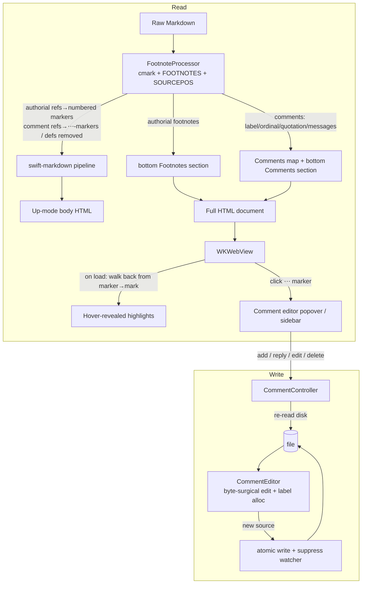

Plan: Footnote Comments
===============================================================================

> Status: Planning


## Context

Issue #5 asks for a commenting workflow: select content in a document, attach a
comment, and use the resulting comments as a batch of feedback for a coding
agent — instead of burning context on multiple rounds of back-and-forth. This
is squarely Mud's primary purpose: collaboratively reviewing and iterating a
Markdown document with an agent.

The proposal in the issue never answers the one question that decides the whole
design: **where do comments live at rest?** A separate comment database brings
all the usual pain — what happens when the file moves, how do you sync to
another device, how do you share with a friend or an agent. Markdown is a plain
text format, and the comments should be too.

So comments are stored **inside the Markdown file, as standard GFM footnotes**.
The key idea is deliberately small and **not Mud-specific** — it's a convention
any tool (or human, or agent) can read and write by hand:

> A footnote is a comment **iff its label matches `^comment-[\w-]+$`**. Its
> body may open with a **blockquote** holding the quoted text; each message is
> introduced by `💬 <author> (<timestamp>)`. No blockquote ⇒ a "general"
> (unanchored) comment; more than one `💬` message ⇒ a thread.

That's the whole format — ordinary blockquotes, the `💬` emoji, and footnotes,
all of which render in any Markdown viewer with footnote support, with nothing
to strip and no proprietary namespace to learn. The canonical grammar, with a
worked example per case and the exact properties it parses to, is pinned in
`Doc/Examples/comments-spec.md`.

This makes Mud a _writer_ for the first time: it modifies the `.md` file when
(and only when) a user adds, edits, replies to, or removes a comment. Every
other path stays read-only.

This buys three things for free:

- **Portability** — comments travel with the file. Move, rename, sync, share:
  all handled, because there is nothing to keep in sync.
- **Agent visibility** — the agent reads the file and sees the comments _as
  footnotes, anchored inline where they apply_. This is the issue's third
  "future extension" (expose comments to an LLM) solved with no CLI and no MCP.
- **Reuse** — comments build directly on the
  [Native Footnotes](./2026-05-native-footnotes.md) plan: cmark-based footnote
  detection, source rewriting by sourcepos byte range, and the bottom-section
  export all carry over unchanged.

**In scope (new vs. an earlier draft):** threading. The format threads
naturally via repeated `💬` messages, so v1 adopts the threaded _format_ and
renders a thread as a flat sequence of messages.

**Out of scope, deliberately ruled out** (not deferred): the issue's
export-as-unified-diff and push-to-forge features, plus bidirectional-forge
sync. The file _is_ the artifact you hand the agent, so those mechanisms are
unnecessary.

This plan depends on Native Footnotes landing first (or alongside): it reuses
that plan's `FootnoteProcessor`, cmark glue, and export-section machinery.


## Confirmed decisions

These were settled during design; the implementation below assumes them.

- **Classifier is the label alone.** A footnote is a comment iff its label
  matches `^comment-[\w-]+$`. No secondary signal is required — the `comment-`
  prefix _is_ the statement of intent. Everything else is **optional**: a bare
  `[^comment-a]: just an observation.` (no quotation, no attribution) is a
  perfectly valid comment (spec example `comment-a`).

- **Quotation is a leading blockquote; attribution is a `💬` header.** When
  present, the definition body opens with a blockquote whose text is the quoted
  range. Each message is introduced by `💬 <author> (<timestamp>):` (a plain
  paragraph). Nothing Mud-proprietary and nothing hidden: a basic viewer shows
  the quotation as a blockquote and the attribution as visible text.

- **Attribution grammar is forgiving.** A message's first paragraph may open
  with `[💬 ]<author> (<timestamp>)[:]` — the `💬` and the trailing colon both
  optional. The parenthetical is read as `created` **iff** it parses as
  `YYYY-MM-DD HH:MM[:SS]` (space-separated, seconds optional); `author` is the
  text before ` (`. If the parenthetical doesn't parse as a timestamp, there is
  no attribution and the whole paragraph is commentary. So
  `JP (2026-06-01 18:33): …` → author `JP`, created set;
  `A quoted comment, no properties.` → no author, no created. Attribution is
  peeled only from a message's **first** paragraph. Timestamps are **local
  wall-clock** (formatted and parsed in the local zone, no offset stored);
  `created` is an absolute `Date`, so a reader in another time zone sees the
  shifted wall-clock — acceptable for v1.

- **Threads are `💬`-delimited messages.** A new message opens at every
  **paragraph that begins with `💬`**; its body runs to the next such paragraph
  (or the end), so a message may span several blocks. With **no** `💬` the whole
  post-quotation body is one message. Only `💬` splits messages — a bare
  `Author (timestamp):` line never starts a new one (spec example `comment-e`).
  The root **quotation** anchors in the **document**; a reply that quotes the
  prior message does so with a blockquote in its own body (parsed, not anchored
  in v1).

- **Anchoring by verbatim echo; no orphan state.** A comment with **no
  quotation** (no leading blockquote) is **general** by construction. A comment
  _with_ a quotation anchors iff that text occurs **verbatim** in the document;
  if it doesn't (the agent rewrote the text), the comment is simply general.
  There is **no** distinct "orphaned" state and no sentinel: a comment is
  either anchored (a highlight is drawn) or not (none is). Whether a quotation
  matches is a pure **render-time DOM** question, computed in JS, never stored.

- **Strict write, forgiving read.** Mud _generates_ a strict canonical form —
  alpha labels (`comment-a`, `comment-b`, …); a leading blockquote for the
  quotation; one `💬 <author> (<timestamp>):` header **per message** (always,
  even a single one), alone on its line, with the commentary starting in a
  **new block** below it; four-space-indented continuation; lines under 79
  characters — but Mud _accepts_ anything the convention allows: any
  `^comment-[\w-]+$` label, any whitespace, a missing
  `💬`/author/timestamp/colon, inline commentary on the header line, the
  blockquote on the marker line or below it. Two consequences of the "new
  block" rule: a message's commentary may be **any** Markdown (a blockquote,
  list, code block — it isn't trapped inline after the colon), and the whole
  codec is **pure block structure with no hard breaks**.

- **Labelling.** The label suffix is an **alpha token allocated in insertion
  order** — the next label is the lexicographically greatest existing
  _scheme-valid_ suffix, incremented (if the last letter is `z`, append `a`;
  otherwise bump the last letter): `a … z, za, zb … zz, zza …`. Hand-authored
  suffixes the scheme could never have produced (`az`, `aa`, `comment-1`,
  `comment-foo`, …) are **ignored when choosing that basis**, so an anomaly
  can't drag the next label into a strange namespace — the comment after
  `{a, b, ya}` is `c`. The scheme is lexicographically monotonic over its own
  labels, so string order equals allocation order and no integer decode is
  needed; and because the basis is always scheme-valid, the new label exceeds
  every scheme-valid label and differs from every anomaly, so it can never
  collide. Labels are **never renumbered**: adding a comment touches only the
  new marker and one appended definition; deleting one leaves a gap. The label
  is a stable join-key and durable identity; the user-facing ordinal (1, 2, 3
  …) is derived from marker position at render time.

- **Rendering.** A comment reference renders — in Mud _and_ exports — as a
  `[⋯]` marker icon (a grayish square with a black middot-ellipsis), not a
  numbered superscript; the highlighted range stays **hidden until the marker
  is hovered**, then shows as a bright-yellow background under the quoted text.
  Mud adds a "Comments" sidebar pane; every export (CLI, Open In Browser,
  Print/PDF, Quick Look) gets a **separate** `<section>` titled Comments,
  emitted **last**, after any authorial footnotes section. Because the marker
  carries no number, comments never consume a footnote number in Mud's rendered
  output — authorial footnotes stay gap-free.

- **Write-back.** Re-read the file from disk → fresh cmark parse →
  byte-surgical edit → atomic write → suppress the self-triggered file-watcher
  reload.


## Data model

The on-disk grammar — one worked example per case with the exact properties it
parses to — is pinned in `Doc/Examples/comments-spec.md`, the canonical spec.
This section summarizes it.

A comment is a footnote whose label matches `^comment-[\w-]+$`. Its definition
body is, in order:

1. an **optional leading blockquote** — the **quotation** (the document text
   the comment refers to). With no blockquote the comment is **general**
   (unanchored).
2. one or more **messages**. A message is introduced by a paragraph beginning
   with `💬`; its body is everything up to the next `💬`-paragraph (so a message
   may span several blocks — paragraphs, blockquotes, lists). A thread is just
   more than one message. A message's first paragraph may open with
   `💬 <author> (<timestamp>):` — `💬` and the trailing colon optional, timestamp
   `YYYY-MM-DD HH:MM[:SS]`. Everything after is the **commentary** (arbitrary
   Markdown).

The fully-attributed, threaded case (spec example `comment-d`):

```markdown
  The quick brown fox[^comment-d] jumped over the lazy dog.

  [^comment-d]: > quick brown fox

      💬 JP (2026-06-01 18:33):

      First comment in thread.

      💬 Claude Opus 4.8 (2026-06-01 18:33:13):

      > First comment in thread.

      Second comment — a reply that quotes JP, as a blockquote in its own body.
```

The marker `[^comment-d]` sits in the document at the **end** of the quoted
range (see _Anchoring_). The leading blockquote (`> quick brown fox`) is the
**root quotation**; a blockquote that appears **after** a `💬` (Claude's
`> First comment in thread.`) is part of that message's commentary, not the
document anchor — the always-present `💬` header is exactly what disambiguates
the two.

Three things the format gives up by construction — no microformat, nothing to
escape, nothing whitespace-fragile:

- **General = no blockquote.** There is no `…` sentinel; absence of a quotation
  _is_ "general." Corollary: a leading blockquote is **always** read as the
  quotation, so a hand-authored general comment whose body opens with a
  blockquote (and carries no `💬`) reads as anchored, not general. Mud's strict
  write avoids this by always emitting the `💬` header first; the tie-break is
  deliberate.
- **Attribution is visible Markdown** (`💬 Author (timestamp):`), not a hidden
  `title` attribute.
- **Messages are blank-line-separated blocks.** No hard breaks, no trailing
  whitespace, no microformat — just paragraphs and blockquotes (see _Risks
  C10_).

Core model (new `Core/Sources/Comments/Comment.swift`):

```swift
  public struct Comment: Sendable, Equatable, Identifiable {
      public var id: String { label }       // stable identity — the footnote label
      public let label: String              // e.g. "comment-a"; ref is "[^\(label)]"
      public let ordinal: Int               // 1-based document-order position; display only
      public let quotation: String?         // root blockquote, whitespace-collapsed; nil = general
      public let messages: [CommentMessage] // one per 💬 header (or one author-less message)
  }

  public struct CommentMessage: Sendable, Equatable {
      public let author: String?  // header text before " ("; nil if unattributed
      public let created: Date?   // parsed from "(YYYY-MM-DD HH:MM[:SS])"; nil if absent/unparseable
      public let body: String     // commentary as Markdown (may itself contain blockquotes, lists, …)
  }
```

There is no `isOrphaned` field and no stored anchor: a comment is general when
it has no `quotation`, and an anchored comment is "anchored or not" purely as a
render-time DOM question (see _Anchoring_). The label is the footnote label,
allocated in insertion order and used purely as a stable join-key.

`parse`/ `serialize` and the attribution/timestamp grammar live in
`Core/Sources/Comments/CommentSerialization.swift`; the round-trip invariant is
`parse(serialize(quotation, messages)) == (quotation, messages)`.


## Architecture

Two concerns, kept separate:

1. **Read path** — extend `FootnoteProcessor` to _classify_ comment definitions
   (label `^comment-[\w-]+$`) apart from authorial footnotes, render each
   comment reference as a `[⋯]` marker (instead of a numbered superscript),
   parse each definition body into a `quotation` plus an ordered
   `[CommentMessage]`, and surface a `[Comment]` list alongside the existing
   footnote list. Pure, testable, shared by app and export.
2. **Write path** — a pure Core `CommentEditor` that rewrites a source `String`
   (insert / rewrite-body / delete) by byte range, plus an app-side
   `CommentController` that orchestrates re-read, atomic write, and watcher
   suppression.




## Anchoring

The model has one anchor — **the marker position** — and one extent — **the
quotation**. A comment's marker is written into the source at exactly the point
where the quoted text ends, so on render the highlight is simply "the
`quotation.length` characters immediately **before** the marker." Re-anchoring
is therefore a short **backward walk** from the marker, not a search of the
document: no scour, no ambiguity when the quoted text repeats elsewhere, no
nearest-occurrence tiebreak. Matching runs against a **whitespace-normalized,
flattened text**, so inline _and_ block element boundaries disappear. The only
place a DOM-position → source-byte mapping is needed is **insert**, and only
for the single selection-end point (below).

- **Capture.** Take the selection text via `Selection.toString()` (block-aware,
  so a cross-paragraph selection reads `…event. Cover…` rather than jamming
  `…event.Cover…`), collapse runs of whitespace to single spaces, and store
  that as the comment's `quotation`. Written as a leading blockquote, the
  collapsed form renders cleanly everywhere and makes matching insensitive to
  the exact break representation. The selection's **end** is the marker's
  insertion point.
- **On create.** Re-read the file and fresh-parse with cmark. Insert
  `[^comment-<label>]` at the **exact source byte of the selection's end** —
  mid-block, right where the quotation ends — by walking the anchor block's
  inline nodes, accumulating their rendered text up to the selection-end
  offset, and reading that node's **per-node sourcepos** for the byte. This is
  the one DOM→source mapping the design needs, and end-anchoring confines it to
  a single point. The highlight extent is recovered on render from the
  quotation, so the marker sits at the quotation's end even when the selection
  spans several blocks.
- **On render.** Each comment reference becomes a visible `[⋯]` marker —
  `<a class="mud-comment-marker" data-mud-label="LABEL" href="#cmt-LABEL">⋯</a>`
  (swift-markdown passes inline HTML through, exactly as for footnote markers),
  baked into the static HTML so it shows even without JS. `mud-comments.js`
  builds a flat text of the body with a position → (text node, offset) index,
  then for each marker walks **backward** `quotation.length` characters from
  the marker and checks that run equals the `quotation`. On a match it maps
  that range back to a `Range` and wraps **each intersected text-node slice**
  in its own `<mark class="mud-comment-highlight" data-mud-label="LABEL">`.
  Per-slice wrapping is required because `Range.surroundContents()` throws
  across element boundaries; the shared `data-mud-label` ties the slices to the
  marker. The marks are **transparent by default** — hovering the marker
  toggles `.is-active` (bright yellow) on the slices with the matching
  `data-mud-label`, and clears it on leave.
- **Unanchored fallback.** If the run immediately before the marker doesn't
  equal the quotation (a general comment, or the agent rewrote the text), the
  `[⋯]` marker still renders but reveals nothing on hover; if the reference is
  gone entirely (a dangling definition), there is no icon. Either way the
  comment still appears in the sidebar and the bottom section with its
  quotation and messages — there is simply no document highlight. No badge, no
  separate state.

The backward flat-text walk and per-slice wrapping are the main JS complexity;
`mud-changes.js`'s zoom-normalized rect handling and span walking are the
closest prior art to follow.

_Known v1 limitations / deferred edges:_ **Reply highlighting** applies only to
the root **quotation**, which has a marker to walk back from; a reply that
quotes the prior message (a blockquote in its own body) has no positional
marker, so highlighting it would require a search within that (short) message.
Replies are parsed and stored but their quotes are **not** highlighted in v1 —
the thread renders as a flat sequence of messages — so that search is deferred
with them. Overlapping highlights need no handling: a highlight is revealed
only on marker hover, one marker at a time, so two never show at once. A long
or cross-block quotation is **more likely to go unanchored** (one agent edit
anywhere in the run breaks the exact backward match); it degrades to a general
comment gracefully, and endpoint anchoring (re-anchoring the run's two ends
independently) is the planned robustness upgrade.


## Implementation

### Core

**`Core/Sources/Rendering/FootnoteProcessor.swift`** — extend the existing
processor (from the Footnotes plan):

- **Classify before numbering.** A definition is a **comment** iff its label
  matches `^comment-[\w-]+$`; otherwise it's an authorial footnote. Footnote
  display numbers are assigned in first-reference order over **authorial**
  references only; comment references are diverted to the `[⋯]` marker path and
  never increment the footnote counter. So `[^1]`, `[^comment-a]`, `[^2]`
  renders in Mud as footnotes 1 and 2 (the comment occupying no number, leaving
  no gap) — even though a foreign renderer like GitHub, which numbers every
  reference by appearance, would show 1, 2, 3.

  - **This means abandoning cmark's reference numbers.** The current `process`
    reads each marker's display number straight from
    `cmark_node_get_literal(refNode)`, but cmark numbers **every** footnote
    reference — comments included — so `[^1] [^comment-a] [^2]` arrives as
    1/2/3 and `[^2]` would render as 3. Replace that read with a Mud-assigned
    counter incremented in first-reference order over **authorial** refs only
    (comment refs skipped). The per-occurrence back-reference id
    (`id="fnref-N-K"`) re-keys off this Mud number, not cmark's.

- Comment references emit the `[⋯]` marker (above) instead of the `<sup>`
  footnote marker; comment definitions are removed from the body like footnote
  definitions. Only **defined** comment labels become markers; a dangling
  `[^comment-x]` stays literal, exactly as for dangling footnotes.

- For each comment definition, parse the body into a `quotation` plus an
  ordered `[CommentMessage]` via `CommentSerialization.parse` and build a
  `Comment` (`label`, `ordinal` = document-order index, `quotation`,
  `messages`). The result type gains a `comments: [Comment]` field beside
  `footnotes`.

**`Core/Sources/Comments/CommentSerialization.swift`** (new) — the read/write
codec for definition bodies, no IO:

```swift
  enum CommentSerialization {
      // Read: structure a comment definition's body blocks into the root
      // quotation and ordered messages. `blocks` are swift-markdown `BlockMarkup`
      // from re-parsing the definition's de-indented `bodyMarkdown` (see below).
      static func parse(_ blocks: [BlockMarkup]) -> (quotation: String?, messages: [CommentMessage])
      // Write: render quotation + messages into Mud's strict canonical body
      // (leading blockquote for the quotation; one "💬 Author (timestamp):"
      // header per message, alone on its line; commentary in a following block).
      static func serialize(quotation: String?, _ messages: [CommentMessage]) -> String
      // Attribution grammar: peel a leading "[💬 ]Author (timestamp)[:]" from a
      // message's first paragraph (💬 and colon optional).
      static func parseAttribution(_ paragraphText: String)
          -> (author: String?, created: Date?, inlineBody: Substring)
      // Timestamp grammar: "YYYY-MM-DD HH:MM[:SS]" (space-separated, seconds
      // optional) ↔ Date.
      static func parseTimestamp(_ s: Substring) -> Date?
      static func formatTimestamp(_ date: Date) -> String
  }
```

- `parse` consumes the definition's body blocks. These come from re-parsing the
  footnote definition's **de-indented `bodyMarkdown`** (the clean CommonMark
  the shared cmark parse already produces via `renderDefinitionBody`) with
  **swift-markdown** into `[BlockMarkup]`. This is safe precisely because the
  body is already de-indented: the swift-markdown multi-paragraph misparse that
  forced cmark for _footnote_ bodies doesn't bite a pre-normalized string, so
  the codec stays pure, testable Swift with no C-interop. From those blocks:
  (1) a **leading blockquote**, if present, becomes `quotation` (flattened,
  whitespace-collapsed); otherwise `quotation` is nil. (2) The remaining blocks
  are split into messages at each **paragraph whose first character is `💬`**; a
  message owns its blocks up to the next `💬`-paragraph. If the first remaining
  block isn't a `💬`-paragraph, an implicit author-less message opens (the
  single-comment, no- `💬` case). (3) Each message's first paragraph is run
  through `parseAttribution`; `author`/ `created` come from the header and the
  remaining text + blocks become `body` (Markdown). A `💬` that is not
  paragraph-initial is ordinary prose and never splits.
- `serialize` is the strict inverse used on write;
  `parse(serialize(q, xs)) == (q, xs)` is the round-trip invariant. The output
  is plain block structure (no hard breaks): just paragraphs and blockquotes.

**`Core/Sources/Comments/CommentEditor.swift`** (new) — pure source rewriting,
no IO:

```swift
  enum CommentEditor {
      // New comment with the given quotation, anchored at the selection end;
      // allocates the next label.
      static func insert(into source: String, quotation: String?, message: CommentMessage)
          -> (source: String, comment: Comment)?
      // Replace the body of an existing definition (covers edit, reply, and
      // delete-a-message — the caller supplies the quotation + new message list).
      static func rewrite(_ source: String, label: String,
                          quotation: String?, messages: [CommentMessage]) -> String
      // Remove a whole comment: its marker and its definition.
      static func delete(_ source: String, label: String) -> String
      // "comment-" + lex-max scheme-valid suffix, incremented.
      static func nextLabel(in source: String) -> String
  }
```

- `insert` allocates the next label via `nextLabel`, maps the selection-end DOM
  point to a source byte (walk the anchor block's inline nodes to the
  selection-end offset, read that node's per-node sourcepos; fresh cmark
  parse), inserts the `[^comment-<label>]` marker at **exactly that byte** —
  where the quotation ends — and appends `serialize(quotation, [message])` to
  the bottom Comments group (creating it after any footnote definitions, with
  one blank line of separation). Returns `nil` if the selection-end can't be
  mapped (caller decides whether to fall back to the block end, or abort).
- `rewrite` finds the definition by `label` (an exact `[^comment-<label>]`
  match) and replaces its body with `serialize(quotation, messages)`. A reply
  is `rewrite(label, quotation, existing + [newMessage])`; an edit is `rewrite`
  with one message's body changed; removing one message in a thread is
  `rewrite` with it dropped. The quotation and the marker are untouched.
- `delete` removes both the definition and its marker, leaving the label gap
  rather than reflowing later labels.
- `nextLabel` takes the lexicographically greatest existing **scheme-valid**
  suffix — one matching `^(z*[a-y]|z+)$`, the form the scheme itself produces —
  and increments it (if the last letter is `z`, append `a`; otherwise bump the
  last letter), starting at `a` when there is none. Anomalous suffixes (`az`,
  `aa`, `comment-1`, `comment-foo`) are ignored as the basis, so they neither
  lengthen nor misdirect the next label; the result exceeds every scheme-valid
  label and differs from every anomaly, so it can't collide.
- All edits are **byte-surgical**: every untouched byte of the source is
  preserved exactly (line endings, trailing-newline state, indentation), so
  diffs stay minimal and concurrent agent edits aren't clobbered beyond the
  edited spans.

**`Core/Sources/RenderOptions.swift`** — add
`public var commentMode: CommentMode = .section` (parallel to `footnoteMode`),
and append `commentMode.rawValue` to `contentIdentity`. `CommentMode` is
`{ interactive, section }`: `.interactive` for the live app (highlights +
sidebar; the bottom section is emitted but `is-print-only`), `.section` for all
export paths (visible bottom section).

**`Core/Sources/MudCore.swift`** — extend the footnotes-aware render entry
point to also return comments:

- `RenderedUpDocument` gains `comments: [Comment]` (and a per-comment rendered
  HTML thread for the editor/sidebar, mirroring the footnote popover map).
- The bottom-section renderer emits, after the optional Footnotes section, a
  `<section class="comments" data-comments><h2>Comments</h2><ol>…</ol></section>`
  — given `is-print-only` when `commentMode == .interactive`. Each item is
  `<li id="cmt-LABEL">` rendering the comment: the `quotation` as a styled
  quote block, then each message with its attribution (`author` · `created`)
  and its `body` rendered as Markdown via the shared `renderUpBody`, plus a
  back-link to the anchor.
- The String export entry points (`renderUpModeDocument`, `renderUpToHTML`) run
  the same preprocessing and get the visible Comments section for free.


### App

**Entitlements** — Mud has been read-only; writing requires
`com.apple.security.files.user-selected.read-write` in `App/Mud.entitlements`
and `App/MudDirect.entitlements`, and retaining **security-scoped** write
access for the opened file (start/stop access around the write). This is a hard
prerequisite for the sandboxed (MAS) build; the direct build needs the same
entitlement for consistency. **Verify** writes succeed in a sandboxed build
before relying on the feature there.

**`App/CommentController.swift`** (new) — owns the write path for a document:

- On add/reply/edit/delete: **re-read the file from disk**, call the
  `CommentEditor` against that fresh content (never the possibly-stale
  in-memory render), write atomically (temp file + rename), and **suppress the
  self-write reload**.
- Self-write suppression: record the expected post-write mtime/size (or content
  hash) and have `FileWatcher` ignore the next change event that matches,
  rather than blindly pausing the watcher (so a near-simultaneous _external_
  edit is still caught). Reuse the existing watcher plumbing.
- After a successful write, refresh the in-app render so the new/edited
  highlight and sidebar entry appear.

**`App/CommentEditorPopover.swift`** (new) — an `NSPopover` (`.transient`)
hosting an editable body (SwiftUI `TextEditor`) with Save, Reply, and Delete,
anchored at the highlight rect (same web→AppKit rect conversion as the footnote
popover). It shows the full thread (read), lets the user edit the body, append
a reply, or delete the comment. Creating a comment shows the same editor
anchored at the live selection.

**`App/WebView.swift`** — register handlers alongside `mudOpen`/ `mudFootnote`:

- `mudCommentDraft` — JS posts the current selection's collapsed `quotation`,
  block info, and rect when the user invokes "Add Comment"; the controller
  opens the editor.
- `mudCommentOpen` — JS posts a comment label + rect on `[⋯]` marker click; the
  controller opens the editor for that comment.
- Thread a `commentData` parameter (label → rendered thread HTML, plus the
  quotation for re-anchoring) into the coordinator in `updateNSView`, beside
  the footnote map.

**`App/DocumentContentView.swift`** — the live Up path computes one
`RenderedUpDocument` with `commentMode: .interactive` and feeds the comments
map to the `WebView`. Heading/outline extraction stays on the original
`ParsedMarkdown` (`[⋯]` markers and highlights contribute no outline text —
verify).

**Menu / context-menu** — add **"Add Comment…"** to the Edit menu and to
`MudWebView`'s context menu, enabled only when there is a non-empty Up-mode
selection (and the document is writable). Hidden where writing can't work.

**Sidebar** — add a `comments` case to `Preferences/SidebarPane.swift` and a
new **`App/CommentsSidebarView.swift`** (mirroring `ChangesSidebarView`)
listing comments in document order with a quotation snippet, the thread, and
`created`. Hovering or selecting a row activates the same bright-yellow
highlight that marker hover does and scrolls to the `[⋯]` marker; clicking
opens the editor (unanchored rows open it without scrolling). Wire it into
`SidebarView.swift`'s pane container.

**Author identity** — a `comment-author` preference (new key in
`MudPreferences`), defaulting to `NSFullUserName()`, written as the `<author>`
in each new message's `💬 <author> (<timestamp>):` header. Surface it in a
settings pane (a small "Comments" pane, or a field under General).


### Resources

**`Core/Sources/Resources/mud-comments.js`** (new) — selection capture
(`Selection.toString()`, whitespace-collapsed) for the draft message; highlight
re-anchoring of the **root** quotation (flat-text index → match → `Range` →
per-slice `<mark>`, across inline _and_ block boundaries, zoom-normalized like
`mud-changes.js`), with the slices left **transparent until the matching `[⋯]`
marker is hovered** (toggle `.is-active`); `[⋯]` marker click → post
`mudCommentOpen` in-app (the `href="#cmt-LABEL"` jump is the no-handler
fallback in exports); unanchored handling (skip drawing). Injected as a
`WKUserScript` in-app **and inlined in full-document exports**, so the marker
and hover work there too; with no JS (fragment, print) the static marker and
bottom section remain.

**`Core/Sources/Resources/mud-up.css`** — `.mud-comment-marker` styled as a
grayish square chip carrying a black middot-ellipsis (`⋯`) glyph
(theme/lighting-variable-aware); `.mud-comment-highlight` transparent by
default with `.mud-comment-highlight.is-active` a bright-yellow background (a
lighting-aware variable so it still reads in dark mode); the styling for Mud's
rendered Comments section and sidebar (the quotation block, the per-message
attribution, and the threaded messages); the `.comments` section (reusing the
footnotes section styling); and the print-only rule:

```css
  .comments.is-print-only { display: none; }
  @media print { .comments.is-print-only { display: block; } }
```

Mud renders the thread from the parsed `Comment` model with its **own** markup
and classes, so the styling never depends on the on-disk form; the raw
blockquote-and- `💬` source is what Down mode and foreign renderers show.


### Down mode, Quick Look, CLI

- **Down mode** needs no comment-specific code, because comment definitions
  _are_ footnotes: `scan` already classifies `[^comment-a]` references and
  their definition blocks (the `> quotation` blockquote and the
  `💬 <author> (<timestamp>):` headers) by cmark footnote node, so they pick up
  the existing `md-footnote-ref` / `md-footnote-def` highlighting and body
  re-parse for free. v1 styles them **identically to authorial footnotes** (no
  distinct comment treatment in Down mode); the raw source is displayed
  literally and honestly, with no wrapper element to dim.
- **Quick Look** and the **CLI** use the String export API (`.section`), so
  comments appear as the bottom Comments section automatically. Neither writes
  comments — authoring is GUI-only.


### Docs

Update `Doc/AGENTS.md` file quick reference: add `Comments/Comment.swift`,
`Comments/CommentEditor.swift`, `Comments/CommentSerialization.swift` (Core),
`CommentController.swift`, `CommentEditorPopover.swift`,
`CommentsSidebarView.swift` (App), and `mud-comments.js`; note the `comments`
case on `SidebarPane`, the `commentMode` field on `RenderOptions`, the
`comment-author` preference, the new read-write entitlement, and the comment
classification step in the rendering-pipeline section. Reference the grammar
spec `Doc/Examples/comments-spec.md`.


## Risks to verify at build time

**Spike C2 and C5b first — they gate the rest.** Sandbox write access (C2) and
the selection-DOM → source-byte mapping (C5b) are the two long poles; prototype
both before building the editor UI or sidebar. If sandbox writes fail,
authoring on the MAS build can't work as designed; if inline sourcepos can't
place the marker mid-paragraph, comments fall back to block-granularity
anchoring. The processor already proves usable inline sourcepos exists — it
reads and validates each footnote reference's source columns today
(`delimitsFootnoteRef`) — so C5b is mapping work, not a capability unknown.

- **C1 — footnote-label portability.** The label prefix is `comment-` (hyphen
  before an alpha suffix). Hyphens and lowercase alpha are unreservedly valid
  in footnote labels everywhere; pin `[^comment-a]` with a fixture and confirm
  GitHub/Gist don't mangle the anchor id (the colon-encoding bug that ruled out
  `mud:` doesn't apply to a hyphen).
- **C2 — sandbox write access.** The read-write entitlement plus
  security-scoped access actually permit writing the user-opened file in a
  sandboxed build.
- **C3 — self-write vs. external edit.** Watcher suppression ignores _our_
  write but still catches a near-simultaneous agent edit (no missed reloads, no
  flicker).
- **C4 — byte-surgical fidelity.** Insert/rewrite/delete preserve line endings,
  trailing-newline state, and all untouched bytes; diffs stay minimal.
- **C5 — DOM re-anchoring.** The backward walk of `quotation.length` chars from
  the marker → `Range` → per-slice `<mark>` is correct across inline elements
  (bold/links/code spans) **and** block boundaries (a cross-paragraph selection
  highlights both runs), under zoom; a non-matching run yields no highlight
  (never the wrong one), and the slices read as one highlight.
- **C5b — insert-time inline sourcepos.** cmark reports usable **per-node**
  source positions for inline nodes under `CMARK_OPT_SOURCEPOS`, so the
  selection-end DOM point maps to the correct source byte (mid-paragraph,
  through emphasis/links/code spans). If inline sourcepos proves unreliable,
  fall back to inserting the marker at the block end (degrading the highlight
  to block granularity for that comment).
- **C6 — concurrent agent edit during authoring.** A file change between
  selection and save routes to the unanchored path rather than corrupting the
  file or clobbering the agent's edit.
- **C7 — codec renders in a basic footnote viewer.** Pin the `comments-spec.md`
  examples in a GitHub Gist and confirm: the leading blockquote shows the
  quotation, each `💬 <author> (<timestamp>):` line shows attribution, the
  commentary (any Markdown) renders, and the footnote back-links work. There
  are no HTML tags to be stripped; the only non-ASCII is the `💬` glyph, which
  renders as an emoji everywhere.
- **C8 — comment/footnote numbering interplay.** In a document mixing authorial
  footnotes and comments, Mud's footnote display numbers count only authorial
  references (comments occupy no number and leave no gap); the Comments and
  Footnotes sections number independently.
- **C9 — attribution + timestamp grammar.** `parseAttribution` peels
  `[💬 ]<author> (<timestamp>)[:]` from a message's first paragraph only when
  the parenthetical parses as `YYYY-MM-DD HH:MM[:SS]` (space-separated, seconds
  optional): `JP (2026-06-01 18:33):` → author + created; the no-colon variant
  (`comment-g`) parses the same; `A quoted comment, no properties.` → no
  author/created, whole text is body. A bare `Author (timestamp):` line **not**
  preceded by `💬` does not start a new message (`comment-e`).
- **C10 — `💬`/blockquote codec parses.** The root quotation is the leading
  blockquote; messages split at **paragraph-initial** `💬`; a `💬` in running
  prose never splits (it isn't paragraph-initial — `comment-f`).
  `parse(serialize(quotation, messages)) == (quotation, messages)` round-trips
  quotation, authors, createds, and bodies (including a reply whose body is
  itself a blockquote). The worked examples and their expected properties are
  pinned in `Doc/Examples/comments-spec.md`.


## Verification

Build (user runs in the macOS VM): `cd Core && swift build`, then `swift test`;
then open `Mud.xcodeproj`, re-resolve packages, build the app.

The grammar spec `Doc/Examples/comments-spec.md` holds one worked example per
case with the exact properties it must parse to: a bare comment (`comment-a`),
a quoted comment (`comment-b`), an attributed comment (`comment-c`), a thread
with a reply that quotes the prior message (`comment-d`), a "looks threaded but
isn't" single comment (`comment-e`), a `💬`-in-prose decoy (`comment-f`), a
no-colon header (`comment-g`), and a general-and-threaded comment
(`comment-h`). The unit tests below assert each example parses to its stated
properties. **Extend the matrix** with: an authorial `[^1]` footnote alongside
a comment (numbering interplay), two comments on the same block, and a comment
whose quotation does **not** occur in the document (general/unanchored at
render).

**Core unit tests** (`Core/Tests/CommentTests.swift`, new):

- classification: any `^comment-[\w-]+$` label → comment (with or without a
  leading blockquote or `💬`); the same body on a non- `comment-` label →
  authorial footnote.
- quotation: a leading blockquote → `quotation`; no leading blockquote → nil
  (general); a blockquote **after** a `💬` belongs to that message's body, not
  the quotation (`comment-d`).
- attribution + timestamp grammar (C9): `comment-c`/ `comment-g`/ `comment-e`
  cases; no-colon header; a parenthetical that isn't a timestamp → no author,
  whole paragraph is body.
- message splitting: a `💬`-initial paragraph opens a message; a `💬` in running
  prose does **not** (`comment-f`); a bare `Author (ts):` without `💬` does
  **not** (`comment-e`); no `💬` at all → one author-less message.
- numbering interplay (C8): `[^1]`, `[^comment-a]`, `[^2]` → authorial
  footnotes render as 1 and 2 (comment occupies no number, no gap).
- codec round-trip (C10):
  `parse(serialize(quotation, messages)) == (quotation, messages)` for the
  general, quoted, attributed, threaded, and reply-with-a-blockquote cases.
- spec conformance: a table-driven test mirroring `comments-spec.md`'s examples
  asserts each parses to its declared properties.
- `nextLabel`: empty source → `comment-a`; `…a … z` → `comment-za`; `zz` →
  `comment-zza`; gapped / out-of-order scheme-valid labels → greatest
  incremented; anomalous labels ignored as basis (`{a, b, ya}` → `c`; `{a, aa}`
  → `b`; only `comment-1`/ `comment-foo` present → `a`).
- `insert`: marker lands at the **selection-end byte** (mid-paragraph, right
  where the quotation ends — not the block end), including a selection ending
  inside inline markup; definition appended to the Comments group; the new
  label comes from `nextLabel`; existing markers and definitions are
  byte-for-byte untouched (no renumber).
- `rewrite` (edit/reply) and `delete` by `label`: reply appends a `💬` message;
  edit changes one body; delete removes both marker and definition and leaves
  the label gap; quotation and other comments untouched.
- general/unanchored: a comment with no quotation, and a comment whose
  quotation is absent from the document, both parse normally and produce no
  document highlight in render.
- export render (`renderUpModeDocument`, `.section`): output has
  `<section class="comments"` _after_ any footnotes section, with
  `<li id="cmt-comment-a"`.

**End-to-end** (open `Doc/Examples/comments-spec.md`, then a scratch file, in
Mud, Up mode):

- select text → "Add Comment…" → editor → save → a `[⋯]` marker appears
  (highlight only on hover), a sidebar row appears, and the file gains a
  `[^comment-<label>]` marker + definition (minimal diff: only the new marker
  and definition change).
- reply in the editor → a second `💬` message appends to the same definition
  (single-definition diff); edit a body → single-definition diff; delete →
  marker and definition removed, other comments' labels untouched (gap left).
- with the document open, edit the underlying text externally (simulating the
  agent) to break a quotation → on reload the comment shows unanchored (in the
  sidebar and section, no document highlight), no data lost; restore the text →
  it re-anchors.
- the highlight is hidden until the `[⋯]` marker is hovered, then reveals as a
  bright-yellow background that lands correctly when the quotation spans
  bold/links/code spans, and when the selection crosses a paragraph break (both
  runs highlighted, marker in the end block).
- the `comment-d` thread renders as a flat sequence of messages with
  per-message attribution; the reply that quotes JP shows its quote as a
  blockquote, not a document highlight.
- Cmd+P / Save-PDF → Comments section appears last in the PDF.
- toggle to Down mode → raw `[^comment-a]` + `> quotation` +
  `💬 author (timestamp):` shown, unchanged.

**Export:**

- Open In Browser → visible Comments section, after footnotes; back-links work.
- `mud -u` / `mud -f` on the fixture → output contains the Comments section.
- Quick Look (spacebar in Finder) → Comments section visible.
