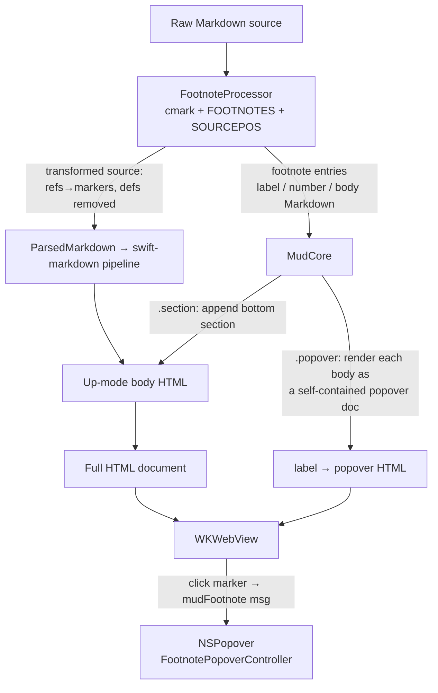

Plan: Native Footnotes
===============================================================================

> Status: Underway


## Context

Mud renders GFM but not footnotes. The reason is a gap in the parsing stack:
the in-app pipeline calls `swift-markdown` (`MarkdownParser.parse` →
`Document(parsing:)`), which never enables footnotes and has no footnote node
cases — so `[^label]` references survive as literal text and `[^label]:`
definitions become stray paragraphs. Worse, `swift-markdown` _misparses_
multi-paragraph and block-content footnote bodies (continuation lines fall out
as indented code blocks), so we can't reconstruct bodies from its AST.

The underlying `swift-cmark` C library (swiftlang/swift-cmark, resolved at
0.8.0) _does_ support footnotes: `CMARK_OPT_FOOTNOTES (1<<13)`,
`CMARK_NODE_FOOTNOTE_DEFINITION` / `CMARK_NODE_FOOTNOTE_REFERENCE`, and
`html.c` emits the standard `<sup class="footnote-ref">` markers and
`<section class="footnotes">`.

We want footnotes to feel native to Mud: clicking a reference marker opens a
macOS `NSPopover` showing the footnote body **rendered as Markdown HTML**. On
any export path (Open In Browser, CLI, Print / Save-PDF, Quick Look) — where no
popover is possible — we instead emit a GitHub-style footnotes section at the
bottom of the document.

The example/fixture document already exists at `Doc/Examples/footnotes.md` and
exercises every permutation used for verification below.


## Confirmed decisions

- **Trigger:** click the marker → transient `NSPopover` anchored at it.
- **In-app:** popover only (no on-screen bottom section). **Export:** bottom
  `<section class="footnotes">`.
- **Parsing:** use `cmark-gfm` directly, parsing with
  `CMARK_OPT_FOOTNOTES | CMARK_OPT_SOURCEPOS`. This adds no new external
  footprint: `swift-cmark` was already a pinned, built dependency (transitive
  via `swift-markdown`; now a direct dependency, unified to the same pin —
  `Core/Package.resolved` pins it at 0.8.0). Declaring a direct `.product`
  dependency just lets us use a library already in the graph. We accept owning
  a small amount of C-interop glue in exchange for footnote detection that is
  correct by construction (cmark is the reference implementation), rather than
  re-deriving CommonMark code-span/escape/ continuation rules in hand-written
  Swift.


## Architecture

A new `FootnoteProcessor` (Core) parses the raw source once with cmark, then
**rewrites the source** for the existing `swift-markdown` pipeline rather than
teaching the pipeline about footnotes:

- Each `[^label]` reference (to a _defined_ label) is replaced, by source byte
  range, with an inline-HTML marker `<sup class="footnote-ref">…</sup>`.
  `swift-markdown` passes inline HTML straight through
  (`UpHTMLVisitor.visitInlineHTML`), so markers render correctly inside
  paragraphs, headings, tables, lists, blockquotes, and emphasis.
- Each definition block is deleted from the source.
- The footnote bodies are returned as clean Markdown (via
  `cmark_render_commonmark` on each definition node, which normalizes
  continuation indentation) for MudCore to render.

Because cmark does the detection, every "should NOT be a footnote" case from
the fixture (refs inside code spans / fenced blocks, escaped `\[^1\]`, empty
`[^]`, whitespace labels) and every dangling `[^missing]` is handled correctly
for free — they simply never become reference nodes, so the literal text
survives untouched.



A single render shape serves all contexts. The bottom
`<section class="footnotes">` is **always** emitted; `.popover` mode adds an
`is-print-only` class so it is hidden on screen but reappears under
`@media print`, giving correct Save-PDF output with no second render. Markers
always carry a real `href="#fn-N"` anchor _and_ `data-footnote-ref` attributes;
the in-app JS intercepts the click (popover) only when the `mudFootnote`
message handler exists, otherwise the native anchor jump to the visible section
works (browser / CLI / Quick Look).


## Implementation

### Core

**`Core/Package.swift`** — add the dependency and link the C product:

```swift
.package(url: "https://github.com/swiftlang/swift-cmark.git", from: "0.7.0"),
// MudCore target dependencies:
.product(name: "cmark-gfm", package: "swift-cmark"),
```

Import in Swift as `import cmark_gfm` (modulemap module name). Footnotes are an
_option flag_, not a syntax extension, so `cmark-gfm-extensions` is not needed.

Use the **identical URL and version range** that `swift-markdown` declares
(`https://github.com/swiftlang/swift-cmark.git`, `from: "0.7.0"`). SwiftPM
resolves one version per package identity (derived from the URL), so matching
both means our dependency unifies with swift-markdown's and can never be the
binding constraint — swift-markdown drives the chosen version, and a divergence
would surface as a loud resolution/compile error, never a silent mismatch. Do
**not** pin tighter (e.g. `.exact` / `.upToNextMinor`): that is what would
later break when swift-markdown bumps cmark. The frozen version lives in the
committed `Package.resolved` (currently 0.8.0) and only moves on a deliberate
`swift package update`.

**`Core/Sources/Rendering/FootnoteProcessor.swift`** (new). Public value types

- an `enum FootnoteProcessor` with one entry point:

```swift
public struct FootnoteEntry: Sendable, Equatable {
    public let label: String        // "1", "named", "long-name", …
    public let number: Int          // 1-based, first-reference order
    public let bodyMarkdown: String // clean, de-indented
}
struct FootnoteProcessingResult { let transformedMarkdown: String; let footnotes: [FootnoteEntry] }
static func process(_ source: String, mode: FootnoteMode) -> FootnoteProcessingResult
```

Algorithm:

1. Fast path: if the source contains no `[^`, return it unchanged with no
   footnotes (skips the cmark parse for the overwhelmingly common case).
2. Build a UTF-8 byte buffer and a 1-based line-start offset table so cmark
   sourcepos `(line, column)` → byte offset. Columns are **byte** offsets
   within the line (validate with a multibyte fixture).
3. `cmark_parse_document(bytes, len, CMARK_OPT_FOOTNOTES | CMARK_OPT_SOURCEPOS)`;
   `defer { cmark_node_free(root) }`.
4. Walk with `cmark_iter`, collecting **definitions** (label via
   `cmark_node_get_literal`; body via `cmark_render_commonmark(defNode, 0, 0)`;
   source byte range) and **references** (label, source byte range from
   sourcepos columns — _not_ literal length, per the cmark autolink caveat;
   occurrence order).
5. Assign numbers in first-reference order, but only to references whose label
   has a definition. References to undefined labels are dangling → left
   untouched (literal text survives).
6. Apply byte-range edits to the source in descending offset order: replace
   each defined reference with its marker; delete each definition block (extend
   the range over the trailing newline / surrounding blank lines so no empty
   paragraph is left behind).

Marker HTML (same in both modes so print/export anchors always resolve):

```html
<sup class="footnote-ref" id="fnref-N"><a href="#fn-N"
  data-footnote-ref data-fn-label="LABEL" data-fn-num="N">N</a></sup>
```

(For the Kth>1 reference of a label use `id="fnref-N-K"` so back-references can
target a specific occurrence.)

Memory: `cmark_node_get_literal` returns a node-owned pointer — copy into a
Swift `String`, do **not** free. `cmark_render_commonmark` returns a malloc'd
buffer the caller **must** `free()`.

Add `FootnoteMode` (here or beside `RenderOptions`):

```swift
public enum FootnoteMode: String, Sendable, Equatable { case popover, section }
```

**`Core/Sources/RenderOptions.swift`** — add
`public var footnoteMode: FootnoteMode = .section` under "Markdown processing",
and append `footnoteMode.rawValue` to `contentIdentity` so a mode change forces
a WebView reload. Default `.section` is the safe export default; only the live
view opts into `.popover`.

**`Core/Sources/MudCore.swift`** — preprocessing must run on the **raw String**
(sourcepos needs raw bytes), so it slots in at the String boundary, before
`ParsedMarkdown`. Concretely:

- Refactor the body of `renderUpToHTML(parsed:)` into a private
  `renderUpBody(parsed:options:resolveImageSource:)` (visitor + frontmatter
  prefix) so it can be reused for footnote bodies.

- New public type and entry point used by the app:

  ```swift
  public struct RenderedUpDocument: Sendable {
      public let html: String
      public let footnotes: [RenderedFootnote]   // label, number, popover html
  }
  public static func renderUpModeDocumentWithFootnotes(
      _ source: String, options: RenderOptions = .init(),
      resolveImageSource: ...) -> RenderedUpDocument
  ```

  It runs `FootnoteProcessor.process(source, mode: options.footnoteMode)`,
  parses the transformed Markdown into a fresh `ParsedMarkdown`, renders the
  body, **always** appends `renderFootnotesSection(entries, options)` (the
  bottom `<section>`; given `is-print-only` when `mode == .popover`), wraps via
  `HTMLTemplate.wrapUp`, and — in `.popover` mode — renders each
  `entry.bodyMarkdown` to a self-contained themed document
  (`renderPopoverDocument`) for the popover WebView.

- The existing String `renderUpModeDocument(_:options:)` and
  `renderUpToHTML(_:String:)` are rewritten to run the same preprocessing and
  discard the footnote map, so all export call sites keep their `String` return
  and get the `.section` output for free.

- `renderFootnotesSection` renders each `bodyMarkdown` to a fragment via
  `renderUpBody(ParsedMarkdown(bodyMarkdown), …)`, wrapping each in
  `<li id="fn-N">… <a class="footnote-backref" href="#fnref-N">↩</a></li>`
  inside `<section class="footnotes" data-footnotes><ol>…</ol></section>`.

- Down-mode functions are unchanged: Down shows raw source, where literal
  `[^1]` is the correct display.

_Known limitation:_ a footnote body that itself contains `[^x]` references is
not recursively processed in v1 (rare; note and defer).


### App

**`App/DocumentContentView.swift`** — the live Up path. Compute a single
`RenderedUpDocument` for up mode (via
`renderUpModeDocumentWithFootnotes(parsed .markdown, options:.popover, resolveImageSource:)`)
and feed **both** the HTML and the footnote map from it, so there is no double
render. The map rides as a new `WebView` parameter
(`footnoteHTML: [String: String]`, label → popover doc) alongside `html` — no
`DocumentState` plumbing needed. Heading/outline/title extraction stays on the
original `ParsedMarkdown` (markers must not pollute outline text; inline-HTML
markers contribute no `plainText`, so this is naturally clean — verify). The
temp-HTML (`:270`) and Open-In-Browser (`:301`) paths already use the String
API and the `.section` default — no change.

**`App/WebView.swift`** — register a second handler
`config.userContentController.add(coordinator, name: "mudFootnote")` (beside
`mudOpen`). Add a `footnoteHTML` stored property threaded into the coordinator
in `updateNSView`. Extract the existing `mudOpen` routing into a private
`openURL(_:)` on the coordinator so both the main view and popover links share
it. Handle `mudFootnote`: look up the body HTML by label, convert the JS rect
(CSS px, zoom-normalized in JS, top-left origin) to the WKWebView's AppKit
coordinate space (Y-flip `y' = bounds.height - (y + h)` — verify against
`isFlipped`), and present the popover anchored to that rect.

**`App/FootnotePopover.swift`** (new) — `FootnotePopoverController`: an
`NSPopover` (`.transient`) hosting a small `WKWebView` and a
`WKNavigationDelegate`. `show(html:baseURL:relativeTo:of:onOpenURL:)` loads the
body document and shows the popover with `preferredEdge: .maxY`. In
`didFinish`, size the popover to `document.body.scroll{Width,Height}` clamped
to sensible min/max with internal scroll for long bodies. The popover document
is a full Up-mode page, so register `mudOpen` on its configuration (reusing
`openURL`) so links inside footnotes route identically (external → browser,
`.md` → new Mud document).


### Resources

**`Core/Sources/Resources/mud-up.css`** — add a theme-variable-aware footnote
block (mirroring the alerts block; `--link-color`, `--border-color`,
`--text-color` are available): `.footnote-ref` superscript styling,
`.footnotes` section styling, `.footnote-backref`, and the print-only rule:

```css
.footnotes.is-print-only { display: none; }
@media print { .footnotes.is-print-only { display: block; } }
```

The popover body reuses the same `mud-up.css` (it's a full Up-mode document),
so no separate stylesheet is needed.

**`Core/Sources/Resources/mud-up.js`** — add a **capture-phase** click listener
for `a[data-footnote-ref]`: if `window.webkit.messageHandlers.mudFootnote`
exists, `preventDefault` + `stopPropagation`, read the marker's zoom-normalized
`getBoundingClientRect` (same `parseFloat(document.documentElement.style.zoom)`
pattern as `mud-changes.js`), and post `{label, num, rect}`. If the handler is
absent (browser / CLI / Quick Look), do nothing — the native `#fn-N` anchor
jump to the visible section is the desired export behavior. No bundling
changes: `mud-up.css` is already inlined by `HTMLTemplate.wrapUp` and
`mud-up.js` is already injected as a `WKUserScript`.


### Docs

Update `Doc/AGENTS.md` file quick reference: add
`Rendering/FootnoteProcessor .swift` (Core) and `FootnotePopover.swift` (App),
note `footnoteMode` on the `RenderOptions` bullet, mention the footnote
preprocessing step + the `renderUpModeDocumentWithFootnotes` entry point in the
rendering-pipeline section, and note the footnote styles/handler now in
`mud-up.css` / `mud-up.js`.


## Risks to verify at build time

- **R1** `import cmark_gfm` resolves under this toolchain (swift-markdown links
  the same package, so it builds; adjust the module name if SwiftPM differs).
- **R2** `cmark_render_commonmark` on a definition node yields clean body
  CommonMark without the `[^label]:` prefix; fallback is to render the
  definition's child blocks individually.
- **R3** Sourcepos columns are byte offsets within the UTF-8 line — validate
  with an emoji/accent-before-marker fixture.
- **R4** `cmark_render_commonmark` `width = 0` means no hard wrapping (else
  pass a large width).
- **R5** C-string ownership: node literal is node-owned (copy, don't free);
  render buffer is malloc'd (must free).
- **R6** Web→AppKit Y-flip for `NSPopover` anchoring vs. `WKWebView.isFlipped`.


## Verification

Build (user runs in the macOS VM): `cd Core && swift build` first to surface
cmark import/link issues in isolation, then `swift test`; then open
`Mud.xcodeproj`, let Xcode re-resolve packages, and build the app.

**Core unit tests** (`Core/Tests/FootnoteProcessorTests.swift`, new):

- no `[^` → input unchanged, empty footnotes (fast path)
- basic ref+def → transformed contains a `footnote-ref` marker with
  `data-fn-num="1"`; the `[^1]:` line is gone; entry body matches
- multi-paragraph / block-content body preserved in `bodyMarkdown` (the whole
  reason for using cmark)
- dangling `[^missing]` → unchanged literal, absent from footnotes
- code span, fenced block, escaped `\[^1\]`, `[^]`, `[^foo bar]` → no marker
- `.section` (via `renderUpModeDocument`) → output has
  `<section class="footnotes"` and `<li id="fn-1"`
- `.popover` (via `renderUpModeDocumentWithFootnotes`) → marker has
  `data-footnote-ref`; footnotes array populated; section present but
  `is-print-only`
- multibyte char before a ref → marker replaces exactly `[^1]`

**End-to-end** (open `Doc/Examples/footnotes.md` in Mud, Up mode):

- click each marker → popover at the marker with the body rendered as Markdown
  (multi-paragraph and block bodies formatted, not raw)
- markers render correctly in headings, tables, lists, blockquotes, emphasis
- dangling / code-span / fenced / escaped cases show literal text, no markers
- a link inside a popover routes correctly (external → browser, `.md` → new
  doc)
- Cmd+P / Save-PDF → footnotes appear as a bottom section in the PDF
- toggle to Down mode → raw `[^1]` source shown, unchanged

**Export:**

- Open In Browser (Cmd+Shift+B) → visible bottom section; markers jump to it,
  back-links return
- `mud -u` and `mud -f` on the fixture → output contains the footnotes section
  and `<sup class="footnote-ref">` markers
- Quick Look (spacebar in Finder) → bottom section visible
