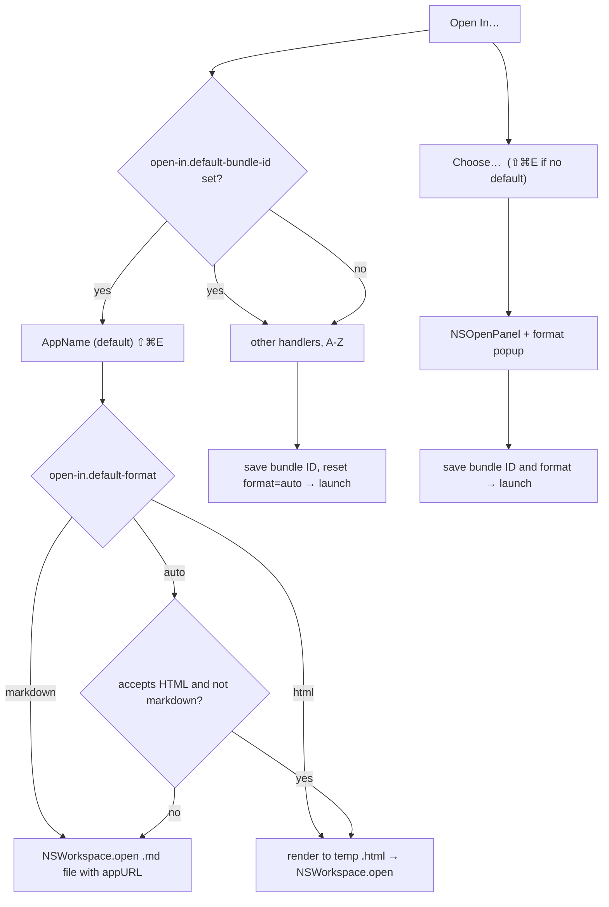

Plan: Open In Editor
===============================================================================

> Status: Complete

GitHub issue: [#4](https://github.com/josephpearson/Mud/issues/4) — "FR: Open
in editor".

## Goal

Add a File-menu command that opens the current document in an external editor,
so the user doesn't have to detour through Finder when they spot something they
want to change. Because Mud is the default `.md` handler, the system doesn't
know which app the user thinks of as their "editor"; Mud has to maintain that
preference itself.

## Design

### Menu shape

A single **File → Open In…** submenu, listing every registered `.md` handler
(minus Mud), with these affordances:

- If an editor has been chosen, it appears at the top of the list with a
  `  (default)` suffix on the title, followed by a divider, followed by the
  remaining handlers alphabetically.
- A trailing divider, then **Choose…**, which falls through to `NSOpenPanel`
  for picking any application.
- Each handler row carries the application's Finder icon.

Picking a handler from the list (or via Choose…) stores its bundle ID as the
last-chosen editor and launches the current file with it. The same submenu is
also installed onto the right-click context menu over the rendered document.

The **Cmd-Shift-E** shortcut floats: it lands on the **(default)** item once an
editor is configured, and on **Choose…** otherwise. So the keystroke does
something useful from a fresh install — opens the picker — and then becomes a
direct launcher once the user has chosen.

### Format choice

The **Choose…** sheet has a `Export:` accessory — a label and a popup-button
with three items:

- **Auto** _(default)_ — at launch time, send HTML if the chosen app accepts
  HTML (`public.html`) and doesn't claim markdown
  (`net.daringfireball.markdown`); otherwise send markdown. Lets you pick
  BBEdit and get markdown, or pick Safari and get HTML, without having to think
  about it.
- **Markdown** — always hand the raw `.md` file to the chosen app
- **HTML** — always render the document to HTML in `NSTemporaryDirectory` and
  hand that file off instead

The chosen format is stored alongside the bundle ID and reused on every
subsequent Cmd-Shift-E / default-item launch. Picking a non-default handler
from the submenu (which has no accessory) resets the stored format to `auto`.
The popup's initial selection is whatever was stored last, so repeating an
earlier choice doesn't require re-clicking the menu.

**Sandboxed builds** (App Store) omit the accessory entirely and force
`markdown` regardless of what the app claims — the temp file that the HTML path
produces lives in our container, which other apps cannot read. This matches the
existing "Open In Browser" feature, which is also hidden under sandboxing.

`.auto` is resolved to `.markdown` or `.html` inside `OpenInMenuModel` before
the launch request reaches the view layer; `EditorLaunchRequest` only ever
carries a concrete format.

### State and persistence

Two keys under the `open-in.*` prefix:

- `open-in.default-bundle-id` — String. The configured editor's bundle ID.
  Unset means no editor has been chosen yet.
- `open-in.default-format` — `auto`, `markdown`, or `html`. Defaults to `auto`.

Both are mirrored into the app group like every other preference, though Quick
Look has no use for either. Bundle IDs are stable across moves and version
updates, where absolute paths are not. If the stored bundle ID no longer
resolves to an installed app, `default-bundle-id` is cleared on the next menu
refresh — Cmd-Shift-E silently reverts to the Choose… path. `default-format`
keeps whatever it had; it gets overwritten the next time the user picks an
editor.

### Architecture

`App/OpenInEditor.swift` owns the data model and the menu actions:

- `RegisteredMarkdownHandler` — value type with `displayName`, `appURL`,
  `bundleID`, and `icon`. Failable `init?(appURL:)` resolves all four from the
  `Bundle` at the given URL (display-name fallback chain: CFBundleDisplayName →
  CFBundleName → file stem).
- `EditorLaunchRequest` — tiny `(handler, format, id)` value used to fire a
  one-shot launch through `DocumentState`.
- `OpenInMenuModel` — singleton `ObservableObject` with `@Published`
  `configured` and `others`. Exposes `refresh`, `launch(with:)`, and
  `chooseEditor()`. `launch(with:)` resolves the appropriate stored choice
  (stored format when the handler is already the default, `.auto` otherwise),
  then resolves `.auto` to a concrete `.markdown` or `.html` based on the
  handler's UTI claims. `chooseEditor()` builds the `NSOpenPanel` and its
  accessory in non-sandboxed builds, omitting the accessory under sandboxing.

The actual rendering and hand-off lives in `DocumentContentView`, mirroring the
existing "Open In Browser" plumbing. `OpenInMenuModel.launch` writes the
preferences and assigns an `EditorLaunchRequest` to the key window's
`DocumentState.openInEditorRequest`. The view observes the change via
`.onChange` and runs a private `openInEditor(_:)` that either renders to a temp
HTML file or passes the source `.md` file directly, then calls
`NSWorkspace.shared.open(_, withApplicationAt:, configuration:)`.

The File-menu commands in `MudApp.swift` are pure SwiftUI declarations driven
by `@ObservedObject openIn = OpenInMenuModel.shared`. No AppKit menu delegate;
SwiftUI's reconciliation owns the menu and we work with it, not against it. The
right-click context menu, by contrast, is owned by `MudWebView` (an AppKit
`WKWebView` subclass), so it builds an equivalent `NSMenu` submenu in
`buildOpenInSubmenu()` driven by the same `OpenInMenuModel.shared`. The shape
duplicates ~30 lines of declaration across SwiftUI and AppKit, but the actions,
state, and launch path are shared.

`AppState.reloadPreference` routes external `open-in.default-bundle-id` and
`open-in.default-format` changes (made via `defaults write` while Mud is
running) to `OpenInMenuModel.shared.refresh()` so the menu stays consistent.

## History

Three earlier designs were attempted and abandoned before settling on the
shipped one:

1. **Option-alternate pair** — a direct-action "Open In AppName" item and an
   "Open In…" submenu occupying the same slot, swapped via
   `NSMenuItem.isAlternate`. Failed because SwiftUI's `Commands` reconciliation
   strips items it didn't declare, including any we injected through an
   `NSMenuDelegate`.

2. **Direct button plus submenu, both always visible** — kept the Cmd-Shift-E
   shortcut on a permanent "Open In Editor" button that greyed out when
   unconfigured. Worked, but the redundant button alongside the submenu
   produced a busier File menu than the feature warranted. Collapsing to a
   single submenu and floating the shortcut onto the (default) item lands the
   same end-user behaviour with less menu real estate.

3. **`editor-bundle-id` as a single top-level key** — once the format choice
   was added, the editor handoff has two values to remember (bundle ID and
   format). Renamed to `open-in.default-bundle-id` and `open-in.default-format`
   so the pair is visibly grouped under a shared prefix, matching every other
   multi-value preference area (`up-mode.*`, `changes.*`, `sidebar.*`).
