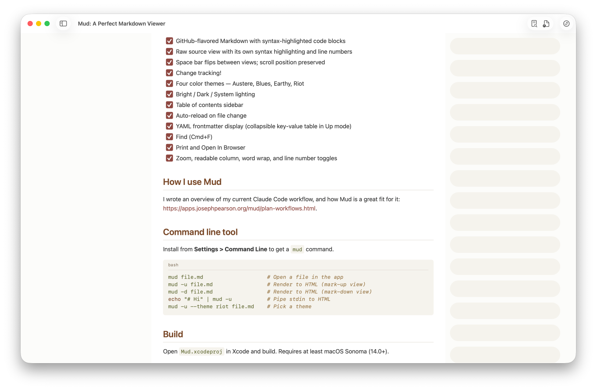
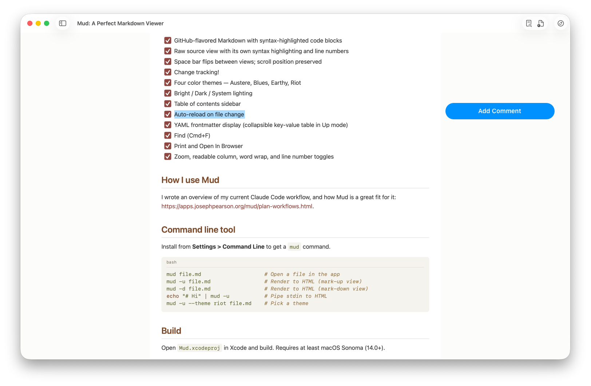
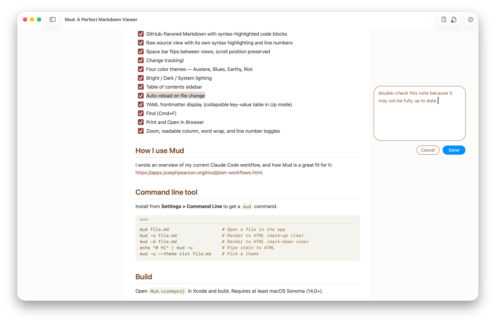
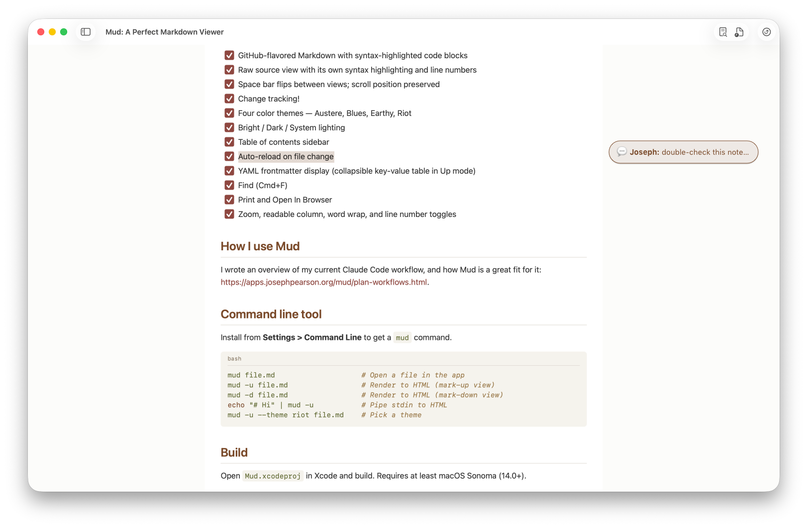
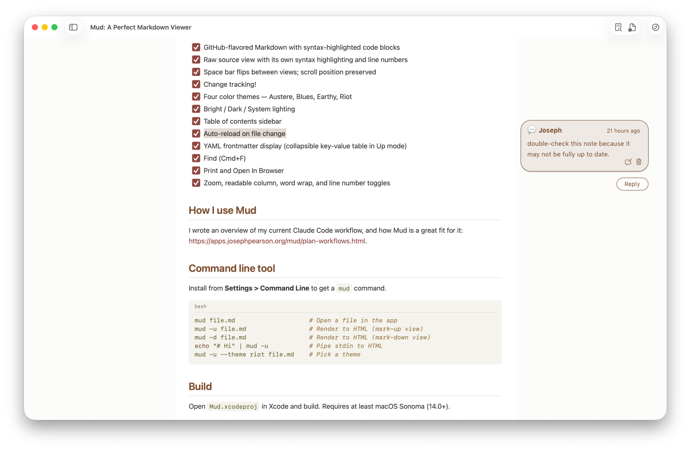
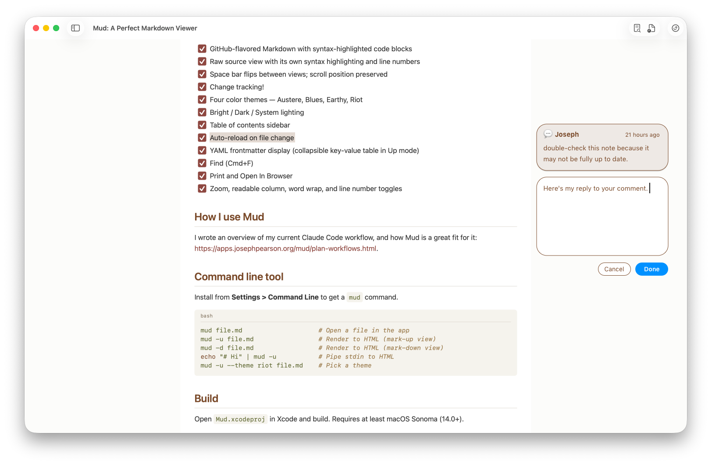
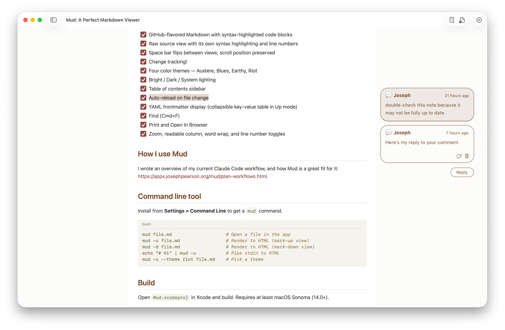
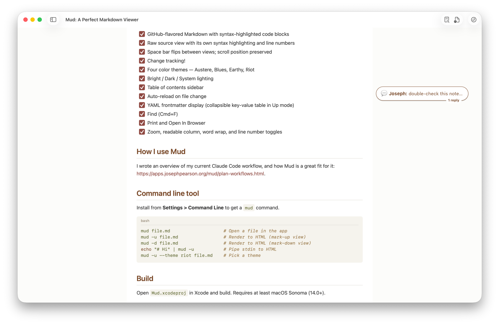

Plan: Comments Column
===============================================================================

> Status: Planning

## Width and position

The Comments column sits to the right of the document. It can be toggled on or
off.

In Readable Column mode, it occupies the 300 pixels directly to the right of
the column, with a 12px margin either side — the document remains centered if
there is 324px+ of available space to the right of it, otherwise it is nudged
leftwards until there is. If the window is narrower than 1124px of total
available width (800 + 12 + 300 + 12), then the document will occupy that width
minus 324px for the Comments column.

When not in Readable Column mode, the document will occupy the window width
minus 324px for the Comments column.

## Visibility

The column is shown or hidden with a `commentsColumn` view toggle, persisted
like the app's other view toggles and applied as a body class. It has both a
View-menu item and a toolbar button, and is off by default. The column is an
Up-mode feature: in Down mode the toggle is inert and the column does not
appear.

## Slots system

Conceptually — but not visibly — the Comments column is a set of "slots". Each
slot is a capsule that is 300px by 45px. There is a gap of 15px above each
slot.

See a visual representation of this concept:

Slots are used for stacking comments intelligently and cleanly. When a comment
or a button occupies one or more consecutive slots, anything already in those
slots slides down to the next available slot. They will push anything in their
way down to the next available slot. When their preferred slots free up, they
will slide back up. These slide transitions are animated elegantly.

### Placement rule

Concretely, the solver gives each item a preferred slot — for a comment, the
slot level with the top of its highlighted quotation; for the Add Comment
button, the slot level with the top of the selection. It sorts items by
preferred slot (document order), then sweeps from the top, placing each item at
the lower of its preferred slot or the first free slot below the previous item.

An item never sits above its preferred slot, so a comment never floats above
the text it annotates. It is pushed down only when an earlier-anchored item
already holds the space, and slides back up when that space frees. This is one
deterministic top-to-bottom pass.

The Add Comment button follows the same rule: it wants the slot by the
selection top but yields to any comment anchored earlier in the document,
landing in the next free slot below — exactly what the sweep produces.

### Reflow triggers

The solver runs once at load and again whenever something moves a comment's
preferred slot or changes how many slots an item needs. The column lives in the
document's scroll space — capsules are positioned against the document body,
not the viewport — so plain scrolling moves the column with the text and needs
**no** re-solve. Everything else that re-solves falls into two groups.

**Geometry changes** recompute each comment's preferred slot from fresh
highlight rectangles, then re-run the sweep:

- The webview resizes (window resize, or the native left sidebar showing or
  hiding, which narrows the webview).
- Readable Column is toggled, changing the text wrap width.
- Zoom changes.
- Async content finishes laying out and shifts the text below it — images
  loading, web fonts arriving, Mermaid diagrams rendering.

A single `ResizeObserver` on the Up container catches most of these — it fires
on any height change, including late image and Mermaid layout — with the window
`resize` event covering width-only changes. Coalesce bursts with
`requestAnimationFrame` so a flurry of image loads solves once.

**State changes** keep the preferred slots but change an item's slot count or
membership, then re-run the sweep:

- A selection appears, moves, or clears — placing or removing the Add Comment
  button.
- A compose form opens or closes (new comment, reply, or edit), growing or
  shrinking an item to its four-slot form.
- A comment is activated or deactivated, expanding to its full height or
  collapsing to one slot.
- A comment add, reply, edit, or delete arrives through the live no-reload
  sync, inserting, resizing, or removing a capsule. Delete runs its
  puff-of-smoke animation first, then re-solves so the capsules below slide up
  into place.

A document reload (the file changed on disk) rebuilds the column from scratch.
A comment-only edit does not reload — the content identity that decides reloads
ignores comments — so those arrive through the live sync above.

## Adding a comment

When you select some text, an "Add Comment" button appears in the slot adjacent
to the top of the selection. (Though it does not appear when you have selected
text that isn't commentable, such as part of a code block.)

If that slot is occupied by a comment that begins earlier in the document than
the start of the selection, the Add Comment button appears in the next free
slot instead.

The selection color is whatever the system-default selection color is — we
don't need to do anything special for this. The Add Comment button should be
the system-default primary button color — ie, the macOS "accent color".

When you click "Add Comment", the selection becomes a highlight span, and now
it should take on the theme's highlight color. The comment-input form appears
in the slot and consumes the next 3 slots. The "Cancel" and "Done" buttons are
bottom-aligned to the bottom of that 4th slot. There should be 15px vertical
gap between the text area and the buttons:

The "Done" button is accent-colored. The textarea and cancel button are
outlined in the theme's foreground-color.

Once you click "Done", the comment is saved to the document, and the comment
collapses down to a single slot, with the text preceded by "💬 **Author**: " and
truncated with an ellipsis at the end of the line:

## Navigating comments

When you hover over a comment in the column, the highlight for the quoted
section will appear in the document:

When you click on the comment, the highlight remains (because the comment is
now "active") and the comment expands to take up as many full slots as
necessary to display its entire contents plus a "Reply" button:

An active comment shows each message's author and time. The time is relative
for the first 24 hours — "5 minutes ago", "11 hours ago" — and an absolute
date-time after that.

The base of the message bubble shows two small icons: an Edit button (as a
comment-bubble-with-pencil icon) and a Delete button (as a trash-can icon).
These buttons are only present for the last comment in the thread.

The Edit button transforms the bubble into the comment-input form, same as at
the "Adding comment" step above, with the same Cancel and Done buttons below
the textarea.

The Delete button removes the comment in a sort of puff-of-smoke animation
(using a simple scale-blur-fade combo, I think). As that ends, any necessary
rearranging of the slots below slides into place.

## Replies & threads

If you click the Reply button below the active comment, it will transform that
slot into a new comment-input form, again occupying 4 full slots (including the
Cancel & Done buttons which are bottom-aligned to the bottom of the 4th slot).

Note that the Edit and Delete buttons are removed from the active comment
bubble, since it will no longer be the last comment in the thread. (They are
restored if you Cancel out of the new comment, of course.) This means that the
active comment will sometimes shrink enough to need one less slot, so the
comment-input form can immediately slide up in that case.

After the reply is submitted (by clicking Done), the full thread will appear,
with each comment taking as many slots as needed to display in full, and the
last comment showing the Edit and Delete icon-buttons:

Mouse-down anywhere outside the comment will collapse it to an inactive
comment. In this form, only the truncation of the first comment in the thread
is shown, with "1 reply" / "2 replies" / etc as a label that cuts into the
border of the bubble:

## Implementation details

MudCore parses a document's comments into a `Comment` model and renders each
one to HTML — its quotation and the Markdown of every message. It writes these
as the **Comments section** at the foot of the document: one block per comment,
each block carrying its label and quotation, and each message carrying its
author and time as structured markup (not just prose). This section is the
single source of comment HTML in the page.

On screen the section is hidden by CSS, and the JS builds the column from it.
For each comment it reads the structured block and projects a capsule —
collapsed (💬 author and a truncated first message) or, when active, expanded
(the cloned message HTML, author and time, and the Reply / Edit / Delete
controls). The JS only clones and re-wraps nodes that are already rendered; it
never parses Markdown. For printing the rule reverses: the column is hidden and
the section is shown (see Exporting & printing).

Because the column is a projection of the section, there is one comment format
to maintain, and the same projection builds the read-only export column and the
live editing column alike. The section's markup is therefore a contract the
column JS depends on, and any clone of a section node must strip or namespace
its `#cmt-LABEL` id so the page holds no duplicate ids.

### The quote marker

In interactive Up mode there is no visible `[⋯]` marker beside the quoted text
— the highlight and the column capsule are the only affordances. The marker is
present in the HTML but hidden by CSS on screen; print and export reveal it,
with its `#cmt-LABEL` link to the section. Keeping it in the DOM gives the
highlight its anchor: the JS finds each quotation by the marker's position,
wraps the quoted text in a `<mark>`, and the slot solver reads that mark's
`offsetTop` for the comment's preferred slot. (Pulling the marker out of the
DOM in Up mode would mean anchoring the highlight some other way — more work
for no visible gain, so it is hidden rather than removed.)

### The write path

Editing is native. The compose box is an HTML `<textarea>`; on submit, its text
crosses to Swift through a message handler carrying the action (add, reply,
edit, delete), the target label, the body, and — for a new comment — the draft
locator that pins the quotation to a source byte. A Swift controller then
performs the byte-exact, atomic, security-scoped write to the `.md` file.
Keyboard handling lives with the textarea: Esc cancels, Cmd-Enter submits, and
the field gets the standard cut / copy / paste.

### Live updates, no reload

A comment add, reply, edit, or delete updates the column in place, with no
document reload, so scroll position and any open selection survive. After the
write, Swift hands the JS the changed comment as a section fragment; the JS
slots it into the hidden section, reprojects that one capsule, and re-solves. A
full reload is reserved for an actual change to the document body on disk — a
comment-only edit does not trigger one.

### Commentability

The Add Comment button must appear only for a selection that can actually be
saved — otherwise a click would fail at submit. A code-block selection, for
instance, has no anchor. The exact predicate — which selections are
commentable, and whether a selection may span more than one block — is **still
open**, to be settled during implementation. The plan assumes for now that the
button shows when the selection lies in ordinary body text and hides otherwise.

### Read and write JavaScript

The exported column is read-only, so the comment JS splits in two: a **read**
file — projection, highlight anchoring, hover, activate-and-expand, the solver,
and layout — included everywhere, exports included; and a **write** file —
selection capture and the Add Comment button, the compose box, submit, edit,
and delete — included only in the app. An export loads only the read file, so
its column reveals highlights on hover and expands on click but offers no
editing.

## Exporting & printing

The same document HTML serves several read-only contexts. Each picks what to
show with CSS and which JavaScript it loads.

- **HTML export and the `mud -u` CLI** include the column, read-only. Every
  comment starts collapsed; it reveals its highlighted quotation on hover and
  expands on click, but nothing can be added, edited, replied to, or deleted.
  This follows from loading only the read JavaScript (see Implementation
  details).
- **Quick Look** excludes the column — the preview is too narrow to spend the
  width on it, and no app JavaScript runs there anyway. Comments degrade to
  their static form, exactly as footnotes do in Quick Look: the quote markers
  are shown and the bottom Comments section is visible, and clicking a marker
  scrolls down to its entry (a same-document `#cmt-LABEL` jump, no popover or
  column).
- **Print** hides the column and shows the bottom Comments section instead,
  with the quote markers revealed and linking into it.

The bottom section is the single source the column projects from, so all of
these read from one rendered form of the comments.
