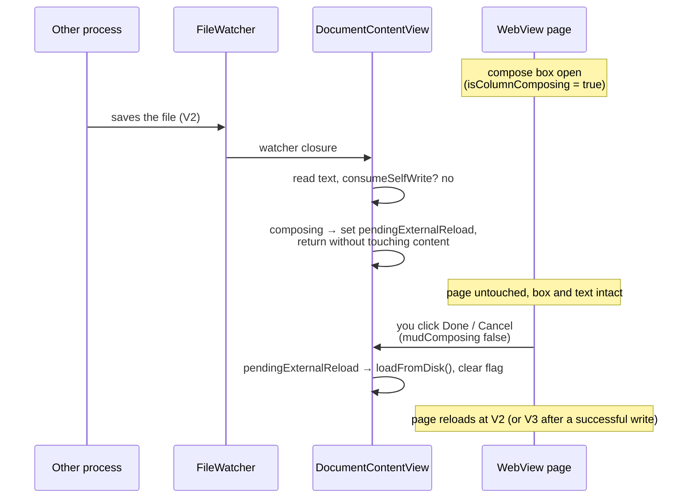

Plan: Save While Commenting
===============================================================================

> Status: Planning

When you are writing a comment and another process (a coding agent, an editor,
a `git checkout`) saves the same `.md` file, your compose box vanishes and the
text you were typing is lost. This plan keeps that from happening.

## The problem

The compose box and its draft anchor live entirely in the WebView page. The
`<textarea>` is the `composeNew` element in `mud-comments-edit.js`; the draft
(quotation, locator, position) is a JS variable on that page. Nothing about
either is mirrored on the native side except one boolean, `isColumnComposing`.

A reload destroys the page. The reload fires like this:

1. `FileWatcher` sees the write and calls the closure in `setupFileWatcher`
   (`DocumentContentView.swift`).
2. The closure calls `loadFromDisk()`, which sets `content = .parsed(...)`.
3. That changes `displayContentID`.
4. `WebView.updateNSView` sees `contentChanged` and calls
   `webView.loadHTMLString(...)`.
5. The page — textarea, typed text, and draft — is torn down and rebuilt.

The comment-invariant `contentID` (it hashes `removeComments(markdown)`) only
protects against _comment_ edits. A prose edit elsewhere in the file is a real
content change, so it reloads. That is correct in general and fatal during
compose.

### Two distinct failures

**1. Lost work.** The reload throws away the box and everything typed in it.
This is the one you hit.

**2. A staler anchor problem at submit.** The draft's locator (`blockText` +
`offsetInBlock` + `occurrence`) is read from the DOM you were looking at — call
it V1. The write path deliberately re-reads disk (now V2) and re-anchors by
_content match_: `CommentAnchor.insertionOffset` finds the leaf block whose
collapsed text equals `blockText`, the `occurrence`-th such block, and walks to
the offset. That match is already resilient when the other process edits a
_different_ part of the file — your block is still found and the marker still
lands right. It goes wrong only when:

- the other process edited the **exact block you quoted** — the text no longer
  matches, `insertionOffset` returns nil, `addComment` returns nil, and today
  the note is **silently dropped** (the JS tore the box down on submit before
  native ran); or
- it changed how many identical-text blocks precede yours — `occurrence` now
  points at the wrong one, so the marker lands in the wrong block.

The first case is the one worth handling. The second is rare and out of scope
here (noted under [Out of scope](#out-of-scope)).

## The approach: hold the document while composing

The model to keep in your head: **while a compose box is open, the document is
held.** External saves are remembered, not applied. The moment you finish —
submit or cancel — the held change applies and you see the new file.

This fixes failure 1 outright, and it keeps the anchor consistent with what you
see: the DOM stays at V1 while you type, so the locator stays valid against V1.
At submit the content-match re-finds your block in V2.

For failure 2 (you submit and your quoted block was rewritten), the write can't
place the marker. We catch that, **keep the box open with your text intact**,
and tell you why.

### Hold flow

### Native: defer the reload

Split the read from the apply so the watcher can inspect the new bytes without
committing to a render:

- `loadFromDisk()` stays the public entry point but is refactored into a read
  step (returns the text, no state mutation) and an apply step (the current
  body: parse, update `comments`, `outlineHeadings`, `changeTracker`, title).

In the `setupFileWatcher` closure:

1. Read the new text (via a pure `readDisk()` that classifies without mutating
   `content`).
2. `consumeSelfWrite` first (unchanged) — so the pending-write set stays
   bounded and a later genuine edit isn't misread.
3. If `isColumnComposing` is true: set a new `pendingExternalReload` flag and
   **return without applying** — `content` doesn't move, `displayContentID`
   doesn't move, no reload. This holds **every** change while a box is open,
   our own comment echo included: when a held external edit and the new comment
   land in one write, applying that echo now would change the prose, reload the
   page, and strand the box. One `loadFromDisk` at compose-end applies whatever
   is on disk by then.
4. Otherwise apply as today (and keep the existing background-reload badge
   logic, which still skips self-writes).

When compose ends, apply the held change. The existing
`.onChange(of: state.isComposingComment)` at `DocumentContentView.swift:198`
already fires when the box closes; add: if `pendingExternalReload`, run
`loadFromDisk()` and clear the flag.

New `DocumentState` fields:

- `pendingExternalReload: Bool` — a held change is waiting (external or our own
  comment echo).
- `externalChangeHeld: Bool` (published) — true while a held change is
  specifically external, driving the banner (see below). Set in the watcher
  only when `!isSelfWrite`, cleared when composing ends.
- a one-shot `composeResolution` trigger (`id` + `success: Bool`) for the
  submit ack below, following the existing `addCommentID` pattern.

### Submit safety net: keep the box open on a failed anchor

Today the new-comment `onDone` posts the submission and then immediately calls
`closeNewCompose()` — the box is gone before native knows whether the marker
could be placed. Change it to wait for a native acknowledgement.

JS (`mud-comments-edit.js`):

- `submit(payload, onResolve)` stores `onResolve` as `pendingResolve` and posts
  the message.
- A new `col.resolveCompose(success)` (set on the read-side `col` object, the
  same way `col.addFromSelection` is) calls and clears `pendingResolve`.
- The new-comment `onDone`: post the add, **disable** the textarea and buttons
  (keep the box, keep the text, keep `setComposing(true)`), and pass a
  resolver: on `true` → `closeNewCompose()`; on `false` → re-enable the box,
  refocus, show an inline error line, and relabel **Cancel → Reload** (with an
  error showing, dismissing the box only drops the held change and refreshes to
  the version on disk).
- The inline reply/edit `onDone` follows the same shape (`teardownInline` on
  success; re-enable on failure).

Native (`DocumentContentView.handleCommentSubmit`):

- `.add`: when `addComment` returns a label, set
  `composeResolution(success: true)`; when it returns nil, set
  `composeResolution(success: false)` and show an `NSAlert` ("Couldn't place
  your comment — the text you selected changed on disk. Your note is still in
  the compose box."), with a button to copy the note to the clipboard as a
  second safety net.
- `.reply` / `.edit`: same — resolve true/false off the returned `Bool`. (A
  failure here means the comment was deleted out from under the reply; rare,
  but the same path keeps the text.)
- `.delete`: no text to lose; resolve is unnecessary.

`WebView.updateNSView` gains one more one-shot handler, mirroring
`addCommentID`: on a new `composeResolution.id`, call
`window.Mud && Mud.comments && Mud.comments.resolveCompose(<bool>)`.

### How the pieces interact at submit

While composing, an external change is already held. On Done:

- **Quoted block untouched by the held edit** → anchor against V2 succeeds →
  write V3 → `resolveCompose(true)` → box closes → `mudComposing(false)` →
  `pendingExternalReload` applies `loadFromDisk()` (disk is V3, the write
  landed synchronously). With held prose, V3's `displayContentID` differs, so
  the page re-renders at V3 with the marker; with no held prose it's
  comment-invariant and the marker drops in via `setData`. Either way, one
  clean update.
- **Quoted block rewritten by the held edit** → anchor fails →
  `resolveCompose(false)` → box stays open (composing stays true, so the hold
  stays) → alert. You copy or retype, then Cancel → `loadFromDisk()` shows V2 →
  re-select and comment against the new text.

## Files to touch

- `App/DocumentState.swift` — `pendingExternalReload`, the published
  `externalChangeHeld`, the `composeResolution` trigger and its
  `ComposeResolution` type.
- `App/DocumentContentView.swift` — split `loadFromDisk` into `readDisk` /
  `applyLoaded`; branch the watcher closure on `isColumnComposing` (raising
  `externalChangeHeld` for external holds); apply the held change and drop the
  banner when composing ends; resolve the submit ack and show the alert.
- `App/WebView.swift` — pass and fire the `composeResolution` one-shot and the
  `externalChangeHeld` banner toggle.
- `Core/Sources/Resources/mud-comments-edit.js` — `submit` with a resolver,
  `col.resolveCompose`, `col.setHoldBanner`, the box's `setBusy` / `showError`
  / `focusTextarea` helpers, and the Cancel → Reload relabel.
- `Core/Sources/Resources/mud-comments-edit.css` — the `.mud-compose-error`
  note and its failure-state accent on the box's buttons, and the
  `.mud-hold-banner` bar.

## Edge cases

- **Several external writes during one compose.** Each sets
  `pendingExternalReload = true` (already set) and returns. One
  `loadFromDisk()` at the end reads the latest disk. Fine.
- **Self-write during compose.** Your own submit write echoes back through the
  watcher. While a box is open it's held like any other change (step 3), so the
  new marker and any held prose land together in the one `loadFromDisk` at
  compose-end. `consumeSelfWrite` still runs first, only to keep the
  pending-write set bounded.
- **Down mode.** Comment compose is Up-mode only, so `isColumnComposing` is
  never true in Down mode and nothing changes there.
- **Write error vs. anchor failure.** Both surface as a failed resolve today.
  We can keep one alert for both, or distinguish them later; the text is
  preserved in both cases regardless.

## The file-changed banner

The hold has a quiet side effect: while you compose, the window keeps showing
V1 even though disk has moved to V2, and nothing tells you. Most of the time
that's fine — you're commenting on text the other process didn't touch, and the
new version appears the moment you finish. But if it rewrote the part you're
reading, you'd be commenting on text that no longer exists, with no clue until
you submit (where the safety net catches it) or cancel (where the view
refreshes).

The banner closes that gap: a fixed, semi-opaque dark bar with white text
across the top of `.up-mode-output`, reading "The file has changed. Your view
refreshes when you finish this comment." It's informational
(`pointer-events: none`, so it never blocks the text) and sits above the
content and the comments header.

It's driven from the published `externalChangeHeld` flag, pushed to the page
the same no-reload way the comment data is — `WebView` compares it against the
coordinator's `lastExternalChangeHeld` and calls `Mud.comments.setHoldBanner`,
which adds or removes the bar element. Only a genuine external edit raises it
(not our own comment echo, which is held too), and it clears when the box
closes, whether the held change then reloads the page or just refreshes in
place.

## Out of scope

- **`occurrence` drift.** If the held edit adds or removes an identical-text
  block before yours, the marker can land in the wrong copy. Handling this
  needs a stronger locator (e.g. carry a few words of surrounding context) and
  is a separate change.
- **A live in-place patch of external prose edits** (rendering the new text
  without a reload, the way comment edits already patch in place) is a much
  larger change against the single-WebView-swap design and is not proposed
  here.

## Testing

Manual (the main coverage — most of this is UI and JS):

1. Open a `.md` in Mud, select text, Add Comment, start typing.
2. From a terminal, append a line elsewhere in the file. Expect: the box and
   text stay; no reload; the "file changed on disk" banner appears.
3. Click Done. Expect: the marker lands, the banner clears, and the view
   refreshes to include the appended line.
4. Repeat, but this time rewrite the exact paragraph you quoted before clicking
   Done. Expect: an alert, the box stays open with your text, and Cancel then
   shows the rewritten file.
5. Reply and edit flows: repeat 2–3 with an inline reply box open.

Unit (`Core/Tests`): `CommentAnchor.insertionOffset` already returns nil when
the quoted block's text changes — that is the failure the safety net catches.
Add a `CommentController.addComment` test asserting it returns nil (no write)
when the source no longer contains the draft's block text, to pin the contract
the JS ack depends on.
