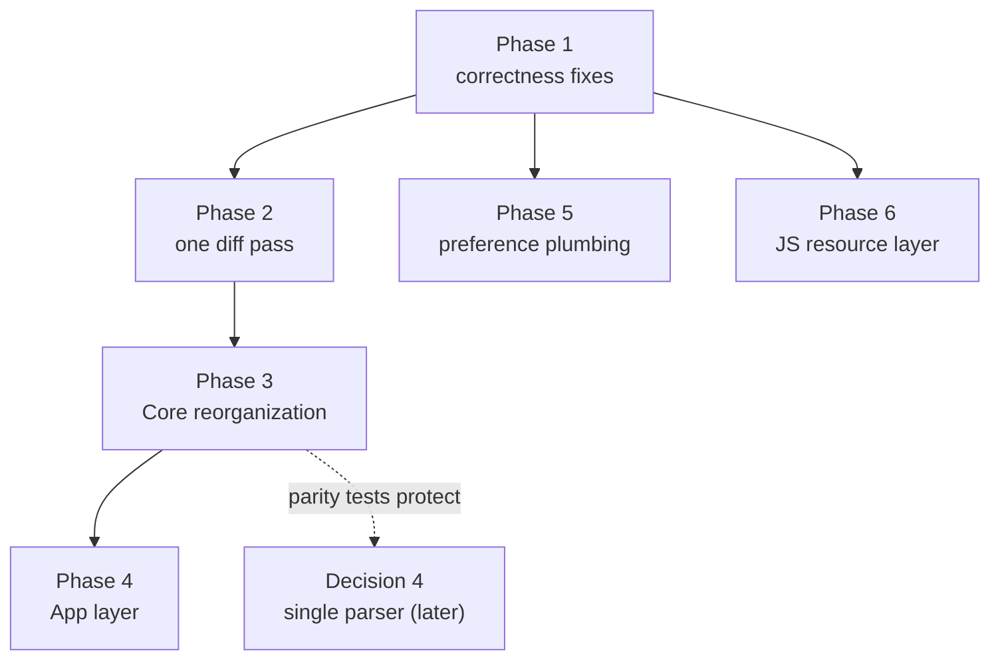

Plan: Architecture Improvements
===============================================================================

> Status: Underway (Phases 1–4 landed, and the single-parser rework of decision
> 4 landed in full — see
> [2026-07-single-parser-rendering.md](./2026-07-single-parser-rendering.md);
> Phases 5–6 remaining)

A full architecture review of Mud (July 2026), covering the App target, the
MudCore rendering and diff subsystems, the Preferences package, the CLI / Quick
Look / Thumbnail targets, and the JS/CSS resource layer. This plan records the
findings and lays out the structural work in phases that can land
independently.


## The pattern behind most findings

The codebase's seams are good: the comments read/write asset split, the
`RenderExtension` registry, the preferences snapshot, the pure `CommentEditor`.
The recurring problem is that the _mappings between layers are hand-written
several times over_, with nothing — no shared type, no shared constant, no test
— keeping the copies in agreement:

- The preference schema is declared five times (`Keys`, accessor, `AppState`
  property + init read + reload case, snapshot, `RenderOptions` mapping).
  Adding one preference touches 8–10 sites in 5–6 files.
- Change IDs (`change-N`) are minted by two independent counters in
  `DiffContext` and `LineDiffMap`, which must number identically for
  sidebar-to-document navigation to work — and they appear not to, in at least
  one case (see Phase 1).
- The "export a standalone HTML document" recipe is written four times (twice
  in `DocumentContentView`, once in the CLI, once in Quick Look).
- The comment-anchoring model (leaf-block tags, marker-free text extraction,
  occurrence counting) is written three times: `mud-comments.js`,
  `mud-comments-edit.js`, and `CommentAnchor.swift`.
- The comment marker's HTML format is emitted in `FootnoteProcessor` and
  re-recognized by a hand-maintained regex in `stripCommentTokens`; the two are
  not derived from one constant.
- The theme list exists three times (the `Theme` enum, the CLI's hardcoded
  array in `main.swift:72`, the theme CSS files).

Most phases below collapse one of these hand-maintained mappings into a single
declaration, or pin it with a parity test.


## Phase 1: correctness fixes

Small, independent fixes for bugs the review found. Each is a candidate for its
own commit. Test instructions go to the user for the VM run.

1. **Change-ID divergence between Up/Down modes and the sidebar.**
   `DiffContext` assigns code-block line-cluster IDs in its grouping pass,
   after all block IDs (`Core/Sources/Diff/DiffContext.swift:304-331`);
   `LineDiffMap` assigns them mid-iteration, per gap
   (`Core/Sources/Diff/LineDiffMap.swift:264-269`). For a code-block edit
   followed by another change, the two number changes differently, so a sidebar
   click in Down mode scrolls to the wrong change. First write the parity test
   (render both modes over an edit corpus; assert the Down-mode
   `data-change-id` values match `computeChanges` IDs), confirm the divergence,
   then apply the minimal ordering fix. The structural fix is Phase 2.
2. **JS string escaping.** `WebView.swift` has one correct JSON-based escaper
   (`jsStringLiteral`, `App/WebView.swift:227-232`) and four hand-rolled ones
   (search text :252-254, heading IDs :286-288, change IDs :297-302, theme CSS
   :468-471). A newline or U+2028 in a search string produces a JS syntax error
   and a silently dead Find. Route every string through the JSON path.
3. **Context menu consults the wrong window.** `MudWebView.canAddComment`
   (`App/WebView.swift:50`) reads the global `AppState.shared.modeInActiveTab`.
   A control-click on a non-key window's web view opens the menu without
   activating the window, so the check uses another window's mode. Read this
   window's own `DocumentState.mode` via `window?.windowController`.
4. **Comment write errors are conflated or silent.** `addComment` returns a
   three-way result, but `reply`/ `editLastMessage`/ `deleteLastMessage` return
   `Bool` (`App/CommentController.swift:108-160`), so a failed disk write on
   reply shows the "comment has changed" message — a wrong diagnosis the add
   path was specifically fixed to avoid. A failed delete shows nothing at all
   (`App/DocumentContentView.swift:316-318`). Underneath,
   `CommentEditor.rewrite`/ `delete` return the source unchanged on a missing
   label, so the caller writes the file back unchanged and reports success.
   Give all four mutations a common `Result<Void, CommentWriteError>`; make
   `CommentEditor` return `nil` (or throw) when the label is not found.
5. **Export temp-file collision.** Both export paths write `<basename>.html` to
   `NSTemporaryDirectory()` (`App/DocumentContentView.swift:523-596`), so two
   windows exporting files named `README.md` from different folders race on one
   path. Write into a unique subdirectory.
6. **`mud.sh` flag list has diverged from `main.swift`.** The dispatcher
   (`App/CLI/mud.sh:33-35`) omits `--standalone`, `--exclude-comments`, and the
   `--theme=NAME` form, so `mud --standalone notes.md` falls through to
   `open -a Mud.app`. Invert the dispatch (delegate to the CLI binary unless
   argv contains only filenames) so there is no second flag list to maintain.
7. **`pendingSelfWrites.removeFirst()` on a `Set`**
   (`App/DocumentState.swift:107-126`) evicts an arbitrary element, not the
   oldest as the comment says. Verify and fix (an array, or an ordered
   container).
8. **Doc drift in `Doc/AGENTS.md`.** The communication-patterns table still
   says menu commands use NotificationCenter; they use the responder chain.
   `FootnoteProcessor.swift` is listed twice. Fix both.


## Phase 2: one diff pass, three projections

The diff subsystem has three consumers — the sidebar change list
(`ChangeList`), the Up-mode overlay (`DiffContext`), and Down-mode highlighting
(`LineDiffMap`) — and each independently re-walks `BlockMatcher.match` output,
re-implementing ID assignment, deletion/insertion pairing per gap, code-block
pair detection, and word-diff threshold checks (~250 duplicated lines). They
already disagree twice: the ID numbering above, and code-block pairing policy
(`DiffContext` pairs code blocks by type anywhere in a gap,
`DiffContext.swift:129-150`; `LineDiffMap` only pairs the positionally i-th
deletion with the i-th insertion, `LineDiffMap.swift:87-98`).

**Change:** extract a single "change plan" pass:

```
BlockMatcher.match output
  → ChangePlan (IDs, gap pairing, code-block pairs, group info, word spans)
    → DiffContext   (HTML-flavored projection for the Up overlay)
    → LineDiffMap   (line-number projection for Down mode)
    → ChangeList    (sidebar items)
```

- Compute the plan once per (waypoint, content) pair and cache it on
  `ChangeTracker` next to the existing `diffCache`. Today one reload runs
  `BlockMatcher.match` three times, and each run re-parses the whole document
  twice for comment-definition line ranges (`BlockMatcher.swift:111`).
- Pick one code-block pairing policy (type-based matching, which the Up overlay
  uses today) and state it in the plan type's doc comment.
- Emit `data-group-type="ins|del|mix"` from the visitor, and delete the JS
  re-derivation that sniffs CSS class names (`mud-changes.js:33-59`). The JS
  copy has no override for mermaid-suppressed deletions, so its badge color can
  disagree with the sidebar today.
- Move deletion pre-rendering (`DiffContext.renderedDeletion`,
  `DiffContext.swift:519-573`) into `Rendering/`, so `Diff/` no longer calls
  `UpHTMLVisitor` statics and the two layers depend in one direction only.

**Tests:** the Phase 1 parity test becomes the contract test for the plan. Add
direct unit tests for `LineDiffMap` (today it is tested only through
rendered-HTML assertions) and for `ChangeGroup.build`.

**Implementation notes (July 2026):**

- Landed as `Diff/ChangePlan.swift` plus projection rewrites of `DiffContext`,
  `LineDiffMap`, and `ChangeList`. Deletion rendering moved to
  `Rendering/DeletionRenderer.swift`; `DiffContext` takes the render function
  as an init parameter, so `Diff/` no longer references the rendering layer.
- The cache landed as a small LRU memo on `ChangePlan.plan(old:new:)` keyed by
  the diffed texts, not on `ChangeTracker` as written above: the Up and Down
  render paths construct their diff state inside `MudCore` and never see a
  `ChangeTracker`, so a tracker-side cache could not serve them. The memo
  serves every consumer from one site. Note the Up render still diffs the
  footnote-processed waypoint text (a different pair from the raw text the
  sidebar and Down mode diff), so a reload computes two plans, not one —
  collapsing that duplicate processing is Phase 3c.
- The parity corpus now includes the mixed gaps (a paragraph and a code block
  changed in one gap) that the old positional pairing in `LineDiffMap` got
  wrong; the plan pairs code blocks by type for all three consumers.
- `data-group-type` is emitted on every grouped element (including code-diff
  line clusters, which now register their own `GroupInfo`), and
  `mud-changes.js` reads it instead of sniffing CSS classes.


## Phase 3: Core rendering reorganization

### 3a. One Up-mode pipeline, one entry point family

`renderUpToHTML(String)` and `renderUpModeDocumentWithFootnotes` each spell out
the full orchestration (process footnotes → process waypoint → parse → body →
footnotes section → comments section) — a change must be made twice
(`Core/Sources/MudCore.swift:155-170, 192-223`). Meanwhile the `ParsedMarkdown`
overloads of the Up renderers silently _skip_ footnote processing; nothing in
the types distinguishes a raw parse from a processed one, and only the doc
comment warns about it.

- Add one internal `renderUpPipeline(source:options:)` returning
  `(body, footnotes, comments, parsed)`; both public functions call it.
- Make the `ParsedMarkdown` Up overloads internal (only tests use them).

**Implementation notes (July 2026):** landed as
`renderUpPipeline(_:options:resolveImageSource:)` returning an internal
`UpRenderPipeline` struct (body with sections appended, footnotes, comments,
parsed document, waypoint-processed options). `renderUpToHTML(String)` returns
its `body`; `renderUpModeDocumentWithFootnotes` adds the title default, the
`wrapUp` call, and the popover documents. The `ParsedMarkdown` Up overloads are
now internal; tests reach them via `@testable import`.


### 3b. Move HTML emission out of the facade

Over half of `MudCore.swift` (563 lines) is concrete HTML emission: the
footnotes section, the comments section and thread markup, and the frontmatter
table. Move these to `Rendering/FootnoteHTMLRenderer.swift`,
`Rendering/CommentHTMLRenderer.swift`, and
`Rendering/FrontMatterHTMLRenderer.swift` (Down mode's frontmatter rendering
moves next to the last one). `MudCore` keeps only dispatch.

**Implementation notes (July 2026):** landed as the three files above, plus one
enabling move: the private `renderUpBody` (visitor setup + frontmatter prefix)
became `UpHTMLVisitor.renderBody`, so the section renderers can render fragment
bodies without calling back into the facade. `withoutCommentsColumn` moved as a
`RenderOptions` extension in `CommentHTMLRenderer.swift` (both popover paths
use it). `DownHTMLVisitor.renderFrontMatterLines` became
`FrontMatterHTMLRenderer.downModeLines`; removing it from `DownHTMLVisitor`
also rejoined `injectMarkers` with its doc comment, which the old function had
been inserted between. `MudCore.swift` is down to 331 lines of dispatch;
`renderCommentItem` and `renderCommentThreadDocument` stay public there and
delegate.


### 3c. One footnote scan per source, cached

`FootnoteProcessor` has five public entry points (`process`, `scan`,
`locateComments`, `commentDefinitionLineRanges`, `removeComments`) and each
runs a fresh cmark parse of the same source. One live-edit render cycle parses
the same text up to eight times across `process`, the waypoint reprocessing,
`removeComments` (content ID), `parseComments` (sidebar), and the Down-mode
scan.

- Compute one `FootnoteScan` value (refs, definitions, comment locations,
  geometry) per source string; derive all five results from it; memoize it
  keyed by source.
- Cache the processed waypoint: `processingWaypoint` (`MudCore.swift:88-95`)
  reprocesses it on every render although it changes only when the waypoint
  changes.
- Memoize `HTMLTemplate.loadResource` (`HTMLTemplate.swift:148-154`): resources
  are immutable for the process lifetime, and a 20-footnote document currently
  does ~120 bundle reads per render.

**Implementation notes (July 2026):**

- `FootnoteScan` (in `FootnoteProcessor.swift`) holds the raw facts of one
  cmark parse — reference and definition nodes with positions and pre-rendered
  bodies, code-block spans, and the source geometry — memoized per source text
  (LRU of 8, the `ChangePlan.plan` pattern). The five entry points are now
  derivations that apply their original guards unchanged. A failed cmark parse
  yields an empty scan, which each derivation turns into the same fallback the
  old per-function code returned.
- `FootnoteProcessor.process` turns out to be `FootnoteMode`-independent (the
  mode only selects footnote-section visibility at render time), so the memo
  keys on source alone; the `mode` parameter stays for callers but is
  documented as not affecting the result.
- The processed waypoint memo lives next to `processingWaypoint` in
  `MudCore.swift`, keyed by waypoint text (LRU of 4), caching the reparsed
  `ParsedMarkdown`.
- `HTMLTemplate.loadResource` caches by `name.type` for the process lifetime.
- No public API changed; behavior is intended to be byte-identical.


### 3d. Split RenderOptions; derive contentIdentity mechanically

`RenderOptions` mixes wrapping config, semantics, display state, and — the odd
one out — `waypoint: ParsedMarkdown?`, an entire document inside an options
value (`Core/Sources/RenderOptions.swift:32`). `contentIdentity` is a
hand-concatenated string with no separators, uses per-process-randomized
`String.hashValue` for the waypoint, and omits `commentsEditable` even though
it changes the emitted HTML.

- Split out `DiffRequest { waypoint, showInlineDeletions, wordDiffThreshold }`
  as a separate parameter (in Phase 2's world, this can become the cached
  `ChangePlan` itself).
- Replace `contentIdentity` with a synthesized- `Hashable` sub-struct of the
  content-affecting fields, so a new field cannot be forgotten.

**Implementation notes (July 2026):**

- The identity fix landed as storage, not projection: the content-affecting
  fields now _live_ in a nested `RenderOptions.ContentIdentity` struct whose
  synthesized `Hashable`/ `Equatable` is the reload identity — a field added
  there cannot be left out of it, which a hand-copied projection would not
  guarantee. Flat forwarding accessors (`options.theme` etc.) keep every call
  site unchanged. `commentsEditable` now joins the identity (it changes the
  emitted CSS; previously toggling it skipped the reload), and the waypoint
  participates by source text via a new `ParsedMarkdown: Hashable` (consistent
  with its `==`). `displayContentID` appends the struct's hash after the exact
  body text.
- The `DiffRequest`-as-separate-parameter split is **deferred**: the three
  fields are grouped in `ContentIdentity` but still ride inside
  `RenderOptions`. Moving them to a parameter touches every render signature
  plus ~200 test call sites that set `opts.waypoint` inline, and both Phase 4a
  (the cached `RenderedDisplay`) and the decided single-parser rework will move
  these same signatures again — doing the split then costs one churn instead of
  two. Revisit when 4a starts.


### 3e. Pin the cross-file invariants with parity tests

The fragile contracts are documented in prose today; convert them to tests:

- Derive the `stripCommentTokens` regex (`FootnoteProcessor.swift:737-758`)
  from the same constant that emits the marker HTML, and test that a rendered
  marker matches the strip pattern.
- A golden-file test for the anchoring contract: render a corpus containing
  every leaf-block tag, extract text the way the JS does, and assert equality
  with `CommentAnchor`'s `inlineText(of:)`. This covers the three-way
  JS/JS/Swift agreement that comment anchors depend on.
- Round-trip tests for `CommentLocation` byte semantics: assert that
  `source[defStart..<defContentEnd]` re-parses to the same comment and that
  delete + insert round-trips bytes.

**Implementation notes (July 2026):**

- The marker HTML and the strip pattern now derive from shared constants
  (`FootnoteProcessor.commentMarkerClass` / `commentMarkerGlyph`);
  `CommentDiffInvarianceTests` pins the pair against real `process` output
  (label variants included) instead of a hand-copied marker string, and
  `CommentResourcesTests` asserts both JS files name the same class.
- The anchoring golden test landed as `CommentAnchorParityTests`: it
  re-implements the JS locator's DOM rules (innermost leaf block, `textContent`
  minus marker elements, `endLocator`'s whitespace handling) over the rendered
  Up-mode HTML via a small tag-stack parser, and asserts every corpus block
  resolves through `CommentAnchor.insertionOffset` — whose block-matching step
  is exactly the JS-text/ `inlineText(of:)` equality the contract needs.
  Corpus: inline syntax (emphasis, code, links, images, entities, emoji
  shortcodes, footnote and comment refs, soft and hard breaks), headings,
  tight/loose/nested/task lists, blockquotes, GFM alerts and DocC asides, table
  cells, and duplicate blocks (occurrence indexing). Excluded by design: `pre`
  (code blocks are not commentable) and the renderer-generated `p.alert-title`.
- `CommentLocationTests` pins the byte spans `CommentEditor` splices by: the
  `defStart..<defContentEnd` slice re-parses to the same comment, rewrite with
  identical content is a byte identity (mid-file included), delete removes
  exactly the definition plus trailing blanks, and delete → re-insert restores
  the file byte-for-byte.
- Finding for Phase 6: the read side's live marker placement
  (`insertMarkerExact` in `mud-comments.js`) extracts block text skipping only
  `mud-comment-marker`, while the write-side locator it consumes also skips
  `footnote-ref` — so in a block containing an authorial footnote reference,
  exact placement misses and falls back to the quotation search (self-healing
  on the next reload). The planned shared part-file should unify the skip
  rules.


### 3f. Visitor splits (as needed, lowest priority in this phase)

`UpHTMLVisitor` (1,079 lines) interleaves plain emission, alert rewriting,
deletion placement, and a word-span cursor machine whose correctness depends on
rendered character counts matching `WordDiff.inlineText` exactly. Extract a
`WordSpanEmitter` (cursor + open-tag state, testable against
`WordDiff.inlineText`) and a `DeletionPlacer`. `DownHTMLVisitor` (1,173 lines)
is four phases plus a diff variant; split by phase when next touched. These are
worthwhile but churny — schedule them opportunistically, not as a big-bang
rewrite.

**Implementation notes (July 2026):**

- `WordSpanEmitter` (`Rendering/WordSpanEmitter.swift`) now owns the cursor
  machine: the span list, cursor, role, and open-tag state, plus the
  span-splitting and escaping rules. The visitor keeps document structure — it
  decides which blocks have spans, computes the aside prefix length, and feeds
  each inline node's character count through `advance` / `closeOpenTag` /
  `skipPrefix` / `finish`, which return HTML fragments it appends. Behavior is
  unchanged; the two static deletion-rendering entry points
  (`renderWithWordSpans`, `renderAlertInnerHTML`) construct an emitter
  directly.
- `WordSpanEmitterTests` pins the machine in isolation: both roles (blue emits
  `<ins>` and optionally `<del>`; red emits `<del>` and always skips
  insertions), tag grouping across consecutive spans, span splitting at
  inline-node boundaries, silent consumption for soft/hard breaks, aside prefix
  skipping (including mid-span splits), escaping and emoji substitution at
  emission, and the alignment assumption itself: consuming spans concatenate to
  `WordDiff.inlineText` of the matching block.
- `DeletionPlacer` (`Rendering/DeletionPlacer.swift`) now owns deletion
  bookkeeping: the consumed-ID set for early emission (list-item peek, table
  hoist, row reclaim), the deferral queue for non- `<tr>` deletions inside a
  table body, `<tr>` wrapping outside a table, and per-deletion attribute
  assembly. The visitor keeps the traversal decisions (which node, at what
  point in the walk) and creates the placer in a `didSet` on `diffContext`, so
  the pair cannot go stale. `DeletionPlacerTests` pins the exactly-once
  bookkeeping (a peeked or hoisted deletion comes back empty at its keyed node)
  and the `<tr>` wrapping; placement behavior end-to-end stays covered by
  `UpModeChangeTrackingTests`.
- The `DownHTMLVisitor` phase-split remains deferred until that file is next
  touched, as planned.


## Phase 4: App layer — document model, command channel, typed bridge

### 4a. Extract a DocumentModel from DocumentContentView

`DocumentContentView` (605 lines) currently holds rendering orchestration, disk
IO, the file-watcher hold/echo policy, comment write dispatch and alert
presentation, two export paths, git waypoint refresh, and keyboard focus
policy. The most expensive consequence: `renderedDisplay` is a computed
property, so the **full Up-mode render runs inside SwiftUI `body`** on every
view update, even when `WebView` then discards the result via `contentID`. The
existing workaround comment on `DocumentState.commentableSelection`
("deliberately not `@Published` so selection churn doesn't re-render the
document view") is the symptom.

Extract a `DocumentModel` (ObservableObject, owned by
`DocumentWindowController` next to `DocumentState`): content, disk reads, the
FileWatcher and its hold/echo policy, and a cached `RenderedDisplay`
invalidated on (content, options-identity) change. The view keeps layout, key
handling, and callback plumbing.

**Implementation notes (July 2026):**

- Landed as `App/DocumentModel.swift`, created by `DocumentWindowController`
  beside `DocumentState` and observed by `DocumentContentView`. The view keeps
  layout, key handling, callback plumbing, comment-submit dispatch (which 4c
  moves onto the typed bridge), and the two export paths (which 4e
  consolidates).
- The model owns the content enum, disk reads, and the file watcher with the
  whole hold/echo policy: the self-write registry, `pendingExternalReload`,
  `externalChangeHeld`, and `hasBackgroundReload` all moved off
  `DocumentState`, along with the pending comment locators, the parsed-comment
  bookkeeping (reveal-on-first-comment, locator pruning), and the git waypoint
  refresh. The model subscribes to `state.$isColumnComposing` directly, so a
  change held during composing is applied by the model at compose-end; the
  view's `onChange` keeps only focus reclaim.
- `display(mode:options:)` returns a cached `RenderedDisplay` (html, contentID,
  footnote popover map, comments) keyed on (content version, mode,
  `RenderOptions.ContentIdentity`), so a SwiftUI `body` evaluation costs a key
  comparison, not a render. Display-only options (htmlClasses, zoomLevel) are
  left out of the key on purpose: they are applied to the live page via JS, so
  a cached page with a stale zoom baked in is exactly as correct as the fresh
  render the WebView would have discarded.
- The contentID moved into the cache next to the html it identifies; the old
  `displayContentID` recomputed `removeComments` over the whole source on every
  view update.
- 3d's deferred `DiffRequest` split stays deferred: the cache keys on
  `ContentIdentity` directly, so 4a did not need the split after all. Fold it
  into the single-parser signature churn.


### 4b. Replace the UUID-trigger dispatcher with a command channel

Commands to the page are modeled as nine `@Published UUID?` one-shot fields,
each requiring a `DocumentState` field, a `WebView` parameter (~25 stored
properties now), a `lastXID` coordinator field, and an `if let` block in
`updateNSView` (`App/WebView.swift:234-398`). One of them runs
`printOperation(...).runModal` — a blocking modal run loop inside SwiftUI's
update pass, the exact hazard `DeferMutation.swift` exists to prevent.

Replace with one `enum WebCommand` and a `PassthroughSubject` on
`DocumentState`, subscribed by the coordinator (which already holds the
`webView` reference). `updateNSView` then diffs only declarative state
(html/contentID/mode/theme/zoom/classes). Move the print modal off the update
pass. This also normalizes the find/changes/comments features, which each
repeat the state-holder + JS-namespace + params + dedup quartet today.

**Implementation notes (July 2026):**

- `WebCommand` (in `DocumentState.swift`) has six cases: `print`,
  `resetMagnification`, `addCommentFromSelection`, `resolveCompose`,
  `scrollToHeading`, `scrollToChanges`. Senders fire
  `state.webCommands.send(...)` from menu/toolbar actions, sidebar clicks, and
  the comment write path; the coordinator subscribes in `makeNSView` and runs
  each command as it arrives. The `ScrollTarget`, `ChangeScrollTarget`, and
  `ComposeResolution` structs existed only to carry a dedup `UUID` and are
  deleted, along with the seven `lastXID` coordinator fields.
- The print modal now runs from the command sink — a plain responder-chain call
  path — instead of inside `updateNSView`. The channel also fixes a latent
  replay bug: a recreated coordinator (fresh `lastXID` fields) would have
  re-fired whatever `UUID?` triggers were still set on the state.
- `scrollToHeading` picks its JS by the coordinator's `lastMode` (the mode of
  the page actually loaded) rather than the view's in-flight mode parameter.
- **Reload is not a command** — it became declarative. Cmd+R calls
  `DocumentModel.load(forced: true)`, which bumps a `loadToken` appended to the
  contentID, so the WebView reloads even when the re-read text is identical;
  `reloadID` disappeared from state, view, and WebView. One edge intentionally
  changed: Cmd+R while the error page is showing and the file is still
  unreadable no longer re-loads the (identical) error page.
- Search stays a declarative diffed parameter, not a command, because it has a
  re-apply-after-reload semantic a fire-and-forget command can't express.
  Testing exposed that the original mechanism (`didFinish` nil-ing
  `lastSearchID` and waiting for the next `updateNSView`) had always been lazy:
  it only re-applied when some unrelated SwiftUI update happened to arrive
  after the page finished loading, and once 4a/4b removed the incidental
  `@Published` churn that used to supply those updates, it visibly stopped
  working. Fixed deterministically: the coordinator mirrors the current query
  (`currentSearchQuery`) and `didFinish` re-runs it directly via the extracted
  `runSearch`, refreshing the match counter too. The find/changes/comments
  normalization beyond that is 4c's bridge work.
- `openInBrowserID` / `openInEditorRequest` remain one-shot triggers for the
  view (not the page); they dissolve in 4e when the export paths leave
  `DocumentContentView`.


### 4c. One typed JS bridge

Build a `MudJSBridge` owning both directions:

- Outbound: `call(_ fn:_ args:)` that JSON-encodes every argument (subsumes the
  Phase 1 escaping fix), centralizes the `window.Mud && Mud.x && Mud.x(...)`
  guard, and logs `evaluateJavaScript` errors — today every call ignores them,
  so JS API drift vanishes silently.
- Inbound: an enum of message names with `Decodable` payload structs, replacing
  `[String: Any]` spelunking in `handleCommentSubmit` and friends.
- Share it with `FootnotePopoverController`, which currently duplicates the
  configuration, the `mudOpen` handler, and the navigation policy.

Document the full message table (handler name → payload → consumer) in one
place, either atop the registration site or in `Doc/`.

**Implementation notes (July 2026):**

- Landed as `App/MudJSBridge.swift`. Outbound, `call("comments.setData", …)`
  encodes all arguments as one JSON array and strips the brackets to get the
  argument list — this replaces `jsStringLiteral` and every hand-interpolated
  call. Each namespace step is guarded (`window.Mud && Mud.comments && …`)
  because namespaces are legitimately absent (`Mud` before the page loads,
  `Mud.comments` in Down mode); the function itself is deliberately not
  guarded, so a renamed or removed JS function raises a TypeError that the
  bridge logs. Previously about half the call sites had no guard and none
  checked the error.
- Inbound, the seven handler names decode into the `MudJSMessage` enum: scalar
  bodies cast directly, dictionary bodies (`mudFootnote`, `mudCommentSubmit`)
  round-trip through `JSONSerialization` into `Decodable` payload structs
  (`FootnoteClick`; `CommentSubmission` gained a `Decodable` init that
  assembles the `CommentDraft` for `.add`). Malformed payloads are logged and
  dropped where they were silently ignored before. The message table lives in
  the doc comment on `MudJSMessage`.
- The coordinator no longer conforms to `WKScriptMessageHandler`; the bridge
  does, and hands each decoded message to a single `handle(_:)` switch. The
  `apply*` / scroll helpers dropped their `webView` parameters — the bridge
  holds the (weak) page reference.
- `FootnotePopoverController` now shares the bridge type: the
  `WKWebViewConfiguration` factory (scheme handler + user scripts), the
  `mudOpen` decoding, and `navigationPolicy`. One deliberate tightening: the
  popover previously allowed any fragment navigation; it now requires the
  fragment URL's path to match the document's, same as the main view.
- The comment-submit _dispatch_ (routing a `CommentSubmission` to
  `CommentController` and acknowledging with `.resolveCompose`) stays in
  `DocumentContentView` — only the wire parsing moved. It leaves the view with
  the export paths in 4e.


### 4d. One key-window snapshot instead of four hand mirrors

Per-window facts are copied into `AppState` from four scattered write sites so
menus can read them; the mirrors go stale when the key window closes, and one
(`activeDocumentEditable`) is written but never read. Replace with a single
observer of `NSWindow.didBecomeKeyNotification` publishing an
`ActiveDocumentSnapshot?` (mode, editable, commentable, column visibility;
`nil` = no document). Window controllers stop writing globals; menus read the
snapshot.

**Implementation notes (July 2026):**

- Landed as `App/ActiveDocument.swift`: `ActiveDocumentSnapshot` (mode,
  editable, `canAddComment`, `commentsColumnVisible`) plus
  `ActiveDocumentObserver.shared`, observed by `MudApp` next to `AppState`. The
  four `AppState` mirrors and their five write sites are gone;
  `windowDidBecomeKey` keeps only the background-reload badge reset.
- The observer does more than the plan sentence: on `didBecomeKey` it
  subscribes to the key controller's `$mode` + `commentableSelection` +
  `$commentsColumnVisible` (combineLatest), so the snapshot tracks in-window
  changes too — the job the per-controller "if key window, write the global"
  sinks used to do. `willCloseNotification` on the attached window clears the
  snapshot, covering the last-window close, where no `didBecomeKey` follows.
- Snapshot publishes are wrapped in `deferMutation` because the state
  publishers fire on `willSet`, sometimes from a menu `Binding` setter mid view
  update — the same reason the old `$mode` sink deferred its mirror write.
- Two deliberate behavior changes: menu state now _clears_ when a non-document
  window (Settings) is key or the last window closes, instead of going stale
  with a checkmark on "Mark Up"; and the never-read `activeDocumentEditable`
  mirror is deleted outright (the snapshot's `editable` feeds `canAddComment`).


### 4e. One exporter

Consolidate the four copies of the export recipe behind
`MudCore.exportDocument(markdown:mode:options:includeComments:)` (owns
standalone + read-only comments column + `ImageDataURI` inlining) and a small
app-side `DocumentExporter` (temp file + `NSWorkspace.open`). Callers: Open In
Browser, Open In editor, the CLI, Quick Look.

**Implementation notes (July 2026):**

- `Mode` moved from MudPreferences to MudCore (`Preferences/Sources/Mode.swift`
  → `Core/Sources/Mode.swift`): `exportDocument`'s signature needs it, nothing
  inside Preferences used it, and the CLI — which links only MudCore — could
  then delete its duplicate `OutputMode` enum. Same direction as the phase 5
  decision that moves `Theme` into MudCore.
- `MudCore.exportDocument(_:mode:options:includeComments:)` owns the whole
  recipe: it forces `standalone` on, clears the change-tracking waypoint,
  strips comments when `includeComments` is false, projects the read-only
  Comments column for an Up-mode document that keeps its comments, and inlines
  local images as data URIs.
- App side: `DocumentExporter` (fresh temp subdirectory + write +
  `NSWorkspace.open`) is created on demand by `DocumentWindowController`.
  `openInBrowser` now exports directly, and a new `openInEditor(with:format:)`
  replaces the `EditorLaunchRequest` hand-off from `OpenInMenuModel` — so the
  `openInBrowserID` / `openInEditorRequest` one-shot view triggers are gone
  (4b's last leftover), and `EditorLaunchRequest` with them.
- To give the controller the same configuration the view displays,
  `renderOptions` / `displayOptions` moved from `DocumentContentView` onto
  `DocumentModel`; the view's render call is now `model.display()` (no
  arguments — the model knows its window's mode and options).
- The comment-submit dispatch left the view too, as promised in the 4c notes:
  `CommentSubmissionHandler` (new file) routes a `CommentSubmission` to
  `CommentController`, resolves the compose box, and presents the failure
  alert. `DocumentContentView` is down to layout, key handling, and callback
  plumbing (~140 lines).
- The CLI's non-standalone stdout output deliberately does **not** go through
  `exportDocument` (that would force image inlining into stdout output); only
  the `--browser` / `--standalone` path does, so plain `mud -u file.md` output
  is unchanged.
- One deliberate behavior change: a Quick Look preview of a commented document
  now shows the projected read-only Comments column (the inlined
  `mud-comments.js` builds it on load), where it previously showed the visible
  bottom Comments section. This matches exported documents.


### 4f. An App test bundle

There are no App-target tests today (~6,500 untested lines). Add `Mud Tests`.
Immediately testable with no refactor: `FindState`'s state machine, the
self-write dedup policy, `OpenInMenuModel.resolveFormat`,
`WebView.parseMatchInfo`, `MudJSBridge`'s argument encoding and message
decoding, `commentSignature`. The extractions above (4a, 4c, 4e) are what make
the watcher hold policy, the comment failure matrix, and export shaping
testable. Also give `GitProvider` an injected `runGit` closure so its output
parsing (which scrapes undocumented `ls-files --debug` output) is testable.

**Implementation notes (July 2026):**

- The `Mud Tests` target is a unit-test bundle hosted in Mud.app (`TEST_HOST`),
  so tests reach the app module via `@testable import Mud`. Its `App/Tests/`
  folder is a file-system-synchronized group — adding a test file needs no
  project edit. All four build configurations exist; the two Direct
  configurations define `GIT_PROVIDER` so the `GitProvider` tests (whole-file
  `#if GIT_PROVIDER`-guarded, like the source) compile there. Both schemes list
  the bundle in their test action, so Cmd+U runs it. Swift Testing, matching
  the Core and Preferences test suites.

- Coverage, by file: `FindStateTests` (the origin/direction state machine —
  typing classifies top/refine, Enter and the arrows advance, close/clear
  reset; the typing path goes through a Combine sink received on
  `RunLoop.main`, so the tests pump the run loop), `DocumentModelTests` (the
  self-write registry policy — match consumed once, external edit clears the
  backlog, ninth entry evicts the oldest — plus the watcher policy against real
  temp files: external reload badges a non-key window, an atomic save is picked
  up via the re-watch, a self-write echo doesn't badge, composing holds changes
  with the banner only for external edits, a forced load changes the contentID
  on identical text, and a document's first comment reveals the column and
  prunes stale locators), `CommentControllerTests` (each mutation's success
  shape on disk plus the `anchorFailed` / `writeFailed` matrix from Phase 1 fix
  4), `OpenInFormatTests` (the `.auto` truth table), `WebViewParsingTests`
  (`parseMatchInfo`, `commentSignature`), `MudJSBridgeTests` (outbound script
  building — newline/quote escaping pinned, plus a JSON round-trip of the
  argument list — and inbound decoding of all seven handlers), and
  `GitProviderTests` (waypoint assembly, content dedup, the staged rules, the
  `ls-files --debug` mtime scrape, and both `%aI` date formats, all over a
  scripted runner).

- Enabling refactors, behavior unchanged: `GitProvider` gained an injected
  `Runner` closure (the default spawns `/usr/bin/git` as before);
  `MudJSBridge.call`'s script assembly moved to an internal `script(for:args:)`
  and `decode(_:for:)` became internal (the real entry point needs a
  `WKScriptMessage`, which tests can't construct);
  `OpenInMenuModel.resolveFormat` became a static function over the two
  UTI-claim booleans, with the instance method doing the `NSWorkspace` lookups;
  `DocumentModel.consumeSelfWrite` went from private to internal.

- Landing the target surfaced four constraints worth remembering:

  - The first `@testable import Mud` ever compiled exposed a products-directory
    collision: the app emits `Mud.swiftmodule` and the CLI emits
    `mud.swiftmodule` — the same path on a case-insensitive disk, so the import
    found a module whose recorded name didn't match. Fixed with
    `PRODUCT_MODULE_NAME = MudCLI` on the CLI target (the `mud` binary name is
    unchanged; nothing imports the CLI's module). Same collision class that
    moved the CLI binary to `Contents/Helpers/`.
  - Under the Direct configurations the test target needs the app's Sparkle
    framework search path (`Vendor/Sparkle`): a `@testable` import must resolve
    the app module's internal imports too, and the explicit-modules scanner
    reports that failure as being unable to resolve `Mud` itself.
  - Swift Testing main-actor test bodies run as blocks on the serial main
    queue, so a synchronous `RunLoop.main.run(until:)` can never deliver
    main-queue work (the file watcher's DispatchSource handler, `deferMutation`
    blocks). The `pump` / `pumpUntil` helpers suspend with `Task.sleep` instead
    — awaiting frees the main queue, and the host app's run loop keeps
    delivering `RunLoop.main` Combine values.
  - Swift Testing exports its own `Comment` type, and the `MudCore` facade enum
    shadows the module name, so neither `Comment` nor `MudCore.Comment` can be
    written in a test file. `TestSupport.swift` (which doesn't import Testing)
    declares `typealias MudComment = Comment` for the tests to use.


### 4g. Contain `#if GIT_PROVIDER`

Three conditional blocks leak into `DocumentContentView`. Give the model a
`WaypointProvider` protocol with a no-op default so the `#if` collapses to one
factory site in `GitProvider.swift` (already whole-file-guarded).

**Implementation notes (July 2026):**

- Landed as `App/WaypointProvider.swift`: the `WaypointProvider` protocol (an
  `isEnabled` read on the main thread, a blocking `queryWaypoints` called off
  it), the `NoWaypointProvider` no-op, and the `WaypointProviders` factory.
  `DocumentModel` takes the provider as an init parameter (defaulting to the
  factory) and no longer mentions git at all — the enabled check moved onto the
  provider, so the preference name lives with the git code.
- One deviation: the factory could not live in `GitProvider.swift` as written
  above, because that file is whole-file-guarded and the `#else` branch has to
  compile exactly when the file doesn't. The single `#if/#else` sits next to
  the protocol instead; `GitProvider.swift` adds the thin `GitWaypointProvider`
  conformer, and `GitProvider` itself is unchanged (it still binds the file URL
  at init, as its tests expect).
- The settings pane's conditional went too: `WaypointProviders.isAvailable`
  replaces the `#if` around the "Git commits" toggle, and the view's
  `.onChange` plumbing (calling the renamed `externalWaypointsSettingChanged`)
  is now unconditional. The remaining `#if GIT_PROVIDER` sites are the
  whole-file guards on `GitProvider.swift` / `GitProviderTests.swift`, the
  factory, and the build settings that define the flag.
- New `DocumentModelWaypointTests` pin the seam with an injected fake: a load
  hands the provider's waypoints to the change tracker, and a disabled provider
  clears them. Testing this without flipping the persisted
  `changesShowGitWaypoints` preference (the test host is the real app) is what
  putting `isEnabled` on the provider buys.


### 4h. Per-window zoom and window-frame autosave

(Decision point 1, decided 2026-07-06.) Move the zoom levels from `AppState` to
per-window state on `DocumentState`, seeded from the persisted values; the
persisted values keep recording the most recent change so a new window opens at
the last-used zoom. Replace the single global window-frame slot with
`setFrameAutosaveName` (or standard cascading) so closing one window no longer
overwrites another window's saved frame.

**Implementation notes (July 2026):**

- `upModeZoomLevel` / `downModeZoomLevel` moved from `AppState` to
  `DocumentState` (`App/DocumentState.swift`), each seeded from
  `MudPreferences.shared` in its property default and re-persisted on every
  `didSet` — the same read-seed-then-persist shape `AppState`'s properties
  already use, just on the per-window object. `DocumentWindowController`'s zoom
  label, `adjustZoom`, `resetZoom`, and the toolbar zoom control now read and
  write `state.upModeZoomLevel` / `state.downModeZoomLevel` instead of
  `AppState.shared`'s; `DocumentModel.renderOptions` follows the same change.
- `AppState.reloadPreference`'s switch drops the two zoom cases into an
  explicit no-op (`case .upModeZoomLevel, .downModeZoomLevel: break`) rather
  than removing them from `Keys`, since `MudPreferences` still owns the
  underlying preference (each new window reads it directly at creation, and the
  Quick Look snapshot still reads it too) — only the live `AppState` mirror is
  gone.
- The window-frame slot is gone entirely, not just relocated: the constructor
  sets a default centered frame (same 860×740 as before) and then calls
  `window.setFrameAutosaveName("document-window:" + url.path)`, which pulls in
  a previously saved frame for that exact file if one exists, or saves the
  default as the baseline otherwise — and keeps saving on every subsequent
  move/resize/close automatically. `MudPreferences.windowFrame` (the
  `internal.window-frame` key) and its `NSStringFromRect` / `NSRectFromString`
  read/write in `windowWillClose` are deleted; Cocoa now owns this storage
  under its own per-name defaults key, outside `MudPreferences`.
- One behavior change beyond the bug fix: because the autosave name is keyed by
  file path, reopening the same file now restores that file's own last frame
  rather than whichever window closed most recently — a bonus follow-on of
  fixing the overwrite bug, not a separate design goal.
- No new tests: `AppState`'s other 20-odd preference-backed properties have no
  test coverage either (nothing in `Mud Tests` exercises `AppState` or
  `DocumentState` against `MudPreferences.shared`, which is a live singleton
  over `UserDefaults.standard` — there's no hermetic seam to test through
  without the `@Pref` property-wrapper work planned for Phase 5). Window-frame
  autosave is AppKit-owned behavior with no Swift-visible seam to assert
  against either.
- A user-reported bug (GitHub issue 10) turned out to be the same defect in a
  third property: `sidebarPane` (which sidebar tab a window shows) also lived
  on `AppState` and was bound directly in `SidebarView`, so switching tabs in
  one window switched every open window's sidebar too. Moved to `DocumentState`
  alongside the zoom levels, same shape: seeded from
  `MudPreferences.shared.sidebarPane` at window creation, re-persisted on
  change. `AppState.reloadPreference` folds `.sidebarPane` into the same
  per-window no-op case as the zoom keys.


## Phase 5: preference plumbing

- Collapse the `AppState` triple bookkeeping (21 properties × didSet + init
  read + reload case) into one declaration per preference — a property wrapper
  (e.g. `@Pref(\.theme)`) that reads at init, writes on set, and registers
  itself in a key → reload table used by the external-change observer. The
  three genuinely special cases (view-toggle fan-in, `enabledExtensions`, the
  Open In reroute) stay explicit.
- Add `RenderOptions.init(snapshot:baseURL:)` so the app and Quick Look stop
  hand-mapping preferences to options separately.
- Type the theme: `RenderOptions.theme` becomes the `Theme` enum rather than a
  raw string, and the CLI derives its theme list from `Theme` instead of a
  hardcoded array. Decided (2026-07-06, decision point 2): `Theme` and
  `DocCAlertMode` move into MudCore; Preferences stores raw strings, typed at
  the edges, and drops its MudCore dependency.


## Phase 6: JS resource layer

- **Split `mud-comments.js` (1,066 lines) into part-files** concatenated by
  `HTMLTemplate` in a fixed order (it already composes CSS lists; no bundler
  needed). Subsystems: highlight anchoring, selection draft, capsule
  projection, slot solver, marker interactions, `setData` sync. The shared
  leaf-block/marker-text block becomes a single part used by both read and
  write sides, reducing the anchoring contract from three copies to two (JS +
  Swift), with the Phase 3e parity test covering the rest.
- **Uniform namespace bootstrapping.** `mud.js` assigns `window.Mud` wholesale,
  `mud-changes.js` extends without a guard, `mud-comments.js` merges
  defensively — so user-script injection order is a hidden contract. Use the
  merge pattern everywhere and document the order at the injection site in
  `WebView.swift`.
- **One geometry helper.** Changes overlays, comment capsules, and the edit
  layer each implement their own zoom/position math (three copies, two models).
  Provide `Mud.geometry` in `mud.js` and use it from all three.
- Declare `resolveCompose` and `setHoldBanner` (defined by the edit layer,
  called by Swift) as explicit `null` slots in `mud-comments.js`'s API literal
  so the Swift-visible JS API is listed in one place.
- Move the find-highlight styles out of the JS string in `mud.js:9-17` into a
  CSS file using theme variables (hardcoded hex colors clash with dark themes).


## Decision points

Genuine product or direction calls, listed for review rather than decided here:

1. **Zoom and window-frame ownership.** Zoom lives on the `AppState` singleton
   but is adjusted per window, so zooming one window rezooms all. The window
   frame is one global slot, so every close overwrites it. Per-window zoom
   seeded from the persisted value, and `setFrameAutosaveName` (or cascading),
   would be the conventional macOS behavior[^comment-a] — but if shared zoom is
   intentional, we document it instead. **Decided (2026-07-06):** per-window —
   scheduled as Phase 4h.
2. **Where `Theme` and `DocCAlertMode` live.** Moving them into MudCore types
   `RenderOptions` properly and lets the CLI enumerate themes; the Preferences
   → Core package dependency then remains but is justified. The alternative
   (Preferences stores raw strings, typed only at the edges) removes the
   dependency[^comment-b], which matters if we ever want the Foundation-only
   package free of swift-markdown/cmark for the appexes. **Decided
   (2026-07-06):** raw strings in Preferences; the enums move to MudCore
   (folded into Phase 5).
3. **Comment invisibility: strip vs normalize.** Today four mechanisms keep
   comments out of diffs (leaf-block exclusion, fingerprint stripping, the
   dual-representation regex, and the comment-invariant content ID). The
   alternative — run both waypoint and current text through the same comment
   removal before diffing — collapses them to one, but requires remapping
   source line numbers past removed lines. Phase 3e's regex-from-constant fix
   removes the worst fragility either way; decide the larger change after Phase
   2 lands.[^comment-c]
4. **Single-parser rendering (long term).** Up mode parses with cmark for
   footnotes, rewrites the source bytes, then re-parses with swift-markdown —
   the origin of three coordinate systems, the Down-mode line blanking, and
   CommentAnchor's typography folding. Rendering Up mode directly from the
   cmark-gfm AST would eliminate the seam where most recent comment bugs
   landed. Investigated in depth in
   [2026-07-single-parser-rendering.md](./2026-07-single-parser-rendering.md):
   feasible and recommended[^comment-d], staged after Phases 2–3, with 3e's
   parity suite as the safety net. **Decided (2026-07-06):** we will do this.
5. **Waypoint memory.** Each waypoint retains a full `ParsedMarkdown` (up to
   ~18 ASTs per window on large documents). Storing source strings and parsing
   lazily on activation is a straightforward win if memory ever shows
   up;[^comment-e] bundle it into Phase 2 if convenient.
6. **Semantic change-menu items.** `ChangeTracker` bakes display strings
   ("since last accepted") that `ChangesFeature` then re-derives meaning from
   by string matching. A semantic enum formatted in the view fixes the
   round-trip; low urgency.
7. **Build phases keyed on config names.** The Sparkle-strip phase matches the
   literal strings `Debug-AppStore`/ `Release-AppStore`; renaming a
   configuration would silently ship Sparkle in a MAS build. Key it on
   `ENABLE_APP_SANDBOX` like the CLI-strip phase.[^comment-f]


## Order and dependencies



Phases 5 and 6 are independent of 2–4 and can interleave. Within each phase,
items are sized to land as separate commits with their tests. Phase 1 should go
first in full: it removes known-wrong behavior cheaply and its parity test is
the foundation for Phase 2.

[^comment-a]: > Per-window zoom seeded from the persisted … would be the
    > conventional macOS behavior

    💬 {JP @ 2026-07-06 11:07:20}:

    Let's do this.

    💬 {Claude @ 2026-07-06 16:02:35}:

    Scheduled as Phase 4h: per-window zoom on `DocumentState`, seeded
    from the persisted values, plus frame autosave/cascading in place
    of the single global frame slot.

[^comment-b]: > The alternative (Preferences stores raw strings, typed only at
    > the edges) removes the dependency

    💬 {JP @ 2026-07-06 11:08:19}:

    This feels acceptable to me, and a good trade-off. Agree?

    💬 {Claude @ 2026-07-06 16:02:35}:

    Agree. Preferences becomes a pure persistence layer, and the cost
    is small: one failable init per enum at the edge, falling back to
    the default. `Theme` and `DocCAlertMode` move to MudCore, which
    also gives the CLI its theme list for free. One consequence to
    settle when Phase 5 starts:
    `RenderOptions.init(snapshot:baseURL:)` needs a home once the
    dependency is cut — most likely the dependency inverts (MudCore
    depends on the Foundation-only Preferences package, so the init
    lives in Core), otherwise the app and Quick Look each keep a copy
    of the mapping, which is what Phase 5 is trying to remove. I've
    folded the decision into the Phase 5 text.

[^comment-c]: > decide the larger change after Phase 2 lands.

    💬 {JP @ 2026-07-06 11:10:00}:

    Let’s remember to workshop this decision after Phase 2. I will
    likely follow your recommendation here, so please make a
    considered one.

    💬 {Claude @ 2026-07-06 16:02:35}:

    Recommendation: **keep the strip approach; don't build the
    normalize pass.** Reasoning, now that Phase 2 is in:

    - Normalizing means `ChangePlan` diffs comment-removed text, so
      every projection has to map the plan's positions back to the
      real source. Down mode needs a line-number remap past each
      removed definition block. Worse, the Up overlay keys
      annotations to AST nodes of the _rendered_ parse (the
      footnote-processed text) — after normalizing, that is no longer
      the parse we diffed, so annotation keying needs a position
      remap too. We'd trade four small mechanisms for one new
      coordinate system.
    - Single-parser rendering (decision 4, now decided) removes the
      root cause instead. With one AST there is no baked marker HTML,
      so the dual-representation regex — the most fragile of the four
      mechanisms — disappears, and comment invisibility becomes "skip
      comment nodes" at the AST level: normalize's benefit with no
      line remapping.

    So: land 3e's regex-from-constant fix now to pin the remaining
    fragility, keep the current mechanisms through Phase 3, and fold
    comment exclusion into the single-parser design when we get
    there.

[^comment-d]: > Investigated in depth in 2026-07-single-parser-rendering.md:
    > feasible and recommended

    💬 {JP @ 2026-07-06 11:10:32}:

    Yes, we have decided to do this.

    💬 {Claude @ 2026-07-06 16:02:35}:

    Recorded as decided. Staging unchanged: after Phases 2–3, with
    3e's parity suite in place first. This decision also settles
    decision 3 — see my reply there.

    💬 {Claude @ 2026-07-14 12:00:00}:

    Landed in full. The staged port ran through Stages 0–7 of
    2026-07-single-parser-rendering.md: the `CMarkDocument` wrapper,
    the leaf-consumer ports, the Up and Down visitor ports, the
    diff-layer port, the Stage 6 cutover, and the Stage 7
    `CommentSerialization` port. Every render now runs on one cmark
    parse, and swift-markdown is out of `Package.swift`. That plan is
    marked Complete.

[^comment-e]: > if memory ever shows up;

    💬 {JP @ 2026-07-06 11:14:16}:

    Defer for now.

[^comment-f]: > Key it on ENABLE_APP_SANDBOX like the CLI-strip phase.

    💬 {JP @ 2026-07-06 11:15:53}:

    Defer for now — it's low risk because I don't expect we'll ever
    rename.
