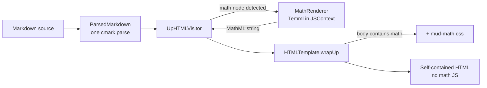

Plan: GFM Math Support
===============================================================================

> Status: Underway

GitHub issue #8 asks for "the MathJax feature of GFM": math expressions written
in TeX, as
[documented by GitHub](https://docs.github.com/en/get-started/writing-on-github/working-with-advanced-formatting/writing-mathematical-expressions).
The request is really about the _syntax_ — MathJax is just the renderer GitHub
uses, and it is heavy: over a megabyte of JavaScript plus fonts, typeset
asynchronously on every page load. Inlining that into every export contradicts
Mud's self-contained, lightweight export story, and the async typeset pass
would flicker on every auto-reload.

We can support the syntax without MathJax. This plan converts TeX to MathML at
render time in Swift, using [Temml](https://temml.org/) running in
JavaScriptCore — the same pattern `CodeHighlighter` already uses for
highlight.js. WebKit renders MathML natively (best of the three engines), so
the output needs no JavaScript anywhere: not in the app, not in exports, not in
Quick Look.


## Why Temml

Temml is a fork of KaTeX by one of its maintainers. It keeps the TeX parser and
macro expander, deletes the HTML/CSS rendering machinery, and emits only MathML
Core. Its TeX coverage matches MathJax and slightly exceeds KaTeX.

| Approach                 | App bundle    | Every export        | Behavior           |
| ------------------------ | ------------- | ------------------- | ------------------ |
| MathJax (client-side)    | ~1 MB + fonts | same, or CDN        | async typeset pass |
| KaTeX (even server-side) | ~280 KB       | ~120 KB CSS + fonts | static, bloated    |
| Temml (server-side, JSC) | ~150 KB       | a few KB of CSS     | static MathML      |

The costs:

- **App bundle**: one `temml.min.js` resource, comparable to
  `highlight.min.js`. Never shipped in exports.
- **Exports**: the MathML markup itself plus a small CSS block, included only
  when the document contains math. Documents without math are byte-identical to
  today's output.
- **Rendering quality**: WebKit and Firefox render MathML very well. Chromium
  is the weakest for edge cases (stretchy operators, some spacing) and prefers
  a bundled math font — so "Open In Browser" output in Chrome may look slightly
  less polished than MathJax for exotic constructs. For README-grade math it is
  indistinguishable. We accept this trade rather than ship a megabyte per
  export. If it ever matters, bundling the Latin Modern font (~380 KB) into
  exports is a follow-up, not a rewrite.


## Scope

GitHub accepts four delimiter forms. They differ sharply in parsing risk,
because cmark-gfm has no math extension and has already inline-parsed the text
by the time our visitor sees it (`$$a_1 + b_1$$` has its underscores turned
into emphasis nodes).

**In scope — the three unambiguous forms:**

1. ```` ```math ```` **fenced block** — already a code block with fence info
   `math`. Detected in `visitCodeBlock`; zero parser changes.
2. **`$$…$$` display paragraph** — a paragraph whose _raw source slice_ starts
   and ends with `$$`. We recover the literal source through the node's
   `byteRange` (the range APIs on `CMarkNode`), so cmark's inline parsing of
   the interior never matters.
3. **`` $`…`$ `` inline** — GitHub's explicit inline form. Parses as a text
   node ending in `$`, an inline-code node, and a text node starting with `$`.
   Detected in the visitor by sibling peeks; unambiguous because the backticks
   protect the interior from inline parsing.

**Out of scope for now — bare `$…$` inline.** Two problems: currency false
positives (`$5 and $10`), and interior mangling (the emphasis problem above)
which the code-span form doesn't have. GitHub itself mis-parses this form
regularly, and its docs recommend the `` $` `` form to avoid the ambiguity.
Supporting it means reconstructing inline runs from source ranges while keeping
the word-diff span emitter aligned — a separate design. If we add it later, it
gets its own plan and probably a Settings toggle; the three forms above are
safe enough to be always-on with no preference.

> [!NOTE]
> **All three forms survive the house formatter.** `odmarkdown` (the Ruby gem
> we run on every Markdown file) leaves math intact:
>
> - Inline `` $`…`$ `` is preserved — the `$` stays attached to its code span
>   and the span is never split across a line wrap. (This needed a formatter
>   fix: `odmarkdown` commit "keep inline code spans attached to adjacent
>   text"; earlier versions inserted a space, turning `` $`x`$ `` into
>   `` $ `x`$ ``. Authoring math files depends on that fix being in the
>   installed gem.)
> - ```` ```math ```` fences are left untouched.
> - A standalone `$$…$$` paragraph collapses to one line, but keeps its
>   delimiters and does **not** escape interior underscores (`a_1` stays `a_1`)
>   — so the `$$` display path and its key subscript test both survive
>   formatting.


## Rendering pipeline change



No new `RenderOptions` field, no `ContentIdentity` change, no CSP change
(MathML is markup, not script), no new `RenderExtension` (there is no runtime
JS to inject — only a conditional stylesheet, handled in `wrapUp` like the
other conditional styles).


## Work items

### 1. Vendor Temml

- Add `temml.min.js` (v0.13.3) to `Core/Sources/Resources/`, with license text
  alongside the existing highlight.js attribution.
- **Verify it evaluates in a bare `JSContext`.** Temml's docs steer server-side
  users toward `temml.cjs`/ `temml.mjs`; if the browser build touches
  `document`, either stub the one global it needs or produce our own minified
  IIFE from `temml.mjs`. A standalone Swift script proves this before any
  pipeline work (I'll write it; you run it).


### 2. `MathRenderer` in MudCore

`Core/Sources/Rendering/MathRenderer.swift`, structurally a copy of
`CodeHighlighter`: one lazily created `JSContext` behind an
`OSAllocatedUnfairLock`, evaluating `temml.min.js` once.

- API: `render(_ tex: String, displayMode: Bool) -> String?` calling
  `temml.renderToString`.
- Invalid TeX: use Temml's non-throwing mode (`throwOnError: false`), which
  emits the literal source inside a `<span class="temml-error">` — same reader
  experience as GitHub. (Verified: Temml uses this span, not an `<merror>`
  element; the CSS trigger and comment-anchor skip rules account for it.) A
  JSC-level failure returns `nil` and the caller falls back to plain rendering
  (code block stays a code block, inline span stays a code span), so a Temml
  bug can never lose document content.


### 3. Visitor detection (`UpHTMLVisitor`)

- `visitCodeBlock`: fence info `math` →
  `MathRenderer.render(literal, displayMode: true)`, wrapped in a
  `<div class="mud-math-block">` that keeps the block-level change attributes
  (`changeAttributes` still runs).
- `visitParagraph`: if the paragraph's `byteRange` source slice, trimmed,
  starts with `$$` and ends with `$$`, render the interior as display math
  instead of descending into children.
- `` $`…`$ ``: in `visitText` / `visitInlineCode`, detect the three-node
  sibling pattern, emit the surrounding text minus the `$` delimiters, and
  render the code literal as inline math.
- The footnote popover and deleted-block renderers reuse this visitor, so math
  inside footnotes and inside change-tracking deletions works with no extra
  code.


### 4. Change-tracking interaction

Math-bearing blocks skip word-level diff spans. The span emitter advances
through the visitor's character stream in step with `WordDiff.inlineText`;
replacing nodes with MathML would desynchronize it. So: when a block will
render math, don't activate word spans for it — the block still gets its
whole-block change annotation, like code blocks do today. Fingerprinting needs
nothing: math is ordinary text in the source, so `BlockMatcher` and
`ChangePlan` already treat math edits as block edits.


### 5. Stylesheet

New `mud-math.css`: display-math centering and margins, plus whatever minimal
rules Temml's output needs (start from `Temml-Local.css`, which relies on
locally installed math fonts — macOS ships STIX Two Math — and trim it).
Appended in `wrapUp` only when the body contains `<math`, mirroring the
existing conditional styles. Print needs checking; any `@media print` rule goes
to `mud-print.css` per convention.


### 6. Comment anchoring

Selections inside a `<math>` element shouldn't be commentable: the rendered
MathML text bears no resemblance to the TeX source, so a quotation anchored
there would never match. Add `math` to the skip rules in
`mud-comment-anchor.js` and the matching check in `CommentAnchor.swift` (the
plan's one JS/Swift rule pair, like the existing marker skip rule).


### 7. Docs and examples

- `Doc/Guides/primer.md`: replace "math is not supported" with the three
  supported forms and a note that bare `$…$` is not recognized.
- `Doc/Examples/math-expressions.md` — **written** (this is the first built
  piece). A showcase that doubles as a render fixture: a fenced-block gallery
  (Gaussian integral, Basel sum, matrix product, `cases`, `aligned`), a `$$`
  display section including the subscript-survival case, an inline section, a
  "what is not math" section (currency and bare `$…$` stay literal), math in a
  footnote, and a deliberately malformed block. It round-trips through the
  fixed `odmarkdown` unchanged (see the Scope note).
- Update the AGENTS.md file quick reference (new `MathRenderer.swift`,
  `mud-math.css`) and the rendering-pipeline section.
- After release: note in `Doc/RELEASES.md`. The workspace-level markdown rules
  file also says "Math: not supported yet" — remind me to update it.


### 8. Tests

All in Core's existing Swift Testing suites (you run them):

- `MathRendererTests`: simple expression, display vs. inline, invalid TeX
  produces error markup not `nil`, JSC-unavailable fallback.
- Visitor tests: each of the three forms; `$$a_1+b_1$$` survives with the
  underscore intact (the source-slice recovery working); a `$` amount in prose
  renders as plain text; math inside a footnote body.
- Template test: `mud-math.css` present only when the document has math; a
  math-free document's output is unchanged.
- Down mode: a ```` ```math ```` block renders as a plain fenced block (unknown
  highlight language), asserting we changed nothing there.


## Sequencing

Item 1 must come first — if Temml can't run in JSC and we can't cheaply fix
that, the whole approach needs rethinking before any visitor work. Items 2–5
are the feature; 3 depends on 2. Items 6–8 can land in any order after.


## Open questions

- Exact size of the trimmed math CSS — measured during item 5.

- Whether Chromium's rendering of our typical output is acceptable without a
  bundled font — eyeballed during item 5 with an Open In Browser export.

- mhchem / chemistry extension: not planned; note in the primer if anyone asks.
