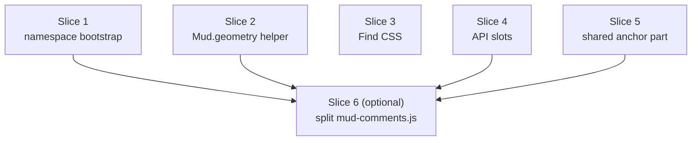

Plan: JS Resource Layer
===============================================================================

> Status: Underway (Slices 1–3 landed; Slices 4–5 remaining, Slice 6 deferred
> by decision)

Phase 6 of the [architecture review](./2026-07-architecture-improvements.md).
The JS/CSS resource layer (`Core/Sources/Resources/`) is where a few small,
independent problems have collected: one file is large enough to be hard to
navigate, the `window.Mud` object is built three different ways, the same
zoom/position math is written in three places, the Swift-callable JS functions
are not listed anywhere, and the Find highlight colors are hardcoded hex in a
JavaScript string. This plan fixes each as its own commit.

Phase 6 depends only on Phase 1 (done). It does not touch the diff or render
pipeline, so it can land at any time.

## What's wrong today

Grounded in the current files:

1. **`mud-comments.js` is 1,066 lines** in one closure, mixing six subsystems:
   highlight anchoring, the selection draft, capsule projection, the placement
   pass (slot solver), inline marker interactions, and the `setData`
   live-update sync. Finding any one of them means scrolling past the other
   five.

2. **The `window.Mud` object is bootstrapped three ways.** `mud.js` assigns it
   wholesale (`window.Mud = { … }`, line 248). `mud-changes.js` extends it with
   no guard (`window.Mud.scrollToChange = …`, line 432), so it breaks if it
   ever runs before `mud.js`. `mud-comments.js` merges defensively
   (`window.Mud = window.Mud || {}`, line 1017). The injection order in
   `App/WebView.swift:181-188` is therefore a hidden contract that nothing
   states or checks.

3. **The zoom/position math is written three times, in two forms.**
   `mud-comments.js` sums `offsetTop` up the `offsetParent` chain (`layoutTop`,
   line 40). `mud-changes.js` and `mud-comments-edit.js` each read
   `getBoundingClientRect`, divide by the document `zoom`, and add the scroll
   offset (`positionOverlay` line 118; `rangePosition` line 36). The bare read
   `parseFloat(document.documentElement.style.zoom) || 1` appears four times
   across the three files.

4. **The Swift-callable JS functions are not listed in one place.** The read
   side (`mud-comments.js`) declares its API as an object literal with an
   explicit `hooks` block (line 1018). But `resolveCompose` and
   `setHoldBanner`, which Swift calls, are attached to that object later by the
   write side (`mud-comments-edit.js:68, 78`), so reading the read-side API
   literal does not tell you the full surface Swift depends on.

5. **The leaf-block / marker-text anchoring rules are copied three times.**
   `mud-comments.js` (lines 844-867) and `mud-comments-edit.js` (lines 93-158)
   each redefine `LEAF_BLOCK_TAGS`, `LEAF_BLOCK_SELECTOR`, `isInnermostLeaf`,
   and `markerFreeText`; `CommentAnchor.swift` is the third copy. The two JS
   copies have already drifted: the write side's `markerFreeText` skips both
   `.mud-comment-marker` and `.footnote-ref` (via `isMarkerElement`, line 130),
   while the read side's skips only `.mud-comment-marker` (line 863). Phase 3e
   recorded the consequence: in a block that contains an authorial footnote
   reference, the read side's exact marker placement (`insertMarkerExact`)
   misses and falls back to a quotation search.

6. **Find highlight colors are hardcoded hex in a JS string.** `mud.js:9-17`
   builds a `<style>` element with literal `#fde68a` / `#f59e0b` and a
   `prefers-color-scheme` dark override, then appends it to `document.head`.
   The colors do not use the theme or lighting variables, so they can clash
   with the themes. The reason it is injected from JS rather than shipped in a
   stylesheet: exports don't load `mud.js`, so this keeps the Find styles out
   of exported HTML.

## The slices

Each slice is one commit with its own test note. They are ordered so the
lowest-risk, most independent ones land first; the large `mud-comments.js`
split comes last and is optional.

### Slice 1: uniform namespace bootstrapping

Make every script build `window.Mud` the same defensive way, so injection order
stops being a silent requirement.

- `mud.js`: change the wholesale `window.Mud = { … }` to
  `window.Mud = window.Mud || {}` followed by an
  `Object.assign(window.Mud, { … })` of the same functions. The object it
  exports is unchanged; it just no longer clobbers an existing one.
- `mud-changes.js`: add the same `window.Mud = window.Mud || {}` guard before
  it attaches `scrollToChange` / `collapseAllChanges` /
  `applyAutoExpandChanges`.
- `mud-comments.js` already merges — leave it.

Runtime function dependencies still exist (`Mud.setClass` calls
`Mud.comments.setVisible` when the class toggles), but those are calls made
after load, not assumptions about which file defined the object. State them
where they belong: add a short comment at the injection site in
`App/WebView.swift:181` that lists the order and says why `mud.js` must be
first (it seeds the shared helpers the others call at runtime).

**Risk:** very low — no behavior change, only order-independence.

**Test:** existing rendered-HTML tests still pass; manually confirm Find,
Changes, and Comments still work in the app.

### Slice 2: one geometry helper

Add `Mud.geometry` in `mud.js` and route the app-only overlay and comment-edit
files through it, so the four `parseFloat(…style.zoom) || 1` reads and the
scattered viewport→layout conversions have one home.

**An export constraint shapes the split.** `mud-comments.js` is inlined into
exports (Quick Look, browser) _without_ `mud.js`, so it cannot reference
`Mud.geometry`. Its `layoutTop` is a pure `offsetTop` summation with no zoom
read, so it is already self-contained and stays exactly where it is. The
overlay file also matters: `mud-changes.js` runs its first `buildOverlays()` at
load, _before_ `mud-comments.js` is injected, so the helper has to live in
`mud.js` (injected first), not in the comments file.

So `Mud.geometry` holds the zoom-dependent conversions the two app-only files
share:

- `zoom()` — `parseFloat(document.documentElement.style.zoom) || 1`.
- `layoutTopFromRect(rect)` — `(rect.top + window.scrollY) / zoom()`, a rect's
  absolute top in layout pixels (the same space `mud-comments.js`'s `layoutTop`
  returns), for the compose position where an `offsetParent` walk isn't handy.
- `viewportToLayout(viewportY, containerRect, scrollTop)` —
  `(viewportY - containerRect.top) / zoom() + scrollTop`, the overlay
  positioning conversion, taking a scalar Y so both `rect.top` and
  `rect.bottom` callers use it.

Consumers:

- `mud-changes.js`: `positionOverlay` and `positionCollapsedOverlay` call
  `geo.viewportToLayout` / `geo.zoom`.
- `mud-comments-edit.js`: the local `zoom()` delegates to `geo.zoom()` and
  `rangePosition` calls `geo.layoutTopFromRect`.
- `mud-comments.js`: unchanged (export-safe `layoutTop` stays local).

Each call site keeps its exact arithmetic; this is a de-duplication, not a
change to how anything is positioned. When Slice 5 introduces the shared
part-file that exports also inline, `layoutTop` could move into it and
`mud-comments.js` could join the other consumers.

**Risk:** low, but this is positioning math, so it needs a careful before/after
visual check.

**Landed (2026-07-15).** `Mud.geometry` added to `mud.js` with the three
functions above; `mud-changes.js` and `mud-comments-edit.js` capture a `geo`
alias and call through it. No raw `style.zoom` read remains outside `mud.js`.

**Test:** manual — overlays, capsules, and the compose box sit in the same
place before and after, at zoom levels other than 100%.

### Slice 3: Find highlight styles into themed CSS

Move the `<style>` block from `mud.js:9-17` into a new `mud-find.css`, and give
the colors CSS custom properties defined next to the other lighting variables
in `mud.css`, with light and dark values. `mud.js` stops building and appending
the style element.

`mud-find.css` must not reach exports (they don't load `mud.js` today, so the
Find styles never appear there). Append it to the style list in
`HTMLTemplate.wrapUp` and `wrapDown` **only when `!options.standalone`** — the
live WKWebView view is the only place the Find bar runs, and `standalone` is
forced on for every export and never set on a live view
(`RenderOptions.swift:12`). Find works in both modes, so both wrappers get it.

Update `Doc/AGENTS.md`'s resource list to add `mud-find.css`.

**Risk:** low.

**Landed (2026-07-15).** New `mud-find.css` holds the two `mark.mud-match`
rules, now reading `--find-match-bg` / `--find-match-active-bg` /
`--find-match-active-outline`. Those variables sit in `mud.css` next to the
alert colors, with a `:root` light block and a `prefers-color-scheme: dark`
override carrying the same hex/rgba values the JS string used. `mud.js` no
longer builds or appends the `<style>` element. `HTMLTemplate.wrapUp` and
`wrapDown` append `findCSS` before the print styles, gated on
`!options.standalone`, so it reaches the live view in both modes and never an
export. `Doc/AGENTS.md` lists the file.

**Test:** `HTMLTemplateTests` gains `findStylesLiveViewOnly`,
`findStylesInDownMode`, and `findStylesNotInJS` (live documents carry
`mark.mud-match`, standalone exports don't, and `mudJS` no longer names the
class). Manual: Find highlights read correctly on each theme in both light and
dark lighting, and an exported HTML file contains no Find styles.

### Slice 4: list the Swift-callable JS API in one place

Declare `resolveCompose` and `setHoldBanner` as explicit `null` slots in the
`mud-comments.js` API literal (line 1018), next to the existing `hooks` block,
with a one-line comment on each saying the write side fills it in and Swift
calls it. The write side (`mud-comments-edit.js:68, 78`) still assigns the real
functions; the read side now documents that the slots exist. This makes the
read-side API object the single list of everything Swift can call, matching how
`hooks` already documents the read/write seam.

**Risk:** none — the slots are `null` until the write side loads, exactly as
today (the properties simply don't exist until then).

**Test:** existing tests; confirm the app's comment reply/edit and the hold
banner still work.

### Slice 5: one shared comment-anchoring part-file

Extract the leaf-block / marker-text primitives into a single part-file and
have both comment scripts call it, cutting the anchoring rules from three
copies to two (this JS part plus `CommentAnchor.swift`).

- New `mud-comment-anchor.js`: an IIFE that defines
  `Mud.commentAnchor = { LEAF_BLOCK_SELECTOR, isInnermostLeaf, markerFreeText, leafBlock, occurrenceOf, normalizeWS, isMarkerElement }`.
- `HTMLTemplate.mudCommentsJS` becomes the shared part concatenated with the
  read-side file (`mud-comment-anchor.js` + `"\n"` + `mud-comments.js`), so the
  one injection point in `WebView.swift` and the one export-inlining point in
  `wrapUp` (line 32) stay a single string. The shared part runs first, so both
  the read side and the separately-injected write side see `Mud.commentAnchor`.
- `mud-comments.js` and `mud-comments-edit.js` delete their local copies and
  call `Mud.commentAnchor.*`.

Unify the skip rules while extracting them: the shared `markerFreeText` skips
both `.mud-comment-marker` and `.footnote-ref`, which fixes the read-side exact
placement miss Phase 3e recorded (a block with a footnote reference). This is
the one intentional behavior change in Phase 6.

**Risk:** medium — this is the anchoring contract, but
`CommentAnchorParityTests` (Swift) already pins the JS DOM rules over a wide
corpus and is the safety net.

**Test:** `CommentAnchorParityTests` still passes (extend its corpus with a
block that mixes a footnote reference and a comment so the unified skip rule is
covered); manual add/reply/edit of a comment in a paragraph that also has a
footnote reference, confirming the marker lands exactly and does not fall back
to a quotation search.

### Slice 6 (optional, do last): split `mud-comments.js` by subsystem

The headline item, and the churny one. Split the read-side file into part-files
concatenated by `HTMLTemplate` in a fixed order — the same "compose a list, no
bundler" approach already used for the CSS lists and for Slice 5.

The subsystems, in dependency order:

1. bootstrap — the container guard, constants, shared mutable state, and the
   small helpers (`section`, `enabled`, `markersShown`)
2. highlight anchoring — `buildIndex`, `matchQuotationStart`, `anchorAll`,
   `setHighlight`
3. selection draft — `showSelectionDraft`, `clearSelectionDraft`
4. capsule projection — `projectCapsule`, `ensureColumn`, `ensureHeader`,
   `project`
5. placement pass — `preferredPosition`, `solve`, `layout`, `syncVisible`
6. hover / activate + navigation — `activate`, `deactivate`, `navigate`
7. marker interactions — `revealComment`, `setMarkersShown`
8. `setData` sync — `syncMarkers`, `rebuildSection`, `setData`
9. the public `api` object

**The real cost, stated plainly.** Today all of these share one closure: the
mutable state `capsules`, `quotationByLabel`, `activeLabel`, `rafPending`,
`lastVisible`, and `container` are plain closure variables that every function
reads and writes. Separate part-files are separate IIFEs and cannot share a
closure. So a real split requires moving that shared state onto one object (for
example an internal `state` on `Mud.comments`) and rewriting every access
through it. That is a broad, behavior-sensitive edit to a file that has no
JavaScript unit tests — it is exercised only through Swift rendered-HTML tests
and by hand.

**Recommendation: defer slice 6.** (Decided 2026-07-14: deferred.) Slices 1-5
deliver the concrete wins (order-independence, one geometry helper, themed Find
colors, a listed API, and the three-to-two anchoring reduction with its bug
fix) at low-to-medium risk. The internal split of `mud-comments.js` is
navigability only, and the architecture plan already chose to treat the
analogous `DownHTMLVisitor` split as "worthwhile but churny — schedule
opportunistically, not a big-bang rewrite" (Phase 3f). Hold slice 6 until this
file is next touched for a feature, or drop it. If we do it, each part-file
lands as its own commit so a regression is easy to bisect, and
`Doc/AGENTS.md`'s resource list is updated for each new file.

## Testing

There is no JavaScript unit-test harness; the resource files are covered
indirectly by the Swift suites that assert over rendered HTML
(`CommentResourcesTests`, `CommentAnchorParityTests`,
`UpModeChangeTrackingTests`) and by manual checks in the app. Slices 1-4 are
behavior-preserving and rely on the existing suites plus a manual pass of Find,
Changes, and Comments. Slice 5 extends `CommentAnchorParityTests` and adds a
manual footnote-plus-comment check. Test instructions go to the user for the VM
run.

## Order and dependencies

Slices 1, 2, 3, and 4 are independent of each other and can land in any order.
Slice 5 is independent too, but reads best after Slice 1 (uniform bootstrap) is
in. Slice 6, if done, comes last and builds on Slices 1, 2, 4, and 5.

## Open decision

**Find CSS home (Slice 3).** The plan puts `mud-find.css` in the style list
gated on `!options.standalone`, which keeps it out of every export and off the
non-standalone CLI fragment (where it is inert anyway). The alternative is to
leave the styles injected from `mud.js` but swap the hardcoded hex for theme
variables — a smaller change that guarantees "not in exports" without a new
gate, at the cost of keeping a `<style>` string in JavaScript. **Decided
(2026-07-14):** the new `mud-find.css` gated on `!standalone`, because the
architecture plan's intent is to get these styles out of the JS string, and a
real stylesheet is easier to theme and maintain.
