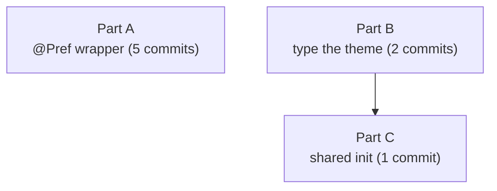

Plan: Preference Plumbing
===============================================================================

> Status: Planning

Phase 5 of the [architecture review](./2026-07-architecture-improvements.md).
The last remaining phase (Phases 1–4 and the single-parser rework landed; Phase
6 landed except its deferred final slice).


## Context

Every user preference is declared three times over, and nothing keeps the three
copies in agreement. In `App/AppState.swift`, each of the 19 preferences is:

1. an `@Published` property whose `didSet` writes to `MudPreferences.shared`,
2. an assignment in `init` that reads the stored value back, and
3. a `case` in `reloadPreference(_:)`, the handler for external changes
   (another process running `defaults write`).

Adding one preference means editing all three sites; forgetting the third makes
a `defaults write` silently fail to update the UI. On top of that, two more
hand-written mappings exist:

- The map from preferences to `RenderOptions` is written twice — once in the
  app (`DocumentModel.renderOptions`) and once in Quick Look
  (`QuickLook/PreviewProvider.swift`) — so the two can drift.
- `RenderOptions.theme` is a raw `String` (`"earthy"`), while the app and Quick
  Look both hold a typed `Theme` and pass `.rawValue`. The CLI validates
  `--theme` against a hardcoded `["austere", "blues", "earthy", "riot"]` array
  that duplicates `Theme`'s cases.

This plan removes all three duplications: a property wrapper collapses the
AppState triple into one declaration each, one shared initializer replaces the
two `RenderOptions` mappings, and `RenderOptions.theme` becomes the `Theme`
enum so the CLI can list themes from the type.

**Decided (2026-07-16): keep the `MudPreferences → MudCore` package
dependency.** Decision point 2 in the architecture plan had proposed dropping
it (raw strings in Preferences, typed only at the edges). Research showed the
cost is higher than that note assumed — it needs either inverting the package
graph so the rendering core depends on the persistence package, or duplicating
the mapping — and its payoff (a Foundation-only Preferences package free of
cmark for the appexes) is unrealized today, because every appex that links
Preferences already links MudCore. Keeping the dependency lets the one shared
`RenderOptions` initializer live in Preferences (which already sees both
types), and reduces the theme move to relocating a single file. The dependency
drop can be revisited later if a cmark-free appex is ever actually wanted.


## Part A: collapse the AppState triple with a `@Pref` wrapper

Introduce one property wrapper so each preference is declared once. This is the
largest and most novel part; the wrapper is the first `@propertyWrapper` in the
codebase.


### The wrapper

`@Pref` reads and writes `MudPreferences.shared` **live** — it stores no cached
value on AppState. Two consequences make the other two sites disappear:

- The `init` read block is gone: there is nothing to seed, because every read
  goes straight to the store.
- The `reloadPreference` switch collapses. `AppState.objectWillChange` is the
  single shared publisher for every observer, so any preference change already
  invalidates every AppState view. With live reads, an external change only has
  to fire one blanket `objectWillChange.send()`; the views re-read fresh values
  themselves.

The wrapper mirrors Swift's own `@Published` "enclosing instance" subscript, so
that `\AppState.theme` stays a `ReferenceWritableKeyPath`. That keeps the
twelve `$appState.x` two-way bindings in the settings panes working (Toggle,
Picker, TextField, Slider). Because `@Pref` is not `@Published`, the compiler's
synthesized change notification does not cover it, so the subscript's setter
sends `objectWillChange` itself, before the write, matching `@Published`'s
`willSet` timing.

```swift
import Combine
import MudPreferences

@propertyWrapper
struct Pref<Value> {
  private let get: () -> Value
  private let set: (Value) -> Void

  // Common case: a plain MudPreferences property.
  init(_ keyPath: WritableKeyPath<MudPreferences, Value>) {
    self.get = { MudPreferences.shared[keyPath: keyPath] }
    self.set = { newValue in
      var prefs = MudPreferences.shared    // local var → assignable base
      prefs[keyPath: keyPath] = newValue
    }
  }

  // Escape hatch: accessors that need a runtime value (enabledExtensions).
  init(get: @escaping () -> Value, set: @escaping (Value) -> Void) {
    self.get = get
    self.set = set
  }

  var wrappedValue: Value {
    get { fatalError("@Pref is only usable on an ObservableObject property") }
    set { fatalError("@Pref is only usable on an ObservableObject property") }
  }

  static subscript<Enclosing: ObservableObject>(
    _enclosingInstance instance: Enclosing,
    wrapped wrappedKeyPath: ReferenceWritableKeyPath<Enclosing, Value>,
    storage storageKeyPath: ReferenceWritableKeyPath<Enclosing, Pref<Value>>
  ) -> Value where Enclosing.ObjectWillChangePublisher == ObservableObjectPublisher {
    get { instance[keyPath: storageKeyPath].get() }
    set {
      instance.objectWillChange.send()      // before the write, like @Published
      instance[keyPath: storageKeyPath].set(newValue)
    }
  }
}
```

**The load-bearing compile detail.** `MudPreferences.shared` is a `static let`,
and its property setters are `nonmutating` (they mutate a reference-typed
`State`, so the write reaches `UserDefaults`). You cannot assign through a
`WritableKeyPath` into a `let`, and a `nonmutating set` on a struct does
**not** make the key path a `ReferenceWritableKeyPath`. The fix is the
`var prefs = MudPreferences.shared` copy: the struct's only stored member is
the shared `State` class reference, so the copy writes to the same store; the
key-path write-back into the local `prefs` is a harmless no-op. This is the
single biggest compilability risk and must be confirmed on the first build. If
it ever fails, the closure `init(get:set:)` form sidesteps it entirely.


### AppState after

```swift
@Pref(\.theme)              var theme: Theme
@Pref(\.lighting)           var lighting: Lighting
@Pref(\.quitOnClose)        var quitOnClose: Bool
// …the other simple prefs, one line each…

// ViewToggle fan-in is no longer special: MudPreferences.viewToggles already
// fans the Set across its five keys, so the whole-Set key path is enough.
@Pref(\.viewToggles)        var viewToggles: Set<ViewToggle>

// enabledExtensions is the one real special case: its default is a runtime
// value the store does not own (the RenderExtension registry).
@Pref(
  get: { MudPreferences.shared.readEnabledExtensions(
           defaultValue: Set(RenderExtension.registry.keys)) },
  set: { MudPreferences.shared.writeEnabledExtensions($0) }
) var enabledExtensions: Set<String>

private init() {
  MudPreferences.shared.syncMirror()
  MudPreferences.shared.startObservingExternalChanges { [weak self] key in
    self?.reloadPreference(key)
  }
}

private func reloadPreference(_ key: MudPreferences.Keys) {
  switch key {
  case .openInDefaultBundleID, .openInDefaultFormat:
    OpenInMenuModel.shared.refresh()          // a different ObservableObject
  case .upModeZoomLevel, .downModeZoomLevel, .sidebarPane,
       .hasLaunched, .cliInstalled, .cliSymlinkPath:
    break                                     // per-window / internal: no AppState prop
  default:
    objectWillChange.send()                   // live-read: one blanket invalidation
  }
}
```

`toggle(_:)` is unchanged: mutating the `viewToggles` Set runs the wrapper's
get-modify-set, firing one `objectWillChange` and writing the fanned-out Set.

The Open In reroute stays explicit (its two keys drive a different
`ObservableObject`, not an AppState property), and the per-window and
`internal.*` keys keep an explicit `break` so the switch stays exhaustive and a
`defaults write internal.cli-installed` doesn't needlessly redraw the settings
window.


### Part A commits

1. **Add the `Pref` wrapper, unused.** New `App/Pref.swift`. Builds as dead
   code; isolates the novel piece and its one risky compile detail for review.
2. **Migrate two proof preferences, one of each consumption style.** `theme`
   (set directly by a pane) and `commentReturnSaves` (bound with
   `$appState.…`). Mixed `@Published` + `@Pref` state is safe — they share one
   `objectWillChange`. This is the go/no-go commit: confirm on the VM that a
   direct-set pane and a `$`-bound Toggle both still round-trip, and that a
   `defaults write` to `theme` updates the UI.
3. **Migrate the remaining simple key-path preferences.** Each drops its
   triple; its reload case folds into `default`.
4. **Migrate the two set-valued cases,** `viewToggles` and `enabledExtensions`.
5. **Collapse `reloadPreference` and slim `init`.** Reduce the switch to the
   three-way form above and delete the init read block. Pure cleanup.


## Part B: type `RenderOptions.theme` and move `Theme` into MudCore

`RenderOptions.docCAlertMode` is already the typed `DocCAlertMode` enum inside
`ContentIdentity`; `theme` is the lone `String` beside it. Promote it.

- **Move `Theme` from Preferences to MudCore.** `Theme` is currently in
  `Preferences/Sources/Theme.swift`. Move the file to `Core/Sources/`.
  `MudPreferences` already imports MudCore (for `DocCAlertMode`), so its
  `theme` accessor and the snapshot keep compiling. App and Settings files that
  name `Theme` but only import MudPreferences today gain an `import MudCore`.
  This commit is a pure move — no behavior change.
- **Type the field.** `ContentIdentity.theme` becomes `Theme = .earthy` (the
  raw- `String` enum is already `Hashable`/ `Sendable`, so `ContentIdentity`'s
  synthesized conformance is unaffected). `HTMLTemplate.themeCSS(for:)` takes a
  `Theme` and interpolates `theme.rawValue` into the `theme-<name>.css`
  filename. The `?? theme-earthy` fallback stays for a missing resource file.
- **Update the edges.** The five sites that set `options.theme` stop calling
  `.rawValue`: `DocumentModel` and Quick Look pass the `Theme` directly,
  `ErrorPage` passes `.system` (a real `Theme` case), `WebView` uses its
  existing `theme: Theme` instead of the derived `commentTheme` string, and the
  CLI assigns `Theme(rawValue: validated) ?? .earthy`.
- **Derive the CLI theme list from `Theme`.** `validThemes` becomes
  `Theme.allCases.map(\.rawValue)` (`Theme.allCases` already excludes the
  internal `.system`). The usage text builds its list the same way.
- **Tests.** `HTMLTemplateTests` calls `themeCSS(for: .earthy)`;
  `unknownThemeFallsBackToEarthy` loses its premise (an enum can't be an
  unknown name) and is replaced by a test that `.system` loads
  `theme-system.css`.

Two commits: the file move first, then the typing and CLI change.


## Part C: one shared `RenderOptions` initializer

Add `RenderOptions.init(snapshot:baseURL:)` in the Preferences package — the
one place that sees both `RenderOptions` (from MudCore) and
`MudPreferencesSnapshot` — covering the fields both consumers map identically:

```swift
extension RenderOptions {
  public init(snapshot: MudPreferencesSnapshot, baseURL: URL?) {
    self.init()
    self.baseURL = baseURL
    self.theme = snapshot.theme
    self.extensions = snapshot.enabledExtensions
    self.htmlClasses = snapshot.upModeHTMLClasses
    self.zoomLevel = snapshot.upModeZoomLevel
    self.blockRemoteContent = !snapshot.upModeAllowRemoteContent
    self.docCAlertMode = snapshot.markdownDocCAlertMode
  }
}
```

- **Quick Look** replaces its seven-line mapping with
  `RenderOptions(snapshot: snapshot, baseURL: url)`, keeping the mode/comment
  fields it sets afterward.
- **The app** builds a snapshot from the live store
  (`MudPreferences.shared.snapshot(defaultEnabledExtensions: Set(RenderExtension.registry.keys))`),
  calls the same initializer, then overrides the two window-specific display
  fields — the mode-dependent `zoomLevel` and the all-toggles `htmlClasses`
  (plus the comment-column and compose classes) — and sets the change-tracking
  fields and waypoint. With Part A's live reads, the snapshot holds exactly the
  values AppState would report, so routing both consumers through one
  initializer removes the drift without changing any output.

One commit.


## Order and dependencies

Parts A, B, and C are independent and can land in any order. Within the plan,
do B before C so the shared initializer assigns a typed `Theme` directly rather
than a string. Part A is the biggest and most self-contained; it can go first
or last. Each numbered step is its own commit that builds and is reviewable.




## Verification

All builds and tests run in the user's VM. The existing Preferences suites
(`MudPreferencesTests`, `MudPreferencesObserverTests`,
`MudPreferencesSnapshotTests`) already cover the read/write/observe primitives
the wrapper builds on; AppState itself has no test coverage, so Part A is
checked by build plus a manual pass. Gate the risky steps:

- **Part A, commit 1 — the key-path write.** `App/Pref.swift` compiles with the
  `var prefs = MudPreferences.shared; prefs[keyPath:] = …` body. If it fails,
  switch the affected properties to the closure `init(get:set:)` form.
- **Part A, commit 2 — bindings and live update.** A direct-set pane (Theme)
  and a `$appState`-bound Toggle (`commentReturnSaves`) both write and redraw;
  `defaults write org.josephpearson.Mud theme blues` updates the open UI once
  (no oscillation — the `lastKnown` guard blocks the echo).
- **Part A, full migration.** Every `$appState.x` pane still round-trips
  (Toggles, the DocC Picker, the Author TextField, the word-diff Slider); no
  new "Publishing changes from within view updates" warning at the drag-handle
  and `onChange` write sites; no perf regression rebuilding `RenderOptions` on
  rapid edits (`viewToggles`/ `enabledExtensions` now recompute per read).
- **Part B.** Each theme renders with its own CSS in the app and the CLI
  (`mud --theme=blues`), an unknown `--theme` still errors with the derived
  list, and an exported/Quick Look preview themes correctly.
- **Part C.** A Quick Look preview and an in-app document render identically to
  before across theme, extensions, remote-content blocking, and DocC alert
  mode.


## Critical files

- `App/AppState.swift` — the triple to collapse (Part A).
- `App/Pref.swift` — new wrapper (Part A).
- `App/OpenInEditor.swift`, `App/Settings/*.swift` — the reroute and the
  `$appState.x` bindings to preserve (Part A).
- `Preferences/Sources/Theme.swift` → `Core/Sources/Theme.swift` — the move
  (Part B).
- `Core/Sources/RenderOptions.swift`,
  `Core/Sources/Rendering/HTMLTemplate.swift`, `App/CLI/main.swift`,
  `App/DocumentModel.swift`, `App/WebView.swift`, `App/ErrorPage.swift` — the
  theme edges (Part B).
- `Preferences/Sources/MudPreferencesSnapshot.swift` — home of the shared
  initializer; `QuickLook/PreviewProvider.swift` and `App/DocumentModel.swift`
  adopt it (Part C).
- `Doc/AGENTS.md` — move `Theme` in the Preferences file list to MudCore; note
  `mud-find.css` is already listed.
