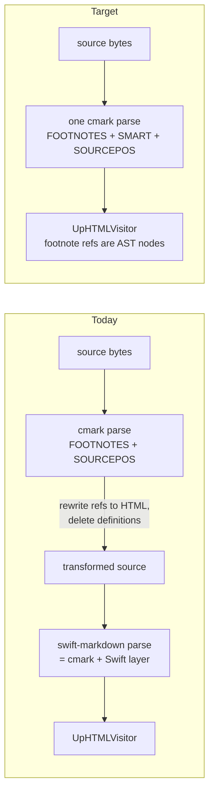

Plan: Single-Parser Rendering
===============================================================================

> Status: Underway (Stages 0–5 landed: the corpus, the `CMarkDocument` wrapper,
> the leaf-consumer ports, the `UpHTMLVisitor` port with its byte-identical
> harness, the diff-layer port with diffed-rendering parity, and the
> `DownHTMLVisitor` port with its plain and diffed harness; Stage 6's
> `FootnoteProcessor` collapse and cutover are next)

Whether and how to consolidate Mud's rendering on one Markdown parser. Today
every Up-mode render parses the document twice: once with cmark-gfm (via
`FootnoteProcessor`, for footnote detection with byte positions), then — after
rewriting the source bytes — again with swift-markdown (for the actual render).
This investigation answers: is dropping swift-markdown feasible, what does it
buy, what does it cost, and in what order should the work land.

**Verdict: feasible, worth doing, and lower-risk than it looks — because
swift-markdown is a wrapper around the exact same parser we would move to.**
The recommended path is a staged port with a differential test harness,
scheduled after Phases 2–3 of
[2026-07-architecture-improvements.md](./2026-07-architecture-improvements.md).

## Why this is not a parser swap

The decisive fact, verified in the pinned sources: **swift-markdown 0.8.0 is a
Swift layer over the same swift-cmark 0.8.0 package Mud already links
directly.** SwiftPM resolves both to one pin (`Core/Package.swift` matches
swift-markdown's version range for exactly this reason). swift-markdown's
converter calls `cmark_parse_document` with
`CMARK_OPT_SMART | CMARK_OPT_SOURCEPOS | CMARK_OPT_TABLE_SPANS` and attaches
three extensions — `table`, `strikethrough`, `tasklist` (its
`Parser/CommonMarkConverter.swift`). Every source range Mud reads off a
swift-markdown node is a copy of the cmark sourcepos fields.

So consolidating does not change the parser, the parse options, or the position
model. It removes the wrapper — and with it, the need to rewrite the source
between the two parses. Rendering differences reduce to Mud's own visitor
logic, which is exactly what the parity harness below tests.

## What consolidation deletes

The two-parser seam is where the recent comment bugs landed (the anchoring and
failed-write fixes in the last several commits). Each item below is code or a
coordinate system that exists only to reconcile the two parses:

1. **The source-rewriting layer.** `FootnoteProcessor.process` injects marker
   HTML into the source and deletes definition blocks so swift-markdown never
   sees footnote syntax. With `CMARK_OPT_FOOTNOTES` on the render parse,
   references and definitions arrive as AST nodes; the visitor emits the same
   marker HTML when it visits a reference node. The byte-edit machinery, the
   orphan-definition scan, and the "transformed source" coordinate system all
   go away.
2. **Waypoint reprocessing.** `processingWaypoint` (`MudCore.swift:88-95`)
   exists so the diff compares transformed source against transformed source.
   With no transformation, it is deleted — and with it the easy-to-forget
   requirement that every new entry point call it.
3. **Half of comment invisibility.** `stripCommentTokens` must today recognize
   _two_ token forms — raw `[^comment-x]` refs and the baked marker HTML —
   because the Up path diffs transformed source while the sidebar diffs raw
   source (`FootnoteProcessor.swift:737-758`). With one representation, the
   regex drops to one form; better, comment nodes can be skipped structurally
   during leaf collection instead of stripped textually.
4. **Down-mode definition blanking.** Down mode blanks footnote-definition
   lines with spaces before parsing (swift-markdown would misparse them as code
   blocks), then remaps coordinates from a sub-parse of each body
   (`DownHTMLVisitor.swift:73-84, 153-194`). Parsing with `CMARK_OPT_FOOTNOTES`
   deletes both mechanisms.
5. **The `Aside` crash workaround.** `AlertDetector` replicates
   swift-markdown's internal column arithmetic to dodge an upstream trap (smart
   typography makes decoded strings longer than their source spans; unfixed as
   of 0.8.0) — `AlertDetector.swift:142-174`. Our own DocC tag parser replaces
   `Aside` and the workaround together.
6. **The `isLooseList` range hack.** `UpHTMLVisitor.swift:1044-1078` infers
   list looseness from range arithmetic (with a workaround for swift-markdown
   extending item ranges past trailing blanks). cmark exposes it directly:
   `cmark_node_get_list_tight`.
7. **One parse per render instead of two.** This also simplifies Phase 3c of
   the architecture plan: the "footnote scan cache" reconciling five
   `FootnoteProcessor` entry points shrinks, because the render itself no
   longer needs a separate detection parse. (If we commit to this plan, build
   3c as a minimal memo, not an elaborate cache.)

What does _not_ go away: `CommentAnchor.fold()`. Smart typography happens at
parse time (curly quotes land in the text-node literals), so rendered DOM text
still differs from raw source bytes regardless of parser count. The fold stays,
unchanged.

## What consolidation costs

### The port surface

Thirteen files import swift-markdown. Most are mechanical ports onto a typed
cmark wrapper; the full inventory (per-file API surface) is summarized here by
what the replacement needs:

| File                        | Port difficulty | Notes                                                     |
| --------------------------- | --------------- | --------------------------------------------------------- |
| `MarkdownParser`            | trivial         | same pattern as `FootnoteProcessor.makeFootnoteParser`    |
| `ParsedMarkdown`            | moderate        | owning wrapper class; see lifetime, below                 |
| `HeadingExtractor`          | easy, exacting  | `plainText` must be byte-identical (slug stability)       |
| `AlertDetector`             | easy            | own DocC tag parser; deletes the `Aside` workaround       |
| `UpHTMLVisitor`             | large           | 24 visit methods; table/tasklist accessors exist in cmark |
| `DownHTMLVisitor`           | large, exacting | inline sourcepos + column conventions; deletes blanking   |
| `BlockMatcher`              | moderate        | fingerprints already slice raw source by sourcepos        |
| `DiffContext`               | moderate        | `SourceKey` range join survives as-is                     |
| `LineDiffMap`, `ChangeList` | trivial         | follow `LeafBlock`                                        |
| `WordDiff.inlineText`       | small, exacting | counts must match the Up visitor's cursor arithmetic      |
| `CommentSerialization`      | small, exacting | `parse` slices bodies by sourcepos; see below             |
| `CommentAnchor`             | none            | already cmark-only                                        |

### The three exacting parts

1. **Smart typography is a cross-cutting contract.** Four subsystems are
   calibrated to smart-typographed text-node literals: Up-mode text emission,
   the word-span cursor counts (which must equal `WordDiff.inlineText`'s
   counts), heading slugs, and `CommentAnchor`'s fold. Passing
   `CMARK_OPT_SMART` preserves all four byte-for-byte — verified:
   swift-markdown passes this exact flag to this exact library, so the
   substituted literals are identical. Forgetting the flag would silently
   change rendered output, slugs, word diffs, and comment anchoring. The
   wrapper should hard-code it (with sourcepos) rather than accept options.
2. **Down mode's column conventions.** The event collector emits spans from
   node ranges for seven inline types and all block containers. Two conventions
   must be reproduced exactly: swift-markdown's upper bound is cmark's
   inclusive end column **plus one**, and columns are UTF-8 byte columns within
   the line. The existing multi-line strikethrough workaround
   (`DownHTMLVisitor.swift:491-504`) papers over a cmark _extension_ sourcepos
   bug, so it survives the port unchanged.
3. **`CommentSerialization` writes into users' files.** `CommentEditor` writes
   its output back into the user's `.md` under the round-trip invariant
   `parse(serialize(x)) == x`, so the port must not change the bytes of message
   bodies. The risk is smaller than it first looked: `serialize()` is already
   hand-rolled string building for Mud's own comment grammar (the `💬 {…}:`
   headers, the quotation line, blank-line joins), and the only real Markdown
   re-serialization in the file is `formatBlock` inside `parse` —
   swift-markdown's `format()`, which today re-formats existing message bodies
   whenever a thread is rewritten. The port deletes it: `parse` instead slices
   each message's body straight out of the de-indented body string by block
   sourcepos (full lines, from the group's first block through its last),
   checked with `verifiedRange(of:)`. Untouched messages then round-trip
   byte-for-byte — better than today. `cmark_render_commonmark` was considered
   and rejected: it formats differently (escaping, wrapping, list markers), and
   the write path holds body _strings_, not an AST, so there is nothing for a
   serializer to serialize.[^comment-y] The file still ports last — it parses
   tiny, de-indented comment bodies, not the document, so it has **no position
   coupling to the render parse**.

### Node lifetime

swift-markdown nodes are immutable ref-counted Swift values; cmark nodes are
raw pointers into a manually-freed C tree. `LeafBlock.markup` handles flow out
of `BlockMatcher` and are read later by `DiffContext` — including nodes from
the _old_ document's tree. The wrapper must make this safe by construction: a
`ParsedMarkdown`-owned root (freed in `deinit`) and node handles that retain
their owning document, so a live handle can never outlive its tree. This is the
main design work in the wrapper, not the visit methods.

### Verified sourcepos limits (and the existing defense)

Inline sourcepos in the pinned swift-cmark fork is real and complete — verified
in `src/inlines.c`: every inline constructor sets positions, emphasis/links
copy positions from their delimiter text nodes, nested inlines included;
footnote references have a dedicated sourcepos block (the one Mud already
reads). It is exactly as good as what swift-markdown consumes, because
swift-markdown consumes these same fields. Known inaccuracies, from the
position math itself:

- Continuation lines with a different prefix width than the block's first line
  (lazy blockquote continuations, ragged list indents) get columns off by the
  prefix delta; line numbers stay correct.
- A paragraph whose opening lines are link-reference definitions reports inline
  lines too small by the number of dropped lines (the classic upstream bug).
- Entity references keep source columns but store decoded literals, so column
  span ≠ literal length across an entity.

Mud already defends against exactly this class of error: `FootnoteProcessor`
verifies every position against the raw bytes before trusting it
(`delimitsFootnoteRef`). The wrapper should generalize that pattern — a
`verifiedRange(of:)` that checks the sliced source against the node before any
byte surgery, falling back gracefully (as comment insertion already falls back
to block-end placement).

### Extension parity

For byte-identical output, the render parse attaches the same three extensions
swift-markdown does (`table`, `strikethrough`, `tasklist`) plus
`CMARK_OPT_FOOTNOTES`. Two deliberate follow-up choices, made separately from
the port so parity stays testable:

- **autolink**: swift-markdown never attaches it, so bare-URL autolinking is
  off in Up mode today (the detection parse attaches it, but that parse doesn't
  render). Turning it on afterward is a small, user-visible improvement — as
  its own commit.
- **`CMARK_OPT_TABLE_SPANS`**: swift-markdown always passes it. Match it during
  the port; decide afterward whether Mud wants cell spans at all.

The extension node types (`table`, `strikethrough`, `tasklist`) are not
exported constants in the public module map; identify them by
`cmark_node_get_type_string`, as swift-markdown itself does.

## Migration plan

Strangler-style: both pipelines coexist behind a differential harness until the
last stage; every stage lands independently and keeps the app shipping.

**Stage 0 — the corpus.** Assemble one shared, loadable corpus of markdown
documents — start from `Doc/Examples/` plus the rendering tests' fixtures; add
documents exercising every node type, smart typography, footnotes, comments,
alerts, tables, task lists. Phase 3e's `CommentAnchorParityTests` already
covers most node types this way, but as markdown string literals inside one
test file, with no smart-typography cases and nothing another test can load.
Pull that corpus into its own shared fixtures, add the missing smart-typography
documents, and wire in `Doc/Examples/`.

The dual-pipeline, byte-identical comparison test can't be written yet: it
needs a second pipeline to compare against, and that pipeline is Stage 1's
`CMarkDocument` wrapper, which doesn't exist yet. Add the comparison test once
Stage 1 lands. Until then, Stage 0 delivers the corpus only — not the harness
the name implies.

**Landed (July 2026):** `Core/Tests/ParityCorpus.swift` holds the shared corpus
— twelve named documents, each isolating one feature or node type, so a failure
names what broke. Nine come from `CommentAnchorParityTests`' existing per-test
markdown (moved here, not duplicated); three are new: `smartTypography`
(straight quotes, an apostrophe, an en dash, an em dash, an ellipsis — every
literal `CMARK_OPT_SMART` rewrites, deliberately absent elsewhere in the
corpus), `frontMatter`, and `codeBlockAndThematicBreak`.
`CommentAnchorParityTests` now reads its markdown from the shared constants
instead of inline literals, and gained a `smartTypographyAnchors` case, since
smart typography is exactly what `CommentAnchor.fold()` exists to undo.
`ParityCorpusTests.swift` is a smoke test (`@Test(arguments:)` over
`ParityCorpus.all`) asserting every document renders to non-empty HTML today —
a placeholder consumer so the corpus is exercised by the suite now, not inert
until Stage 1. `Doc/Examples/` was not loaded directly: those files live
outside `Core/`'s directory tree, so Swift Package Manager can't bundle them
into the `Core` test target without copying or symlinking across the package
boundary. Representative content (front matter, a fenced code block, a thematic
break) was ported into the corpus by hand instead.

**Stage 1 — the wrapper.** `CMarkDocument` in Core: owning class over the
parsed tree, typed node enum (by type string for extension nodes), a walker
with default-descend behavior, and a range API that reproduces swift-markdown's
conventions (exclusive upper bound, UTF-8 byte columns) so consumers port
without changing their range math. Includes `verifiedRange(of:)`. Unit tests
against known documents.

**Landed (July 2026):** `Core/Sources/CMark/` holds the wrapper in three files.
`CMarkDocument.swift` is the owning class: parse options are hard-coded to
swift-markdown 0.8.0's exact setup (`SMART`, `SOURCEPOS`, `TABLE_SPANS`, the
`table` / `strikethrough` / `tasklist` extensions) plus `CMARK_OPT_FOOTNOTES`;
`autolink` stays off, per Extension parity above. It hosts the three range
APIs: `range(of:)`, bounds-checked `byteRange(of:)`, and `verifiedRange(of:)`,
which checks delimiter bytes for footnote refs, emphasis, strong,
strikethrough, inline code, images, links, and blockquotes. `CMarkNode.swift`
is the handle struct — it retains its owning document, so a live node can never
outlive its tree — with the kind enum (extension nodes by type string, since a
task item's C type is plain `CMARK_NODE_ITEM`) and accessors including
`listIsTight`, the Stage 3 replacement for the `isLooseList` hack.
`CMarkWalker.swift` mirrors `MarkupWalker`'s method vocabulary so Stage 3 ports
name-for-name. One convention surfaced beyond the two documented above,
verified in the pinned sources: swift-markdown widens inline-code ranges by
`cmark_node_get_backtick_count`, so the range includes the backticks where raw
cmark covers only the content between them; the wrapper reproduces it.
`CMarkDocumentTests.swift` covers the wrapper (kinds, ranges with multibyte
columns, `verifiedRange` slices, walker dispatch, the lifetime guarantee, a
corpus sweep) and adds the first two dual-pipeline comparisons: range records
and text literals must match swift-markdown exactly over the corpus. The
byte-identical **HTML** comparison still waits on Stage 3, which builds the
second Up renderer to compare.

**Stage 2 — leaf consumers.** `HeadingExtractor` (with a slug-parity test over
the corpus), `WordDiff.inlineText` (with a count-parity test against the old
implementation), `AlertDetector` (own DocC tag parser). Each is small,
independently revertible, and proves the wrapper.

**Landed (July 2026):** `CMarkNode` gained a `plainText` accessor matching
swift-markdown's `Markup.plainText` (inline code keeps its backtick delimiters,
unlike `WordDiff.inlineText`), shared by the two consumers below that need it.
`HeadingExtractor` ported onto `CMarkWalker` for real: `ParsedMarkdown.init`
now runs a second, temporary `CMarkDocument` parse of the body purely for
headings, alongside the swift-markdown parse `UpHTMLVisitor`/ `BlockMatcher`
still use for everything else — the duplicate parse goes away once Stage 3
lands. `HeadingExtractorTests` gained a slug/segment parity test over the
corpus against a kept-verbatim copy of the swift-markdown extractor it
replaced.

`WordDiff.inlineText` and `AlertDetector`'s DocC detection could not cut over
the same way: their real callers (`ChangePlan`, `UpHTMLVisitor`,
`DownHTMLVisitor`) are still swift-markdown-based until Stages 3–5, so wiring
in a cmark version now isn't possible. Both gained a parallel `CMarkNode`
overload instead, proven against the existing swift-markdown implementation and
left unwired: `WordDiff.inlineText(of: CMarkNode)` (a count- and text-parity
test over the non-footnote corpus in `WordDiffTests`), and
`AlertDetector.detectGFMAlert` / `detectDocCAlert` taking a `CMarkNode` (parity
tests in the new `AlertDetectorTests.swift`). The DocC detector is also the
"own tag parser" promised above: it parses the leading `Kind:` tag directly off
the text literal and returns the tag's byte length for the caller to skip,
rather than using swift-markdown's `Aside` type and rebuilding a node with a
shifted source range — the operation that crashes on smart-typography input
(`asideTagShiftIsInBounds` guards the legacy path against it). The new parser
never builds that range, so it has no equivalent risk to guard against; a
regression test using that same crash input (`> Don't: x`) checks it returns
the same result the guard produces instead.

**Stage 3 — UpHTMLVisitor.** Port the 24 visit methods; footnote and comment
references become visit cases emitting the existing marker HTML (numbering
logic moves from `FootnoteProcessor`'s rewrite pass into the render). The
harness gates the switch: byte-identical output on the corpus, no deliberate
changes in this stage.

**Landed (July 2026):** `Core/Sources/Rendering/CMarkUpHTMLVisitor.swift` is
the port — a separate struct on `CMarkWalker`, parallel to `UpHTMLVisitor` and
**unwired**: the legacy visitor still renders every production document. The
cutover has to wait for Stage 4 because `DiffContext` keys its annotation
lookups on swift-markdown nodes parsed from the footnote-transformed source, so
a cmark-based visitor cannot serve a render that has a change-tracking
waypoint. For the same reason, everything diff-related stayed behind: change
attributes, `DeletionPlacer`, word spans, code-block diffs, and the
`renderAlertInnerHTML` / `renderWithWordSpans` statics all port with the diff
layer.

What did move now, per the stage description: footnote and comment references
are visit cases. The visitor assigns authorial footnote numbers in
first-reference order (comments consume no number), tracks per-label occurrence
for the `fnref-N-K` back-link ids, and emits the marker HTML through
`FootnoteProcessor.markerHTML` / `commentMarkerHTML` — now internal rather than
private, so the rewrite pass and the visitor share one emitter and cannot
drift. Footnote definitions render nothing (the legacy pipeline deletes them
from the source; the visitor skips the nodes), which also keeps their inner
references out of the numbering. The legacy pass's sourcepos guards are
mirrored: a reference whose position cmark cannot verifiably delimit falls back
to literal `[^label]` text instead of a marker. `listIsTight` replaced the
`isLooseList` range hack, as planned. The DocC aside emission works from the
detector's `tagByteLength` (Stage 2's own tag parser) instead of `Aside`'s
rebuilt content blocks.

The harness is `Core/Tests/UpRenderingParityTests.swift`: every corpus
document, under all three `docCAlertMode` values, must render the same body
bytes through both pipelines (bottom footnote/comment sections are excluded —
both pipelines share those renderers). Focused tests pin the moved numbering
logic directly. The corpus grew seven documents for this stage:
`footnoteNumbering` (out-of-order definitions, a repeated reference, an
interleaved comment, an undefined reference, an orphan definition),
`gfmAlertVariants`, `docCAsideVariants` (including the `Don't:`
smart-typography input), `rawHTML`, `linkVariants`, `codeBlockVariants`, and
`orderedListStart`.

One edge to be aware of at cutover time (not a Stage 3 change, since the new
visitor is unwired): in the legacy pipeline, smart typography sees the injected
marker HTML as neighboring text, so a quote character directly adjacent to a
footnote reference can curl differently than it will once references are AST
nodes. The new behavior is the correct one; the corpus deliberately avoids
quotes adjacent to references so parity stays byte-exact.

**Stage 4 — the diff layer.** `BlockMatcher`, `DiffContext`, `LineDiffMap`,
`ChangeList`. Sequence this after architecture Phase 2 (one diff pass) if
possible — porting one shared pass is less work than porting three consumers.
`SourceKey` joins survive because both sides still parse the same string with
the same parser.

**Landed (July 2026):** the port arrived in two pieces, both still parallel and
unwired — production renders stay on the legacy pipeline until Stage 6.

Sub-stage 4a is the data layer: `Core/Sources/Diff/` gained
`CMarkBlockMatcher`, `CMarkChangePlan`, `CMarkDiffContext`, `CMarkLineDiffMap`,
and `CMarkChangeList` — direct structural ports of their legacy counterparts,
duplicated rather than genericized (matching how Stage 3 built
`CMarkUpHTMLVisitor`; the whole layer is deleted at Stage 6's cutover). Thanks
to Phase 2's one-diff-pass consolidation, most of the type surface underneath
(`GroupInfo`, `WordSpan`, `RenderedDeletion`, `DocumentChange`,
`DeletionGroup`, `BlockWordData`, `CodeBlockDiff`, `WordSpanEmitter`) is
parser-agnostic and is reused unchanged. Two rules from the design review
shaped the port, each recorded in a doc comment where it applies:

1. **Join keys are source positions, never node identity.** `CMarkChangePlan`
   caches by source text and every production render parses fresh, so a cache
   hit routinely returns a plan whose leaf-block nodes point into a different
   (textually identical) tree than the one being rendered. `CMarkSourceKey` is
   therefore a 4-int position value, like the legacy `SourceKey`.
2. **The collector skips footnote definitions structurally.**
   `CMarkLeafBlockCollector.visitFootnoteDefinition` is a no-op over the whole
   subtree, replacing the legacy comment-line filter. The legacy Up path never
   needed this because `FootnoteProcessor.process` deleted every definition
   before its parse; the cmark collector walks the raw source, where
   definitions survive as nodes the render visitor never draws. A Stage 5
   Down-mode collector wants the opposite policy (footnote definitions stay
   diffable there) and needs its own variant.

Sub-stage 4b wired change tracking into `CMarkUpHTMLVisitor` (plus
`CMarkDeletionPlacer` / `CMarkDeletionRenderer` in `Rendering/`): change
attributes, deletion placement, word spans, and diffed code blocks, mirroring
the legacy visitor — with the table hoisting/deferral/reclaiming loops folded
into `visitTable`, since cmark has no table-body node to hang a
`visitTableBody` off. `renderBody` now builds a `CMarkDiffContext` straight
from the raw waypoint body: `MudCore.processingWaypoint` has no counterpart
here, because there is no transformed source to compare like with like. One
piece has no legacy analogue: deleted blocks belong to the old document, and
legacy gets their footnote markers pre-baked into its transformed source, so
`CMarkDiffContext(old:new:)` computes the old document's reference numbering
once (`CMarkUpHTMLVisitor.footnoteNumbering(for:)`) and seeds every
deletion-rendering visitor with it — keyed by verified byte range, position
over identity again, so it survives the plan cache.

Proof: `CMarkBlockMatcherTests` and `CMarkChangePlanParityTests` hold the data
layer value-equal to the legacy plan and its projections over
`ChangeIDParityTests.corpus`, and `UpRenderingParityTests` gained a diffed
byte-parity sweep — that corpus plus roughly forty more edit cases covering
every deletion-placer path, alerts, word-span shapes, and the footnote/comment
interplay, each run with `showInlineDeletions` both ways. Two deliberate
divergences are excluded from byte parity and pinned as cmark-side tests
instead, both places where the legacy pipeline mis-renders because its markers
are baked text (they join Stage 3's smart-typography note as behavior _fixes_
the cutover adopts):

- With word spans active, legacy word-marks the baked footnote marker's number
  (a text node in its transformed source), landing `<ins>`/ `<del>` inside the
  marker anchor; the cmark reference is an AST node and its marker emits intact
  (`wordSpannedFootnoteMarkerStaysIntact`).
- A paired edit of a roman-path DocC aside (first line over the 60-character
  bold-inline threshold) hits a legacy triple defect: swift-markdown's
  `parseAsideTag` rebuilds the aside's first paragraph with
  `preserveRange: true`, so legacy's `visitParagraph` runs on a rebuilt node
  that still matches the diff lookups — the preceding deletion emits a second
  time inside the alert, the inner `
` duplicates the blockquote's change
  attributes, and the prefix-skipped span emitter is replaced by an unskipped
  one, shearing every word marker. The cmark visitor never routes that
  paragraph through `visitParagraph`, so none of it can happen
  (`romanAsideEditAvoidsLegacyDefects`).

**Stage 5 — DownHTMLVisitor.** Port the event collector onto verified inline
sourcepos; delete the definition blanking and the sub-parse remap. Down mode's
output is raw-source-faithful, so the harness comparison is exact here too.

**Landed (July 2026):** `Core/Sources/Rendering/CMarkDownHTMLVisitor.swift` is
the port — a separate struct parallel to `DownHTMLVisitor` and **unwired**: the
legacy visitor still renders every production Down document. Phases 2–3 (the
per-line rendering and the div layout, both diffed and plain) are
parser-agnostic string machinery and copy over verbatim. Phase 1 is the real
change: one `CMarkDocument(parsing:)` replaces the legacy trio of
`FootnoteProcessor.scan`, the definition-line blanking, and the per-definition
body sub-parse. Footnote references and definitions are now visit cases that
emit `md-footnote-ref` / `md-footnote-def` spans straight off the AST (their
positions are already original source coordinates — exactly what the deleted
sub-parse remap reconstructed). A definition descends so its body highlights
through the normal visit methods; while inside one, reference spans are
suppressed (legacy emitted none there) and code blocks are span-colored but
neither highlight.js-rendered nor given `dc-*` line roles (legacy discarded the
sub-parse's code blocks). The only column arithmetic that still needs the old
per-line offsets is `visitCodeBlock`'s explicit body-local anchors; a
`lineDrop(_:)` helper reproduces `subParseDefBody`'s stripped-prefix width and
is a no-op outside definitions. The DocC alert tag span keeps the legacy width
(the tag through its colon), _not_ Stage 2's `tagByteLength`, which also counts
the trailing whitespace legacy excludes.

The diff layer gained the Down-mode policy Stage 4 deferred:
`CMarkDefinitionDiffPolicy` (`Diff/CMarkBlockMatcher.swift`) threads through
`CMarkBlockMatcher.match` and `CMarkChangePlan.plan` (defaulted to `.skipAll`,
so every existing call site and the Stage 4 tests are untouched) and joins the
plan's cache key. Under `.descendPlainFootnotes` the collector descends plain
footnote definitions (comments stay skipped) and then stable-sorts the
collected blocks by source line — cmark's footnote pass relocates every
referenced definition to the tree's end in first-reference order, so without
the sort an out-of-order definition would break change-ID minting. `Down` mode
projects the plan through the Stage 4 `CMarkLineDiffMap`, which was
consumer-less until now.

The harness is `Core/Tests/DownRenderingParityTests.swift`: every corpus
document under all `docCAlertMode` values must render the same bytes through
both pipelines, plain; a diffed sweep covers `ChangeIDParityTests.corpus`,
`UpRenderingParityTests.diffEditCases`, the new footnote-definition edit cases
(`CMarkChangePlanParityTests.downPolicyEditCases`), and Down-specific
front-matter cases. `CMarkChangePlanParityTests` gained a Down-policy
`CMarkLineDiffMap`-vs-legacy sweep and a cache-key test. The corpus grew four
documents (`footnoteDefBodyVariants`, `footnoteDefCodeBlocks`,
`footnoteDefMidDocument`, `docCAsideTrailingSpaces`), each of which also joins
the Up sweep.

Five deliberate divergences are excluded from byte parity and pinned cmark-side
instead — each a place where the legacy pipeline's blank-and-sub-parse geometry
diverges from a single footnote-aware parse (they join Stages 3–4's pins as
behavior the cutover adopts or must revisit):

- An **orphan** (unreferenced) definition: cmark unlinks it from the tree, so
  the port highlights nothing and diffs nothing in its body, where legacy —
  which never blanks an orphan — highlights the body and diffs it as an
  ordinary paragraph (`orphanDefinitionBodyLosesHighlighting`,
  `orphanDefinitionEditYieldsNoChanges`).
- A definition **orphaned by the diff itself**: deleting the only paragraph
  that referenced `[^b]` leaves `[^b]: B.` defined but unreferenced in the new
  document. cmark unlinks the now-orphaned definition, so the block match diffs
  the old document's live definition as a deletion — an extra `dl-del` line for
  a definition whose raw source is still present. Legacy never unlinks an
  orphan, so it produces only the paragraph deletion. This is the orphan
  divergence above manifesting inside a diff; it surfaced because the Down
  sweep reuses `UpRenderingParityTests.diffEditCases`, where Up mode's
  `.skipAll` policy hides it (`definitionOrphanedByDeletionDiffsAsDeleted`; the
  offending case is filtered out of `diffedDownSweepCases`).
- A **multi-paragraph** definition body: cmark sees one leaf per paragraph,
  legacy reads the indented continuation paragraphs as indented code blocks —
  different leaf granularity, so the change IDs differ. Pinned that the cmark
  plan still lands the edit on the right line
  (`multiParagraphDefinitionEditLandsOnItsLine`).
- A **fenced code block inside a definition body**: legacy's raw parse reads it
  as an indented code block (fence lines inside the literal), cmark as a real
  fenced block, and `CMarkLineDiffMap`'s prefix-based fence detection maps the
  cluster lines differently — flagged for review at cutover
  (`fencedCodeInDefinitionBodyEditStaysInDefinition`).
- A definition **between two lists**: legacy's blanked parse joins them into
  one loose list, cmark splits them at the definition node. Down renders no
  list spans, so the bytes still match
  (`definitionBetweenListsRendersIdentically`), but Up mode's rendering of this
  shape changes at cutover — which is why the `footnoteDefMidDocument` corpus
  document keeps its definition between paragraphs, not lists.

One open question this stage sharpens for Stage 6: legacy's sidebar
(`ChangeList`) and Down mode both project the _same_ raw-source plan today, so
the sidebar currently lists plain-definition edits. The cmark sidebar
(`CMarkChangeList`) uses the `.skipAll` plan (it does not), so the cutover must
decide which policy the sidebar's plan uses — the two consumers can no longer
share one plan if they want different definition visibility. Stage 6 settles
this; see "Settle the sidebar and Down-mode diff policy" below.

**Stage 6 — collapse FootnoteProcessor and cut over.** This stage makes the
switch: every production render goes through the cmark pipeline, and the
swift-markdown pipeline is deleted. Several pieces land together.

**Wire the cmark visitors into the render paths.** The Up and Down render entry
points in `MudCore` call `CMarkUpHTMLVisitor` / `CMarkDownHTMLVisitor` instead
of the legacy visitors. `renderBody` builds a `CMarkDiffContext` from the raw
waypoint body — no `processingWaypoint`, because there is no transformed source
to compare like with like. Down projects `CMarkLineDiffMap`.

**Collapse `FootnoteProcessor`.** `process` shrinks to an AST walk producing
`FootnoteEntry` / `Comment` models with no source edits; `scan` and the render
share one parse. The byte-geometry functions (`locateComments`,
`SourceGeometry`) stay — the comment **write** path still does byte surgery by
design — but now read positions from the same single parse. The source
rewriting, the orphan-definition scan, `processingWaypoint`, the Down-mode
definition blanking, and the per-definition sub-parse remap all go.

**Settle the sidebar and Down-mode diff policy.** Stage 5 left this open:
legacy's sidebar and Down mode share one raw-source plan, so the sidebar lists
footnote-definition edits; the cmark sidebar uses `.skipAll` and does not.
Three facts from the live code decide it:

- The sidebar list is computed once and read in both modes
  (`ChangeTracker.changes`, a single `MudCore.computeChanges` call).
- Clicking a change scrolls the _currently visible_ body to the element with
  that change ID (`scrollToChange`). A sidebar ID navigates only if it exists
  in the body on screen.
- Change IDs are a running counter (`change-N`, minted in match order), not a
  source position. So a footnote-definition change consumes a number and shifts
  every change after it.

Together these mean no single fixed sidebar plan can match both bodies: Up
skips definitions (`.skipAll`), Down descends them (`.descendPlainFootnotes`),
so whenever a definition edit sits among ordinary edits, the two bodies number
their shared changes differently. A sidebar pinned to one policy navigates
correctly in that mode and misfires in the other — not only on the definition
edit, but on every ordinary edit after it. (Legacy carries this same latent
mismatch; it is rarely hit because editing a footnote definition alongside body
text is uncommon.)

The fix is to route by consumer, and to make the sidebar follow the current
mode:

| Consumer                                        | Policy                                                                                             |
| ----------------------------------------------- | -------------------------------------------------------------------------------------------------- |
| Up body overlay (`CMarkDiffContext`)            | `.skipAll`                                                                                         |
| Down body highlighting (`CMarkLineDiffMap`)     | `.descendPlainFootnotes`                                                                           |
| Sidebar change list (`CMarkChangeList`)         | follow the current mode — `.skipAll` in Up, `.descendPlainFootnotes` in Down                       |
| Waypoint dedup and creation (`isRedundantSave`) | `.descendPlainFootnotes` — a footnote-definition edit is real content and should create a waypoint |

The sidebar then shares whichever plan the visible body already uses, so its
IDs match that body by construction. The plan cache is keyed by (source,
policy), so this is two cached plans, not four — the sidebar reuses the current
mode's plan. The plumbing: split the single `computeChanges` call so the
waypoint path stays on `.descendPlainFootnotes` while the sidebar list is
computed per mode (compute both projections, or recompute on mode toggle), and
`ChangeTracker` learns the current mode.

If the cutover must stay pure behavior-parity, an acceptable fallback is to pin
the sidebar to Down's `.descendPlainFootnotes` plan (exactly legacy's behavior,
latent Up-mode mismatch included) and land the mode-aware list as the next
commit. Given the plumbing is small and the alternative ports a real navigation
bug forward, prefer the mode-aware version and pin it as one more adopted fix.
A larger option, out of scope here: if the Up-mode bottom footnotes section
were itself change-annotated, one inclusive plan would serve every consumer and
the mode-dependence would disappear — a behavior addition, noted for later.

**Adopt the pinned divergences.** The cmark-side pins from Stages 3–5 become
the shipped behavior. Re-check each at cutover; the one explicitly flagged for
review is `fencedCodeInDefinitionBodyEditStaysInDefinition` (Down maps a fenced
block inside a definition body differently than legacy's indented-code
reading).

**Delete the legacy side.** Remove the legacy visitors, the legacy diff layer,
and the old side of every parity harness; the cmark tests become the sole
tests. (swift-markdown itself leaves in Stage 7, with `CommentSerialization`.)

**Stage 7 (separable) — CommentSerialization.** Port `parse` onto the cmark
wrapper, replacing `formatBlock` with sourcepos slicing of the de-indented body
string (`serialize` is already hand-rolled and does not change), then drop the
swift-markdown dependency from `Package.swift`. Two tests gate the switch: the
existing round-trip suite (`parse(serialize(x)) == x`) and a new byte-identity
test that a reply to a hand-written fixture leaves the earlier messages' bytes
unchanged. This stage can trail the rest — the file has zero position coupling
to the render parse, so the two-parser seam is gone even while the dependency
lingers.

## Recommendation

Do it, in the order above, after Phases 2–3 of the architecture plan:

- Phase 2 first (one diff pass) so Stage 4 ports one implementation, not three.
- Phase 3's renderer extraction and entry-point consolidation first, so Stage 3
  ports one pipeline, not two spellings of it.
- Build Phase 3c (the footnote-scan cache) as a minimal memo, since Stage 6
  removes most of what it would cache.

The risk profile is unusual for a "replace the parser" project: the parser does
not change, the options do not change, the maintained C library (BSD 2-clause,
near-frozen except security work) is already a direct dependency, and the team
already operates its C API in the two most position-sensitive files in the
codebase. The work is real — roughly 4,000 lines of visitors and collectors
plus the parity corpus — but it is mechanical under a harness that fails
loudly, and each stage is useful on its own. The alternative (waiting for
swift-markdown to gain footnotes) has no timeline: the request has been open
upstream since 2022 with no in-flight work as of July 2026.

[^comment-y]: > cmark_render_commonmark formats differently (escaping,
    > wrapping, list … would churn bytes in users’ documents.

    💬 {JP @ 2026-07-08 10:43:26}:

    How much is this really likely to matter in practice? Almost all
    comments are created via Mud, rather than hand-written. I guess
    there’s a slight back-compatibility aspect for existing documents
    with comments, but for new comments in any doc (if we switched to
    `cmark_render_commonmark`) would there really be much ongoing
    churn? Am I being to optimistic about this? Give me your
    realistic assessment and advice.

    💬 {Claude @ 2026-07-08 05:47:12}:

    You’re not being too optimistic — the plan overweights this.
    Three facts size the churn:

    1. Mud only rewrites a definition when the user acts on that
       specific thread (reply, edit, delete-one). Rendering never
       writes. So churn in existing documents is zero until the next
       edit to that thread, and then the diff is confined to that one
       definition block.
    2. Normalization-on-rewrite already exists today.
       `CommentEditor.rewrite` rebuilds the whole definition from
       parsed messages, and `parse` runs every body block through
       swift-markdown’s `format()`
       (`CommentSerialization.swift:262`). A reply to a hand-written
       thread already reformats the earlier messages into
       swift-markdown’s canonical form. Switching to
       `cmark_render_commonmark` would change the canonical form, not
       introduce normalization. For Mud-authored threads the switch
       shows up once — the first write under the new serializer
       re-canonicalizes the thread — and is stable after that,
       provided round-trips are idempotent.
    3. The residual risks are narrow but real: (a) idempotence —
       cmark’s commonmark renderer backslash-escapes more
       aggressively (punctuation that could open a construct), and if
       an escape isn’t stripped symmetrically on re-parse,
       backslashes compound on every edit; (b) readability — those
       escapes land in the raw file, which humans and agents read on
       GitHub, and Mud’s comments are deliberately GitHub-readable.

    But I think the debate mostly dissolves on a closer look at the
    file: `serialize()` is already hand-rolled string building. The
    only true Markdown re-serialization is `formatBlock` inside
    `parse`. So Stage 7 needs neither `cmark_render_commonmark` nor a
    hand-written block serializer — `parse` can slice each message’s
    body straight out of the de-indented body string by block
    sourcepos (full lines, first block of the group through the
    last), guarded by the wrapper’s `verifiedRange`. Untouched
    messages then round-trip byte-for-byte — strictly better than
    today, where `format()` normalizes them — and the dependency
    drops.

    Advice: keep Stage 7 late as planned, but reframe it as “port
    `parse` onto the cmark wrapper and slice bodies by sourcepos,”
    with two tests: `parse(serialize(x)) == x`, and a byte-identity
    test that a reply to a hand-written fixture leaves the earlier
    messages’ bytes unchanged.

    💬 {JP @ 2026-07-08 10:49:38}:

    > serialize() is already hand-rolled string building.

    _Should_ it be?

    💬 {Claude @ 2026-07-08 05:51:09}:

    Yes — because `serialize()` is not a Markdown serializer. It is
    the writer for Mud's own comment grammar (the
    `💬 {author @ timestamp}:` convention in `Doc/Spec/comments.md`):
    a `> ` quotation line, header paragraphs, blank-line joins. The
    only real Markdown in the output — the message bodies — passes
    through **verbatim as strings**. There is no AST anywhere on the
    write path: bodies arrive as text from the compose box or from
    `parse` of the on-disk file.

    That framing answers the question two ways:

    1. A "real" serializer has nothing to serialize. To use one you
       would first have to parse each body into an AST and re-emit it
       — which manufactures exactly the normalization churn we just
       agreed to avoid, and adds an escaping risk surface instead of
       removing one. Verbatim pass-through _is_ the desirable
       property: the user's typed bytes reach the file unchanged.
    2. No off-the-shelf serializer knows the `💬 {…}:` grammar. That
       container syntax would be hand-rolled regardless — and it is
       nearly the whole function. What remains is small and rigid
       enough to be correct by construction.

    The obligation that comes with verbatim pass-through is that
    `serialize` trusts bodies not to break the container, and the
    round-trip suite is the enforcement — `CommentSerializationTests`
    has ten `roundTrip_*` cases asserting `parse(serialize(x)) == x`.
    One residual edge I'd note rather than fix: a body whose _second
    or later_ paragraph begins with `{` or `💬` would split into a new
    message on re-parse. That is an ambiguity in Mud's grammar, not
    in Markdown — a Markdown serializer would not prevent it either.
    Content survives (only the attribution boundary shifts), so I'd
    leave it as a documented limitation unless it ever bites; the fix
    would be an escape convention in the grammar, not a serializer.
