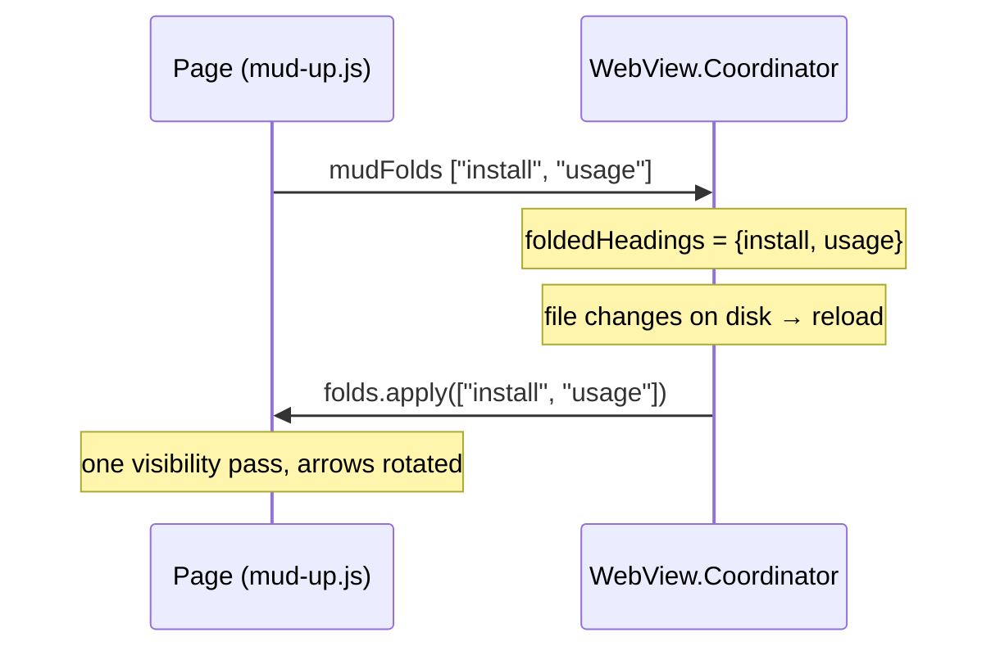

Plan: Foldable Headings
===============================================================================

> Status: Underway

A new Up Mode setting, "Foldable headings". With it on, every h2-and-deeper
heading in Mark Up mode gets a faint arrow button at its right edge, and
clicking it folds that heading's section away — the content under it,
sub-sections included. Folds last as long as the window is open, and navigating
into a folded section opens it back up.


## What it does

- The setting sits in Settings > Up Mode and is off by default — it adds a
  control to every heading in the document. (It was planned for General, below
  "First heading as window title"; Up Mode is the better home, since folding is
  a Mark Up feature.)
- With it on, each `h2`–`h6` in the rendered view gets a small arrow at the
  right edge of the heading, vertically aligned with the heading's last line.
  `h1` is left out — it is the document title, not a section.
- The arrow points down while the section is open and rotates -90° to point
  right while it is folded. Its color is `--border-color`, the same faint tone
  as the h1/h2 underlines.
- Clicking the arrow toggles the fold. The arrow is the only click target: the
  heading around it stays ordinary text — selectable, commentable, and with its
  links still following — and the pointer cursor appears over the arrow alone.
- A folded section hides everything from the heading down to the next heading
  of the same or higher rank. The heading itself stays on screen.
- Folds are remembered per window for as long as the window is open: across
  reloads (an external edit, Cmd+R), and across a switch to Mark Down and back.
  Closing the window forgets them. Nothing is written to preferences.
- Navigating to a heading, or to anything inside a folded section, unfolds it
  and every folded section it sits inside. That covers outline sidebar clicks,
  in-page `#` links, Find matches, and change navigation.


## Where each piece lives

| Piece                           | Home                                      |
| ------------------------------- | ----------------------------------------- |
| The setting and its persistence | `ViewToggle.foldableHeadings`             |
| The root CSS class              | `is-foldable-headings`                    |
| Arrow shape                     | `Resources/fold-arrow.svg`                |
| Arrows, click handling, folding | `mud-up.js` (`Mud.folds`)                 |
| Arrow and hidden-block styles   | `mud-up.css`, one rule in `mud-print.css` |
| Unfold-on-navigation call sites | `mud.js`, `mud-changes.js`, `mud-up.js`   |
| A folded section's comments     | `mud-comments.js`, `mud-comments.css`     |
| Memory across a reload          | `WebView.Coordinator`                     |
| Page → app reporting            | `mudFolds` bridge message                 |

Folding is a view state of one page, not a property of the document, so no part
of it reaches `RenderOptions`, the visitor, or the diff layer. The rendered
HTML is byte-for-byte what it is today; the arrows are built in the page.


## The preference

`ViewToggle` is described as "a persisted boolean toggle that maps to a CSS
class on the webview root", which is exactly what this is: `foldableHeadings`,
class `is-foldable-headings`, key `.uiFoldableHeadings`
(`"ui-foldable-headings"`), default `false`.

Two things then work with no further wiring. `DocumentModel.renderOptions`
already maps every view toggle to a class, so a fresh page loads with the class
baked in; and `WebView.Coordinator.applyBodyClasses` already pushes every view
toggle's class live, so flipping the setting reaches open windows without a
reload.

The class stays out of `MudPreferencesSnapshot.upModeHTMLClasses`. A Quick Look
preview gets no `mud-up.js`, so it would have no arrows to show either way, and
that list is meant to name only what a preview honors.

Settings gets one more `Section` in `UpModeSettingsView`, matching the
one-toggle-per-section shape of the pane.


## The arrow asset

`fold-arrow.svg` is a 14×14 chevron, drawn pointing down — the open state. The
page needs its markup inline so CSS can color and rotate it, so
`HTMLTemplate.mudUpJS` substitutes the file's contents into the
`"__MUD_FOLD_ARROW_SVG__"` placeholder in `mud-up.js`, JSON-encoded into a JS
string literal. This mirrors `mudCommentsJS`, which already assembles its
script from more than one resource file. `HTMLTemplateTests` pins the
substitution, since a renamed placeholder would ship a heading button holding
the literal placeholder text.

The `stroke="#000000"` on the polyline is a presentation attribute, so a CSS
rule beats it: the button sets `color: var(--border-color)` and the polyline's
stroke reads `currentColor`.

Orientation is one rotation, not two: the arrow is drawn pointing down, so the
open state needs no transform and the folded state is `rotate(-90deg)`, which
points it right. The transform origin is the arrow's center.


## The arrow's box

The arrow sits at the heading's right edge, level with its last line, and must
not collide with the heading text when the heading wraps. Absolute positioning
inside the heading does both: the heading takes `position: relative` and a
`padding-right` that keeps a column clear for the arrow, and the arrow takes
`position: absolute; right: 0` with a `bottom` offset. The last line box ends
at the content box bottom, so an offset from the bottom is an offset from the
last line. An h2 adds `padding-bottom: 0.3em` under its text before its
underline, so it carries a larger offset than the other ranks.

Two font sizes are in play, so the button takes `font: inherit`. Without it an
`em` on a button is the UA's own ~13px at every rank, which is what made the
first version of the box overhang the heading text; with it, every length on
the arrow is in the heading's em. The button is then `1.5rem` wide inside a
`1.75rem` column — the same unit on both sides, so the two can be compared at a
glance — and `1.25em` tall, one line box, so the hit box covers the last line
and nothing else. The SVG keeps its own `0.875rem` and centers in the box, so
the arrow looks the same at every rank while its box tracks the line it sits
on.

The whole on-screen block is scoped to `@media screen`, the way
`mud-comments.css` scopes the column's layout. Printing then shows a folded
document in full, with no rule needed to undo the hiding. `mud-print.css` only
has to hide the arrows themselves, so a printed heading doesn't carry a stray
button box.


## The fold pass

The rendered body is flat: an `h2` and the blocks that follow it are siblings
inside `.up-mode-output`. So a section is "the following siblings up to the
next heading of the same or higher rank", and nesting is implied by rank rather
than by containment.

`Mud.folds` keeps one set of folded heading slugs (the `id` the visitor already
puts on every heading) and recomputes the whole page's visibility from that set
in a single top-to-bottom walk. Recomputing beats toggling elements in place:
with nested folds, "unfold this section" is not "show these elements" — a
sub-section folded inside it must stay folded.

The walk keeps a stack of the folded headings whose sections are still open,
outermost first:

```
  for (var el of article.children) {
    var level = headingLevel(el);            // 0 when not a heading
    if (level) {
      while (open.length && open.top.level >= level) open.pop();
      setHidden(el, open);                   // hidden by an outer fold
      el.classList.toggle("is-folded", folded.has(el.id));
      if (folded.has(el.id)) open.push({ level: level, id: el.id });
    } else {
      setHidden(el, open);
    }
  }
```

`setHidden` adds or removes `is-fold-hidden`, whose one rule is
`display: none`. A heading inside a folded parent is hidden along with the
rest, and keeps its own folded state for when the parent opens again.

While a block is hidden `setHidden` also stamps it with `data-fold-host`, the
`id` of `open[0]` — the outermost folded heading over it, and the only one of
them still on screen. That is what `hiding` reads back; see "Making `hiding`
cheap".

The API `mud-up.js` publishes:

| Call                      | Who calls it                                    |
| ------------------------- | ----------------------------------------------- |
| `folds.setEnabled(on)`    | `mud.js` `setClass`, when the setting flips     |
| `folds.apply(slugs)`      | The app after a page load, to restore the folds |
| `folds.reveal(el)`        | Any navigation landing on an element            |
| `folds.revealHeading(id)` | Outline sidebar navigation                      |
| `folds.hiding(el)`        | The Comments column, to place a folded comment  |

Turning the setting off removes the arrows and shows everything, but keeps the
remembered set, so turning it back on restores the same folds.


## Remembering folds across a reload

A reload replaces the whole HTML document, so the page can't remember anything
by itself. `WebView.Coordinator` already remembers one such fact across a
reload — the scroll fraction — and this is the same shape, so the folded slugs
live there too: a per-window fact the view layer holds, gone when the window
closes.

The page reports its full folded set after every change, and the coordinator
replays it once the new page has loaded.



Pieces:

- `MudJSBridge.Handler.folds` (`"mudFolds"`), a `MudJSMessage.folds([String])`
  case, its decode, and a row in the message table on `MudJSMessage`.
- `Coordinator.foldedHeadings`, set from that message and replayed in
  `didFinish` next to the existing comment and column-width replays. It must
  run **before** the scroll restore; see "Scroll position after a reload".
- Nothing declarative on `WebView` and nothing on `DocumentState`: the app
  never initiates a fold, so there is one direction of authority and no risk of
  the app pushing back a set the page just changed.

Mark Down mode needs no special case. `mud-up.js` returns early when there is
no `.up-mode-output`, so `Mud.folds` doesn't exist on a Down page, and the
guarded `bridge.call` no-ops — the same way `comments.*` calls already do.

A heading whose text is edited gets a new slug, so its section comes back
unfolded after that reload. The old slug is not dropped, though: it stays in
the set for as long as the window is open, and if that heading ever comes back
— an undo, say — it comes back folded. We keep that. The set is bounded by the
headings the reader has folded in this one window, and a fold surviving an undo
is the better of the two behaviors.


## Unfolding on navigation

Every path that scrolls somewhere gets one line ahead of the scroll:

| Path              | Where                             |
| ----------------- | --------------------------------- |
| Outline sidebar   | `mud.js` `scrollToHeading`        |
| In-page `#` link  | `mud-up.js` click handler         |
| Find match        | `mud.js` `activateMatch`          |
| Change navigation | `mud-changes.js` `scrollToChange` |

`reveal(el)` walks up from the element to the preceding headings and removes
every enclosing folded slug from the set, then reruns the visibility pass.
`revealHeading(id)` does that for the heading's ancestors and for the heading
itself.

In-page links are the one interception. `mud-up.js` used to return early for an
`href` starting with `#` and let WebKit scroll; WebKit can't scroll to a
`display: none` target, so the handler now resolves the target, unfolds what
encloses it, and scrolls.

Each of these calls through `window.Mud.folds && …`, the same defensive shape
the files already use for `Mud.comments`, so injection order stays a
non-requirement.


## What the rest of the page does with hidden blocks

- **Change overlays** mostly cope. `positionOverlay` filters to elements with a
  layout box (`offsetParent !== null`) and hides an overlay whose blocks have
  all gone, and a `ResizeObserver` on `.up-mode-output` repositions everything
  when the article's height changes — which a fold does. A collapsed
  deletion-only group is the open question; see the last item under "Testing".
- **The Comments column** needs work of its own.[^comment-a] A capsule's
  position comes from `preferredPosition`, which returns `layoutTop(anchor)`; a
  hidden anchor has no offset parent, so it reports 0 and every folded comment
  piles at the top of the column. "Comments in a folded section" covers what it
  does instead.
- **Find** counts matches inside folded sections. Activating one unfolds
  it[^comment-b], so stepping through matches with Cmd+G still walks the whole
  document. Leaving the count as the document's total is the honest number.
- **Print** shows everything, because the hiding rule is `@media screen`.


## Comments in a folded section

A folded section can hold comments, and the column should say so rather than
quietly dropping them — but it can't show a capsule beside a quotation that
isn't on screen.

`Mud.folds.hiding(el)` answers the one question the column has: what is hiding
this element, and where is it? The answer names the outermost folded section
the element sits in, since an inner folded heading is itself off screen. That
heading is where the section's comments are represented — by one stub, however
many of them there are.

- **Grouping.** The placement pass groups the folded-away comments by the
  heading hiding them. The first one carries the stub; the rest leave the
  column until the section opens, the way a hidden capsule already did.
- **Appearance.** The carrier takes `is-stub`: 5px tall with nothing drawn
  inside, keeping the capsule's own 1px border, background and radius so it
  reads as a comment pressed shut. Its `title` says what it stands for — the
  one comment's "Author: message", or "3 comments".
- **Placement.** The stub sits level with the bottom of the heading, which
  `hiding` reports and the column centers its 5px on. See "Where the stub sits"
  for why that line and not the arrow's.
- **Opening.** Clicking a stub — or stepping onto its comment with the header's
  ‹ › arrows — unfolds the section, expands the comment, and scrolls to its
  quotation, which may be well below the heading the stub sat beside.
- **Ordering.** `orderedLabels` compares anchors by DOM position rather than by
  measured top, so ‹ › still walks every comment in the document, including the
  ones a stub stands in for. That is now the definition of the column's order,
  not a workaround for folding: measured position ties whenever two capsules
  share a row.

An anchor with no layout box for some other reason still leaves the column, as
before. The header's count stays the document's total either way.


## Corrections after review

Six things the review pass turned up, all now on the branch. The first two were
defects a reader would hit; the rest were loose ends.


### The key-catalog count test

`MudPreferences.Keys` has 33 cases — `uiFoldableHeadings` from this work and
`cliInstalledAt` from the Command Line pane — but
`MudPreferencesTests.keyCatalogCount` expected 32. The CLI commit bumped 31 →
32 for its own key and absorbed only one of the two. It reads 33 now.


### Scroll position after a reload

`WebView.didFinish` restored the saved scroll fraction and then replayed the
folds. Both were right; the order was wrong. The fraction was captured on the
folded page, where the document is short, and `setScrollFraction` multiplies it
by the new page's `scrollHeight - innerHeight` — which was the _unfolded_
height, because the folds hadn't been replayed yet. The page then shrank under
the reader: fold most of a long document, scroll to the middle, press Cmd+R,
and you landed near the end.

`folds.apply` now runs above `restoreScrollPosition()`. The bridge's
`evaluateJavaScript` calls run in the order they are issued, so that was the
whole fix.


### The arrow's hit box

The arrow button was far bigger than it looked, and it overhung the heading's
own text. Nothing in the stylesheets sets `font: inherit` on a button, so the
`em` in `.mud-fold-arrow` was the UA button font size (~13.3px), and
`box-sizing: content-box` with `width/height: 1.25em` and `padding: 1em` made a
box of about 43×43px on every rank. The column reserved for it was
`padding-right: 1.5em` stated in the _heading's_ em, which is a different
number per rank: about 36px at h2, 30px at h3, 24px at h4, 21px at h5, 20px at
h6.

So the button covered between 7 and 23px of the heading's text column, with
`cursor: pointer` over it. On a heading long enough to wrap, the last
characters sat under the button: clicking there folded the section instead of
placing the caret, and a drag-select couldn't start. That contradicted the
promise in "What it does" that the heading stays ordinary text. Vertically it
was worse — bottom-anchored and 43px tall, the arrow floated in the margin
above the smaller ranks rather than sitting on their last line.

Both numbers are now in units that can be compared, and the button is strictly
narrower than the column it sits in. "The arrow's box" has the result.


### Where the stub sits

The stub sits level with the bottom of the heading — `layoutTop(host)` plus the
heading's `offsetHeight`, less half the stub's height so the 5px straddles that
line. That is the design, and it stays. The plan described a constant
`ARROW_MID` measured up from that edge to the arrow; it was never written, and
it isn't wanted. Only the words needed correcting.

Sitting on the heading's own bottom edge beats measuring the arrow on three
counts:

- It doesn't move when the arrow's box is retuned ("The arrow's hit box"). One
  less thing tied to a number we are still tuning.
- The `offsetTop` walk and `offsetHeight` are both pre-zoom layout pixels — the
  same space the column sets capsule tops in — so no zoom correction enters. A
  rect measurement would need one.
- The fold code can compute it without knowing that an arrow exists, so nothing
  about the arrow crosses the seam. `hiding` returns a line in the document and
  the column decides how tall its stand-in is.

On an h2 the line falls just under the underline rule and the stub straddles
it, which reads as the stub sitting on the line that ends the heading. On h3–h6
there is no rule and it lands at the bottom of the text.

Two folded sections can't crowd each other's stubs: the solver keeps `GAP`
(15px) between rows, and consecutive folded headings are about 70px apart at h2
and 37px at h6, both more than `STUB_H + GAP`.

What was wrong was the prose. Five places said the stub is level with the
heading's _arrow_ — `mud-comments.js` (three comments, at `stubTop`, at
`preferredPosition`, and in `layout`), the `.is-stub` block in
`mud-comments.css`, and the `mud-comments.js` entry in `AGENTS.md`. They say
the bottom of the heading now.

`STUB_H` stays in `mud-comments.js`: the stub's height is the column's own
business.


### Pin `STUB_H` to the CSS

`mud-comments.js` and `mud-comments.css` each state the stub's 5px height and
each told the reader the other one has to agree, with nothing enforcing it.
`CommentResourcesTests.stubHeightAgreesAcrossJSAndCSS` now reads the JS number
and requires the `.mud-capsule.is-stub` rule to use it — the same pattern as
`markerClassAgreesWithTheJSLayer` beside it and the `Layout.compactBreakpoint`
pin in `HTMLTemplateTests`.


### Smaller corrections

- `reveal()` didn't check `enabled()`, so with the setting off an outline click
  still deleted slugs from the set and reported the smaller one to the app.
  That contradicts `setEnabled`, which promises the set survives so turning the
  setting back on restores the same folds. It returns early now.
- `orderedLabels` compares by DOM position but fell back to `preferredPosition`
  when either anchor was missing. Two orderings in one comparator leave the
  whole sort undefined, not just those few labels; anchor-less labels sort to
  the end instead.
- The `!stub && anchor.offsetParent === null` early return in `layout()`
  skipped the `is-stub` and `title` reset below it. No visible effect — the
  capsule is hidden, and the reset runs before it shows again — but the state
  is cleared on the way out now.
- A footnote or comment popover carried `is-foldable-headings` on its root,
  inherited from the document's options. The fold code bails on
  `footnote-popover`, so there were no arrows, but the heading `padding-right`
  rule still applied and indented every heading for a button that never
  arrives. Both popover builders share one options helper, so the removal joins
  the column's there. That helper strips more than the column now, and both its
  callers are popovers, so `withoutCommentsColumn` became `forPopover`.


## Untangling the column

`mud-comments.js` is the most complicated file in the project, and folding
added about 110 lines to it. Most of that has left. This section is the
refactor, which changes no behavior.


### What the column knew about folding

- `stubTop` — where a folded heading ends, measured in the comments file.
- `folds()`, `foldHost()`, `unfold()` — three wrappers around `Mud.folds`.
- The `hiddenBy` / `carrier` / `covered` grouping inside `layout()`.
- Three separate unfold call sites: a stub click, `navigate`, `openToComment`.
- `orderedLabels`, rewritten to compare by DOM position.
- `clearActive`, split out of `deactivate` so the placement pass can close a
  comment whose section just folded.
- The `.is-stub` rules in `mud-comments.css`.

Some of that is the column's own business: how to draw a stand-in for a comment
you can't place, how to collapse several of them into one, what happens when
it's clicked. The rest was fold knowledge that had leaked across — what a
heading is, where an arrow sits, that folding exists at all. The column needs
one idea, not that whole list: **this comment's anchor is hidden; here is where
its stand-in goes.**


### The seam

Two calls, both on `Mud.folds`:

| Call                   | Returns                                        |
| ---------------------- | ---------------------------------------------- |
| `Mud.folds.hiding(el)` | `{ key, top }`, or null when `el` is on screen |
| `Mud.folds.reveal(el)` | true when something was opened                 |

`key` is an opaque string the column groups by and never interprets — it is the
hiding heading's slug, but nothing outside `mud-up.js` needs to know that.
`top` is the bottom of the hiding heading, in layout pixels — a line to sit on,
not a position for any particular thing. The column centers its stub on it.

`mud-comments.js` names the feature in exactly one function:

```
  // The document can hide a comment's anchor: foldable headings (mud-up.js)
  // are an app feature, and an export doesn't load that file. Null whenever
  // the anchor is on screen, and everywhere folding doesn't exist.
  function foldOver(anchor) {
    var f = window.Mud && window.Mud.folds;
    return f && anchor && anchor.offsetParent === null
      ? f.hiding(anchor) : null;
  }
```

Everything downstream reads `fold.key` and `fold.top`. In an export `foldOver`
returns null on its first clause and every branch below it falls away — the
same guarantee the three separate guards gave, in one place instead of three.


### One lookup per comment

`layout()` resolved the host up to three times per comment — once building the
grouping maps, once in the loop body, once inside `preferredPosition` — and
each `hostOf` walked backwards through the article's children. That was
comments × blocks of DOM walking on every animation frame.

The map is now built once at the top of the pass and the answer passed down:

```
  var folds = Object.create(null);      // label -> { key, top } | null
  labels.forEach(function (label) {
    folds[label] = foldOver(anchorFor(label));
  });
```

`preferredPosition(label, fold)` takes what it needs instead of recomputing it
(with the argument omitted it still looks the fold up itself, for the odd
caller outside a placement pass), and the grouping loops read `folds[label]`.
The `clearActive` check that closes a comment whose section just folded moved
below the map and reads it too, so nothing in the pass asks twice.


### Making `hiding` cheap

The backwards walk in `hostOf` re-derived something the visibility pass had
already worked out. `refresh()` walked the article carrying the ranks of the
folded sections still open; it now carries `{ level, id }` pairs, and
`setHidden` stamps each block it hides with `data-fold-host="<outermost id>"`.

`hiding(el)` is then the block lookup it already did, one attribute read, and
one measurement of the heading — no walk. Better than the speed: the answer
comes from the same pass that decided the element was hidden, so the two can't
disagree.

The measurement borrows `Mud.geometry.layoutTopFromRect` from `mud.js` rather
than restating the `offsetParent` walk a third time. The two agree because
`body` has `margin: 0`, which `mud-comments-edit.js` already relies on for its
compose box.


### What moved and what stayed

| Piece                               | Home after                     |
| ----------------------------------- | ------------------------------ |
| The stub's line, and measuring it   | `mud-up.js` (`hiding`)         |
| Which heading is hiding an element  | `mud-up.js` (`data-fold-host`) |
| The one guard for "no folding here" | `mud-comments.js` (`foldOver`) |
| `STUB_H`, `.is-stub`, `stubTitle`   | `mud-comments.js` / `.css`     |
| Carrier grouping, open-on-click     | `mud-comments.js`              |
| `orderedLabels` by DOM position     | `mud-comments.js`              |

The column lost `folds()`, `foldHost`, `stubTop`, `unfold` and every mention of
a heading — about 30 lines — and stopped walking the article three times per
comment. `foldOver` is the only name in the file that says "fold".


### Folding the unfold into `activate`

The three unfold call sites all did the same two things in the same order.
"Opening a comment reveals it" is one rule, so `activate` opens the fold
itself. `navigate` and `openToComment` lost a line each, and the stub's click
handler reads whether it needs to scroll off the capsule it already has:

```
  var wasStub = cap.classList.contains("is-stub");
  activate(label);
  if (wasStub) scrollToComment(label);
```

`wasStub` says the same thing the old `unfold(label)` return said: the only
capsule that can be clicked while its fold is shut is the one carrying the
stub, since the rest are `display: none`.

One path now reveals that didn't before: `project()` re-activates the open
comment after a reproject, so a live edit arriving while a comment is expanded
inside a folded section would open that section. Reaching that state means
folding a section without clicking outside the expanded capsule, and the arrow
click's `mousedown` closes it first — so it isn't reachable in practice. The
`clearActive` check in `layout()` stays as the backstop either way.


### Naming

`hiding` over the alternatives, briefly, since the name is the whole point of
the seam:

- `hostOf` (the original) implies containment. A folded heading doesn't contain
  the blocks it hides — they are its siblings, which is why the fold pass is a
  walk over `article.children` and not a tree descent. The name misdescribes
  the data model to the next reader.
- `standInFor` names what the caller draws, not what `mud-up.js` knows. The
  fold code has never heard of stubs.
- `hiddenBy` is accurate, and `layout()` reached for that exact word for its
  own local map — good evidence it is the natural one. As a function returning
  a record it reads passive, so it stays the local name and the call becomes
  the active voice of it.
- `hiding` reads as a sentence at the call site — "the fold hiding this anchor"
  — and pairs with the `reveal` that already exists: one asks what is hiding a
  thing, the other opens it.


## What this doesn't touch

- **Exports, Quick Look, and the CLI.** `mud.js`, `mud-up.js`, and
  `mud-changes.js` are injected by the app's `WKWebView` only. An export
  document may carry the root class, but with no fold script there are no
  arrows and nothing to click.
- **Footnote and comment popovers.** They load their own page and are given
  `mudJS` and `mudUpJS`, and they inherit `htmlClasses` from the document's
  options — so the fold code skips a page whose root has `footnote-popover`.
  One guard at startup.
- **Change tracking, comment anchoring, and the rendered HTML.** Nothing is
  emitted, rewritten, or reordered. Comment anchoring maps a DOM position to a
  source byte and never sees the arrows, which hold no text.


## Files

**Preferences/**

- `ViewToggle.swift` — the `foldableHeadings` case, its class, key, and default
- `MudPreferences.swift` — the `uiFoldableHeadings` key
- `Tests/MudPreferencesTests.swift` — the key-catalog count

**App/**

- `Settings/UpModeSettingsView.swift` — the toggle
- `MudJSBridge.swift` — the `mudFolds` handler, message case, decode, and table
  row
- `WebView.swift` — `Coordinator.foldedHeadings`, the message case, the
  `didFinish` replay (before the scroll restore)

**Core/Sources/**

- `Rendering/HTMLTemplate.swift` — substitute `fold-arrow.svg` into `mudUpJS`
- `Rendering/CommentHTMLRenderer.swift`, `Rendering/FootnoteHTMLRenderer.swift`
  — `forPopover()` drops `is-foldable-headings` along with the column's classes
- `Resources/mud-up.js` — `Mud.folds`: arrows, click handling, the visibility
  pass and its `data-fold-host` stamp, `hiding`, the `#`-link handler
- `Resources/mud.js` — the `setClass` hook, unfold in `activateMatch` and
  `scrollToHeading`
- `Resources/mud-changes.js` — unfold in `scrollToChange`
- `Resources/mud-comments.js` — `foldOver`, the stub, the fold map in `layout`
- `Resources/mud-comments.css` — the stub's rules
- `Resources/mud-up.css` — arrow and hidden-block rules, `@media screen`
- `Resources/mud-print.css` — hide the arrows on paper

**Core/Tests/**

- `HTMLTemplateTests.swift` — the fold-arrow substitution
- `CommentResourcesTests.swift` — `STUB_H` against the CSS height

**Doc/**

- `AGENTS.md` — the feature list, the `ViewToggle` entry, the `mud-up.js` /
  `mud.js` / `mud-comments.js` / `mud-up.css` entries, the bridge message table
- `RELEASES.md` — a line in the next version's notes


## Testing

Most of this is CSS and JS, which the test suites don't reach. The Swift-side
tests are small:

- `MudJSBridgeTests` — decoding a `mudFolds` payload into `MudJSMessage.folds`,
  and dropping a malformed one. (Done.)
- `HTMLTemplateTests` — the fold arrow reaches `mudUpJS`. (Done.)
- `MudPreferencesTests` — the key-catalog count. (Done.)
- `CommentResourcesTests` — `STUB_H` against the CSS. (Done.)

The rest is a manual pass, on a document with nested headings, comments, and a
waypoint selected:

1. Setting off: no arrows at all.
2. Setting on: arrows on h2–h6, none on h1, aligned right and on the last line
   of a wrapped heading. Heading text still selects and takes a comment, and a
   link in a heading still follows. Do this on a long h5 and h6, where the
   button overhung the text before the fix.
3. Click an arrow on an h2 that holds h3s: everything down to the next h2
   disappears; the arrow points right.
4. Fold an inner h3, fold its h2, unfold the h2: the h3 is still folded.
5. Edit the file in another editor: after the reload the same sections are
   folded, **and the scroll position is where it was**. Same for Cmd+R, and for
   Space to Mark Down and back.
6. Click an outline row for a folded heading, and one inside a folded section:
   both unfold and scroll.
7. Cmd+F for text inside a folded section, then Cmd+G onto it: it unfolds and
   scrolls.
8. With the Changes bar showing, navigate to a change inside a folded section.
9. With the Comments column open, fold a section that holds two comments: one
   thin sliver appears level with the heading's bottom, and hovering it reads
   "2 comments". Click it — the section opens, the first comment expands, and
   the page scrolls to its quotation. Fold it again and step onto either
   comment with the header's ‹ › arrows: the same. Unfold by hand and both
   capsules come back in place.
10. Cmd+P with a section folded: the printed document is complete.
11. Close the window, reopen the file: nothing is folded.
12. Open question — fold a section that _contains_ a deletion-only change.
    `refresh()` leaves `.mud-overlay` children alone by design, and
    `positionCollapsedOverlay` walks back to the nearest visible sibling, which
    for a folded section is the heading itself. The expando button should end
    up parked under the folded heading, still clickable, expanding deletions
    from a section that isn't on screen. Look at it on a real page and decide
    whether the overlay should hide with its section.


## Deferred

Not in this plan; worth doing once the basics are in use.

- **Fold All / Unfold All.** A View-menu pair, and the toolbar or keyboard
  equivalents that go with it. Both are one call into `Mud.folds` — Fold All
  puts every `h2` slug in the set (or every heading rank, if we want it to
  close right down), Unfold All empties it — and both report the new set back
  over `mudFolds` like any other change, so nothing else has to move.
- **Folding in Mark Down mode.** The raw view has headings too, but its rows
  are table lines rather than blocks, so the section walk would be a different
  piece of code against `LineDiffMap`-style line ranges. Out of scope here.

[^comment-a]:
    > The Comments column needs one fix.

    💬 {JP @ 2026-08-02 15:23:00}:

    Adding a comment here to test it.

[^comment-b]:
    > Activating one unfolds it

    💬 {JP @ 2026-08-02 17:04:48}:

    Same section, second comment.
