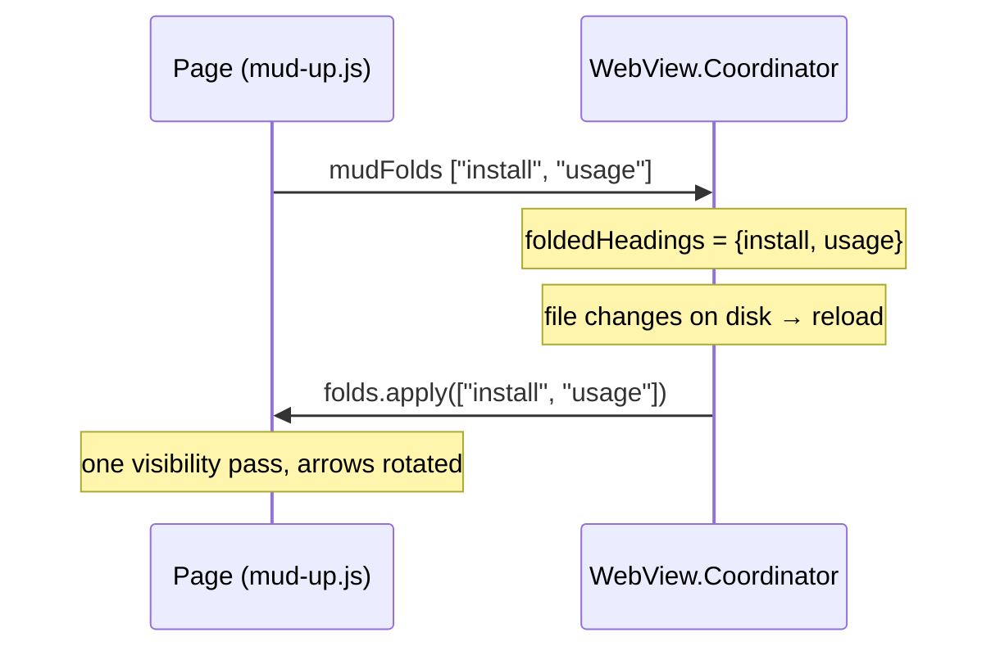

Plan: Foldable Headings
===============================================================================

> Status: Planning

A new General setting, "Foldable headings". With it on, every h2-and-deeper
heading in Mark Up mode gets a faint arrow at its right edge, and clicking the
heading folds its section away — the content under it, sub-sections included.
Folds last as long as the window is open, and navigating into a folded section
opens it back up.


## What it does

- The setting sits in Settings > General, directly below "First heading as
  window title", and is off by default — it changes what a click on a heading
  does.
- With it on, each `h2`–`h6` in the rendered view gets a small arrow at the
  right edge of the heading, vertically aligned with the heading's last line.
  `h1` is left out — it is the document title, not a section.
- The arrow points down while the section is open and rotates -90° to point
  right while it is folded. Its color is `--border-color`, the same faint tone
  as the h1/h2 underlines.
- Clicking the heading toggles the fold. Clicks on a link or a comment marker
  inside the heading, and clicks that end a text selection, are left alone — a
  heading is commentable text, and selecting it must keep working. The pointer
  cursor appears over the arrow only, so the rest of the heading still reads as
  selectable text; we'll see how that feels in use.
- A folded section hides everything from the heading down to the next heading
  of the same or higher rank. The heading itself stays on screen.
- Folds are remembered per window for as long as the window is open: across
  reloads (an external edit, Cmd+R), and across a switch to Mark Down and back.
  Closing the window forgets them. Nothing is written to preferences.
- Navigating to a heading, or to anything inside a folded section, unfolds it
  and every folded section it sits inside. That covers outline sidebar clicks,
  in-page `#` links, Find matches, and change navigation.


## Where each piece lives

| Piece                           | Home                                      |
| ------------------------------- | ----------------------------------------- |
| The setting and its persistence | `ViewToggle.foldableHeadings`             |
| The root CSS class              | `is-foldable-headings`                    |
| Arrow shape                     | `Resources/fold-arrow.svg`                |
| Arrows, click handling, folding | `mud-up.js` (`Mud.folds`)                 |
| Arrow and hidden-block styles   | `mud-up.css`, one rule in `mud-print.css` |
| Unfold-on-navigation call sites | `mud.js`, `mud-changes.js`, `mud-up.js`   |
| Memory across a reload          | `WebView.Coordinator`                     |
| Page → app reporting            | `mudFolds` bridge message                 |

Folding is a view state of one page, not a property of the document, so no part
of it reaches `RenderOptions`, the visitor, or the diff layer. The rendered
HTML is byte-for-byte what it is today; the arrows are built in the page.


## The preference

`ViewToggle` is described as "a persisted boolean toggle that maps to a CSS
class on the webview root", which is exactly what this is. Add a case:

- `foldableHeadings`, class `is-foldable-headings`, key `.uiFoldableHeadings`
  (`"ui-foldable-headings"`), default `false`.

Two things then work with no further wiring: `DocumentModel.renderOptions`
already maps every view toggle to a class, so a fresh page loads with the class
baked in; and `WebView.Coordinator.applyBodyClasses` already pushes every view
toggle's class live, so flipping the setting reaches open windows without a
reload.

Leave the class out of `MudPreferencesSnapshot.upModeHTMLClasses`. A Quick Look
preview gets no `mud-up.js`, so it would have no arrows to show either way, and
the list is meant to name only what a preview honors.

Settings gets one more `Section` in `GeneralSettingsView`, matching the
one-toggle-per-section shape of the pane:

```
Toggle(isOn: …) {
    Text("Foldable headings")
    Text("Click a heading to fold its section away. Folds last until the "
         + "window closes.")
}
```


## The arrow asset

`fold-arrow.svg` is a 14×14 chevron, drawn pointing down — the open state. The
page needs its markup inline so CSS can color and rotate it.

`HTMLTemplate.mudUpJS` already exists to hand `mud-up.js` to the WebView. Give
it one substitution: `mud-up.js` declares

```
// The fold arrow. HTMLTemplate.mudUpJS replaces this placeholder with the
// contents of fold-arrow.svg, so the shape is stated in one file only.
var FOLD_ARROW_SVG = "__MUD_FOLD_ARROW_SVG__";
```

and `mudUpJS` swaps in the file's contents, JSON-encoded into a JS string
literal. This mirrors `mudCommentsJS`, which already assembles its script from
two resource files rather than from the one on disk.

The `stroke="#000000"` on the polyline is a presentation attribute, so a CSS
rule beats it: the button sets `color: var(--border-color)` and the polyline's
stroke reads `currentColor`. The file's `stroke-width: 1.6` is the starting
weight; if it reads heavy at h5/h6 sizes we set it in CSS instead.

Orientation is one rotation, not two: the arrow is drawn pointing down, so the
open state needs no transform and the folded state is `rotate(-90deg)`, which
points it right. The transform origin is the arrow's center.


## The arrow's box

The arrow must sit at the heading's right edge, level with its last line, and
must not collide with the heading text when the heading wraps. Absolute
positioning inside the heading does both:

```
@media screen {
  .is-foldable-headings .up-mode-output :is(h2, h3, h4, h5, h6) {
    position: relative;
    padding-right: 1.6em;   /* text wraps before the arrow's column */
  }
  .mud-fold-arrow {
    position: absolute;
    right: 0;
    /* the last line box ends at the content box bottom, so an offset from
       the bottom is an offset from the last line */
    bottom: …;
  }
}
```

The h2 rule adds `padding-bottom: 0.3em` under the text before its underline,
so the arrow's `bottom` is computed from that padding plus half the leftover
line box. The exact number is a tuning pass with the rendered page in front of
us.

The whole on-screen block is scoped to `@media screen`, the way
`mud-comments.css` scopes the column's layout. Printing then shows a folded
document in full, with no rule needed to undo the hiding. `mud-print.css` only
has to hide the arrows themselves, so a printed heading doesn't carry a stray
button box.


## The fold pass

The rendered body is flat: an `h2` and the blocks that follow it are siblings
inside `.up-mode-output`. So a section is "the following siblings up to the
next heading of the same or higher rank", and nesting is implied by rank rather
than by containment.

`Mud.folds` keeps one set of folded heading slugs (the `id` the visitor already
puts on every heading) and recomputes the whole page's visibility from that set
in a single top-to-bottom walk. Recomputing beats toggling elements in place:
with nested folds, "unfold this section" is not "show these elements" — a
sub-section folded inside it must stay folded.

The walk keeps a stack of the ranks of folded headings whose sections are still
open:

```
for (var el of article.children) {
  var level = headingLevel(el);            // 0 when not a heading
  if (level) {
    while (stack.length && stack.top >= level) stack.pop();
    setHidden(el, stack.length > 0);       // hidden by an outer fold
    el.classList.toggle("is-folded", folded.has(el.id));
    if (folded.has(el.id)) stack.push(level);
  } else {
    setHidden(el, stack.length > 0);
  }
}
```

`setHidden` adds or removes `is-fold-hidden`, whose one rule is
`display: none`. A heading inside a folded parent is hidden along with the
rest, and keeps its own folded state for when the parent opens again.

The API `mud-up.js` publishes:

| Call                      | Who calls it                                    |
| ------------------------- | ----------------------------------------------- |
| `folds.setEnabled(on)`    | `mud.js` `setClass`, when the setting flips     |
| `folds.apply(slugs)`      | The app after a page load, to restore the folds |
| `folds.reveal(el)`        | Any navigation landing on an element            |
| `folds.revealHeading(id)` | Outline sidebar navigation                      |

Turning the setting off removes the arrows and shows everything, but keeps the
remembered set, so turning it back on restores the same folds.


## Remembering folds across a reload

A reload replaces the whole HTML document, so the page can't remember anything
by itself. `WebView.Coordinator` already remembers one such fact across a
reload — the scroll fraction — and this is the same shape, so the folded slugs
live there too: a per-window fact the view layer holds, gone when the window
closes.

The page reports its full folded set after every change, and the coordinator
replays it once the new page has loaded.



Pieces:

- `MudJSBridge.Handler.folds` (`"mudFolds"`), a `MudJSMessage.folds([String])`
  case, its decode, and a row in the message table on `MudJSMessage`.
- `Coordinator.foldedHeadings`, set from that message and replayed in
  `didFinish` next to the existing comment and column-width replays.
- Nothing declarative on `WebView` and nothing on `DocumentState`: the app
  never initiates a fold, so there is one direction of authority and no risk of
  the app pushing back a set the page just changed.

Mark Down mode needs no special case. `mud-up.js` returns early when there is
no `.up-mode-output`, so `Mud.folds` doesn't exist on a Down page, and the
guarded `bridge.call` no-ops — the same way `comments.*` calls already do.

A heading whose text is edited gets a new slug, so its fold is forgotten after
that reload. That seems right: it is not quite the same heading any more.


## Unfolding on navigation

Every path that scrolls somewhere gets one line ahead of the scroll:

| Path              | Where                             |
| ----------------- | --------------------------------- |
| Outline sidebar   | `mud.js` `scrollToHeading`        |
| In-page `#` link  | `mud-up.js` click handler (new)   |
| Find match        | `mud.js` `activateMatch`          |
| Change navigation | `mud-changes.js` `scrollToChange` |

`reveal(el)` walks up from the element to the preceding headings and removes
every enclosing folded slug from the set, then reruns the visibility pass.
`revealHeading(id)` does that for the heading's ancestors and for the heading
itself.

In-page links are the one new interception. Today `mud-up.js` returns early for
an `href` starting with `#` and lets WebKit scroll. WebKit can't scroll to a
`display: none` target, so the handler now resolves the target, unfolds what
encloses it, and scrolls.

Each of these calls through `window.Mud.folds && …`, the same defensive shape
the files already use for `Mud.comments`, so injection order stays a
non-requirement.


## What the rest of the page does with hidden blocks

- **Change overlays** already cope. `positionOverlay` filters to elements with
  a layout box (`offsetParent !== null`) and hides an overlay whose blocks are
  all gone, and a `ResizeObserver` on `.up-mode-output` repositions everything
  when the article's height changes — which a fold does.
- **The Comments column** needs one fix.[^comment-a] A capsule's position comes from
  `preferredPosition`, which returns `layoutTop(anchor)`; a hidden anchor has
  no offset parent, so it reports 0 and the capsule jumps to the top of the
  column. `layout()` should skip a capsule whose anchor has no layout box and
  hide it while its quotation is folded away. The same `ResizeObserver` brings
  them back on unfold. The column's header count stays the document's total.
- **Find** counts matches inside folded sections. Activating one unfolds it, so
  stepping through matches with Cmd+G still walks the whole document. Leaving
  the count as the document's total is the honest number.
- **Print** shows everything, because the hiding rule is `@media screen`.


## What this doesn't touch

- **Exports, Quick Look, and the CLI.** `mud.js`, `mud-up.js`, and
  `mud-changes.js` are injected by the app's `WKWebView` only. An export
  document may carry the root class, but with no fold script there are no
  arrows and nothing to click.
- **Footnote and comment popovers.** They load their own page and are given
  `mudJS` and `mudUpJS`, and they inherit `htmlClasses` from the document's
  options — so the fold code must skip a page whose root has
  `footnote-popover`. One guard at startup.
- **Change tracking, comment anchoring, and the rendered HTML.** Nothing is
  emitted, rewritten, or reordered. Comment anchoring maps a DOM position to a
  source byte and never sees the arrows, which hold no text.


## Files

**Preferences/**

- `ViewToggle.swift` — the `foldableHeadings` case, its class, key, and default
- `MudPreferences.swift` — the `uiFoldableHeadings` key

**App/**

- `Settings/GeneralSettingsView.swift` — the toggle
- `MudJSBridge.swift` — the `mudFolds` handler, message case, decode, and table
  row
- `WebView.swift` — `Coordinator.foldedHeadings`, the message case, the
  `didFinish` replay

**Core/Sources/**

- `Rendering/HTMLTemplate.swift` — substitute `fold-arrow.svg` into `mudUpJS`
- `Resources/mud-up.js` — `Mud.folds`: arrows, click handling, the visibility
  pass, the `#`-link handler
- `Resources/mud.js` — the `setClass` hook, unfold in `activateMatch` and
  `scrollToHeading`
- `Resources/mud-changes.js` — unfold in `scrollToChange`
- `Resources/mud-comments.js` — skip capsules whose anchor is folded away
- `Resources/mud-up.css` — arrow and hidden-block rules, `@media screen`
- `Resources/mud-print.css` — hide the arrows on paper

**Doc/**

- `AGENTS.md` — the feature list, the `ViewToggle` entry, the `mud-up.js` /
  `mud.js` / `mud-up.css` entries, the bridge message table
- `RELEASES.md` — a line in the next version's notes


## Testing

Most of this is CSS and JS, which the test suites don't reach. The Swift-side
tests are small:

- `MudJSBridgeTests` — decoding a `mudFolds` payload into `MudJSMessage.folds`,
  and dropping a malformed one.

The rest is a manual pass, on a document with nested headings, comments, and a
waypoint selected:

1. Setting off: no arrows, heading clicks do nothing.
2. Setting on: arrows on h2–h6, none on h1, aligned right and on the last line
   of a wrapped heading.
3. Fold an h2 that holds h3s: everything down to the next h2 disappears; the
   arrow points right.
4. Fold an inner h3, fold its h2, unfold the h2: the h3 is still folded.
5. Edit the file in another editor: after the reload the same sections are
   folded. Same for Cmd+R, and for Space to Mark Down and back.
6. Click an outline row for a folded heading, and one inside a folded section:
   both unfold and scroll.
7. Cmd+F for text inside a folded section, then Cmd+G onto it: it unfolds and
   scrolls.
8. With the Changes bar showing, navigate to a change inside a folded section.
9. With the Comments column open, fold a section that holds a comment's
   quotation: the capsule leaves; unfold and it comes back in place.
10. Cmd+P with a section folded: the printed document is complete.
11. Close the window, reopen the file: nothing is folded.


## Deferred

Not in this plan; worth doing once the basics are in use.

- **Fold All / Unfold All.** A View-menu pair, and the toolbar or keyboard
  equivalents that go with it. Both are one call into `Mud.folds` — Fold All
  puts every `h2` slug in the set (or every heading rank, if we want it to
  close right down), Unfold All empties it — and both report the new set back
  over `mudFolds` like any other change, so nothing else has to move.
- **Folding in Mark Down mode.** The raw view has headings too, but its rows
  are table lines rather than blocks, so the section walk would be a different
  piece of code against `LineDiffMap`-style line ranges. Out of scope here.

[^comment-a]:
    > The Comments column needs one fix.

    💬 {JP @ 2026-08-02 15:23:00}:

    Adding a comment here to test it.
