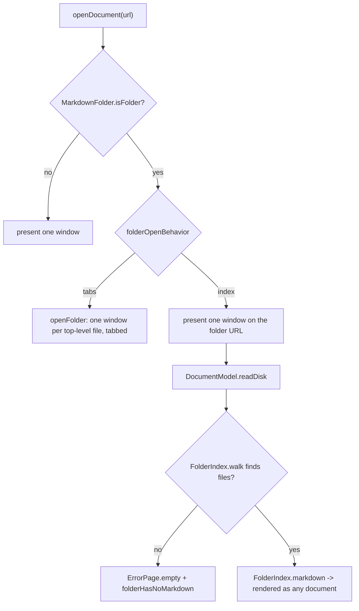

Plan: Folder Index Document
===============================================================================

> Status: Underway


## Context

Since f3c0854, handing Mud a folder opens the Markdown files directly inside
it, one tab each. Only the top level: walking the tree could mean hundreds of
windows from one command.

That is the right answer for a flat pile of documents and the wrong one for a
docs tree. Point Mud at a project's `Doc/` and everything in `Doc/Guides/` and
`Doc/Plans/` is invisible.

This adds a second behavior, chosen in Settings. Mud walks the whole tree below
the folder, finds every Markdown file, and opens one window holding a generated
index: a nested list of links. A subfolder appears only when it holds a
Markdown file, or a subfolder that does, at any depth. The index becomes the
default for a new install; one-tab-per-file stays available.


## What the reader sees

General settings gains a picker, "Opening a folder":

- **Shows an index of the folder** (new default)
- **Opens each file in a tab** (today's behavior)

In index mode, opening `Doc/` gives one window titled `Doc/` showing:

```markdown
Doc
===============================================================================

- [AGENTS.md](AGENTS.md)
- [RELEASES.md](RELEASES.md)
- **Guides/**
  - [command-line.md](Guides/command-line.md)
  - [primer.md](Guides/primer.md)
- **Plans/**
  - [2026-02-mud-app.md](Plans/2026-02-mud-app.md)
  - **archive/**
    - [2025-11-old-thing.md](Plans/archive/2025-11-old-thing.md)
```

Clicking a link opens that document in its own window, which the existing link
routing already does (`WebView.Coordinator.openURL` sends a local `.md` back
through `NSDocumentController`). Mark Down mode shows the generated source.
Cmd+R walks the tree again, so a file added since the window opened turns up. A
folder with no Markdown anywhere beneath it keeps today's answer: the blank
page and the `folderHasNoMarkdown` notice.


## The shape of the change

The index is generated in memory. The window's `fileURL` stays the folder, and
`DocumentModel` returns the generated Markdown where it would otherwise return
the file's text. No temp file is written, so nothing has to be cleaned up, the
window title and Open Recent entry are the folder itself, and Cmd+R regenerates
for free. This is the path the empty-folder window already takes — that window
is a folder URL whose `readDisk` returns a page instead of a file's contents.




## Files

**New:**

- `App/FolderIndex.swift` — the walk and the generated document, in two parts
  so the string building is testable without disk: `walk(_:limit:)` returns a
  node tree plus whether the cap stopped it, and `markdown(for:)` turns that
  tree into the source above.
- `Preferences/Sources/FolderOpenBehavior.swift` — `index` / `tabs` enum with a
  `label`, alongside the other preference enums.
- `App/Tests/FolderIndexTests.swift`.

**Changed:**

- `Preferences/Sources/MudPreferences.swift` — `folderOpenBehavior` key
  (`folder-open-behavior`, top-level group with `lighting` and `quit-on-close`)
  and its accessor, defaulting to `.index`.
- `App/AppState.swift` — one `@Pref(\.folderOpenBehavior)` line.
- `App/Settings/GeneralSettingsView.swift` — the picker, in the shape of the
  existing "Floating controls" section.
- `App/DocumentController.swift` — the folder branch of `openDocument` switches
  on the behavior. `.tabs` calls today's `openFolder`; `.index` calls
  `presentWindow(for: folder, noteRecent: true)`.
- `App/DocumentModel.swift` — the folder branch of `readDisk` builds the index;
  a new `baseURL` property (below); `refreshExternalWaypoints` skips a folder.
- `App/DocumentContentView.swift` — passes `model.baseURL` to `WebView`.
- `App/DocumentWindowController.swift` — `reopenFolder` (Cmd+R) applies only in
  `.tabs` mode; the comment explaining why gains the index case.
- `App/DocumentNotice.swift` — the truncation notice.
- `App/MudApp.swift` — `URL.isEditableDocument` beside `isBundleResource`.
- `App/ActiveDocument.swift`, `DocumentWindowController.canAddComment` — use
  it.


## Details

### The walk

`FolderIndex.walk` recurses with `contentsOfDirectory`, one level at a time, so
ordering and pruning fall out naturally.

- **What counts as a document** is `MarkdownFolder.isMarkdown`, which becomes
  internal rather than private so the walker shares the one rule (conformance
  to `net.daringfireball.markdown`, with the three-extension fallback).
- **What counts as a folder to descend into** is `MarkdownFolder.isFolder`, so
  a package (`.app`, `.rtfd`) is left alone here too.
- **Order** is files first in name order, then subfolders in name order, both
  by `localizedStandardCompare` — the comparator `markdownFiles(in:)` uses.
- **Hidden entries** are skipped, by `.skipsHiddenFiles`, which is what keeps
  `.git` and `.build` out.
- **Symlinked folders are not followed.** A link back up the tree would
  otherwise recurse forever.
- **Empty branches are dropped.** A subfolder is kept only when it holds a
  Markdown file or a kept subfolder.
- **The cap is 1,000 files.** The walk stops there and reports that it did.
  Without it, pointing Mud at a home folder would hang the open.


### The generated Markdown

A setext `=` H1 of the folder's name, a blank line, then the nested list. Two
spaces of indent per level; a folder row is `- **Name/**`, a file row is
`- [name.md](relative/path.md)`.

Two escaping rules, both worth a test:

- **Link text and folder names** get Markdown escaping, so a file called
  `Notes [draft].md` or `a_b_c.md` reads as its name rather than as a broken
  link or an italic run.
- **Link destinations** get percent-encoding of everything outside
  `A–Z a–z 0–9 - . _ ~ /`. Spaces, `#`, `?`, `%` and parentheses all break a
  destination otherwise, and `#` would silently turn a path into a fragment.


### Relative links need a base URL with a trailing slash

`HTMLDocument` already emits `<base href>` from `RenderOptions.baseURL` for
every non-standalone render, and the app passes the document's `fileURL`. For a
folder that URL has no trailing slash, so `file:///a/b/Doc` plus `Guides/x.md`
resolves to `/a/b/Guides/x.md` — one level too high, and every link in the
index would miss.

The fix is one property on `DocumentModel`:

```swift
/// The URL relative links in this document resolve against. A folder's
/// generated index links to files beneath the folder, so its base URL must
/// end in a slash — `<base href="file:///a/b/Doc">` would resolve
/// `Guides/x.md` against `/a/b/`.
var baseURL: URL {
    MarkdownFolder.isFolder(fileURL)
        ? URL(fileURLWithPath: fileURL.path, isDirectory: true)
        : fileURL
}
```

`renderOptions` and `DocumentContentView`'s `WebView(baseURL:)` both read it.
No change in Core.


### An index is read-only

There is no file behind it, so comment authoring has to be off. Both places
that decide this today ask the same question of the URL:

```swift
extension URL {
    /// Whether Mud can write to the document this URL stands for. False for a
    /// bundled guide, which lives inside the app, and for a folder, whose
    /// index is generated rather than read.
    var isEditableDocument: Bool {
        !isBundleResource && !MarkdownFolder.isFolder(self)
    }
}
```

`ActiveDocument.swift`'s `editable` and
`DocumentWindowController.canAddComment` switch to it, which is enough —
`ActiveDocumentSnapshot.canAddComment` is the one rule every Add Comment
affordance already applies.

Git waypoints go the same way: `refreshExternalWaypoints` gains the folder to
its `isBundleResource` guard, since `git log` on a folder path would answer
about the folder's files rather than about a document Mud rendered.


### Cmd+R

`reopenFolder` exists for the empty-folder window: re-running the open is the
only way that window moves on, because every read of a folder returns the same
blank page. In index mode that is no longer true — a read walks the tree — so
`reopenFolder` runs only in `.tabs` mode and `.index` falls through to
`model.load(forced: true)`, which re-walks and re-renders in place.


### The truncation notice

A new `DocumentNotice.folderIndexTruncated(limit:)`, at `.info` (nothing is
wrong; the document just isn't the whole tree), no action, not dismissible:
"This folder holds more than 1,000 Markdown files. The list shows the first
1,000." Raised from the same place the blank-page notice is raised.


## Not in this change

- **No watcher on the tree.** A folder gets no `FileWatcher` today, and
  watching a deep tree means one DispatchSource per folder. Cmd+R is the
  refresh.
- **Folder rows are text, not links.** Clicking one to get that subfolder's own
  index would be a nice follow-up, but it means routing a folder URL through
  `openURL`, which today sends anything that isn't a local `.md` to
  `NSWorkspace` — Finder would open instead.
- **Open In Browser on an index exports broken links.** `exportDocument` drops
  the `<base>` tag (`options.standalone`), so the relative paths resolve
  against the temp file's folder and lead nowhere. Nothing crashes; the links
  don't open. Worth fixing later by writing absolute `file:` destinations on
  the export path.
- **The CLI is unchanged.** `mud -u` takes files, and `mud.sh` hands a folder
  to the GUI, so index generation can stay in `App/`.


## Two details settled while building

- **`DocumentModel` takes the behavior as a closure**, next to the
  `waypointProvider` seam: `folderBehavior: () -> FolderOpenBehavior`,
  defaulting to `{ AppState.shared.folderOpenBehavior }`. A closure rather than
  a stored value because the read has to be live (the setting must apply on the
  next Cmd+R), and because tests can then pin a behavior instead of writing the
  reader's real preferences.
- **Filling the limit exactly counts as truncated.** The walk can run out of
  room with folders still unwalked and no file yet dropped. Those folders are
  skipped, so the index is short either way and has to say so — even in the
  rare case where they would have turned out to hold nothing.


## Verification

Build and run in Xcode (I'll give you the steps; you run them):

1. **Default behavior.** Delete the preference first —
   `defaults delete org.josephpearson.Mud folder-open-behavior` — then Cmd+O
   and select this repo's `Doc/` folder. Expect one window titled `Doc/`
   listing `AGENTS.md`, `TODO`-level files, and the `Guides/`, `Plans/`,
   `Local/` subfolders nested beneath, with `Plans/archive/` under `Plans/`.
2. **Links.** Click a nested link (`Guides/primer.md`); it opens in its own
   window. Check one with a space or a `#` in its name if you have one.
3. **Refresh.** With the index window open, add a file to a subfolder and press
   Cmd+R. It appears.
4. **Comments off.** The Comment toolbar button and Edit > Add Comment are
   disabled on the index, in both modes.
5. **The other mode.** Switch the setting to "Opens each file in a tab", reopen
   `Doc/`, and confirm today's tabbed behavior is unchanged.
6. **Empty folder.** `mkdir /tmp/empty && open -a Mud /tmp/empty` — blank page,
   "This folder does not contain Markdown files."
7. **The cap.** Open your home folder. It should come up in a moment or two
   with the info bar reporting the 1,000-file limit, not hang.

Then the test suites: the `Mud Tests` bundle (new `FolderIndexTests`, plus the
`DocumentModelTests` cases for a folder in each mode) and the Core and
Preferences suites, which this shouldn't touch.


## Documentation

- `Doc/AGENTS.md` — add `App/FolderIndex.swift`,
  `Preferences/Sources/FolderOpenBehavior.swift`, and
  `App/Tests/FolderIndexTests.swift` to the key-file lists; update the
  `MarkdownFolder.swift` and `DocumentModel.swift` entries and the folder line
  in Features.
- `Doc/RELEASES.md` — a line for the release this lands in.
