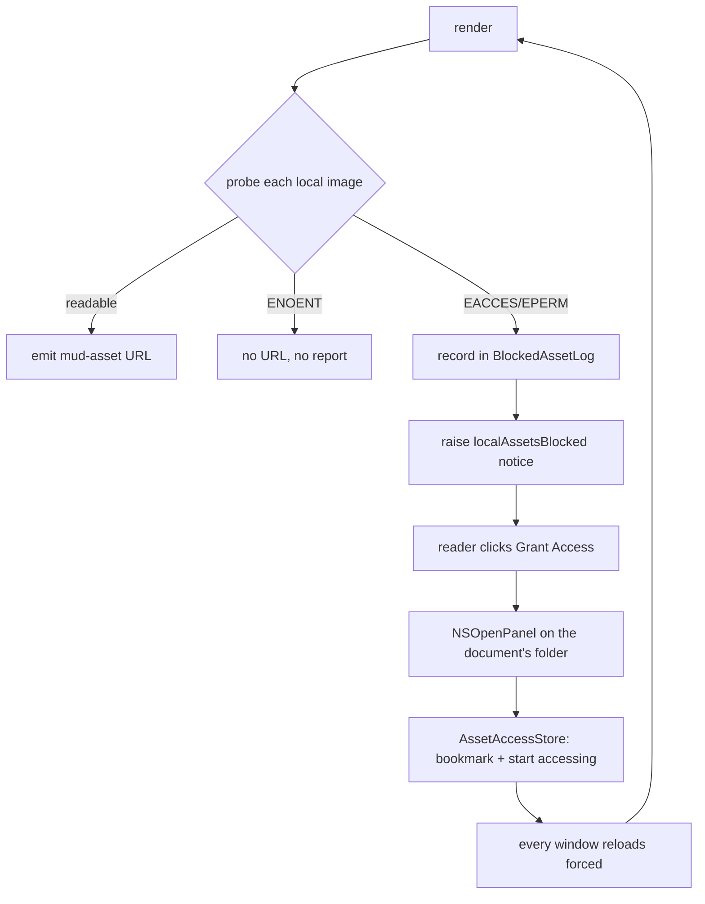

Plan: Local Content Access
===============================================================================

> Status: Planning

In the sandboxed (Mac App Store) build, opening a document grants Mud read
access to that file and nothing else. A document that references a local image
therefore renders with a broken image and no explanation. Opening the enclosing
_folder_ fixes it — the sandbox grants a folder's whole subtree — but nothing
in the app tells the reader that, and the grant lasts only until Mud quits.

This plan detects the failure, says so in the info bar, and offers a button
that asks for the folder and remembers it.


## What is true today

Three facts the design rests on.

**Powerbox grants subtrees.** When the reader picks a folder in an
`NSOpenPanel`, the sandbox extension covers every file below it. That is why
opening `Mud/` makes every image under `Mud/` readable for the rest of the
session.

**Mud stores no bookmarks.** `CommentController` says so in a comment at
`App/CommentController.swift:225`, and a search for `bookmarkData` finds
nothing. Every grant Mud holds came from a powerbox prompt in the current run
and dies with the process. The one accidental exception is Open Recent:
`NSDocumentController` keeps a security-scoped bookmark per recent document, so
reopening a folder from that menu restores its grant. Under
`FolderOpenBehavior.index` the folder is noted as recent; under `.tabs` only
the files inside it are, so there the grant can't be recovered at all.

**Mud can't currently tell "denied" from "missing".**
`DocumentModel.mudAssetResolver` (`App/DocumentModel.swift:262`) calls
`FileManager.default.fileExists` and returns nil on false, which leaves the
`` as a relative path that CSP then blocks. If the sandbox permits
`stat` on the path — which it generally does, denying only the content read —
`fileExists` returns true instead, the `mud-asset:` URL is emitted, and
`LocalFileSchemeHandler` fails its `Data(contentsOf:)` and returns 404
(`App/LocalFileSchemeHandler.swift:29`). Either way the reader sees a broken
image, and a notice built on the current check would also fire on a plain typo
in a filename.


## The probe

Replace the `fileExists` check with a three-way probe that goes through the
sandbox policy for certain: `open(path, O_RDONLY)`, then read `errno`.

- success → readable. Close the descriptor, emit the `mud-asset:` URL as today.
- `ENOENT` / `ENOTDIR` → the image isn't there. Return nil, as today. Nothing
  is reported: a misspelled filename is the author's problem, not a permissions
  problem.
- `EACCES` / `EPERM` → denied. Return nil, and record the path.

`open` is the right call rather than `access` or `stat`, because the sandbox
denies the content read specifically, and that is the operation the WebView
will eventually attempt. One syscall per image per render, which is the same
order of cost as the `stat` it replaces.

This makes detection synchronous and complete before the page ever loads, so
nothing has to be plumbed back out of `LocalFileSchemeHandler`. That handler
keeps its current shape; its 404 becomes a case that should no longer be
reachable for a denial.


## Reporting a denial out of the render

`mudAssetResolver` is a `nonisolated static` function passed as a bare closure,
with no way to report anything. Give the render a collector to write into:

- A small reference type — `BlockedAssetLog` — that holds the denied URLs and
  vends the resolver closure that records into it.
- `DocumentModel.render` makes one per render, passes `log.resolver` to
  `MudCore.renderUpModeDocumentWithFootnotes`, and reads `log.denied` after the
  call returns.

The other call site — `WebView.Coordinator`, rendering comment items at
`App/WebView.swift:568` — keeps the collector-free static resolver. The
document render already includes the comments section, so any image in a
comment body has been probed once already; a second report from the column
rebuild would be a duplicate.

Two consequences to handle:

**The raise must be deferred.** `display()` is called from
`DocumentContentView`'s body, so setting `@Published var notice` from inside
`render` would trip SwiftUI's "Publishing changes from within view updates."
Wrap the raise in `deferMutation` (`App/DeferMutation.swift`) — the case that
helper exists for.

**The render is cached.** `display(mode:options:)` returns a cached
`RenderedDisplay` when the content and content-affecting options are unchanged,
so the probe does not re-run on every view update. That is fine: the notice
persists on its own until something clears it, and the thing that clears it is
a fresh render that finds no denials.


## The notice

A new kind on `DocumentNotice`:

```swift
/// Local images this document references are in a folder Mud isn't
/// allowed to read. Sandboxed build only — see the plan's "Only under
/// sandboxing".
case localAssetsBlocked
```

At `.warning` level, dismissible, with the "Grant Access…" action. Because the
action opens a file panel with no intervening explanation, the bar's message
carries the whole reason:

> Mud doesn’t have your permission to access the images in this document.

Dismissible, because the reader may simply not care about the images and should
be able to get the bar out of the way; a later render that finds no denials
also clears it.

**Only under sandboxing.** Raise this only when `isSandboxed`. The probe itself
runs in both builds — it is a better test than `fileExists` either way — but in
the direct build a denial is an ordinary Unix permissions problem, and "grant
access to the folder" is not the remedy for it. The direct build keeps today's
silence.

**Collision with the read failures.** `DocumentState.notice` holds one notice
at a time and raising replaces it. A render only happens after a successful
read, so this can't stomp `openFailed`. It can replace a dismissible
`reloadFailed`, which is acceptable — that one is about a stale document, and
the reader has already been told.


## The grant

A new effect case on `DocumentNotice.Action`, carrying the folder the panel
should open at:

```swift
case grantFolderAccess(startingAt: URL)
```

The effect stays a value, so `DocumentNotice` keeps its synthesized
`Equatable`. `DocumentNoticeBar.perform` gains the case and presents the panel:

- `canChooseDirectories = true`, `canChooseFiles = false`, no multiple
  selection.
- `directoryURL` is the document's enclosing folder.
- `message` explains what the choice does: "Choose the folder that holds this
  document's images. Mud will be able to read every file inside it."
- `prompt` reads "Grant Access".
- Presented as a sheet on the document's window.

The document's enclosing folder is the starting point, not the blocked image's
folder, because a document usually references images below itself
(`images/diagram.png`). If some images live outside that folder and stay
blocked, the next render raises the notice again and the reader can grant a
second folder — the loop closes itself, and each grant is a folder the reader
chose rather than one Mud inferred.


## Remembering the grant

A new singleton, `AssetAccessStore`, an `ObservableObject`:

- **Storage.** Security-scoped bookmark blobs in `UserDefaults.standard` under
  a key of its own. Not in `MudPreferences`: a security-scoped bookmark is
  usable only by the app that created it, so mirroring it into the app-group
  suite would put a blob the Quick Look extension can't use into the
  extension's only channel.
- **Granting.** `url.bookmarkData(options: .withSecurityScope, …)`, then
  `startAccessingSecurityScopedResource()`, held for the process lifetime.
- **At launch.** `AppDelegate` asks the store to resolve every saved bookmark
  and start accessing each one. A bookmark that resolves stale is rewritten if
  the folder is still reachable, and dropped if it isn't.
- **De-duplication.** Keep the reduction pure and testable:
  `reduce(grants:adding:) -> [URL]`. Granting a folder already covered by an
  existing grant is a no-op; granting a parent of existing grants replaces
  them.


### Re-rendering after a grant

The store publishes a change when the grant set changes.
`DocumentWindowController` subscribes and calls `model.load(forced: true)`,
whose bumped `loadToken` changes the contentID so the page reloads and the
probe runs again. Every open window reloads, not just the one whose bar was
clicked — a grant can unblock a document in another window, and the reader
shouldn't have to guess that.




### Seeing and removing grants

A permanent list of folders the app can read, with no way to see or shorten it,
is not a good thing to accumulate silently. It belongs in the Up Mode settings
pane, beside the toggle that answers the same question about remote content:
both decide what a rendered document is allowed to load, and both matter only
in Up mode, because that is the only mode that renders an image.

Add a **Content permissions** section to `UpModeSettingsView`, below the
existing "Code blocks" section, holding two things:

- The **Allow remote content** toggle, moved down from its current place as the
  pane's first, unlabeled section.
- **Allow local content from:** — the granted folders, one row each, with a
  Remove button per row. Removing drops the bookmark and stops accessing the
  URL.

Show the folder list only when `isSandboxed`. The direct build holds no grants
because it needs none, so an always-empty list there would suggest a
restriction that doesn't exist. The section keeps its title with only the
remote toggle in it.

Give the list an Add button as well, opening the same panel the notice's button
does. Without one the section is somewhere a grant can only be taken away, and
a reader who knows where their images live should be able to say so before
meeting a broken one.

The list is the one part of the plan that could ship later without leaving
anything broken. Everything above works without it; it only means the reader
can't take a grant back. Moving the remote-content toggle is independent of
that and can land either way.


## Files

**New:**

- `App/LocalAssetProbe.swift` — the three-way `open`/`errno` probe and its
  result enum.
- `App/BlockedAssetLog.swift` — per-render collector; vends the resolver
  closure. (Could live beside the probe if both stay small.)
- `App/AssetAccessStore.swift` — bookmark storage, resolution at launch,
  granting, the pure `reduce` de-duplication.
- `App/Tests/LocalAssetProbeTests.swift`
- `App/Tests/AssetAccessStoreTests.swift`

**Changed:**

- `App/DocumentModel.swift` — `mudAssetResolver` uses the probe; `render`
  creates a log and raises/clears the notice through `deferMutation`.
- `App/DocumentNotice.swift` — the `localAssetsBlocked` kind, the notice
  itself, the `grantFolderAccess` effect case.
- `App/DocumentNoticeBar.swift` — performs the new effect.
- `App/DocumentWindowController.swift` — subscribes to the store, forces a
  reload on a grant.
- `App/AppDelegate.swift` — resolves saved bookmarks at launch.
- `App/Settings/UpModeSettingsView.swift` — the new "Content permissions"
  section: the granted-folders list, and the "Allow remote content" toggle
  moved into it.
- `Doc/AGENTS.md` — the new key files, and a paragraph under "Sandbox-aware
  features".


## Tests

- **The probe** — against real temp files: a readable one, a missing one, and
  one at mode `000` for the denied case. Note that the denied case does not
  hold when the suite runs as root; the test should be written to skip rather
  than fail there.
- **`AssetAccessStore.reduce`** — the de-duplication truth table as a pure
  function: adding a covered folder, adding a parent, adding an unrelated
  folder.
- **`DocumentNoticeTests`** — the new notice's level, dismissibility, and the
  folder its action carries.

The probe and store tests can run in the existing `Mud Tests` bundle. Ask
before running — the bundle is hosted in Mud.app and needs Xcode.


## Out of scope

- **Print and Save as PDF need nothing.** They print the live page —
  `WebView.swift:390` runs `webView.printOperation(with: .shared)` on the
  window's own `WKWebView`. The images are already in the page, fetched over
  `mud-asset:` when it loaded, so there is no second read to deny. What is on
  screen is what prints, before a grant and after it.
- **Open In Browser and the Open In HTML handoff** do re-read: they go through
  `DocumentExporter` → `MudCore.exportDocument` → `ImageDataURI.encode`, which
  reads each image's bytes fresh. Those reads succeed while a grant is held, so
  a granted document exports correctly. But both are unreachable in the
  sandboxed build anyway — Open In Browser is hidden (`MudApp.swift:87`,
  `WebView.swift:16`) and the editor handoff forces `.markdown`
  (`OpenInEditor.swift:94`), because a temp file inside our container isn't
  readable by the receiving app.
- **Quick Look** is the one real gap, and this plan can't close it. It renders
  through `MudCore.exportDocument` and so through `ImageDataURI`, in a separate
  extension process that can't use the app's sandbox extensions or its
  bookmarks. The MAS variant carries no read exception at all
  (`QuickLook.entitlements` versus `QuickLookDirect.entitlements`), so a
  preview there drops local images with no way for the reader to grant
  anything. Worth a plan of its own.
- **Restoring grants from Open Recent.** Under `.tabs` a folder open notes only
  the files as recent, so the folder's grant is unrecoverable after a quit.
  With bookmarks stored this stops mattering, so nothing is proposed here.


## Open questions

1. Should `MudPreferences.reset()` clear the stored grants? They live outside
   `MudPreferences`, so today's reset wouldn't touch them — which may be right
   (a grant is closer to a system permission than a preference) or may be
   surprising.
2. Does the notice deserve a `#if DEBUG` tester in the Debugging pane, like the
   level samples? Its action opens a real panel, so a sample would either grant
   real access or need an effect case that exists only for testing.
