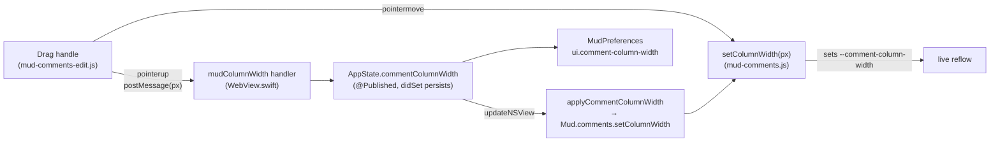

Plan: Resizable Comments Column
===============================================================================

> Status: Complete

The reader can drag the Comments Column wider or narrower. The content width
(the capsule / header / compose width) ranges from 200px to 400px, with a fixed
24px of margin (12px each side) on top, so the reserved gutter ranges from
224px to 424px. The default is unchanged: 300px content, 324px gutter.

## What shipped

### The width is one CSS variable

`mud-comments.css` defines `--comment-column-width` (the inner content width,
default 300px) and `--comment-column-gutter` (`calc(content + 24px)`). The
capsule, header, and compose box read the content width; the body's reserved
`padding-right`, the column container's width, and the Readable Column
centering math read the gutter. The 12px side margins stay literal — only the
content width varies. Nothing else hardcodes the old 300 / 324 / 1124 numbers.

The layout solver (`solve` / `project`) never reads the width — it measures
rendered heights — so changing the variable only needs a reflow, which the
existing `scheduleLayout` (a `ResizeObserver` plus the window `resize`
listener) already provides.

### The drag handle

A thin full-height strip sits on the gutter's inner edge — the divider between
the document and the column — with a bare `col-resize` cursor and no grip mark.
It is built in the write-side files (`mud-comments-edit.js` /
`mud-comments-edit.css`), which load in the app only, so a read-only export
keeps the fixed column with no handle.

Dragging left widens the column, right narrows it. Each pointer move sets
`--comment-column-width` through one read-side helper that clamps to 200–400
and reflows; on release the applied width is posted to Swift to persist. While
dragging, the capsule transitions are dropped and text selection is suppressed
so the column tracks the pointer without lag, and a `mousedown` guard keeps the
grab from collapsing an open comment.

### Persistence rides the same path as zoom

The width is one app-global preference. The flow:

The Swift→JS push mirrors `applyZoom`: `WebView` reapplies the saved width on
every load (`didFinish`) and on change (the no-reload path). The JS→Swift post
mirrors `mudCommentSubmit`: a new `mudColumnWidth` message handler hands the
released width to `AppState.commentColumnWidth`, whose `didSet` persists it and
republishes it to every open window. The page never reloads on a resize, and
the width stays out of `RenderOptions` and `contentID`.

### Wide-window alignment in Readable Column

In Readable Column on a wide window, the column rides off the article's right
edge (the article is capped at 800px and centered), not the window's right
edge. The fixed header and the handle were anchored to the window edge, so they
sat to the right of the capsules. Both now reuse the column's own Readable
Column `left` expression — the header's left edge lands on the capsules (column
left + 12px), the handle centers on the column's left edge (the divider).
Because all three share one expression, they stay aligned at any window width
and any dragged width. This also corrects a pre-existing header misalignment
that predated this feature, including in exports (the header override lives in
the read-side stylesheet).

## What this did not touch

- **The layout solver** (`solve` / `project`) — width-agnostic; only the
  existing reflow is triggered.
- **`RenderOptions` / `contentID` / the render pipeline** — the width is a live
  CSS-variable push, like zoom. No reload, no new render option, no Quick Look
  snapshot change.
- **Change tracking, the bottom Comments section, print** — print already hides
  the column and shows the bottom section; the variable only affects the
  on-screen `@media screen` gutter.

## Decisions

- **Handle discoverability** — a bare `col-resize` cursor on hover, no grip
  mark.
- **First-paint width** — applied via JS on `didFinish`, so a saved non-default
  width can show one frame at the 300px default before snapping. Accepted as
  shipped; if it ever reads as a flash, the width can instead be emitted into
  the document at render time, at the cost of pulling it into the template and
  `RenderOptions`.
