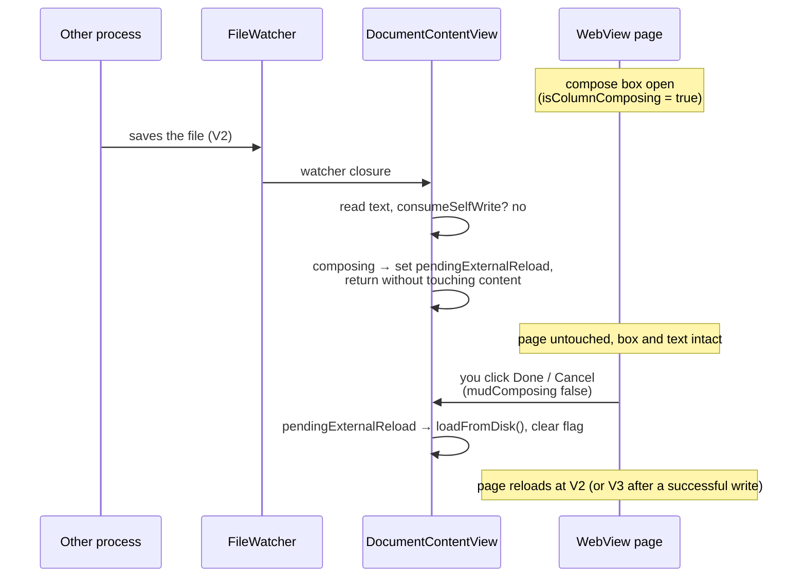

Plan: Save While Commenting
===============================================================================

> Status: Complete

When you are writing a comment and another process (a coding agent, an editor,
a `git checkout`) saves the same `.md` file, your compose box used to vanish
and your typed text was lost. Now the document is held while you compose, and a
placement that can't land keeps your text instead of dropping it.

## The problem

The compose box and its draft anchor live entirely in the WebView page. The
`<textarea>` is the `composeNew` element in `mud-comments-edit.js`; the draft
(quotation, locator, position) is a JS variable on that page. Nothing about
either is mirrored on the native side except one boolean, `isColumnComposing`.

A reload destroys the page, and it fires whenever the file changes on disk:
`FileWatcher` → `loadFromDisk()` sets `content` → `displayContentID` changes →
`WebView.updateNSView` calls `loadHTMLString`, tearing down the textarea, the
typed text, and the draft. The comment-invariant `contentID` (it hashes
`removeComments(markdown)`) only spares _comment_ edits; a prose edit elsewhere
is a real content change, so it reloads — correct in general, fatal during
compose.

Two failures hid here:

1. **Lost work.** The reload throws away the box and everything typed in it.
2. **A stale anchor at submit.** The draft's locator (`blockText` +
   `offsetInBlock` + `occurrence`) is read from the DOM you were looking at —
   V1 — but the write re-reads disk (V2) and re-anchors by content match. That
   match is resilient when the other process edits a _different_ part of the
   file. It fails only when the other process rewrote the **exact block you
   quoted** (`CommentAnchor.insertionOffset` returns nil), where the note used
   to be silently dropped.

(`occurrence` drift — an identical-text block added or removed before yours,
shifting the match — stays out of scope; see [below](#out-of-scope).)

## What was built

### Hold the document while composing

While a compose box is open, the document is held: external saves are
remembered, not applied, and the held change lands when you finish (submit or
cancel). The page and your text stay alive, and the anchor stays consistent
with what you see — the DOM stays at V1 while you type, so the locator stays
valid; at submit the content-match re-finds your block in V2.

The file-watcher reads the new bytes through a pure `readDisk()` (no state
mutation) and, while composing, sets `pendingExternalReload` and returns
without touching `content`. It holds _every_ change, our own comment echo
included — otherwise a held external edit and the new comment landing in one
write would change the prose, reload the page, and strand the box. When the box
closes, one `loadFromDisk()` applies whatever is on disk by then.

### Keeping your text when placement fails

If the other process rewrote the block you quoted, the marker can't be placed.
The submit path waits for a native acknowledgement instead of closing the box
optimistically: `submit` carries a resolver, native sends
`composeResolution(success:)`, and the page either closes the box (success) or
re-enables it — text intact, an inline note, Cancel relabeled **Reload**.
Native also shows an alert offering to copy the note to the clipboard. Reply
and edit take the same path.

### The file-changed banner

The hold is otherwise invisible: you keep seeing V1 with no sign the file
moved. A fixed, semi-opaque dark bar with white text across the top of
`.up-mode-output` — "The file has changed. Your view refreshes when you finish
this comment." — closes that gap. It's informational (`pointer-events: none`)
and driven from the published `externalChangeHeld` flag, pushed to the page the
no-reload way the comment data is. Only a genuine external edit raises it (not
our own comment echo), and it clears when the box closes.

## Edge cases

- **Several external writes during one compose.** Each just re-sets
  `pendingExternalReload`; one `loadFromDisk()` at the end reads the latest
  disk.
- **Down mode.** Comment compose is Up-mode only, so the hold never applies
  there.
- **Write error vs. anchor failure.** Both surface as a failed resolve; the
  text is preserved either way.

## Out of scope

- **`occurrence` drift.** An identical-text block added or removed before yours
  can land the marker in the wrong copy. Fixing it needs a stronger locator
  (e.g. a few words of surrounding context) — a separate change.
- **A live in-place patch of external prose edits** (re-rendering without a
  reload, the way comment edits already patch in place) is a much larger change
  against the single-WebView-swap design.

## Verifying

Compose a comment, then from a terminal append a line elsewhere in the file:
the box and text stay, no reload, the banner appears; Done lands the marker and
the view refreshes. Rewrite the exact quoted paragraph before Done instead: an
alert, the box stays with your text, Reload shows the new file. Reply and edit
behave the same.
