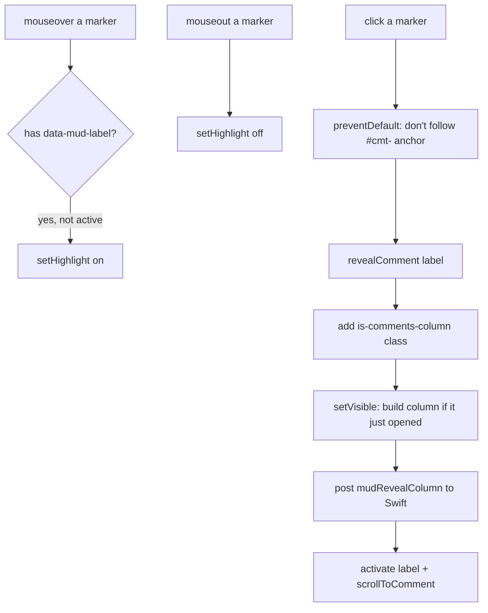

Plan: Show Comment Markers
===============================================================================

> Status: Complete

A Comments setting that makes the inline `💬` markers visible in the live app,
with hover and click behavior:

- **Hovering** a marker highlights its quotation (if the comment has one).
- **Clicking** a marker in Up mode reveals the Comments column, scrolls to the
  comment, and expands it.

Default off, so the prior behavior (markers hidden on screen; the column and
hover-highlights stand in for them) is unchanged. The marker glyph also changed
from the `⋯` ellipsis to a `💬` speech balloon, so it reads as a comment
everywhere it shows (this setting, exports, and print).

## Background

In the live app the render is always in column mode
(`<html class="comments-column">`). In that mode the inline markers are
visually hidden — a `@media screen` rule clips each `.mud-comment-marker` to a
1px box so it stays in the accessibility tree and keeps a measurable position
for the column's placement pass, but shows nothing on screen. The column
capsules and the hover-revealed quotation highlights stand in for the markers.

The highlight marks (`<mark class="mud-comment-highlight">`) that the hover
reveals are wrapped by `mud-comments.js` in `anchorAll()`, which previously ran
**only** when the column was open (`enabled()` requires both `comments-column`
and `is-comments-column`). So with the column closed there were no marks to
light up.

The column's visibility is per-window Swift state
(`DocumentState.commentsColumnVisible`), pushed to the page as the
`is-comments-column` html class. JavaScript can add that class itself (the Add
Comment path already does), but unless Swift's state agrees, the next class
sync tears the column back down. So a JS-initiated reveal must tell Swift to
persist the toggle.

## The setting

- Preference key `comments-show-markers` (Bool, default `false`), alongside the
  other comment preferences in `MudPreferences`.
- An `AppState.commentsShowMarkers` published property, wired the same way as
  `commentReturnSaves` (init from config, `didSet` writes the preference,
  `reloadPreference` re-reads it).
- A toggle in `CommentsSettingsView`: "Show comment markers", with a one-line
  description.
- It does **not** go in `MudPreferencesSnapshot` — like `commentReturnSaves`
  and `commentsIncludeInExport`, it's an app-only live preference and does not
  feed the Quick Look render.

The preference flows to the page as an html class, exactly like
`comment-return-saves`:

- `DocumentContentView.renderOptions` inserts `show-comment-markers` into
  `htmlClasses` when the preference is on (initial render).
- `WebView.applyBodyClasses` adds `show-comment-markers` to its fixed list of
  toggle-style classes, so flipping the preference re-pushes the class with no
  reload.

## Showing the markers (CSS)

The `@media screen` rule that clips each marker to a 1px box now carries a
`:not(.show-comment-markers)` qualifier on the `.comments-column` ancestor.
With the preference on, the rule no longer matches and each marker falls back
to its base `.mud-comment-marker` styling (the visible chip). Print is
unaffected — the clip rule was already `@media screen`.

## Hover and click (mud-comments.js)

Both behaviors attach once, delegated off `container` (the `.up-mode-output`),
so they cover markers from the initial server render and from live edits alike.

`revealComment(label)` adds `is-comments-column` to the html element, calls
`syncVisible()` (which builds the column on an off→on flip and is a no-op when
it was already on, so an open compose box survives), posts `mudRevealColumn` to
Swift so the per-window toggle is persisted, then `activate(label)` (expands
the capsule, highlights the quotation, lays out) and `scrollToComment(label)`.
The native post is guarded on the message handler existing, so a read-only
export (no handler, column already open) just activates and scrolls.

## Highlights with the column closed

So that hovering a marker highlights the quotation even when the column is
closed, highlight anchoring is decoupled from column visibility.

- A small `markersShown()` helper reads the `show-comment-markers` class.
- `project()` gained a branch: when the column is **not** enabled, it tears
  down the column capsules as before, but if `markersShown()` it still
  populates `quotationByLabel` from the bottom section and runs `anchorAll()`
  (instead of `clearHighlights()`). The marks are transparent until hovered, so
  they're harmless with the column closed.
- The initial-load call and a new `setMarkersShown()` entry route through
  `project()` for the column-closed case; when the column is already open,
  `setMarkersShown()` is a no-op (the marks are already anchored and marker
  visibility is pure CSS — no reproject, so no wiping a compose box).
- `mud.js` `setClass` calls `Mud.comments.setMarkersShown(on)` when the
  `show-comment-markers` class toggles, mirroring the existing
  `is-comments-column` branch.

The former `teardown()` (which both removed the column and cleared highlights)
split into a column-only `teardownColumn()` plus the conditional highlight
handling above.

## Revealing the column from JS (Swift side)

A new `mudRevealColumn` message handler, parallel to `mudColumnWidth` /
`mudComposing`:

- `WebView.makeNSView` registers the `mudRevealColumn` handler.
- `WebView` gained an `onRevealColumn: (() -> Void)?`; the coordinator routes
  the message to it.
- `DocumentContentView` wires `onRevealColumn` to set
  `state.commentsColumnVisible = true`.

Setting that state re-pushes `is-comments-column` (already on), so
`syncVisible()` sees no change and does not reproject; the activation done in
JS survives. The toolbar's column button and the floating bars pick up the new
visibility through the existing `$commentsColumnVisible` sink.

## Files touched

- `Preferences/Sources/MudPreferences.swift` — key + accessor.
- `App/AppState.swift` — published property, init, `reloadPreference`.
- `App/Settings/CommentsSettingsView.swift` — the toggle.
- `App/DocumentContentView.swift` — insert the class; wire `onRevealColumn`.
- `App/WebView.swift` — register handler, add `onRevealColumn`, route it.
- `Core/Sources/Resources/mud-comments.css` — scope the hide rule.
- `Core/Sources/Resources/mud-comments.js` — marker hover/click, reveal,
  decoupled anchoring, `setMarkersShown`.
- `Core/Sources/Resources/mud.js` — `setClass` branch for the new class.
- `Doc/AGENTS.md` — record the new preference.
- The marker glyph swap (`⋯` → `💬`) touched `FootnoteProcessor`,
  `CommentAnchor`, `CommentController`, `DocumentState`, the comments CSS/JS,
  and `CommentClassificationTests`.

</content>
