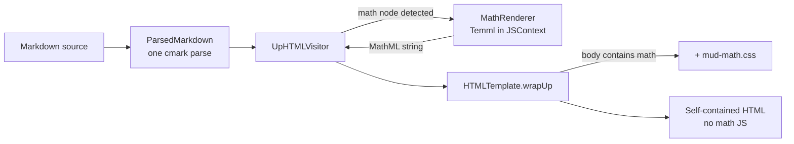

Plan: GFM Math Support
===============================================================================

> Status: Complete

GitHub issue #8 asks for "the MathJax feature of GFM": math expressions written
in TeX, as
[documented by GitHub](https://docs.github.com/en/get-started/writing-on-github/working-with-advanced-formatting/writing-mathematical-expressions).
The request is really about the _syntax_ — MathJax is just the renderer GitHub
uses, and it is heavy: over a megabyte of JavaScript plus fonts, typeset
asynchronously on every page load. Inlining that into every export contradicts
Mud's self-contained, lightweight export story, and the async typeset pass
would flicker on every auto-reload.

We support the syntax without MathJax. Mud converts TeX to MathML at render
time in Swift, using [Temml](https://temml.org/) running in JavaScriptCore —
the same pattern `CodeHighlighter` already used for highlight.js. WebKit
renders MathML natively (best of the three engines), so the output needs no
JavaScript anywhere: not in the app, not in exports, not in Quick Look.


## Why Temml

Temml is a fork of KaTeX by one of its maintainers. It keeps the TeX parser and
macro expander, deletes the HTML/CSS rendering machinery, and emits only MathML
Core. Its TeX coverage matches MathJax and slightly exceeds KaTeX.

| Approach                 | App bundle    | Every export        | Behavior           |
| ------------------------ | ------------- | ------------------- | ------------------ |
| MathJax (client-side)    | ~1 MB + fonts | same, or CDN        | async typeset pass |
| KaTeX (even server-side) | ~280 KB       | ~120 KB CSS + fonts | static, bloated    |
| Temml (server-side, JSC) | ~150 KB       | a few KB of CSS     | static MathML      |

The costs, as built:

- **App bundle**: one `temml.min.js` resource, 164 KB — comparable to
  `highlight.min.js`. Never shipped in exports.
- **Exports**: the MathML markup itself plus `mud-math.css` (9.5 KB), included
  only when the document contains math. Documents without math are
  byte-identical to the old output.
- **Rendering quality**: WebKit and Firefox render MathML very well. Chromium
  is the weakest for edge cases (stretchy operators, some spacing) and prefers
  a bundled math font — so "Open In Browser" output in Chrome may look slightly
  less polished than MathJax for exotic constructs. For README-grade math it is
  indistinguishable. We accepted this trade rather than ship a megabyte per
  export. If it ever matters, bundling the Latin Modern font (~380 KB) into
  exports is a follow-up, not a rewrite.


## Scope

GitHub accepts four delimiter forms. They differ sharply in parsing risk,
because cmark-gfm has no math extension and has already inline-parsed the text
by the time our visitor sees it (`$$a_1 + b_1$$` has its underscores turned
into emphasis nodes).

**In scope — the three unambiguous forms, all shipped:**

1. ```` ```math ```` **fenced block** — already a code block with fence info
   `math`. Detected in `visitCodeBlock`; zero parser changes.
2. **`$$…$$` display paragraph** — a paragraph whose _raw source slice_ starts
   and ends with `$$`. We recover the literal source through the node's
   `byteRange` (the range APIs on `CMarkNode`), so cmark's inline parsing of
   the interior never matters.
3. **`` $`…`$ `` inline** — GitHub's explicit inline form. Parses as a text
   node ending in `$`, an inline-code node, and a text node starting with `$`.
   Detected in the visitor by sibling peeks; unambiguous because the backticks
   protect the interior from inline parsing.

**Out of scope — bare `$…$` inline.** Two problems: currency false positives
(`$5 and $10`), and interior mangling (the emphasis problem above) which the
code-span form doesn't have. GitHub itself mis-parses this form regularly, and
its docs recommend the `` $` `` form to avoid the ambiguity. Supporting it
means reconstructing inline runs from source ranges while keeping the word-diff
span emitter aligned — a separate design. If we add it later, it gets its own
plan and probably a Settings toggle; the three forms above are safe enough to
be always-on with no preference.

> [!NOTE]
> **All three forms survive the house formatter.** `odmarkdown` (the Ruby gem
> we run on every Markdown file) leaves math intact:
>
> - Inline `` $`…`$ `` is preserved — the `$` stays attached to its code span
>   and the span is never split across a line wrap. (This needed a formatter
>   fix: `odmarkdown` commit "keep inline code spans attached to adjacent
>   text"; earlier versions inserted a space, turning `` $`x`$ `` into
>   `` $ `x`$ ``. Authoring math files depends on that fix being in the
>   installed gem.)
> - ```` ```math ```` fences are left untouched.
> - A standalone `$$…$$` paragraph collapses to one line, but keeps its
>   delimiters and does **not** escape interior underscores (`a_1` stays `a_1`)
>   — so the `$$` display path and its key subscript test both survive
>   formatting.


## Rendering pipeline change



As predicted: no new `RenderOptions` field, no `ContentIdentity` change, no CSP
change (MathML is markup, not script), no new `RenderExtension` (there is no
runtime JS to inject — only a conditional stylesheet, handled in `wrapUp` like
the other conditional styles).


## What shipped

### 1. Temml vendored

`temml.min.js` (v0.13.3, MIT) sits in `Core/Sources/Resources/` alongside
`highlight.min.js`. It evaluates in a bare `JSContext` with no `document` stub
— the browser build was usable as-is, so the fallback plans (a CJS build, our
own IIFE) were never needed.


### 2. `MathRenderer` in MudCore

`Core/Sources/Rendering/MathRenderer.swift`, structurally a copy of
`CodeHighlighter`: one lazily created `JSContext` behind an
`OSAllocatedUnfairLock`. `render(_ tex: String, displayMode: Bool) -> String?`
calls `temml.renderToString`.

The two renderers had the same context-creation and library-load code, so it
was pulled out into `Rendering/BundledJSContext.swift` — both now hold their
context as one `BundledJSContext.load(resource:)` call.

Invalid TeX uses Temml's `throwOnError: false`, which emits the literal source
inside a `<span class="temml-error">` — the same reader experience as GitHub.
(It is that span, not an `<merror>` element; the CSS trigger and the
comment-anchor skip rules both account for it.) A JSC-level failure returns nil
and the caller falls back to plain rendering — a code block stays a code block,
an inline span stays a code span — so a Temml bug can never lose document
content.


### 3. Visitor detection (`UpHTMLVisitor`)

- `visitCodeBlock`: fence info `math` → `emitMathBlock`, which wraps the MathML
  in a `<div class="mud-math-block">` carrying the block's change attributes.
- `visitParagraph`: `displayMathInterior(of:)` reads the paragraph's raw bytes
  and returns the interior when the text is exactly `$$…$$`. Two wrinkles the
  plan didn't anticipate: a multi-line `$$` paragraph inside a blockquote
  captures the `> ` continuation markers in its byte range (cmark's sourcepos
  has no per-line columns), so they are stripped before reading the TeX; and
  `\$` is honored as GitHub's opt-out, so an escaped delimiter isn't a
  delimiter. The test also skips the String decode when the raw bytes hold no
  `$` at all — every paragraph in every document takes this test.
- Inline `` $`…`$ ``: `isInlineMath` identifies a code span bounded by `$` on
  both sides; `visitText` drops the bounding `$` from the neighboring text
  nodes so they don't render as literal dollar signs.
- The footnote popover and the deleted-block renderer reuse this visitor, so
  math inside footnotes and inside change-tracking deletions works with no
  extra code.


### 4. Change-tracking interaction

Math-bearing blocks skip word-level diff spans, because the span emitter
advances through the visitor's character stream in step with
`WordDiff.inlineText` and a MathML substitution would desynchronize it. The
block still gets its whole-block change annotation, like a code block does.

Three pieces make that hold everywhere:

- `containsInlineMath` searches inlines at any depth, so a heading, list item,
  link, or DocC aside with math nested inside emphasis skips word spans too —
  not just paragraphs.
- `ChangePlan` adds `math` to the list of fence languages that never code-block
  pair (mermaid was already there). An edited ```` ```math ```` block stays a
  whole-block deletion plus insertion, so the annotation the sidebar lists is
  one the visitor actually emits.
- `DeletionRenderer` renders deleted math as MathML for the overlay — both
  fence and `$$` forms — instead of routing it through the word-span paths.

Fingerprinting needed nothing: math is ordinary text in the source, so
`BlockMatcher` and `ChangePlan` already treat math edits as block edits.


### 5. Stylesheet

`mud-math.css` (9.5 KB): display-block layout plus the per-engine spacing and
accent rules adapted from `Temml-Local.css`, which relies on locally installed
math fonts — macOS ships STIX Two Math. It also reframes Temml's hard-coded red
error span as a themed error chip.

`wrapUp` appends it only when the body contains math. The trigger is wider than
the plan's `<math`: it also matches a `mud-math-block` div (present even when
the renderer is unavailable and the block falls back to escaped TeX) and a
`temml-error` span (invalid TeX produces no `<math>` element at all). Print
rules went to `mud-print.css` per convention.


### 6. Comment anchoring

A selection inside math isn't commentable — the rendered MathML text bears no
resemblance to the TeX source, so a quotation anchored there would never match.
`mud-comment-anchor.js` skips a `<math>` element, a `.mud-math-block`, and a
`.temml-error` span. (It tests `localName`, not `tagName`: a MathML element is
foreign-namespace, so its tag name stays lowercase and comparing against `MATH`
would never match.)

The Swift side needed more than the expected one-line mirror. Because the
rendered DOM omits both the MathML subtree _and_ the bounding `$` delimiters,
an inline-math span is zero-width when `CommentAnchor` walks the raw footnote
AST — so it grew `isInlineMathCode`, the twin of `UpHTMLVisitor.isInlineMath`,
and treats the span and its delimiters as contributing no rendered text. The
two predicates must agree: whatever the visitor renders as math, the anchor
must count as zero-width. `CommentAnchorParityTests` covers a paragraph with
inline math at the start, in the middle, and at the end.


### 7. Docs and examples

- `Doc/Guides/primer.md` lists the three supported forms and warns that a bare
  `$…$` is not math.
- `Doc/Examples/math-expressions.md` — a showcase that doubles as a render
  fixture: a fenced-block gallery (Gaussian integral, Basel sum, matrix
  product, `cases`, `aligned`), a `$$` display section including the
  subscript-survival case, an inline section, a "what is not math" section
  (currency and bare `$…$` stay literal), math in a footnote, and a
  deliberately malformed block. It round-trips through the fixed `odmarkdown`
  unchanged. Linked from `Doc/HUMANS.md`.
- `Doc/AGENTS.md`: file quick reference (`MathRenderer.swift`,
  `BundledJSContext.swift`, `mud-math.css`, `temml.min.js`) and a math
  paragraph in the rendering-pipeline section.


### 8. Tests

`MathRendererTests` covers the renderer itself: inline and display mode, the
subscript case, and invalid TeX producing error markup rather than nil.

`MathRenderingTests` covers the pipeline: each of the three forms;
`$$a_1+a_2$$` surviving with the underscore intact; a blockquoted multi-line
`$$` paragraph; prices in prose and a bare `$…$` pair staying literal; `\$` not
acting as a delimiter; math in a footnote body; an edited heading, an
emphasis-nested span, and an edited fenced math block all taking whole-block
annotations; a deleted `$$` paragraph rendering as MathML; and the stylesheet
present only when the document has math (invalid TeX included).

One test guards Down mode: a ```` ```math ```` block still renders as plain
fenced source, unchanged by any of this.


## Open questions

- **Size of the trimmed math CSS** — answered: 9.5 KB, added only to
  math-bearing documents.

- **Chromium rendering without a bundled font** — still unverified. Nobody has
  eyeballed an Open In Browser export in Chrome. This is an accepted risk, not
  a blocker: WebKit is what the app, Quick Look, and Safari exports use, and
  the fix if it ever matters is bundling Latin Modern (~380 KB) into exports.

- **mhchem / chemistry extension** — not planned; note it in the primer if
  anyone asks.


## Follow-ups

- Add a math entry to `Doc/RELEASES.md` when the next version ships (v3.1.0 was
  the last release; math is unreleased).
- The workspace-level markdown rules file
  (`~/.claude/rules/code-style-markdown.md`) lists the Mud dialect features for
  agents but doesn't mention math either way. It should describe the three
  supported forms, as the primer does.

```

```
