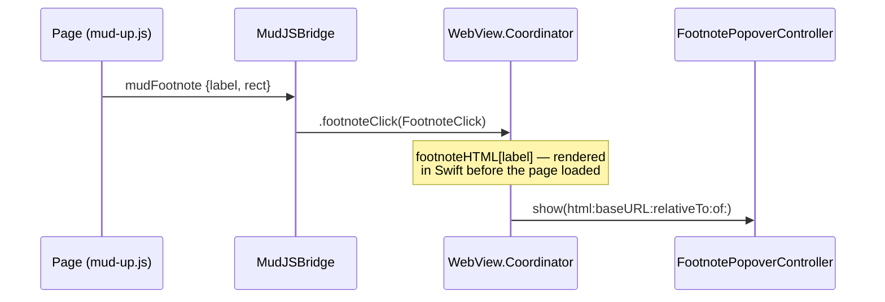
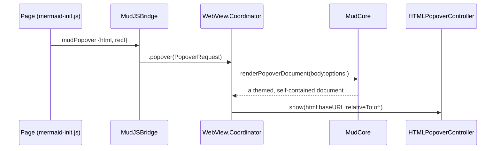

Plan: HTML Popover Bridge
===============================================================================

> Status: Complete

## Context

A Mermaid diagram that won't parse shows the code block as the author wrote it
(see the Invalid diagram section of `Doc/Examples/mermaid-diagrams.md`). Before
this change the parser's message sat below the block in red. The message is
useful but long — a syntax error runs to three or four lines, most of it a list
of expected tokens — and it stayed in the document permanently, pushing the
following text down.

Better: a red **INVALID** badge in the corner of the block, and the message in
a popover when the reader clicks it.

Mud already showed two kinds of popover, both `NSPopover` hosting a small
`WKWebView`:

- a footnote body, from `FootnotePopoverController`
- a comment thread, in the Comments column's editor

`FootnotePopoverController` was footnote-specific in its name and nothing else.
Its whole interface is `show(html:baseURL:relativeTo:of:onOpenURL:)`, and it
already handled transient behavior, dismiss-on-scroll, height measurement, and
link routing. A diagram error is the third caller, which is the point at which
generalizing pays.

## What was specific

The trigger, not the popover.

The page names a footnote; Swift owns the content. That works because Swift
renders every footnote body up front (`renderUpModeDocumentWithFootnotes`) and
keeps them in `WebView.Coordinator.footnoteHTML`, keyed by label. That path is
unchanged — see "Not doing" below.

A diagram error can't work that way. Its text doesn't exist until Mermaid
fails, in the page, during the render. Swift has no way to produce it ahead of
time and no key to look it up by. So the page has to send the content.

## The design

The page sends a **body fragment**; Swift wraps it into a document and shows
it.

Swift wraps rather than the page sending a whole document, for two reasons. The
popover has to match the window it opened from — theme, lighting, zoom — and
those live in `RenderOptions`, which the page has no full copy of. And the two
calls that do the wrapping, `RenderOptions.forPopover()` and
`HTMLTemplate.wrapUp`, are both internal to MudCore, so the App target can't
assemble the document itself even if it wanted to.

## The pieces

### Core: one more popover-document producer

`MudCore` already has two functions that turn something into a self-contained
themed document for a popover WebView: `renderUpModeDocumentWithFootnotes` and
`renderCommentThreadDocument`. A third, general one —
`renderPopoverDocument(body:options:)` — takes the caller's body HTML, applies
`options.forPopover()`, clears the waypoint and title, adds the
`footnote-popover` class for the same trimmed padding the other two use, and
wraps it with `HTMLTemplate.wrapUp`. `renderCommentThreadDocument` already did
exactly this around its own body, so the new function is that recipe with the
body supplied by the caller.

The body arrives as HTML, not Markdown. A caller that wants Markdown rendered
already has `renderUpToHTML`.

One thing this took that the plan hadn't foreseen. `wrapUp` includes
`mud-diagram.css` only for a document that holds a Mermaid block, and the error
popover holds the message alone — so without a change it would have arrived
unstyled. It now also matches on `mud-diagram-error`, the way the math branch
already matched on `temml-error`. The Handwritten look's 100 KB label font
stays keyed to the real block, since the popover letters no labels.

### App: a new inbound message

`MudJSBridge` gained one handler and one case:

- `Handler.popover = "mudPopover"`
- `case popover(PopoverRequest)`, where `PopoverRequest` holds `html: String`
  and `rect: PopoverRect`

`FootnoteClick.Rect` became a shared `PopoverRect`, used by both
`FootnoteClick` and `PopoverRequest`.
`WebView.Coordinator.anchorRect(from:in:)` takes the shared type and is
otherwise unchanged.

Registration needed no edit: `WebView` already registers
`MudJSBridge.Handler.allCases`.

### App: rename the popover controller

`App/FootnotePopover.swift` became `App/HTMLPopover.swift`, and
`FootnotePopoverController` became `HTMLPopoverController`. No behavior change
— the rename was the work, plus a doc comment that stops saying "footnote". The
Coordinator keeps one instance and both callers use it, so two popovers can
never be open at once. `App/` is not a file-system-synchronized group, so the
rename also touched four lines of `Mud.xcodeproj/project.pbxproj`.

### App: route the message

`WebView.Coordinator` routes `.popover` to a new `presentPopover`, which builds
the document through the new Core call with the window's current
`renderOptions`, converts the rect, and shows the controller with the same
`openURL` closure `presentFootnote` passes. The coordinator had no
`RenderOptions` — it kept `theme` and applied zoom without keeping it — so
`WebView` gained a `renderOptions` property, mirrored across in `updateNSView`
beside the other coordinator fields.

### Resources: a shared way to ask

`mud.js` gained `Mud.popover.show(rect, html)`, which posts `mudPopover` and
returns `false` when `window.webkit.messageHandlers.mudPopover` is absent. The
footnote click handler in `mud-up.js` already checks for its handler this way
and falls through to the plain anchor jump when it isn't there; the new helper
makes that check reusable rather than inventing a second convention.

### Resources: the badge

`mermaid-init.js` puts the badge in the code block instead of the red paragraph
under it. `pre.mud-code` is already `position: relative` (for the copy button),
so the badge is positioned against it, bottom right.

On click:

1. Try `Mud.popover.show(rect, message)`.
2. If that returns `false`, toggle a hidden `.mud-diagram-error` block below
   the code — the paragraph that was there before, hidden until asked for.

`mud-diagram.css` gained the badge (white on the alert red, a capsule in
uppercase monospace) and the hidden-by-default state of the message block. The
message rule itself is unscoped and carries no margin, because it is also the
whole body of the popover; only the in-document copy takes the gap under the
block.

Two smaller things the plan didn't cover. `reset` has to take the badge off
with the block it sits in — a lighting change resets and redraws every
container, so without that a document accumulates one badge per change. And
paper needs a rule of its own: nothing there can be clicked, so `mud-print.css`
prints the message under the block. The badge prints with it, reading as a
marker rather than a control.

## Falling back

There is no bridge in an exported document, in Open In Browser, or in Quick
Look. All three run `mermaid-init.js` — it is inlined into a standalone
document — so all three reach the badge and none of them reach `mudPopover`.
`mud.js` is not inlined into an export, so there `window.Mud` is undefined
altogether; the caller checks for the namespace as well as the handler.

The fallback is the inline block, hidden until the badge is clicked. It costs
about five lines of JS and no second popover implementation. The badge behaves
the same everywhere; only where the message appears differs.

## What this widens

The bridge accepted labels, booleans, numbers, and comment submissions. It now
also accepts HTML that it loads into a WKWebView with the document's `baseURL`
and `mudOpen` link routing live.

Document content cannot reach it. A rendered document is served
`script-src 'none'`, so nothing in the Markdown can run script and post a
message; only Mud's own injected `WKUserScript`s can. The widening is real but
bounded by that, and the note now sits on `MudJSMessage` beside the message
table, because the next person to add a caller will read that table first.

One consequence worth stating: the popover is not a place to put anything a
document supplies verbatim. If a future caller wants to show document text, it
should escape it — the diagram-error caller sets the message with `textContent`
and never builds HTML from Mermaid's string.

## Testing

- `MudJSBridgeTests` — decoding a `mudPopover` body into `.popover`, including
  a malformed one that decodes to nil. This is the existing pattern in that
  suite.
- `Core/Tests/PopoverDocumentTests.swift` — `renderPopoverDocument` returns a
  document carrying the theme's stylesheet and the given body, takes no
  waypoint or column state, carries the diagram stylesheet for an error message
  and the Handwritten font for neither.
- `.claude/tmp/mmtest/badge.js` — the headless harness, extended: the badge is
  built inside the code block, the message is in the document, a click with no
  bridge toggles the inline block and a second click puts it back, a click with
  a stub `mudPopover` handler posts once and toggles nothing, the posted HTML
  is escaped, and two lighting changes leave one badge rather than three.
- By hand: open `Doc/Examples/mermaid-diagrams.md`, click the badge on both
  invalid diagrams, and check the popover matches the window's theme and
  lighting. Then Open In Browser and check the badge falls back to the inline
  block.

## Not doing

- **Popovers from document content.** Only Mud's own scripts can ask for one,
  and that stays true.
- **A second popover for exports.** The HTML Popover API would work in a
  browser and in the app, but having two popover systems to keep looking alike
  is worse than one popover and one inline fallback.
- **Moving footnotes onto the new message.** Footnote bodies are rendered in
  Swift before the page loads and keyed by label, which is the better
  arrangement for content Swift can produce. `mudFootnote` stays.

## Steps

1. `MudCore.renderPopoverDocument(body:options:)`, with its Core test.
2. `PopoverRect` extracted; `PopoverRequest` and the `.popover` case added to
   `MudJSBridge`; decode test.
3. `FootnotePopover.swift` renamed to `HTMLPopover.swift`, type renamed.
4. `presentPopover` in `WebView.Coordinator`.
5. `Mud.popover.show` in `mud.js`.
6. The badge and its fallback in `mermaid-init.js`; styles in
   `mud-diagram.css`.
7. `Doc/AGENTS.md` — the renamed file, the new Core call, the new message.

Steps 1 and 2 are independent and can land together. Step 6 is the only one the
reader sees.

All seven are done, and three things were added along the way: the `wrapUp`
rule that gets `mud-diagram.css` into a popover holding no diagram, the badge
removal in `reset` so lighting changes don't stack badges, and the print rule
that shows the message on paper.
