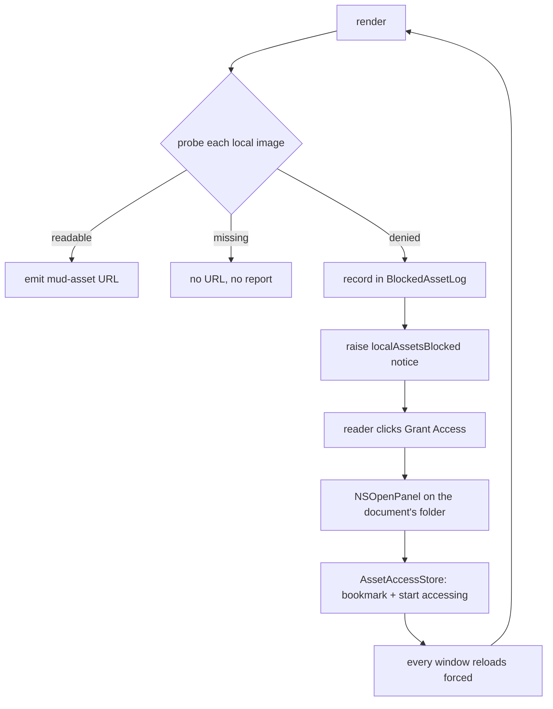

Plan: Local Content Access
===============================================================================

> Status: Complete

In the sandboxed (Mac App Store) build, opening a document grants Mud read
access to that file and nothing else. A document that references a local image
therefore rendered with a broken image and no explanation. Opening the
enclosing _folder_ fixed it — the sandbox grants a folder's whole subtree — but
nothing in the app said so, and the grant lasted only until Mud quit.

Mud now detects the failure, says so in the info bar, and offers a button that
asks for the folder and remembers it.

## What it does

- A render that meets a local image it isn't allowed to read raises a warning
  in the info bar: "Mud doesn't have your permission to access the images in
  this document." The bar's button, "Grant Access…", opens a folder panel.
- Choosing a folder grants Mud everything inside it, for this run and every
  later one. Every open window re-reads, since a grant can unblock a document
  in any of them.
- A misspelled image path raises nothing. It is the document's problem and no
  grant would fix it.
- Settings → Up Mode → Content permissions lists the folders granted, with an
  Add button and a Remove button per row. The "Allow remote content" toggle
  moved into that section — both settings decide what a rendered document may
  load.
- A granted folder that isn't reachable at launch (an external disk, most
  likely) keeps its row, dimmed and marked "Unavailable". The grant comes back
  when the folder does.
- The direct build is unchanged. It reads whatever the file system allows, so
  it holds no grants and the folder list is hidden there.

## What was true before

Three facts the design rests on.

**Powerbox grants subtrees.** When the reader picks a folder in an
`NSOpenPanel`, the sandbox extension covers every file below it. That is why
opening `Mud/` makes every image under `Mud/` readable for the rest of the
session.

**Mud stored no bookmarks.** Every grant Mud held came from a powerbox prompt
in the current run and died with the process. The one accidental exception was
Open Recent: `NSDocumentController` keeps a security-scoped bookmark per recent
document, so reopening a folder from that menu restored its grant. Under
`FolderOpenBehavior.index` the folder is noted as recent; under `.tabs` only
the files inside it are, so there the grant couldn't be recovered at all.

**Mud couldn't tell "denied" from "missing".** `DocumentModel.mudAssetResolver`
called `FileManager.default.fileExists` and returned nil on false, which left
the `` as a relative path that CSP then blocked. If the sandbox
permits `stat` on the path — which it generally does, denying only the content
read — `fileExists` returned true instead, the `mud-asset:` URL was emitted,
and `LocalFileSchemeHandler` failed its `Data(contentsOf:)` and returned 404.
Either way the reader saw a broken image, and a notice built on that check
would also have fired on a plain typo in a filename.

## The probe

`LocalAssetProbe` replaces the `fileExists` check with a three-way answer that
goes through the sandbox policy for certain:
`open(path, O_RDONLY | O_NONBLOCK)`, then read `errno`.

- success → `.readable`. Close the descriptor, emit the `mud-asset:` URL as
  before.
- `EACCES` / `EPERM` → `.denied`. Return nil, and record the path.
- anything else → `.missing`. Return nil, report nothing. `ENOENT` and
  `ENOTDIR` are the ordinary cases; a symlink loop or a device that went away
  reads the same way, because no folder grant would fix any of them either.

`open` is the right call rather than `access` or `stat`, because the sandbox
denies the content read specifically, and that is the operation the WebView
will eventually attempt. One syscall per image per render, which is the same
order of cost as the `stat` it replaces.

`O_NONBLOCK` is there so the open itself can't hang. It changes nothing for a
regular file, but a FIFO opened for reading with no writer blocks until one
arrives — and this runs on the main thread inside a render, so a document that
named a pipe `diagram.png` would otherwise stop the app.

Detection is synchronous and complete before the page loads, so nothing has to
be plumbed back out of `LocalFileSchemeHandler`. That handler kept its shape;
its 404 is now a case that should no longer be reachable for a denial.

## Reporting a denial out of the render

`mudAssetResolver` is a `nonisolated static` function passed as a bare closure,
with no way to report anything. The render got a collector to write into:

- `BlockedAssetLog`, a small reference type that holds the denied URLs, without
  repeats, and vends the resolver closure that records into it.
- `DocumentModel.render` makes one per render, passes `log.resolver` to
  `MudCore.renderUpModeDocumentWithFootnotes`, and reads `log.denied` after the
  call returns.

The resolution itself moved to
`DocumentModel.resolve(source:baseURL:onDenied:)`, with `mudAssetResolver` left
as the collector-free form. They are two functions rather than an overloaded
pair, so passing `mudAssetResolver` as a value stays unambiguous.

The other call site — `WebView.Coordinator`, rendering comment items for the
column — keeps `mudAssetResolver`. The document render already includes the
comments section, so any image in a comment body has been probed once already;
a second report from the column rebuild would be a duplicate.

**The raise is deferred.** `display()` is called from `DocumentContentView`'s
body, so setting `@Published var notice` from inside `render` would trip
SwiftUI's "Publishing changes from within view updates." The raise goes through
`deferMutation` — the case that helper exists for.

## The notice

`DocumentNotice.localAssetsBlocked(folder:)`, at `.warning` level, dismissible,
with the "Grant Access…" action. Because the action opens a file panel with no
intervening explanation, the bar's message carries the whole reason:

> Mud doesn’t have your permission to access the images in this document.

Dismissible, because the reader may simply not care about the images and should
be able to get the bar out of the way; a later render that reads every image
also clears it.

**Only under sandboxing.** `DocumentModel.reportBlockedAssets` returns early
unless `isSandboxed`. The probe runs in both builds — it is a better test than
`fileExists` either way — but in the direct build a denial is an ordinary Unix
permissions problem, and "grant access to the folder" is not the remedy for it.

This is the only notice re-derived on every render, which is why it needed two
rules the others don't:

- **`lastBlockedReport`** holds the last answer, and an unchanged one does
  nothing. `cachedDisplay` is a single slot, so a mode toggle or a theme change
  re-renders; without this, each of those would raise the notice again and put
  a dismissed bar back up. The stored answer only moves on when the bar was
  actually changed, so a raise that stood down for another notice is tried
  again on the next render.
- **`blockedAssetsMayRaise(over:)`** stops this notice taking the bar from
  another one. The plan originally allowed it to replace a dismissible
  `reloadFailed`; that was wrong. Every other notice is raised by something
  that just happened and says so once — `externalChangeHeld` guards on its own
  `didSet` and never repeats — so a notice re-derived every render would win
  that contest repeatedly and the other message would be gone for good.

Only Up mode renders an image, so only Up mode calls `reportBlockedAssets`. A
notice raised there stays up through a switch to Down: the document still has
images Mud can't read, and taking the bar down on a mode toggle would only make
it flicker back on the way returning.

## The grant

`DocumentNotice.Action.Effect.grantFolderAccess(startingAt:)` carries the
folder the panel should open at. The effect stays a value, so `DocumentNotice`
keeps its synthesized `Equatable`; `DocumentNoticeBar.perform` handles the case
by calling `AssetAccessStore.requestAccess`, which presents the panel:

- `canChooseDirectories = true`, `canChooseFiles = false`, no multiple
  selection.
- The message explains what the choice does: "Choose a folder to allow Mud to
  show local content from. Mud will be able to read every file inside it."
- The prompt reads "Grant Access".
- Presented as a sheet on `NSApp.keyWindow` — the reader has just clicked a
  button in this bar, so that window is key by definition, and threading a
  window through every call site (previews included) would buy nothing AppKit
  doesn't already know. Modal when there is no window, which is how the
  settings pane's Add button reaches the same panel.

The panel opens at the document's own folder when that folder holds the blocked
file, and at the blocked file's folder when it doesn't. The plan first said
always the document's folder, on the grounds that a document usually references
images below itself (`images/diagram.png`); a document that points somewhere
else entirely shouldn't send the reader to the wrong place to go looking. If
images in a third folder stay blocked, the next render raises the notice again
and the reader can grant it too — the loop closes itself, and each grant is a
folder the reader chose rather than one Mud inferred.

## Remembering the grant

`AssetAccessStore`, a singleton `ObservableObject`:

- **Storage.** Security-scoped bookmark blobs in `UserDefaults.standard` under
  `granted-folder-bookmarks`. Not in `MudPreferences`: a security-scoped
  bookmark is usable only by the app that created it, so mirroring it into the
  app-group suite would put a blob the Quick Look extension can't use into the
  extension's only channel.
- **Granting.** `url.bookmarkData(options: .withSecurityScope, …)`, then
  `startAccessingSecurityScopedResource()`, held for the process lifetime. The
  bookmark is taken first: without one there is no grant to record, and a
  failure there leaves nothing half-started to clean up. The entitlement that
  makes this work, `com.apple.security.files.bookmarks.app-scope`, was added to
  `App/Mud.entitlements`.
- **At launch.** `AppDelegate` calls `resolveSavedGrants()` before any document
  opens, so a document's images are readable the first time it renders rather
  than after a reload. Resolution asks for no UI, so nothing there can hold up
  launch. A stale bookmark is rewritten while access is held. Storage is only
  written back when the pass actually changed something, so a store with
  nothing to say doesn't touch the reader's defaults — which includes every run
  under the test host.
- **De-duplication.** `reduce(grants:adding:)` is pure: granting a folder
  already covered by an existing grant changes nothing, and granting a parent
  of existing grants replaces them. Containment is decided by `covers`, which
  compares path components rather than string prefixes — `/a/b` is not an
  ancestor of `/a/bc`.

**An unreachable grant is kept, not dropped.** The plan first said a bookmark
that won't resolve should be discarded. That would mean a reader who keeps
their notes on an external drive loses the grant every time they start Mud
without it plugged in. So `Grant` is a struct that outlives its folder being
reachable: `path` is always there, read straight out of the blob, and `url` is
only there while access is held. Containment is decided on `folder`, which
falls back to the path, so an away grant still covers what it covers. The
reader took the grant; only the reader takes it back. A blob that isn't a
bookmark at all is the one thing dropped.

### Re-rendering after a grant

The store publishes `accessChanged`, a `PassthroughSubject`, whenever the
reader has done something that may change what Mud can read.
`DocumentWindowController` subscribes and calls
`model.reloadForAssetAccessChange()`, which drops `lastBlockedReport` and
forces a load — the bumped `loadToken` changes the contentID, so the page
reloads and the probe runs again. Every open window reloads, not just the one
whose bar was clicked.

The subscription is on `accessChanged` rather than on `$grants` because the two
answer different questions. The settings list wants the folders and only cares
when they change; a window wants to know it should look at its images again,
which is true even when the list came out identical. Granting a folder Mud
already covers adds no row, but it is still the reader asking, and a button
that did nothing visible would read as broken.

In Down mode the reload clears the notice outright: no Down render probes an
image, so nothing else there would ever take down a bar the grant may have just
made untrue. In Up mode the notice is left alone and the render coming right
behind says whether it was fixed, which spares the bar a blink on its way to
saying the same thing.

### Seeing and removing grants

A permanent list of folders the app can read, with no way to see or shorten it,
is not a good thing to accumulate silently. It went in the Up Mode settings
pane, beside the toggle that answers the same question about remote content:
both decide what a rendered document is allowed to load, and both matter only
in Up mode, because that is the only mode that renders an image.

`UpModeSettingsView` gained a **Content permissions** section holding:

- The **Allow remote content** toggle, moved down from its former place as the
  pane's first, unlabeled section.
- **Allow local content from:** — the granted folders, one row each, with an
  Add button in the header row and a Remove button per row. Removing forgets
  the bookmark, so the grant is gone at the next launch. Whether the sandbox
  extension is torn down in _this_ run isn't Mud's to promise: a folder the
  reader opened in a panel this session stays readable until quit, because that
  grant came from the panel rather than from the store.

Add exists so this isn't only somewhere a permission can be taken away. A
reader who knows where their images live can say so here rather than waiting to
meet a document that doesn't show them.

Each row shows the folder's Finder icon and its path abbreviated with a tilde,
middle-truncated so the folder's own name survives, with the full path in a
tooltip. An unreachable folder is dimmed and labeled "Unavailable", with help
text saying the permission is kept and works again once the folder is back.

The folder list appears only when `isSandboxed`. The direct build holds no
grants because it needs none, so an always-empty list there would suggest a
restriction that doesn't exist. The section keeps its title with only the
remote toggle in it.

## Files

**New:**

- `App/LocalAssetProbe.swift` — the `open`/`errno` probe and
  `LocalAssetAccess`.
- `App/BlockedAssetLog.swift` — per-render collector; vends the resolver
  closure.
- `App/AssetAccessStore.swift` — bookmark storage, resolution at launch,
  granting, revocation, the pure `reduce` de-duplication.
- `App/Tests/LocalAssetProbeTests.swift`
- `App/Tests/BlockedAssetLogTests.swift`
- `App/Tests/AssetAccessStoreTests.swift`

**Changed:**

- `App/DocumentModel.swift` — `resolve` uses the probe; `render` creates a log;
  `reportBlockedAssets` raises or clears the notice through `deferMutation`;
  `reloadForAssetAccessChange` re-reads on a grant.
- `App/DocumentNotice.swift` — the `localAssetsBlocked` kind, the notice
  itself, the `grantFolderAccess` effect case.
- `App/DocumentNoticeBar.swift` — performs the new effect.
- `App/DocumentWindowController.swift` — subscribes to `accessChanged`.
- `App/AppDelegate.swift` — resolves saved bookmarks at launch.
- `App/Mud.entitlements` — the app-scope bookmarks entitlement.
- `App/Settings/UpModeSettingsView.swift` — the "Content permissions" section.
- `Doc/AGENTS.md` — the new key files, and a "Local content" section under
  "Sandbox-aware features".

## Tests

- **`LocalAssetProbeTests`** — the three answers against real temp files. The
  denied case uses mode `000` and skips when the suite runs as root, where it
  wouldn't hold.
- **`BlockedAssetLogTests`** — the resolver's three answers against real temp
  files: only a denial reaches the log.
- **`AssetAccessStoreTests`** — `reduce` and `covers` as pure functions: the
  de-duplication truth table, that a shared name prefix isn't containment, and
  what an unavailable `Grant` still knows about itself.
- **`DocumentNoticeTests`** — the notice's level, dismissibility, the folder
  its action carries, and the `blockedAssetsMayRaise` priority rule.

All four run in the existing `Mud Tests` bundle.

## Out of scope

- **Print and Save as PDF need nothing.** They print the live page — `WebView`
  runs `webView.printOperation(with: .shared)` on the window's own `WKWebView`.
  The images are already in the page, fetched over `mud-asset:` when it loaded,
  so there is no second read to deny. What is on screen is what prints, before
  a grant and after it.
- **Open In Browser and the Open In HTML handoff** do re-read: they go through
  `DocumentExporter` → `MudCore.exportDocument` → `ImageDataURI.encode`, which
  reads each image's bytes fresh. Those reads succeed while a grant is held, so
  a granted document exports correctly. But both are unreachable in the
  sandboxed build anyway — Open In Browser is hidden and the editor handoff
  forces `.markdown`, because a temp file inside our container isn't readable
  by the receiving app.
- **Quick Look** is the one real gap, and this work can't close it. It renders
  through `MudCore.exportDocument` and so through `ImageDataURI`, in a separate
  extension process that can use neither the app's sandbox extensions nor its
  bookmarks. The MAS variant carries no read exception at all
  (`QuickLook.entitlements` versus `QuickLookDirect.entitlements`), so a
  preview there drops local images with no way for the reader to grant
  anything. Worth a plan of its own.
- **Restoring grants from Open Recent.** Under `.tabs` a folder open notes only
  the files as recent, so the folder's grant was unrecoverable after a quit.
  With bookmarks stored this stopped mattering.

## Questions the work settled

1. **Does `MudPreferences.reset()` clear the stored grants?** No, and
   deliberately. `reset()` iterates `MudPreferences.Keys`, and
   `granted-folder-bookmarks` isn't one of them. A grant is closer to a system
   permission than to a preference, and Settings → Up Mode is where it is taken
   back.
2. **Does the notice deserve a `#if DEBUG` tester in the Debugging pane?** No.
   Its action opens a real panel, so a sample would either grant real access or
   need an effect case existing only for testing. The level samples already
   cover how the bar looks at `.warning`.
