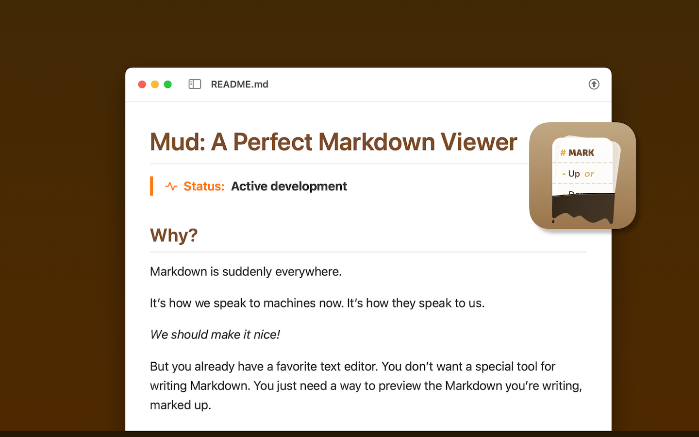
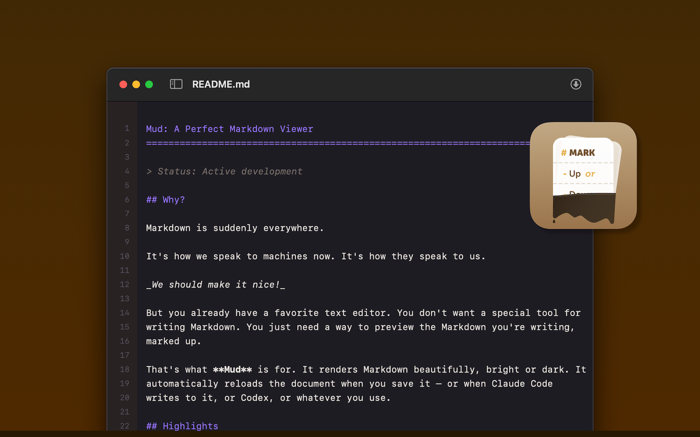
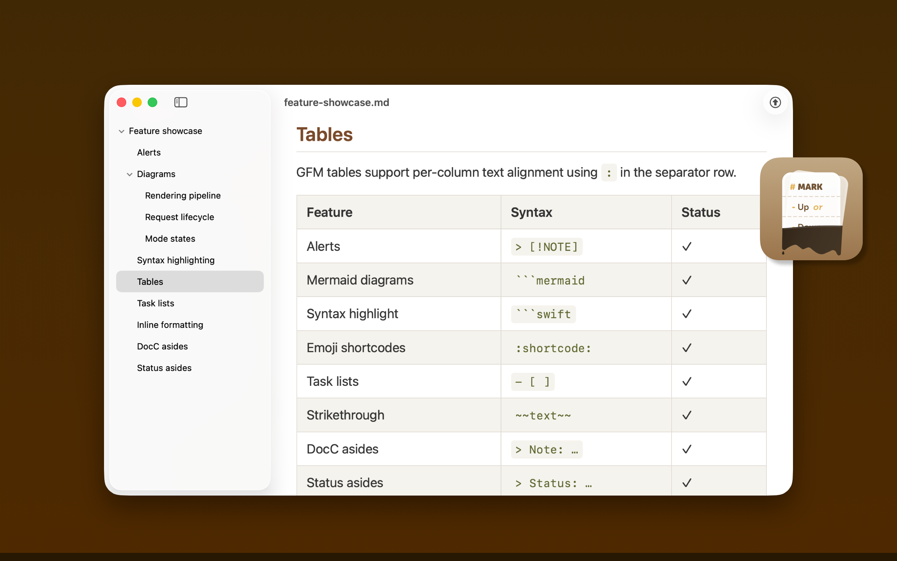
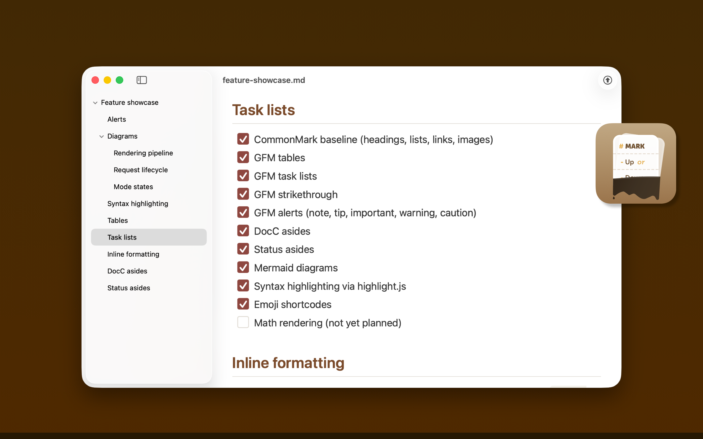
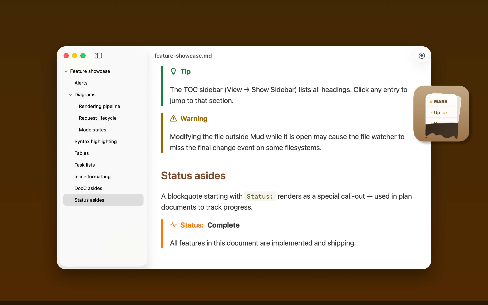

Mud: A Perfect Markdown Viewer
===============================================================================

> Status: Active development


## Gimme

Download **Mud.app** from either:

- **[GitHub Releases](https://github.com/joseph/mud/releases)** — includes Git
  change waypoints, CLI, Open In Browser, and Sparkle auto-updates.
- **[Mac App Store](https://apps.apple.com/us/app/mud-mark-up-or-down/id6759427937?mt=12)**
  — sandboxed for complete safety, updates through the App Store.

Requires macOS Sonoma (14.0+).


## Why?

Markdown is suddenly everywhere.

It's how we speak to machines now. It's how they speak to us.

_We should make it nice!_

But you already have a favorite text editor. You don't want a special tool for
writing Markdown. You just need a way to preview the Markdown you're writing,
marked up.

That's what **Mud** is for. It renders Markdown beautifully, bright or dark. It
automatically reloads the document when you save it — or when Claude Code
writes to it, or Codex, or whatever you use.




Mud shows you both sides of the document:

- **Mark Up** renders your Markdown as styled HTML — GitHub-flavored, with
  syntax-highlighted code.
- **Mark Down** shows the raw source with line numbers.

Hit Space to flip between them. Your scroll position carries over.

Mud is a Mac-assed Mac app with excellent command-line tooling. It's free and
it's open source.

It does one thing — it marks up Markdown! — and it does it really well.


## Highlights

- [x] GitHub-flavored Markdown with syntax-highlighted code blocks
- [x] Raw source view with its own syntax highlighting and line numbers
- [x] Space bar flips between views; scroll position preserved
- [x] Change tracking!
- [x] Four color themes — Austere, Blues, Earthy, Riot
- [x] Bright / Dark / System lighting
- [x] Table of contents sidebar
- [x] Auto-reload on file change
- [x] YAML frontmatter display (collapsible key-value table in Up mode)
- [x] Find (Cmd+F)
- [x] Print and Open In Browser
- [x] Zoom, readable column, word wrap, and line number toggles


## How I use Mud

I wrote an overview of my current Claude Code workflow, and how Mud is a great
fit for it: <https://apps.josephpearson.org/mud/plan-workflows.html>.


## Command line tool

Install from **Settings > Command Line** to get a `mud` command.

```bash
mud file.md                    # Open a file in the app
mud -u file.md                 # Render to HTML (mark-up view)
mud -d file.md                 # Render to HTML (mark-down view)
echo "# Hi" | mud -u           # Pipe stdin to HTML
mud -u --theme riot file.md    # Pick a theme
```


## Build

Open `Mud.xcodeproj` in Xcode and build. Requires at least macOS Sonoma
(14.0+).


## Contributing

Issues welcome! I have not enabled Pull Requests. Feel free to attach a
Markdown plan document to an issue for any proposed fix or improvement.


## Screenshots







## Documents

- [Doc/HUMANS.md](Doc/HUMANS.md) — orientation guide for human beings
- [Doc/AGENTS.md](Doc/AGENTS.md) — architecture guide for coding agents
- [Doc/RELEASES.md](Doc/RELEASES.md) — versioned changelog


## License

MIT with Commons Clause. See [Doc/LICENSE.md](Doc/LICENSE.md).
