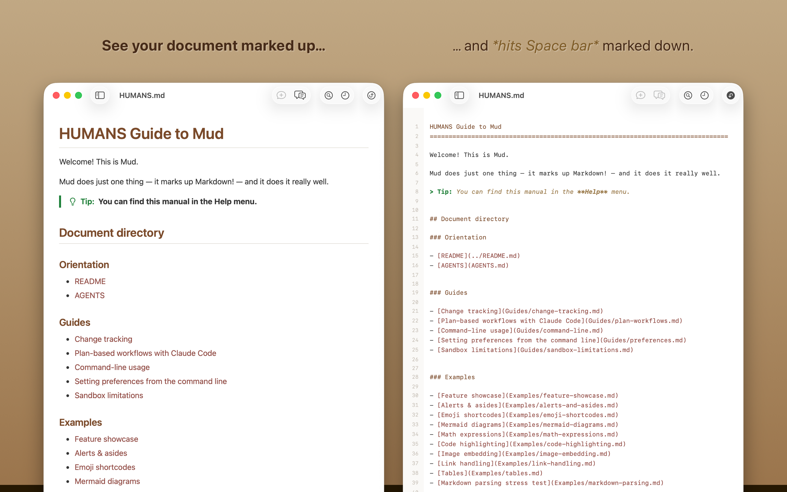
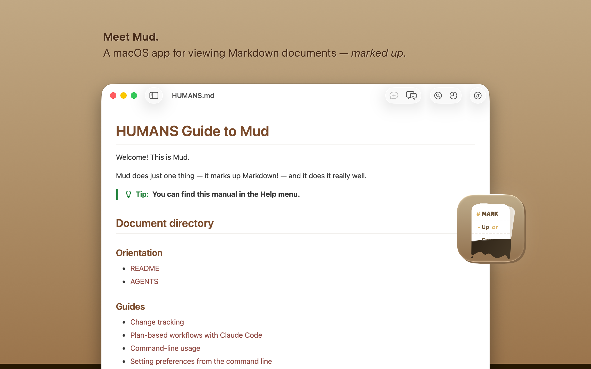
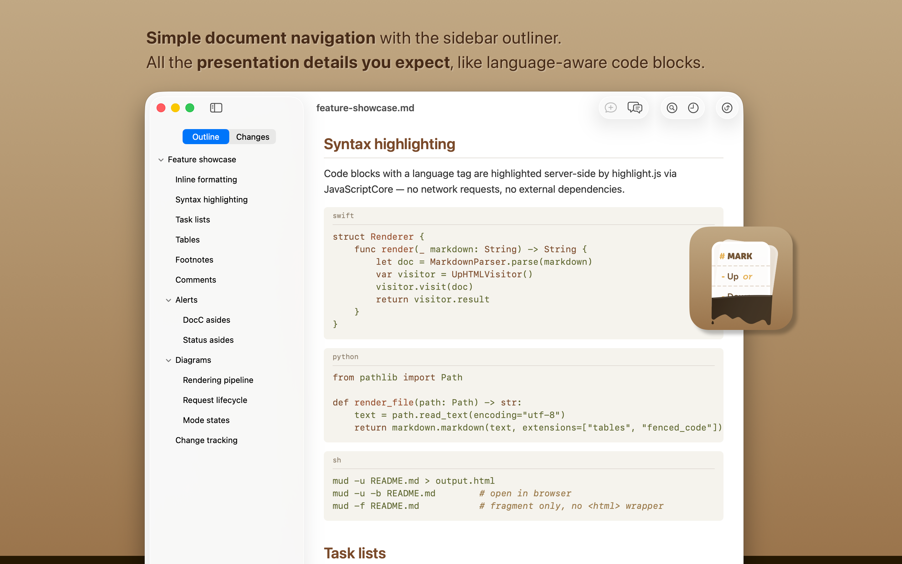
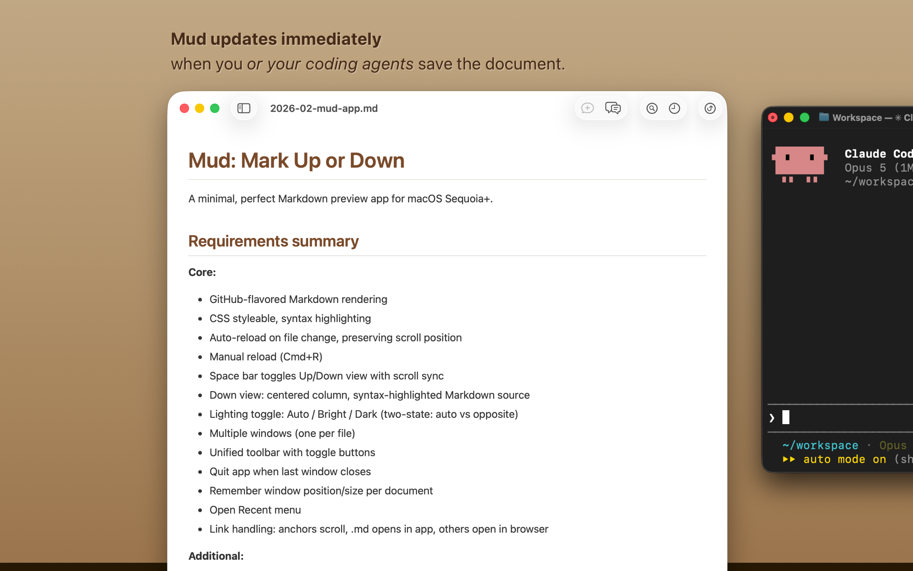
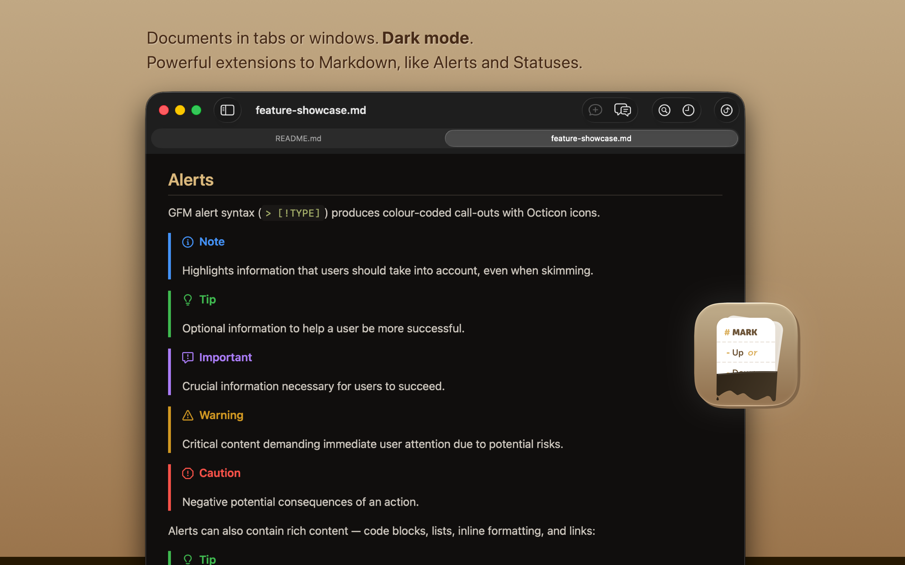
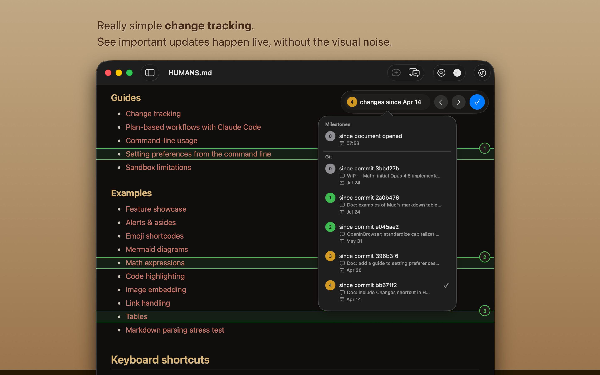
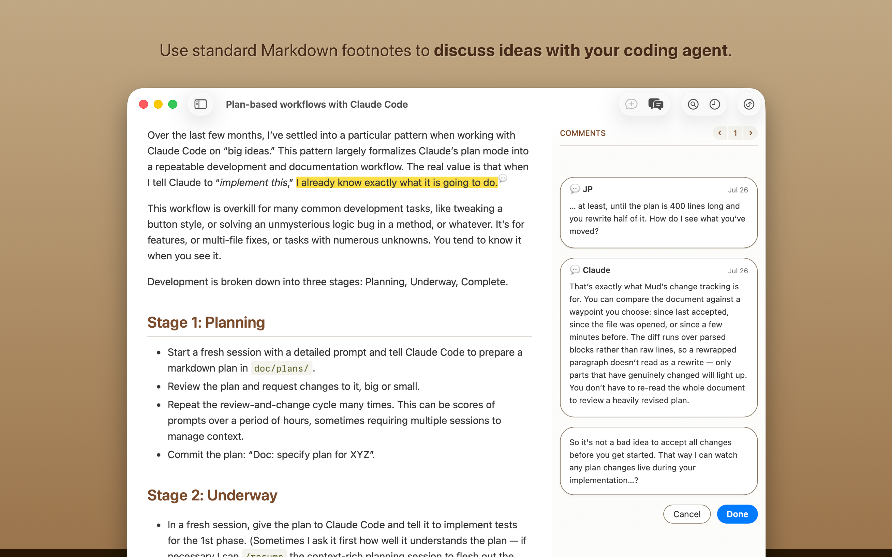
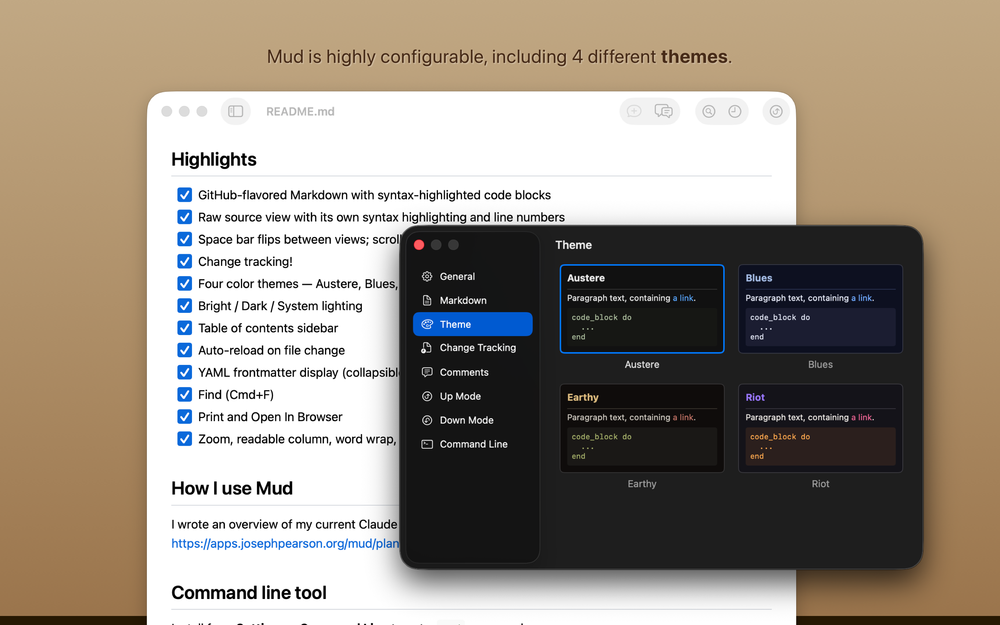
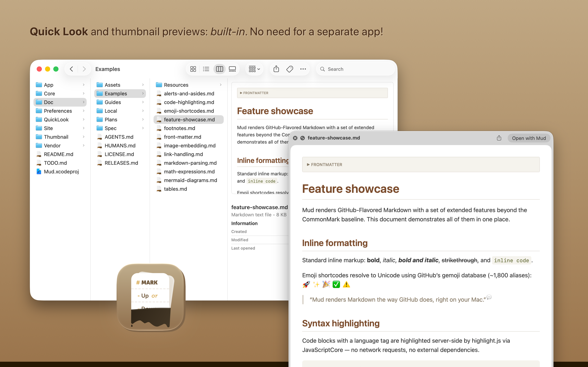
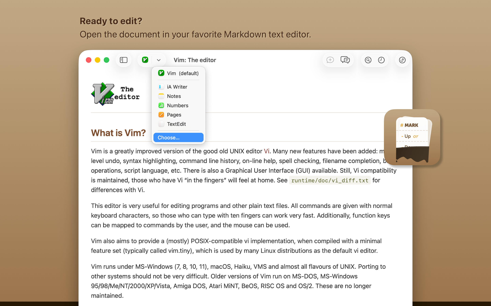

Mud: A Perfect Markdown Viewer
===============================================================================

> Status: Active development


## Why Mud?

Markdown is suddenly everywhere. It’s how we speak to machines now. It’s how
they speak to us.

_We should make it nice!_

But you already have a favorite text editor. You don’t want a special tool for
writing Markdown. You just need a way to preview the Markdown you’re writing,
marked up.

That’s what **Mud** is for. It renders Markdown beautifully, bright or dark. It
automatically reloads the document when you save it — or when Claude Code
writes to it, or Codex, or whatever you use.



Mud shows you both sides of the document:

- **Mark Up** renders your Markdown as styled HTML — GitHub-flavored, with
  syntax-highlighted code.
- **Mark Down** shows the raw source with line numbers.

Hit Space to flip between them. Your scroll position carries over.

Mud is a Mac-assed Mac app with excellent command-line tooling. It’s free and
it’s open source.


## Quick start

Mud requires macOS Sonoma (14.0) or higher, and comes in two flavors:

- **[GitHub Releases](https://github.com/joseph/mud/releases)** — includes Git
  change waypoints, CLI, Open In Browser, and Sparkle auto-updates.
- **[Mac App Store](https://apps.apple.com/us/app/mud-mark-up-or-down/id6759427937?mt=12)**
  — sandboxed for complete safety, updates through the App Store.


## Highlights

- [x] **GitHub-flavored Markdown** with syntax-highlighted code blocks
- [x] Full support for macOS **Quick Look** and thumbnail previews in Finder
- [x] **Comments!** Take notes for yourself and your collaborators, or chat
      with your agent
- [x] **Change tracking!** See what your coding agent is doing to the document
- [x] **Reload** automatically every time the file is saved to disk
- [x] Table of contents — **document outliner** in sidebar
- [x] Four color **themes** — Austere, Blues, Earthy, Riot
- [x] **Dark mode**, Bright mode, or let your system decide
- [x] Find (**Cmd+F**)
- [x] **Print** and **Open In Browser**
- [x] **Zoom**, readable column, word wrap, and line number toggles
- [x] Mermaid **diagrams**, drawn in your theme’s colors
- [x] High-quality presentation of **math equations**
- [x] Native popovers for **footnotes**
- [x] Collapsible **YAML** frontmatter
- [x] **GFM Alerts** and Status blockquote styles
- [x] **Foldable headings** — collapse the sections you aren’t reading
- [x] **Open a folder** to get a tree of every Markdown document inside it
- [x] Excellent **command-line** tools (Direct release, mostly)
- [x] Configure Mud to open the document in **your editor** with a click or a
      keystroke

The [**Feature Showcase**](Doc/Examples/feature-showcase.md) demonstrates Mud’s
Markdown rendering.


## How I use Mud

I wrote an overview of my current Claude Code workflow, and how Mud is a great
fit for it:

- [Plan-based workflows with Claude Code & Mud](https://apps.josephpearson.org/mud/plan-workflows.html)


## Command line tool

Install from **Settings > Command Line** to get a `mud` command.

```bash
mud file.md                    # Open a file in the app
mud -u file.md                 # Render to HTML (mark-up view)
mud -d file.md                 # Render to HTML (mark-down view)
echo "# Hi" | mud -u           # Pipe stdin to HTML
mud -u --theme riot file.md    # Pick a theme
```


## Build

Open `Mud.xcodeproj` in Xcode and build. Requires at least macOS Sonoma
(14.0+).


## Contributing

Issues welcome! I have not enabled Pull Requests. Feel free to attach a
Markdown plan document to an issue for any proposed fix or improvement.


## Screenshots












## Documents

- [Doc/HUMANS.md](Doc/HUMANS.md) — orientation guide for human beings
- [Doc/AGENTS.md](Doc/AGENTS.md) — architecture guide for coding agents
- [Doc/RELEASES.md](Doc/RELEASES.md) — versioned changelog


## License

MIT with Commons Clause. See [Doc/LICENSE.md](Doc/LICENSE.md).
